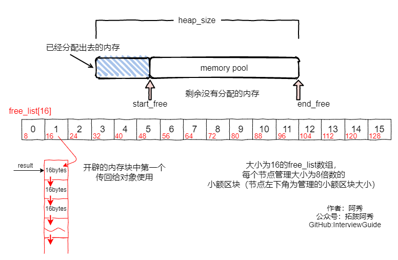

# C++

[toc]


## 1、指针和引用的区别

> The difference between a pointer and a reference

1. 指针是一个变量，存储的是一个地址，引用跟原来的变量实质上是同一个东西，是原变量的别名

- A pointer is a variable that stores an address, and a reference is essentially the same thing as the original variable, an alias for the original variable

2. 指针可以有多级，引用只有一级

- A pointer can have multiple levels, and a reference has only one level

3. 指针可以为空，引用不能为NULL且在定义时必须初始化

- The pointer can be NULL, the reference can not be NULL, and must be initialized when defined

4. 指针在初始化后可以改变指向，而引用在初始化之后不可再改变

- A pointer can change its pointer after initialization, and a reference can not change after initialization

5. sizeof指针得到的是本指针的大小，sizeof引用得到的是引用所指向变量的大小

- The sizeof pointer gets the size of this pointer, and the sizeof reference gets the size of the variable the reference points to

6. 当把指针作为参数进行传递时，也是将实参的一个拷贝传递给形参，两者指向的地址相同，但不是同一个变量，在函数中改变这个变量的指向不影响实参，而引用却可以。

- When you pass a pointer as an argument, you also pass a copy of the argument to the parameter. Both point to the same address, but not to the same variable. Changing the point of the variable in a function does not affect the argument, references can.

7. 引用本质是一个指针，同样会占4字节内存；指针是具体变量，需要占用存储空间（具体情况还要具体分析）。

- A reference is essentially a pointer, which also takes up 4 bytes of memory; a pointer is a specific variable that takes up storage space.

#### when pass the parameter:

1. 需要返回函数内局部变量的内存的时候用指针。使用指针传参需要开辟内存，用完要记得释放指针，不然会内存泄漏。而返回局部变量的引用是没有意义的

* Use a pointer when you need to return the memory of a local variable within a function. Use Pointer arguments need to open up memory, after use remember to release the pointer, or will leak memory. And it doesn't make sense to return a reference to a local variable

2. 对栈空间大小比较敏感（比如递归）的时候使用引用。使用引用传递不需要创建临时变量，开销要更小

* Use references when you are sensitive to stack space sizes, such as recursion. Passing by reference does not require the creation of temporary variables and is less expensive

3. 类对象作为参数传递的时候使用引用，这是C++类对象传递的标准方式

- Class objects are passed as parameters using references, which is the standard way C + + class objects are passed


## 2、堆和栈的区别 

> 2. The difference between a stack and a heap

|                                               | 堆heap                                                       | 栈Stack                                                      |
| :-------------------------------------------- | ------------------------------------------------------------ | ------------------------------------------------------------ |
| **管理方式** **Management style**             | 堆中资源由程序员控制（容易产生memory leak）The resources in the heap are controlled by the programmer (who is prone to memory leak) | 栈资源由编译器自动管理，无需手工控制Stack resources are managed automatically by the compiler without manual control |
| **内存管理机制  **Memory management mechanism | 系统有一个记录空闲内存地址的链表，当系统收到程序申请时，遍历该链表，寻找第一个空间大于申请空间的堆结点，删 除空闲结点链表中的该结点，并将该结点空间分配给程序（大多数系统会在这块内存空间首地址记录本次分配的大小，这样delete才能正确释放本内存空间，另外系统会将多余的部分重新放入空闲链表中）The system has a linked list that records free memory addresses. When the system receives a program application, it traverses the linked list to find the first heap node whose space is larger than the requested space, deletes the node in the free node linked list, and saves the node Point space is allocated to the program (most systems will record the size of this allocation at the first address of this memory space, so that delete can correctly release this memory space, and the system will put the extra part back into the free list） | 只要栈的剩余空间大于所申请空间，系统为程序提供内存，否则报异常提示栈溢出。（这一块理解一下链表和队列的区别，不连续空间和连续空间的区别，应该就比较好理解这两种机制的区别了）As long as the stack remaining space is larger than the space requested, the system provides memory for the program, otherwise reported an exception to the stack overflow. This piece understands the difference between a list and a queue, the difference between a discontinuous space and a continuous space, and it should be easier to understand the difference between the two mechanisms |
| **空间大小 **The size of the space            | 堆是不连续的内存区域（因为系统是用链表来存储空闲内存地址，自然不是连续的），堆大小受限于计算机系统中有效的虚拟内存（32bit 系统理论上是4G），所以堆的空间比较灵活，比较大The heap is a discrete area of memory, so the heap space is more flexible, more large | 栈是一块连续的内存区域，大小是操作系统预定好的，windows下栈大小是2M（也有是1M，在 编译时确定，VC中可设置）The stack is a contiguous area of memory, the size of which is predetermined by the operating system, and the windows stack size is 2m (or 1m, as determined at compile time and set in VC) |
| **碎片问题 **The fragment problem             | 对于堆，频繁的new/delete会造成大量碎片，使程序效率降低For the heap, frequent new/delete causes a lot of fragmentation, which makes the program less efficient | 对于栈，它是有点类似于数据结构上的一个先进后出的栈，进出一一对应，不会产生碎片。（看到这里我突然明白了为什么面试官在问我堆和栈的区别之前先问了我栈和队列的区别）In the case of a stack, it is a bit like a first-in, first-out stack on a data structure, in and out of one-to-one correspondence, without fragmentation. |
| **生长方向 **Growth direction                 | 堆向上，向高地址方向增长。The heap grows upward, toward higher addresses. | 栈向下，向低地址方向增长。The stack grows down, toward the lower address. |
| **分配方式**Distribution method               | 堆都是动态分配（没有静态分配的堆）The heap is dynamically allocated (there is no statically allocated heap) | 栈有静态分配和动态分配，静态分配由编译器完成（如局部变量分配），动态分配由alloca函数分配，但栈的动态分配的资源由编译器进行释放，无需程序员实现。There are static allocation and dynamic allocation, static allocation by the compiler (such as local variable allocation) , dynamic allocation by the  function allocation, but the stack dynamic allocation of resources by the compiler to release, no programmer implementation is required. |
| **分配效率**Efficiency of distribution        | 堆由C/C++函数库提供，机制很复杂。所以堆的效率比栈低很多。The heap is provided by a C/C + + library with a complex mechanism. So the heap is much less efficient than the stack. | 栈是其系统提供的数据结构，计算机在底层对栈提供支持，分配专门 寄存器存放栈地址，栈操作有专门指令。The stack is the data structure provided by the system. The computer provides support for the stack at the bottom layer, allocates special registers to store the stack address, and has special instructions for stack operations. |


## 3、new / delete 与 malloc / free的异同

> The similarities and differences between new/delete and Malloc/Free

**相同点**

The same

1. 都可用于内存的动态申请和释放

- Both can be used for dynamic memory requisition and deallocation

**不同点**

Different

1. 前者是C++运算符，后者是C/C++语言标准库函数

- The former is the C + + operator, and the latter is the C/C + + language standard library function

2. new自动计算要分配的空间大小，malloc需要手工计算

- New automatically calculates the size of the space to be allocated, and Malloc needs to calculate it manually

3. new是类型安全的，malloc不是。

- New is type-safe, Malloc is not. 

4. new调用名为**operator new**的标准库函数分配足够空间并调用相关对象的构造函数，delete对指针所指对象运行适当的析构函数；然后通过调用名为**operator delete**的标准库函数释放该对象所用内存。后者均没有相关调用

- New calls the standard library function called `operator new` to allocate enough space and call the constructor of the related object, and `delete` runs the appropriate destructor on the object. The memory used by the object is then freed by calling a standard library function called `operator delete`. 

5. 后者需要库文件支持，前者不用

- The latter requires library file support, while the former does not

6. new是封装了malloc，直接free不会报错，但是这只是释放内存，而不会析构对象

- New encapsulates malloc, and direct free does not report an error, but it frees memory, not destructs the object

7. malloc和free返回的是void类型指针（必须进行类型转换），new和delete返回的是具体类型指针。

- Malloc and free return a void type pointer (type conversion is required) , and new and delete return a concrete type pointer.

8. new内存分配失败时，会抛出bac_alloc异常。malloc分配内存失败时返回NULL。

* A `bac_alloc`  exception is thrown when a new memory allocation fails. Malloc returns NULL when it fails to allocate memory.


## 4、宏定义和函数、typedef、inline、const有何区别

> What is the difference between a macro definition and a function?

1. 宏在预处理阶段完成替换，之后被替换的文本参与编译，相当于直接插入了代码，运行时不存在函数调用，执行起来更快；函数调用在运行时需要跳转到具体调用函数。

- Macros are replaced in the pre-processing stage, and then the replaced text is compiled, which is equivalent to inserting code directly. A function call needs to jump to a specific calling function at run time.

2. 宏定义属于在结构中插入代码，没有返回值；函数调用具有返回值。

- A macro definition is one that inserts code into a structure and does not return a value; a function call has a return value.

3. 宏定义参数没有类型，不进行类型检查；函数参数具有类型，需要检查类型。

- Macro definition parameters have no type and no type checking; function parameters have types and need to be checked for types.

4. 宏定义不要在最后加分号。

- Do not add a semicolon at the end of a macro definition.

  

1. 宏主要用于定义常量及书写复杂的内容；typedef主要用于定义类型别名。

Macros are used to define constants and write complex content; typedef is used to define type aliases.

2. 宏替换发生在编译阶段之前，属于文本插入替换；typedef是编译的一部分。

Macro substitutions occur before the compilation stage and are text insertion substitutions; a typedef is part of the compilation.

4. 宏不检查类型；typedef会检查数据类型。

Macros do not check types; typedef checks data types.

5. 宏不是语句，不在在最后加分号；typedef是语句，要加分号标识结束。

A macro is not a statement and is not followed by a semicolon; a typedef is a statement and is marked by a semicolon.

6. 作用域不同，#define没有作用域的限制，只要是之前预定义过的宏，在以后的程序中都可以使用。而typedef有自己的作用域。

The scope is different. # define has no scope restrictions and can be used in future programs as long as it is a pre-defined macro. A typedef has its own scope.


1. 在使用时，宏只做简单字符串替换（编译前）。而内联函数可以进行参数类型检查（编译时），且具有返回值。

- When used, macros do only simple string substitution (before compilation) . Inline functions, on the other hand, can do parameter type checking (compile-time) and have return values.

2. 内联函数在编译时直接将函数代码嵌入到目标代码中，省去函数调用的开销来提高执行效率，并且进行参数类型检查，具有返回值，可以实现重载。

3. The inline function embeds the function code into the object code directly at compile time, saves the cost of function call to improve the execution efficiency, and carries on the parameter type check, has the return value, may realize the overload.

- 宏定义时要注意书写（参数要括起来）否则容易出现歧义，内联函数不会产生歧义

4. Macro definition to pay attention to the writing (parameters to be enclosed) , otherwise prone to ambiguity, inline functions will not produce ambiguity

- 内联函数有类型检测、语法判断等功能，而宏没有
- Inline functions have type detection, syntax judgment, and so on, while macros do not

**内联函数适用场景:**

Inline functions apply to the following scenarios:

- 使用宏定义的地方都可以使用 inline 函数。
- The inline function can be used wherever macros are used.
- 作为类成员接口函数来读写类的私有成员或者保护成员，会提高效率。
- It is more efficient to read and write private or protected members of a class as class member interface functions.


1. const定义的常量是变量带类型，而#define定义的只是个常数不带类型；

   CONST defines a constant with a type, while # define defines a constant without a type

2. define只在预处理阶段起作用，简单的文本替换，而const在编译、链接过程中起作用；

   Define works only in the pre-processing phase, with simple text substitution, while const works in the compilation and linking process

3. define只是简单的字符串替换没有类型检查。而const是有数据类型的，是要进行判断的，可以避免一些低级错误；

   Define is a simple string substitution with no type checking. CONST is a data type, is to be judged, can avoid some low-level errors;

4. define预处理后，占用代码段空间，const占用数据段空间；

   Define preprocesses, taking up code segment space, const takes up data segment space;

5. const不能重定义，而define可以通过#undef取消某个符号的定义，进行重定义；

   Const can not be redefined, while define can be redefined by undefining a symbol with # UNDEF

   


## 5、C++中struct和class的区别

> The difference between struct and class in C + +

**相同点**

The same

- 两者都拥有成员函数、公有和私有部分
- Both have member functions, public, and private parts
- 任何可以使用class完成的工作，同样可以使用struct完成
- Anything that can be done using class can also be done using struct

**不同点**

Different

- 两者中如果不对成员不指定公私有，struct默认是公有的，class则默认是私有的

  In both, if no public or private ownership is specified for members, struct Defaults to public and class defaults to private

- class默认是private继承， 而struct默认是public继承

  Class defaults to private inheritance, while struct Defaults to public inheritance

**引申**：C++和C的struct区别

Extension: C + + and C struct Difference

- C语言中：struct是用户自定义数据类型（UDT）；C++中struct是抽象数据类型（ADT），支持成员函数的定义，（C++中的struct能继承，能实现多态）

  In C language: struct is user-defined Data Type (UDT) ; in C + + struct is Abstract Data Type (ADT) , support member function definition, (c + + struct Can Inherit, can implement polymorphism)

- C中struct是没有权限的设置的，且struct中只能是一些变量的集合体，可以封装数据却不可以隐藏数据，而且成员**不可以是函数**

  In C, struct is set without permission, and struct can only be a collection of variables, can encapsulate data but can not hide data, and members can not be functions

- C++中，struct增加了访问权限，且可以和类一样有成员函数，成员默认访问说明符为public（为了与C兼容）

  In C + + , structs increase access and can have member functions like classes, with the default access descriptor being public (for C compatibility)

- struct作为类的一种特例是用来自定义数据结构的。一个结构标记声明后，在C中必须在结构标记前加上struct，才能做结构类型名（除：typedef struct class{};）;C++中结构体标记（结构体名）可以直接作为结构体类型名使用，此外结构体struct在C++中被当作类的一种特例

  Structs are used as a special case of classes to customize data structures. After a struct Tag is declared, it must be preceded by a struct in C for a struct Type name (except: typedef struct Class {} ;) ; in C + + , a struct Tag (struct name) can be used directly as a struct Type name, in addition, structs are treated as a special case of classes in C + +


## 6、C++中const和static的作用

> The role of const and static in C + +

**static**

- 不考虑类的情况

  Regardless of the class

  - 隐藏。所有不加static的全局变量和函数具有全局可见性，可以在其他文件中使用，加了之后只能在该文件所在的编译模块中使用
  - Hide. All non-static global variables and functions have global visibility and can be used in other files, but only in the compilation module where the file is located with `static`
  - 默认初始化为0，包括未初始化的全局静态变量与局部静态变量，都存在全局未初始化区
  - The default initialization is 0, and there is a global uninitialized region for both uninitialized global and local static variables
  - 静态变量在函数内定义，始终存在，且只进行一次初始化，具有记忆性，其作用范围与局部变量相同，函数退出后仍然存在，但不能使用
  - Static variables are defined in a function, always present, and initialized only once, are mnemonic（[nɪˈmɒnɪk]), have the same scope as local variables, and still exist after the function exits, but can not be used

- 考虑类的情况

  Consider the case of classes

  - static成员变量：只与类关联，不与类的对象关联。定义时要分配空间，不能在类声明中初始化，必须在类定义体外部初始化，初始化时不需要标示为static；可以被非static成员函数任意访问。
  - Static member variable: is associated only with the class, not with the object of the class. Definition to allocate space, can not be initialized in the class declaration, must be initialized outside the body of the class definition, initialization does not need to be marked as static; can be non-static member functions arbitrary access.
  - static成员函数：不具有this指针，无法访问类对象的非static成员变量和非static成员函数；**不能被声明为const、虚函数和volatile**；可以被非static成员函数任意访问
  - Static member functions: non-static member variables and non-static member functions of class objects can not be accessed without the this pointer; can not be declared as const, virtual, and volatile; can be accessed arbitrarily by non-static member functions

- 静态成员与普通成员的区别是什么？

   > What is the difference between a static member and an ordinary member?

   1. 生命周期(Life cycle)

   静态成员变量从类被加载开始到类被卸载，一直存在；

   Static member variables exist from the moment a class is loaded until it is unloaded

   普通成员变量只有在类创建对象后才开始存在，对象结束，它的生命期结束；

   A normal member variable does not exist until the class creates the object, the object ends, and its lifetime ends

   2. 共享方式(Sharing methods)

   静态成员变量是全类共享；普通成员变量是每个对象单独享用的；

   Static member variables are shared by all classes; normal member variables are shared by each object individually;

   3. 定义位置(Definition location)

   普通成员变量存储在栈或堆中，而静态成员变量存储在静态全局区；

   A normal member variable is stored on the stack or heap, while a static member variable is stored in a static global area

   4. 初始化位置(The initialization location)

   普通成员变量在类中初始化；静态成员变量在类外初始化；

   Normal member variables are initialized in the class, static member variables are initialized outside the class

**const**

- 不考虑类的情况

  Regardless of the class

  - const常量在定义时必须初始化，之后无法更改

    Const constants must be initialized at definition time and can not be changed later

  - const形参可以接收const和非const类型的实参，例如// i 可以是 int 型或者 const int 型void fun(const int& i){ //...}

    CONST parameters can take const and non-const arguments, for example//I can be int or const int void fun (const Int & i){//... }

  - 在一个函数声明中，const可以修饰形参，表明它是一个输入参数，在函数内部不能改变其值；

    In a function declaration, const modifies a parameter to indicate that it is an input parameter and can not be changed within the function;

    

- 考虑类的情况

  Consider the case of classes

  - const成员变量：不能在类定义外部初始化，只能通过构造函数初始化列表进行初始化，并且必须有构造函数；不同类对其const数据成员的值可以不同，所以不能在类中声明时初始化
  - CONST member variables: can not be initialized outside the class definition, can only be initialized through the constructor initialization list, and must have a constructor; different classes can have different values for their const data members, can not be initialized when declared in a class
  - const成员函数：const对象不可以调用非const成员函数；非const对象都可以调用；不可以改变非mutable（用该关键字声明的变量可以在const成员函数中被修改）数据的值
  - CONST member functions: const objects can not call non-const member functions; non-const objects can call non-const  and const member functions; non-mutable (variables declared with this keyword can be modified in const member functions) data values can not be changed

补充一点const相关：const修饰变量是也与static有一样的隐藏作用。只能在该文件中使用，其他文件不可以引用声明使用。 因此在头文件中声明const变量是没问题的，因为即使被多个文件包含，链接性都是内部的，不会出现符号冲突。

A little const-related: const modifiers are also hidden in the same way as static. Can only be used in this file, other files can not be referenced to declare the use. So It's okay to declare the const variable in the header file, because even if it's contained by multiple files, the chaining is internal and no sign conflicts occur


## 7、关键字 

### override

它指定了子类的这个虚函数是重写的父类的

It specifies that the virtual function of the subclass is an override of the parent class

### final

当不希望某个类被继承，或不希望某个虚函数被重写，可以在类名和虚函数后添加final关键字，添加final关键字后被继承或重写，编译器会报错

When you don't want a class to be inherited or a virtual function to be overridden, you can add the final keyword to the class name and virtual function

### **volatile**

volatile 关键字是一种类型修饰符，**用它声明的类型变量表示可以被某些编译器未知的因素更改**，比如：操作系统、硬件或者其它线程等。当要求使用 volatile 声明的变量的值的时候，**系统总是重新从它所在的内存读取数据**，即使它前面的指令刚刚从该处读取过数据。

The volatile keyword is a type modifier that declares a type variable that can be changed by something unknown to the compiler, such as the operating system, hardware, or other threads. When the value of a variable declared with volatile is required, the system always rereads the data from its memory, even though its previous instruction had just read the data from there.

**多线程中被几个任务共享的变量需要定义为volatile类型。**

Variables that are shared by several tasks in multiple threads need to be defined as volatile.

Note:

- 可以把一个非volatile int赋给volatile int，但是不能把非volatile对象赋给一个volatile对象。
- You can assign a non-volatile int to a volatile int, but you can not assign a non-volatile object to a volatile object.
- 除了基本类型外，对用户定义类型也可以用volatile类型进行修饰。
- In addition to primitive types, user-defined types can also be modified with volatile types.
- C++中一个有volatile标识符的类只能访问它接口的子集，一个由类的实现者控制的子集。用户只能用const_cast来获得对类型接口的完全访问。此外，volatile向const一样会从类传递到它的成员。
- A class with a volatile identifier in C + + can access only a subset of its interface, a subset controlled by the class's implementer. The user can only use const to get full access to the type interface. In addition, volatile, like const, is passed from a class to its members.

### **mutable**

mutable的中文意思是“可变的，易变的”，跟constant（既C++中的const）是反义词。在C++中，mutable也是为了突破const的限制而设置的。被mutable修饰的变量，将永远处于可变的状态，即使在一个const函数中。我们知道，如果类的成员函数不会改变对象的状态，那么这个成员函数一般会声明成const的。但是，有些时候，我们需要**在const函数里面修改一些跟类状态无关的数据成员，那么这个函数就应该被mutable来修饰，并且放在函数后后面关键字位置**。

In C + + , mutable is also set up to break the limits of Const. Variables that are modified by mutable will always be in a mutable state, even in a const function. We know that if a member function of a class does not change the state of the object, it is usually declared as const. However, sometimes we need to modify data members that are not related to class state in the const function, so the function should be modified by mutable and placed in the keyword position after the function.

### **explicit**

explicit关键字用来修饰类的构造函数，被修饰的构造函数的类，不能发生相应的隐式类型转换，只能以**显示的方式进行类型转换**，注意以下几点：

The explicit keyword is used to modify the constructor of a class. The modified constructor's class can not be implicitly typed, but can only be typed explicitly. Note the following:

- explicit 关键字只能用于类内部的构造函数声明上

  The explicit keyword can only be used on constructor declarations inside a class

- explicit 关键字作用于单个参数的构造函数

  The explicit keyword acts on the constructor of a single argument

- 被explicit修饰的构造函数的类，不能发生相应的隐式类型转换

  The class of the constructor decorated by explicit can not have the corresponding implicit type conversion


## 8. **C++的类型安全**

(2) C + + type safety

如果C++使用得当，它将远比C更有类型安全性。相比于C语言，C++提供了一些新的机制保障类型安全：

If used properly, C + + is far more type-safe than C. Compared to the C language, C + + provides some new mechanisms for type safety:

- 操作符new返回的指针类型严格与对象匹配，而不是void*

  The pointer type returned by the operator new strictly matches the object, not void *

- C中很多以void*为参数的函数可以改写为C++模板函数，而模板是支持类型检查的；

  Many functions in C that take void * as an argument can be rewritten as C + + template functions, which support type checking;

- 引入const关键字代替#define constants，它是有类型、有作用域的，而#define constants只是简单的文本替换

  The const keyword was introduced to replace # define constants, which are typed and scoped, while # define constants is a simple text substitution

- 一些#define宏可被改写为inline函数，结合函数的重载，可在类型安全的前提下支持多种类型，当然改写为模板也能保证类型安全

  Some # define macros can be rewritten as inline functions, combined with function overloading, and can support multiple types with type safety, although rewriting them as templates also ensures type safety

- C++提供了**dynamic_cast**关键字，使得转换过程更加安全，因为dynamic_cast比static_cast涉及更多具体的类型检查。

  C + + provides the dynamic keyword, which makes the conversion process more secure because dynamic involves more specific type checking than static.


## 9、C++中的重载、重写（覆盖）和隐藏的区别

> The difference between overloading, overwriting, and hiding in C + +

（1）重载（overload）

重载是指在同一范围定义中的同名成员函数才存在重载关系。主要特点是函数名相同，参数类型和数目有所不同，不能出现参数个数和类型均相同，仅仅依靠返回值不同来区分的函数。重载和函数成员是否是虚函数无关。举个例子：

Overloading is defined in the same scope in the same name member functions exist overloading relationship. The main features are the same function name, parameter types and the number of different parameters can not be the same number and type of parameters are the same, only rely on different return values to distinguish the function. Overloading is independent of whether a function member is a virtual function.

（2）重写（覆盖）（override）

重写指的是在派生类中覆盖基类中的同名函数，**重写就是重写函数体**，**要求基类函数必须是虚函数**且：

Overwriting is overwriting a function of the same name in a derived class. Overwriting is overwriting the body of a function, requiring that the base class function be virtual and:

- 与基类的虚函数有相同的参数个数
- A virtual function of a base class has the same number of arguments
- 与基类的虚函数有相同的参数类型
- Has the same parameter types as the virtual functions of the base class
- 与基类的虚函数有相同的返回值类型
- Has the same return value type as the virtual function of the base class

重载与重写的区别：

The difference between overloading and overwriting:

- 重写是父类和子类之间的垂直关系，重载是不同函数之间的水平关系
- Overrides are vertical relationships between parent and child classes, and overloads are horizontal relationships between different functions
- 重写要求参数列表相同，重载则要求参数列表不同，返回值不要求
- Overwriting requires the same parameter list, overloading requires a different parameter list, and return values are not required
- 重写关系中，调用方法根据对象类型决定，重载根据调用时实参表与形参表的对应关系来选择函数体
- In the override relation, the calling method is determined by the object type, and the overloading selects the function body according to the corresponding relationship between the argument table and the formal parameter table

（3）隐藏（hide）

隐藏指的是某些情况下，派生类中的函数屏蔽了基类中的同名函数，包括以下情况：

Hiding is when a function in a derived class blocks a function of the same name in a base class in some cases, including the following:

- 两个函数参数相同，但是基类函数不是虚函数。**和重写的区别在于基类函数是否是虚函数。**举个例子：
- Both functions take the same arguments, but the base class function is not a virtual function. The difference between **and overwriting is whether the base class function is a virtual function. ** an example:

- **两个函数参数不同，无论基类函数是不是虚函数，都会被隐藏。和重载的区别在于两个函数不在同一个类中。举个例子：**
- The two function parameters are different, whether or not the base class function is a virtual function, will be hidden. The difference between overloading and reloading is that two functions are not in the same class.


## 10、C++有哪几种的构造函数 

> How many C + + constructors are there

C++中的构造函数可以分为4类：

Constructors in C + + fall into four categories:

1. 默认构造函数

- The default constructor

2. 初始化构造函数（有参数）

- Initialization constructor (with arguments)

3. 拷贝构造函数

- Copy constructor

4. 移动构造函数（move和右值引用）

- Move Constructors (move and rvalue references)

- 构造函数设计的初衷: 这样就避免了新的空间的分配，大大降低了构造的成本移动；

  This is the original intention of the mobile constructor design:  avoids the allocation of new space and greatly reduces the cost of construction ;

  1. 移动构造函数的参数和拷贝构造函数不同，拷贝构造函数的参数是一个左值引用，但是移动构造函数的初值是一个右值引用。意味着，移动构造函数的参数是一个右值或者将亡值的引用。也就是说，只用用一个右值，或者将亡值初始化另一个对象的时候，才会调用移动构造函数。

     The parameter of the move constructor is different from that of the copy constructor, which is an lvalue reference, but the initial value of the move constructor is an rvalue reference. This means that the argument to the move constructor is a reference to a right or dead value. That is, the move constructor is only called when you use a right value, or when you initialize another object with a dead value. 

5. 委托构造函数

- Delegate constructor

6. 转换构造函数

- Conversion constructor

- 默认构造函数和初始化构造函数在定义类的对象，完成对象的初始化工作
- The default constructor and the initialization constructor define the class object and complete the initialization of the object
- 复制构造函数用于复制本类的对象
- The copy constructor is used to copy objects of this class
- 转换构造函数用于将其他类型的变量，隐式转换为本类对象
- Conversion constructors are used to implicitly convert variables of other types to objects of this class

------

什么情况下会调用拷贝构造函数(When the copy constructor is called)

- 用类的一个实例化对象去初始化另一个对象的时候
- To initialize another object with an instantiated object of a class
- 函数的参数是类的对象时（非引用传递）
- Function when its argument is an object of the class (passed by non-reference)
- 函数的返回值是函数体内局部对象的类的对象时 ,此时虽然发生（Named return Value优化）NRV优化，但是由于返回方式是值传递，所以会在返回值的地方调用拷贝构造函数
- NRV optimization occurs when the return Value of a function is an object of the class of a local object in the body of the function, so the copy constructor is called where the return value is

**另：第三种情况在Linux g++ 下则不会发生拷贝构造函数，不仅如此即使返回局部对象的引用，依然不会发生拷贝构造函数**


## 11、What is class inheritance?

1. 类与类之间的关系（The relationship between classes）

has-A包含关系，用以描述一个类由多个部件类构成，实现has-A关系用类的成员属性表示，即一个类的成员属性是另一个已经定义好的类；

Has-a contains relations to describe a class composed of multiple parts classes. The implementation of has-A relations is represented by the member attributes of a class, that is, the member attributes of a class are another defined class

use-A，一个类使用另一个类，通过类之间的成员函数相互联系，定义友元或者通过传递参数的方式来实现；

USE-A, a class that uses another class, is related by member functions between classes, defines friend function, or is implemented by passing parameters;

is-A，继承关系，关系具有传递性；

IS-A, inheritance relation, relation has transitivity;

1. 继承的相关概念（Related concepts of inheritance）

所谓的继承就是一个类继承了另一个类的属性和方法，这个新的类包含了上一个类的属性和方法，被称为子类或者派生类，被继承的类称为父类或者基类；

Inheritance is when a class inherits the properties and methods of another class. This new class contains the properties and methods of the previous class. It is called a subclass or a derived class. The inherited class is called a parent class or a base class

1. 继承的特点
2. The characteristics of inheritance

子类拥有父类的所有属性和方法，子类可以拥有父类没有的属性和方法，子类对象可以当做父类对象使用；

A child class has all the properties and methods of the parent class. A child class can have all the properties and methods that the parent class does not have


## 12、public，protected和private访问和继承权限 /public/protected/private的区别？

> What is the difference between public, protected, and private access and inheritance rights/public/protected/private?

- public的变量和函数在类的内部外部都可以访问。

  Public variables and functions are accessible both inside and outside the class.

- protected的变量和函数只能在类的内部和其派生类中访问。

  Protected variables and functions are accessible only within a class and its derived classes.

- private修饰的元素只能在类内访问。

  Private-decorated elements are accessible only within classes.

（一）访问权限 (Access rights)


派生类对基类成员的访问形象有如下两种：

Derived classes have two images for accessing members of a base class:

- 内部访问：由派生类中新增的成员函数对从基类继承来的成员的访问
- Internal Access: access to members inherited from the base class by new member functions in the derived class
- **外部访问**：在派生类外部，通过派生类的对象对从基类继承来的成员的访问
- External Access: outside of a derived class, access to members that inherit from the base class through an object of the derived class

（二）继承权限(the right to inherit)

**public继承**

Public inheritance

公有继承的特点是基类的公有成员和保护成员作为派生类的成员时，都保持原有的状态，而基类的私有成员任然是私有的，不能被这个派生类的子类所访问

The characteristic of public inheritance is that both the public member and the protected member of the base class keep their original state when they are members of the derived class, while the private member of the base class is still private and can not be accessed by the subclass of the derived class

**protected继承**


保护继承的特点是基类的所有公有成员和保护成员都成为派生类的保护成员，并且只能被它的派生类成员函数或友元函数访问，基类的私有成员仍然是私有的，访问规则如下表

The characteristic of protected inheritance is that all public members and protected members of the base class become protected members of the derived class and can only be accessed by its derived class member function or friend function, and the private members of the base class are still private, the access rules are as follows


**private继承**

Private inheritance

私有继承的特点是基类的所有公有成员和保护成员都成为派生类的私有成员，并不被它的派生类的子类所访问，基类的成员只能由自己派生类访问，无法再往下继承，访问规则如下表

The characteristic of private inheritance is that all public members and protected members of the base class become private members of the derived class, and are not accessible by subclasses of its derived class, you can not inherit further, the access rules are as follows


## 13、C++的异常处理的方法

> C + + method of exception handling

在程序执行过程中，由于程序员的疏忽或是系统资源紧张等因素都有可能导致异常，任何程序都无法保证绝对的稳定，常见的异常有：

In the process of program execution, due to the negligence of the programmer or system resource constraints and other factors may lead to exceptions, any program can not guarantee absolute stability, common exceptions are:

- 数组下标越界
- Array subscript is out of bounds
- 除法计算时除数为0
- Division is calculated by dividing by 0
- 动态分配空间时空间不足
- Insufficient space for dynamic allocation of space
- ...

**（1）try、throw和catch关键字**

(1) try, throw, and catch keywords

C++中的异常处理机制主要使用**try**、**throw**和**catch**三个关键字，其在程序中的用法如下：

The exception handling mechanism in C + + uses the three keywords try, throw, and catch, which are used in programs as follows:

```cpp
#include <iostream>
using namespace std;
int main()
{
    double m = 1, n = 0;
    try {
        cout << "before dividing." << endl;
        if (n == 0)
            throw - 1;  //抛出int型异常
        else if (m == 0)
            throw - 1.0;  //拋出 double 型异常
        else
            cout << m / n << endl;
        cout << "after dividing." << endl;
    }
    catch (double d) {
        cout << "catch (double)" << d << endl;
    }
    catch (...) {
        cout << "catch (...)" << endl;
    }
    cout << "finished" << endl;
    return 0;
}
//运行结果
//before dividing.
//catch (...)
//finished
    
```

代码中，对两个数进行除法计算，其中除数为0。可以看到以上三个关键字，程序的执行流程是先执行try包裹的语句块，如果执行过程中没有异常发生，则不会进入任何catch包裹的语句块，如果发生异常，则使用throw进行异常抛出，再由catch进行捕获，throw可以抛出各种数据类型的信息，代码中使用的是数字，也可以自定义异常class。**catch根据throw抛出的数据类型进行精确捕获（不会出现类型转换），如果匹配不到就直接报错，可以使用catch(...)的方式捕获任何异常（不推荐）。**当然，如果catch了异常，当前函数如果不进行处理，或者已经处理了想通知上一层的调用者，可以在catch里面再throw异常。

In the code, divide two numbers, where the divisor is 0. You can see the above three keywords, the program's execution process is to execute a try package statement block, if no exception occurs during the execution process, will not enter any catch package statement block, if an exception occurs, throw is used to throw an exception, which is caught by catch. Throw can throw information of various data types, use numbers in the code, or customize the exception class. catch captures exactly the type of data thrown by throw (no casting occurs) , and if it doesn't match, it simply throws an error. Catch (...) can be used to catch any exceptions (not recommended) . of course, if you catch an exception, the current function can throw the exception inside the catch if it doesn't handle it, or if it already has a handle on notifying the caller at the next level.

**（2）函数的异常声明列表**

(2) a list of exception declarations for the function

有时候，程序员在定义函数的时候知道函数可能发生的异常，可以在函数声明和定义时，指出所能抛出异常的列表，写法如下：

Sometimes, a programmer who knows what exceptions are possible when defining a function can specify a list of exceptions that can be thrown when the function is declared and defined, as follows:

```cpp
int fun() throw(int,double,A,B,C){...};
```

这种写法表名函数可能会抛出int,double型或者A、B、C三种类型的异常，如果throw中为空，表明不会抛出任何异常，如果没有throw则可能抛出任何异常

This type of function might throw an int, a double, or an exception of Type A, B, or C. if the throw is empty, no exception will be thrown, and if there is no throw, any exception may be thrown

**（3）C++标准异常类 exception**(C + + standard  class exception)

C++ 标准库中有一些类代表异常，这些类都是从 exception 类派生而来的，如下图所示

The C + + Standard Library has classes representing exceptions that are derived from the exception class, as shown in the following figure


1. bad_typeid：使用typeid运算符，如果其操作数是一个多态类的指针，而该指针的值为 NULL，则会拋出此异常，例如：

- using the typeid operator, this exception is thrown if the operand is a pointer to a polymorphic class whose value is NULL, such as

2. bad_cast：在用 dynamic_cast 进行从多态基类对象（或引用）到派生类的引用的强制类型转换时，如果转换是不安全的，则会拋出此异常

- this exception is thrown when using dynamic to cast from a polymorphic base class object (or reference) to a reference of a derived class if the conversion is unsafe

3. bad_alloc：在用 new 运算符进行动态内存分配时，如果没有足够的内存，则会引发此异常

- this exception is thrown if there is not enough memory for dynamic memory allocation with the new operator

4. out_of_range:用 vector 或 string的at 成员函数根据下标访问元素时，如果下标越界，则会拋出此异常

-  this exception is thrown if the index is out of bounds when the element is accessed by the at member function of vector or string based on the index


## 14、形参与实参的区别？ 

> What is the difference between form and argument?

1. 形参变量只有在被调用时才分配内存单元，在调用结束时， 即刻释放所分配的内存单元。因此，形参只有在函数内部有效。 函数调用结束返回主调函数后则不能再使用该形参变量。

   A parameter variable allocates memory units only when it is called, and immediately releases the allocated memory units at the end of the call. Therefore, parameters are valid only within functions. The parameter variable can not be used after the function call returns the calling function.

2. 实参可以是常量、变量、表达式、函数等， 无论实参是何种类型的量，在进行函数调用时，它们都必须具有确定的值， 以便把这些值传送给形参。 因此应预先用赋值，输入等办法使实参获得确定值，会产生一个临时变量。

   Arguments can be constants, variables, expressions, functions, and so on. Regardless of their type, they must have certain values when making a function call in order to be passed to the parameter. Therefore, you should use assignment, input, and other methods to get a definite value argument, will produce a temporary variable.

3. 实参和形参在数量上，类型上，顺序上应严格一致， 否则会发生“类型不匹配”的错误。

   Arguments and parameters should be exactly the same in quantity, type and order, otherwise"Type mismatch" will occur.

4. 函数调用中发生的数据传送是单向的。 即只能把实参的值传送给形参，而不能把形参的值反向地传送给实参。 因此在函数调用过程中，形参的值发生改变，而实参中的值不会变化。

   The data transfer that occurs in a function call is one-way. That is, you can only pass the value of an argument to a parameter, not the other way around. So during a function call, the value of the parameter changes, but the value of the argument does not.

5. 当形参和实参不是指针类型时，在该函数运行时，形参和实参是不同的变量，他们在内存中位于不同的位置，形参将实参的内容复制一份，在该函数运行结束的时候形参被释放，而实参内容不会改变。

   When a parameter and an argument are not pointer types, they are different variables when the function is run, they are located in different places in memory, and the parameter copies the contents of the argument, the parameter is released at the end of the function run, and the argument content does not change


## 15、值传递、指针传递、引用传递的区别和效率

> The difference and efficiency of value, pointer, and reference passing

1. 值传递：有一个形参向函数所属的栈拷贝数据的过程，如果值传递的对象是类对象 或是大的结构体对象，将耗费一定的时间和空间。（传值）

   Value Passing: There is a process of copying data from formal parameters to the stack to which the function belongs. If the object being passed is a class object or a large structure object, it will consume a certain amount of time and space

2. 指针传递：同样有一个形参向函数所属的栈拷贝数据的过程，但拷贝的数据是一个固定为4字节的地址。（传值，传递的是地址值）

   Pointer passing: there is also the process of copying data to the stack to which the function belongs, but the copied data is a fixed 4-byte address.(Pass the value, pass the address value)

3. 引用传递：同样有上述的数据拷贝过程，但其是针对地址的，相当于为该数据所在的地址起了一个别名。（传地址）

   Reference Passing: There is also the above data copying process, but it is address specific, equivalent to creating an alias for the address where the data resides. (fax address)

4. 效率上讲，指针传递和引用传递比值传递效率高。一般主张使用引用传递，代码逻辑上更加紧凑、清晰。

   In terms of efficiency, pointer passing and reference passing are more efficient than value passing. The general idea is to pass by reference, making the code logically more compact and clear.


**从汇编层次来看，引用的确引用是通过指针来实现的**

**at the assembly level, true references are implemented through pointers**


## 16、allocator都有什么作用？

> What does  allocator do?

new在内存分配上面有一些局限性，new的机制是将内存分配和对象构造组合在一起，同样的，delete也是将对象析构和内存释放组合在一起的。allocator将这两部分分开进行，allocator申请一部分内存，不进行初始化对象，只有当需要的时候才进行初始化操作。

`new`has some limitations in memory allocation. `new`'s mechanism combines memory allocation with object construction, and delete combines object destruction with memory release. Allocator takes these two parts apart, allocator takes a chunk of memory, doesn't initialize the object, and initializes it only when it's needed


## 17、delete是如何知道释放内存的大小的？

> how does delete know the size of the freed memory?

需要在 new [] 一个对象数组时，需要保存数组的维度，C++ 的做法是在分配数组空间时多分配了 4 个字节的大小，专门保存数组的大小，在 delete [] 时就可以取出这个保存的数，就知道了需要调用析构函数多少次了。

You need to save the dimension of the array when you have an array of objects in new [] . C + + allocates 4 bytes more when it allocates the space of the array, specifically saving the size of the array, you can retrieve the saved number at delete [] and know how many times you need to call the destructor


## 18、malloc与free的实现原理？ 

> How does Malloc and free work?

1、 在标准C库中，提供了malloc/free函数分配释放内存，这两个函数底层是由brk、mmap、，munmap这些系统调用实现的;

In the standard C library, Malloc/free functions are provided to allocate and free memory. These two functions are implemented by system calls such as BRK, MMAP, and munmap

2、 brk是将数据段(.data)的最高地址指针_edata往高地址推,mmap是在进程的虚拟地址空间中（堆和栈中间，称为文件映射区域的地方）找一块空闲的虚拟内存。这两种方式分配的都是虚拟内存，没有分配物理内存。在第一次访问已分配的虚拟地址空间的时候，发生缺页中断，操作系统负责分配物理内存，然后建立虚拟内存和物理内存之间的映射关系；

BRK pushes the highest address pointer of a data segment (. Data) up to a higher address. MMAP finds a free chunk of virtual memory in the virtual address space of the process (between the heap and the stack, called the file-mapped region) . Both methods allocate virtual memory, not physical memory. During the first access to the allocated virtual address space, a page fault occurs, and the operating system allocates the physical memory, and then establishes the mapping between virtual memory and physical memory

3、 malloc小于128k的内存，使用brk分配内存，将_edata往高地址推；malloc大于128k的内存，使用mmap分配内存，在堆和栈之间找一块空闲内存分配；brk分配的内存需要等到高地址内存释放以后才能释放，而mmap分配的内存可以单独释放。当最高地址空间的空闲内存超过128K（可由M_TRIM_THRESHOLD选项调节）时，执行内存紧缩操作（trim）。在上一个步骤free的时候，发现最高地址空闲内存超过128K，于是内存紧缩。

If Malloc memory is less than 128K, use BRK to allocate memory, push to higher address; if Malloc memory is more than 128K, use MMAP to allocate memory, find a free memory allocation between stack and stack; Brk-allocated memory needs to wait for high-address memory to be freed, while mmap-allocated memory can be freed separately. Trim is performed when the free memory in the highest address space exceeds 128K (adjustable by the M option) . At the last step, free, the highest address was found to have more than 128K free memory, so memory was compressed.

4、 malloc是从堆里面申请内存，也就是说函数返回的指针是指向堆里面的一块内存。操作系统中有一个记录空闲内存地址的链表。当操作系统收到程序的申请时，就会遍历该链表，然后就寻找第一个空间大于所申请空间的堆结点，然后就将该结点从空闲结点链表中删除，并将该结点的空间分配给程序。

Malloc requests memory from the heap, which means that the pointer returned by the function points to a block of memory in the heap. The operating system has a linked list of free memory addresses. When the operating system receives the application, it will traverse the list, then look for the first heap node with more space than the requested space, and then delete the node from the list of idle nodes, and assign the space of the node to the program.


## 19、类成员初始化方式？构造函数的执行顺序 ？为什么用成员初始化列表会快一些？

> Class member initialization? The order in which constructors are executed? Why is it faster to initialize a list with members?

1. 赋值初始化，通过在函数体内进行赋值初始化；列表初始化，在冒号后使用初始化列表进行初始化。
2. An assignment is initialized by an assignment in the body of the function; List initialization, using the initialization list after the colon to initialize

#### **这两种方式的主要区别在于**：

1. 方法一是在构造函数当中做赋值的操作，而方法二是做纯粹的初始化操作。我们都知道，C++的赋值操作是会产生临时对象的。临时对象的出现会降低程序的效率。

   Method one is to do the assignment in the constructor, and method two is to do pure initialization. C + + assignment generates temporary objects. The appearance of temporary objects can reduce the efficiency of the program.

   用初始化列表会快一些的原因是，对于类型，它少了一次调用构造函数的过程，而在函数体中赋值则会多一次调用。而对于内置数据类型则没有差别。举个例子：

   The reason that using an initialized list is faster is that for types, it lacks the process of calling the constructor once, and assigning values in the function body will be called one more time. There is no difference for the built-in data type. 

#### 一个派生类构造函数的执行顺序如下：

The execution order of a derived class constructor is as follows:

① 虚拟基类的构造函数（多个虚拟基类则按照继承的顺序执行构造函数）。

The constructor for the Virtual Base Class (multiple virtual base classes execute the constructor in the order of inheritance) .

② 基类的构造函数（多个普通基类也按照继承的顺序执行构造函数）。

Constructors for base classes (multiple common base classes also execute constructors in the order of inheritance) .

③ 类类型的成员对象的构造函数（按照初始化顺序）

Constructor for member of class object (in initialization order)

④ 派生类自己的构造函数。

is the constructor of the derived class itself.

#### 一个派生类析构函数的执行顺序如下：

① 调用派生类的析构函数；

call the destructor of the derived class;

② 调用成员类对象的析构函数；

call the destructor of the member class object;

③ 调用基类的析构函数。

calls the destructor of the base class

#### 有哪些情况必须用到成员列表初始化？作用是什么？

What situations do you have to initialize with a member list? What does it do?

1. 必须使用成员初始化的四种情况
2. There are four situations in which member initialization must be used

① 当初始化一个引用成员时；

1 when initializing a reference member;

② 当初始化一个常量成员时；

When initializing a constant member;

③ 当调用一个基类的构造函数，而它拥有一组参数时；

3 when the constructor of a base class is called, and it has a set of parameters;

④ 当调用一个成员类的构造函数，而它拥有一组参数时；

4 when the constructor of a member class is called, and it has a set of parameters;

1. 成员初始化列表做了什么
2. What does the member Initialization List Do

① 编译器会一一操作初始化列表，以适当的顺序在构造函数之内安插初始化操作，并且在任何显示用户代码之前；

The compiler will operate on the initialization list one by one, inserting initialization operations within the constructor in the appropriate order, and before any user code is displayed;

② list中的项目顺序是由类中的成员声明顺序决定的，不是由初始化列表的顺序决定的；

The order of items in a list is determined by the order in which members in the class are declared, not by the order in which the list is initialized;


## 20、什么是内存泄露，如何检测与避免

> What is a memory leak and how to detect and avoid it

**内存泄露**(Memory Leak)

一般我们常说的内存泄漏是指**堆内存的泄漏**。堆内存是指程序从堆中分配的，大小任意的(内存块的大小可以在程序运行期决定)内存块，使用完后必须显式释放的内存。应用程序般使用malloc,、realloc、 new等函数从堆中分配到块内存，使用完后，程序必须负责相应的调用free或delete释放该内存块，否则，这块内存就不能被再次使用，我们就说这块内存泄漏了

In general, we often say that the memory leak is a leak of heap memory. Heap memory is a block of memory that a program allocates from the heap, of any size (the size of the block can be determined at runtime) , and that must be explicitly freed after use. Applications typically use functions such as malloc, realloc, new, and so on to allocate block memory from the heap. After the block is used, the program must be responsible for the corresponding call to `free` or `delete` to free the block. Otherwise, the block of memory can not be used again, let's say this memory is leaking

**避免内存泄露的几种方式** (Several ways to avoid memory leaks)

- 计数法：使用new或者malloc时，让该数+1，delete或free时，该数-1，程序执行完打印这个计数，如果不为0则表示存在内存泄露
- Count: when using new or malloc, + 1, delete or free, -1, the program prints the count after execution, and if it is not 0, it has a memory leak
- 一定要将基类的析构函数声明为**虚函数**
- Be sure to declare the destructor of the base class as a virtual function
- 对象数组的释放一定要用**delete []**
- Be sure to use delete [] for releasing an array of objects
- 有new就有delete，有malloc就有free，保证它们一定成对出现
- `new` Equals `delete`, `malloc` equals `free`, making sure they always come in pairs

**检测工具** (Detection Tools)

- Linux下可以使用**Valgrind工具**
- The Valgrind tool is available under Linux
- Windows下可以使用**CRT库**
- The CRT library is available for Windows


## 21、对象复用和零拷贝的了解 

> Knowledge of object reuse, knowledge of zero-copy

**对象复用**（Object Reuse）

对象复用其本质是一种设计模式：Flyweight享元模式。

Object Reuse is essentially a design pattern: the Flyweight sharepoint pattern.

通过将对象存储到“对象池”中实现对象的重复利用，这样可以避免多次创建重复对象的开销，节约系统资源。

By storing objects in a“Pool of objects” to achieve object reuse, you can avoid the cost of creating multiple duplicate objects, saving system resources.

**零拷贝**（Zero Copy）

零拷贝就是一种避免 CPU 将数据从一块存储拷贝到另外一块存储的技术。

Zero copy is a technique that prevents the CPU from copying data from one storage block to another.

零拷贝技术可以减少数据拷贝和共享总线操作的次数。

Zero-copy technology can reduce the number of data copies and shared bus operations.

在C++中，vector的一个成员函数**emplace_back()**很好地体现了零拷贝技术，它跟push_back()函数一样可以将一个元素插入容器尾部，区别在于：**使用push_back()函数需要调用拷贝构造函数和转移构造函数，而使用emplace_back()插入的元素原地构造，不需要触发拷贝构造和转移构造**，效率更高。举个例子：

In C + + , a member function of vector **emplace_back()** is a good example of the zero-copy technique, as is the push_back() function, which inserts an element into the end of a container, the difference is that using the push () function requires calling the copy and transfer constructors, whereas using emplace_back() to insert an element **in-place constructs** more efficiently without triggering the copy and transfer constructors


## 22、介绍面向对象的三大特性，并且举例说明

> Introduce the three major features of object-oriented, and give examples

**三大特性：继承、封装和多态**

Three features: inheritance, encapsulation, and polymorphism

**（1）继承**

(1) inheritance

**让某种类型对象获得另一个类型对象的属性和方法。**

Let one type object get the properties and methods of another type object.

它可以使用现有类的所有功能，并在无需重新编写原来的类的情况下对这些功能进行扩展

It can use all the capabilities of an existing class and extend them without rewriting the original class

例如，将人定义为一个抽象类，拥有姓名、性别、年龄等公共属性，吃饭、睡觉、走路等公共方法，在定义一个具体的人时，就可以继承这个抽象类，既保留了公共属性和方法，也可以在此基础上扩展跳舞、唱歌等特有方法

For example, if you define a person as an abstract class with common attributes like name, gender, age, and public methods like eating, sleeping, and walking, you can inherit that abstract class when you define a concrete person, public properties and methods are preserved, but you can also extend specific methods such as dancing or singing

**（2）封装**

(2) packaging

数据和代码捆绑在一起，避免外界干扰和不确定性访问。

Data and code are bundled together to avoid outside interference and uncertain access.

封装，也就是**把客观事物封装成抽象的类**，并且类可以把自己的数据和方法只让可信的类或者对象操作，对不可信的进行信息隐藏，例如：将公共的数据或方法使用public修饰，而不希望被访问的数据或方法采用private修饰。

Encapsulation, that is, the objective things are encapsulated into abstract classes, and classes can only operate on their own data and methods by trusted classes or objects to hide untrusted information, for example: public data or methods are decorated with public, and data or methods that you don't want to be accessed are modified by private..

**（3）多态**

(3) polymorphism

同一事物表现出不同事物的能力，即向不同对象发送同一消息，不同的对象在接收时会产生不同的行为**（重载实现编译时多态，虚函数实现运行时多态）**。

The ability to send the same message to different objects, and different objects behave differently when they receive it **(overloaded implementation compile-time polymorphism, virtual function implementation run-time polymorphism) ** .

多态性是允许你将父对象设置成为和一个或更多的他的子对象相等的技术，赋值之后，父对象就可以根据当前赋值给它的子对象的特性以不同的方式运作。**简单一句话：允许将子类类型的指针赋值给父类类型的指针**

Polymorphism is a technique that allows you to set the parent object to be equal to one or more of its children. After assignment, the parent object can behave differently depending on the characteristics of the children currently assigned to it. In a nutshell: allows a pointer to a child type to be assigned to a pointer to a parent type

实现多态有二种方式：覆盖（override），重载（overload）。

There are two ways to implement polymorphism: override and overload.

覆盖：是指子类重新定义父类的虚函数的做法。

Overwriting: refers to the practice of subclasses redefining virtual functions of the parent class.

重载：是指允许存在多个同名函数，而这些函数的参数表不同（或许参数个数不同，或许参数类型不同，或许两者都不同）。例如：基类是一个抽象对象——人，那教师、运动员也是人，而使用这个抽象对象既可以表示教师、也可以表示运动员。

Overloading: allows multiple functions with the same name, each with a different list of arguments (perhaps a different number of arguments, a different type of argument, or both) . For example, the base class is an abstract object -- a person, and the teacher and the athlete are also human, and this abstract object can be used to represent both the teacher and the athlete.


## 23、C++的四种强制转换reinterpret_cast/const_cast/static_cast /dynamic_cast

> C + + 's four forbearance transforms interpret/const/static/dynamic

**1. reinterpret_cast**

reinterpret_cast<type-id> (expression)

type-id 必须是一个指针、引用、算术类型、函数指针或者成员指针。它可以用于类型之间进行强制转换。

Type-id must be a pointer, reference, arithmetic type, function pointer, or member pointer. It can be used to cast between types.

**2. const_cast**

const_cast<type_id> (expression)

该运算符用来修改类型的const或volatile属性。除了const 或volatile修饰之外， type_id和expression的类型是一样的。用法如下：

This operator is used to modify the const or volatile attributes of a type. Except for const or volatile modifiers, the types of type and expression are the same. The usage is as follows:

- 常量指针被转化成非常量的指针，并且仍然指向原来的对象

  A constant pointer is converted to a non-constant pointer and still points to the original object

- 常量引用被转换成非常量的引用，并且仍然指向原来的对象

  A constant reference is converted to a non-constant reference and still points to the original object

- const_cast一般用于修改底指针。如const char *p形式

  const is generally used to modify the base pointer. As const char * p

**3. static_cast**

static_cast < type-id > (expression)

该运算符把expression转换为type-id类型，但没有运行时类型检查来保证转换的安全性。它主要有如下几种用法：

This operator converts expression to type-id, but there is no runtime type check to ensure the security of the conversion. It is mainly used in the following ways:

- 用于类层次结构中基类（父类）和派生类（子类）之间指针或引用引用的转换

  Used to convert pointer or reference references between base classes (parent classes) and derived classes (child classes) in a class hierarchy

  - 进行上行转换（把派生类的指针或引用转换成基类表示）是安全的

    It is safe to do uplink conversions, which convert pointers or references to derived classes to base class representations

  - 进行下行转换（把基类指针或引用转换成派生类表示）时，由于没有动态类型检查，所以是不安全的

    When performing a downlink conversion (converting a base class pointer or reference to a derived class representation) , it is unsafe because there is no dynamic type checking

- 用于基本数据类型之间的转换，如把int转换成char，把int转换成enum。这种转换的安全性也要开发人员来保证。

  For conversions between primitive data types, such as int to char and int to enum. The security of this transformation is also guaranteed by the developer.

- 把空指针转换成目标类型的空指针

  Converts a null pointer to a null pointer of the target type

- 把任何类型的表达式转换成void类型

  Converts an expression of any type to a void type

注意：static_cast不能转换掉expression的const、volatile、或者__unaligned属性。

Note: Static does not convert the const, volatile, or property of expression.

**dynamic_cast**

有类型检查，基类向派生类转换比较安全，但是派生类向基类转换则不太安全

With type checking, it is safe to convert from a base class to a derived class, but less safe to convert from a derived class to a base class

dynamic_cast <type-id> (expression)

该运算符把expression转换成type-id类型的对象。type-id 必须是类的指针、类的引用或者`void*`

If type-id is a class pointer type, then expression must also be a pointer, and if type-id is a reference, then expression must also be a reference

dynamic_cast运算符可以在执行期决定真正的类型，也就是说expression必须是多态类型。如果下行转换是安全的（也就说，如果基类指针或者引用确实指向一个派生类对象）这个运算符会传回适当转型过的指针。如果 如果下行转换不安全，这个运算符会传回空指针（也就是说，基类指针或者引用没有指向一个派生类对象）

The dynamic operator can determine the true type at run time, which means that expression must be polymorphic. If the downstream conversion is safe (that is, if the base class pointer or reference does point to a derived class object) , the operator returns the appropriately converted pointer. If, if the downstream conversion is unsafe, the operator returns a null pointer (that is, the base class pointer or reference does not point to a derived class object)

dynamic_cast主要用于类层次间的上行转换和下行转换，还可以用于类之间的交叉转换

Dynamic is used primarily for uplink and downlink conversions between class hierarchies, and can also be used for cross-conversion between classes

在类层次间进行上行转换时，dynamic_cast和static_cast的效果是一样的

Dynamic and static have the same effect when doing uplink conversions between class hierarchies

在进行下行转换时，dynamic_cast具有类型检查的功能，比static_cast更安全

Dynamic has the ability to type check when performing a downlink conversion and is more secure than static


## 24、静态类型和动态类型，静态绑定和动态绑定的介绍

> Introduction to static and dynamic typing, static binding and dynamic binding

- 静态类型：对象在声明时采用的类型，在编译期既已确定；
- Static type: the type that an object takes when it is declared and is determined at compile time;
- 动态类型：通常是指一个指针或引用目前所指对象的类型，是在运行期决定的；
- Dynamic type: usually refers to a pointer or reference to the type of object currently referred to, is determined at run time;
- 静态绑定：绑定的是静态类型，所对应的函数或属性依赖于对象的静态类型，发生在编译期；
- Static binding: binding is a static type, the corresponding function or property depends on the object's static type, occurs at compile time;
- 动态绑定：绑定的是动态类型，所对应的函数或属性依赖于对象的动态类型，发生在运行期；
- Dynamic binding: binding is a dynamic type, the corresponding function or property depends on the object's dynamic type, occurs at runtime;

非虚函数一般都是静态绑定，而虚函数都是动态绑定（如此才可实现多态性)

non-virtual functions are generally static bound, while virtual functions are dynamically bound

#### 总结静态绑定和动态绑定的区别：

summarize the difference between static binding and dynamic binding:

- 静态绑定发生在编译期，动态绑定发生在运行期；

  Static binding occurs at compile time and dynamic binding at run time

- 对象的动态类型可以更改，但是静态类型无法更改；

  The dynamic type of the object can be changed, but the static type can not be changed;

- 要想实现动态，必须使用动态绑定；

  To implement dynamic, you must use dynamic binding;

- 在继承体系中只有虚函数使用的是动态绑定，其他的全部是静态绑定；

  In the inheritance system, only virtual functions use dynamic binding, the rest are all static binding;

#### 引用是否能实现动态绑定，为什么可以实现？

can references be dynamically bound and why?

可以。引用在创建的时候必须初始化，在访问虚函数时，编译器会根据其所绑定的对象类型决定要调用哪个函数。注意只能调用虚函数。

References must be initialized when created, and when accessing virtual functions, the compiler determines which function to call based on the type of object it is bound to. Note that only virtual functions can be called.


## 25、全局变量和局部变量有什么区别？ 

> What is the difference between a global variable and a local variable?

生命周期不同：全局变量随主程序创建和创建，随主程序销毁而销毁；局部变量在局部函数内部，甚至局部循环体等内部存在，退出就不存在；

Life cycle is different: global variables are created and created by the main program and destroyed by the main program; local variables exist inside the local function, or even the local loop body, and exit does not exist;

使用方式不同：通过声明后全局变量在程序的各个部分都可以用到；局部变量分配在堆栈区，只能在局部使用。

The usage is different: global variables can be used in all parts of the program after being declared; local variables are allocated on the stack and can only be used locally.

操作系统和编译器通过内存分配的位置可以区分两者，全局变量分配在全局数据段并且在程序开始运行的时候被加载。局部变量则分配在堆栈里面 。

The operating system and the compiler are distinguished by the location of the memory allocation, where global variables are allocated in the global data segment and loaded at the start of the program. Local variables are allocated on the stack


## 26、方法调用的原理（栈，汇编）

> The principle of method calls (stack, assembly)

1. 过程实现(Process implementation)

① 备份原来的帧指针，调整当前的栈帧指针到栈指针位置；

backup the original frame pointer, adjust the current stack frame pointer to the stack pointer position;

② 建立起来的栈帧就是为被调用者准备的，当被调用者使用栈帧时，需要给临时变量分配预留内存；

The stack frame is set up for the callee. When the callee uses the stack frame, it is necessary to allocate memory for the temporary variable

③ 使用建立好的栈帧，比如读取和写入，一般使用mov，push以及pop指令等等。

use well-established stack frames, such as read and write, generally using MOV, push and pop instructions and so on.

④ 恢复被调用者寄存器当中的值，这一过程其实是从栈帧中将备份的值再恢复到寄存器，不过此时这些值可能已经不在栈顶了

restores the value in the callee register. This is the process of restoring the backup value from the stack frame to the register, but the value may no longer be at the top of the stack

⑤ 恢复被调用者寄存器当中的值，这一过程其实是从栈帧中将备份的值再恢复到寄存器，不过此时这些值可能已经不在栈顶了。

Restore the values in the called register. This is the process of restoring the backup values from the stack frame to the register, but they may no longer be at the top of the stack.

⑥ 释放被调用者的栈帧，释放就意味着将栈指针加大，而具体的做法一般是直接将栈指针指向帧指针，因此会采用类似下面的汇编代码处理。

frees the stack frame of the callee, which means increasing the stack pointer, which is generally done by pointing the stack pointer directly to the frame pointer, so it is handled in assembly code similar to the following.

⑦ 恢复调用者的栈帧，恢复其实就是调整栈帧两端，使得当前栈帧的区域又回到了原始的位置。

restore the caller's stack frame, recovery is actually adjusting the stack frame on both sides, so that the current stack frame area back to the original location.

⑧ 弹出返回地址，跳出当前过程，继续执行调用者的代码。

Eject the return address, jump out of the current procedure, and continue executing the caller's code

2. 过程调用和返回指令 (Procedure calls and return instructions)

① call指令

② leave指令

③ ret指令


## 27、C++中的指针参数传递和引用参数传递有什么区别？底层原理？

> What is the difference between pointer parameter passing and reference parameter passing in C + + ? Do you know the underlying principle?

**1)** 指针参数传递本质上是值传递，它所传递的是一个地址值。

 pointer parameter passing is essentially a value passing, and what it passes is an address value.

值传递过程中，被调函数的形式参数作为被调函数的局部变量处理，会在栈中开辟内存空间以存放由主调函数传递进来的实参值，从而形成了实参的一个副本（替身）。

In the process of value transfer, the formal parameter of the called function is treated as a local variable of the called function, which opens up memory space in the stack to store the value of the argument passed in by the main function, this creates a copy of the argument (a stand-in) .

值传递的特点是，被调函数对形式参数的任何操作都是作为局部变量进行的，不会影响主调函数的实参变量的值（形参指针变了，实参指针不会变）。

The property of value-passing is that any operation of a function on a formal parameter is done as a local variable and does not affect the value of the argument variable of the main function (the parameter pointer changes, the argument pointer does not) .

**2)** 引用参数传递过程中，被调函数的形式参数也作为局部变量在栈中开辟了内存空间，但是这时存放的是由主调函数放进来的实参变量的地址。

in the process of passing the reference parameter, the formal parameter of the called function also opens up the memory space in the stack as a local variable, but at this time, the address of the argument variable put in by the main function is stored.

被调函数对形参（本体）的任何操作都被处理成间接寻址，即通过栈中存放的地址访问主调函数中的实参变量（根据别名找到主调函数中的本体）。

Any operation of the called function on the parameter (the ontology) is handled as indirect addressing, that is, accessing the argument variable (the ontology of the main function by aliases) from the address stored on the stack.

因此，被调函数对形参的任何操作都会影响主调函数中的实参变量。

Therefore, any operation of the called function on the parameters will affect the arguments in the main function.

**3)** 引用传递和指针传递是不同的，虽然他们都是在被调函数栈空间上的一个局部变量，但是任何对于引用参数的处理都会通过一个间接寻址的方式操作到主调函数中的相关变量。

reference passing and pointer passing are different, although they are both local variables in the stack space of the called function, any processing of reference parameters will be indirectly addressed to the relevant variables in the main function.

而对于指针传递的参数，如果改变被调函数中的指针地址，它将应用不到主调函数的相关变量。如果想通过指针参数传递来改变主调函数中的相关变量（地址），那就得使用指向指针的指针或者指针引用。

For arguments passed by a pointer, if you change the address of the pointer in the called function, it will not apply to the variables associated with the main function. If you want to change the relative variable (address) in a calling function by passing a pointer argument, you use a pointer to the pointer or a pointer reference.

**4)** 从编译的角度来讲，程序在编译时分别将指针和引用添加到符号表上，符号表中记录的是变量名及变量所对应地址。

from a compile point of view, the program adds pointers and references to the symbol table at compile time. The symbol table records the name and address of the variable.

指针变量在符号表上对应的地址值为指针变量的地址值，而引用在符号表上对应的地址值为引用对象的地址值（与实参名字不同，地址相同）。

The address value of the pointer variable on the symbol table corresponds to the address value of the pointer variable, while the address value of the reference on the symbol table corresponds to the address value of the reference object (unlike the argument name, the address is the same) .

符号表生成之后就不会再改，因此指针可以改变其指向的对象（指针变量中的值可以改），而引用对象则不能修改。

The symbol table is not changed after it is generated, so a pointer can change the object it points to (the value in the pointer variable can change) , while a reference object can not.


## 28、如果想将某个类用作基类，为什么该类必须定义而非声明？

> If you want to use a class as a base class, why does it have to be defined and not declared?

派生类中包含并且可以使用它从基类继承而来的成员，为了使用这些成员，派生类必须知道他们是什么。

Derived classes contain and can use the members it inherits from the base class, and in order to use these members, derived classes must know what they are.

所以必须定义而非声明。

So you have to define it, not declare it.


## 29、C++中的组合？它与继承相比有什么优缺点吗？

> Know the C + + combination? Does it have any advantages or disadvantages over inheritance?

**一：继承**

One: inheritance

继承是Is a 的关系，比如说Student继承Person,则说明Student is a Person。

继承的优点是子类可以重写父类的方法来方便地实现对父类的扩展。

Inheritance Is a relation of Is a, for example Student inherits Person, which means Student Is a Person. T

he advantage of inheritance is that subclasses can override the methods of the parent class to easily extend the parent class.

继承的缺点有以下几点：

The disadvantages of inheritance are as follows:

①：父类的内部细节对子类是可见的。

1: the inner details of the parent class are visible to the child class.

②：子类从父类继承的方法在编译时就确定下来了，所以无法在运行期间改变从父类继承的方法的行为。

2: methods that subclass inherits from the parent class are determined at compile time, so the behavior of methods that subclass inherits from the parent class can not be changed at run time.

③：如果对父类的方法做了修改的话（比如增加了一个参数），则子类的方法必须做出相应的修改。所以说子类与父类是一种高耦合，违背了面向对象思想。

3: If you make changes to the methods of the parent class (such as adding a parameter) , the methods of the child class must be changed accordingly. So subclasses and superclasses are highly coupled, contrary to object-oriented thinking.

**二：组合**

Two: combination

组合也就是设计类的时候把要组合的类的对象加入到该类中作为自己的成员变量。

Composition means that when you design a class, you add the object of the class you want to combine to the class as its own member variable.

组合的优点：

Advantages of combination:

①：当前对象只能通过所包含的那个对象去调用其方法，所以所包含的对象的内部细节对当前对象时不可见的。

1: the current object can only call its methods through the contained object, so the internal details of the contained object are not visible to the current object.

②：当前对象与包含的对象是一个低耦合关系，如果修改包含对象的类中代码不需要修改当前对象类的代码。

2: the current object has a low-coupling relationship with the containing object, and if you modify the code in the containing object's class, you do not need to modify the code in the current object's class.

③：当前对象可以在运行时动态的绑定所包含的对象。可以通过set方法给所包含对象赋值。

3: the object contained by the current object can be bound dynamically at run time. You can assign values to contained objects through the set method.

组合的缺点：①：容易产生过多的对象。②：为了能组合多个对象，必须仔细对接口进行定义。

Disadvantages of composition: 1: it is easy to produce too many objects. 2: in order to combine multiple objects, interfaces must be carefully defined.


## 29、为什么模板类一般都是放在一个.h文件中

> Why template classes are typically placed in an  `.h` file

1. 模板定义很特殊。由template<…>处理的任何东西都意味着编译器在当时不为它分配存储空间，它一直处于等待状态直到被一个模板实例告知。所以为了容易使用，几乎总是在头文件中放置全部的模板声明和定义。

   The template definition is special. Anything processed by template<...> means that the compiler did not allocate storage space for it at that time, and it was waiting until it was notified by a template instance. So for ease of use, you almost always put all the template declarations and definitions in the header file.

2. 所以，当编译器只看到模板的声明时，它不能实例化该模板，只能创建一个具有外部连接的符号并期待连接器能够将符号的地址决议出来。

   So, when the compiler sees only the declaration of the template, it can't instantiate the template, it can only create a symbol with an external connection and expect the connector to resolve the address of the symbol.


## 30、你知道重载运算符吗？ 

> Do you know the overloaded operator?

1. 我们只能重载已有的运算符，而无权发明新的运算符；对于一个重载的运算符，其优先级和结合律与内置类型一致才可以；不能改变运算符操作数个数；

 We can only overload existing operators without the right to invent new ones; for an overloaded operator, its precedence and associative law must be the same as the built-in type; we can not change the number of operator operations;

2. 两种重载方式：成员运算符和非成员运算符，成员运算符比非成员运算符少一个参数；下标运算符、箭头运算符必须是成员运算符；

Two types of overloading: member operator and non-member operator, member operator has one less parameter than non-member operator, subscript operator and arrow operator must be member operator;

3. 引入运算符重载，是为了实现类的多态性；

The operator overloading was introduced to implement class polymorphism;

4. 当重载的运算符是成员函数时，this绑定到左侧运算符对象。成员运算符函数的参数数量比运算符对象的数量少一个；至少含有一个类类型的参数；

When the overloaded operator is a member function, this is bound to the left operator object. The number of arguments of a member operator function is one less than the number of operator objects;

5. 从参数的个数推断到底定义的是哪种运算符，当运算符既是一元运算符又是二元运算符（+，-，*，&）；

Infer from the number of arguments which operator is defined when the operator is both unary and binary operation (+ ,-, * , &) ;

6. 下标运算符必须是成员函数，下标运算符通常以所访问元素的引用作为返回值，同时最好定义下标运算符的常量版本和非常量版本；

Subscript operators must be member functions, subscript operators usually access the elements of the reference as a return value, and it is best to define the constant and non-constant version of the subscript operator;

7. 箭头运算符必须是类的成员，解引用通常也是类的成员；重载的箭头运算符必须返回类的指针；

The arrow operator must be a member of the class, and dereferencing is usually a member of the class; overloaded arrow operators must return a pointer to the class


#### 当程序中有函数重载时，函数的匹配原则和顺序是什么？

What is the matching principle and order of functions when they are overloaded in a program?

1. 名字查找

   Name Lookup

2. 确定候选函数

   Identify the candidate functions

3. 寻找最佳匹配

   Look for the best match


##  31、隐式转换，如何消除隐式转换？

> Implicit conversion, how to eliminate implicit conversion?

所谓隐式转换，是指不需要用户干预，编译器私下进行的类型转换行为。很多时候用户可能都不知道进行了哪些转换

Implicit conversion refers to the type conversion behavior that the compiler does in private without user intervention. In many cases, the user may not even know which transformations are being performed

 C++中提供了explicit关键字，在构造函数声明的时候加上explicit关键字，能够禁止隐式转换。

The explicit keyword is provided in C + + to suppress implicit conversions by adding the explicit keyword to the constructor declaration.


## 32、如果有一个空类，它会默认添加哪些函数？

> If there is an empty class, what functions does it add by default?

```cpp
1)  Empty(); // 缺省构造函数//
2)  Empty( const Empty& ); // 拷贝构造函数//
3)  ~Empty(); // 析构函数//
4)  Empty& operator=( const Empty& ); // 赋值运算符//

```


## 33、你什么情况用指针当参数，什么时候用引用，为什么？

> When do you use pointers as arguments, when do you use references, and why?

#### **使用引用参数的主要原因有两个**：

There are two main reasons for using reference parameters:

1. 程序员能修改调用函数中的数据对象

The programmer can modify the data object in the calling function

2. 通过传递引用而不是整个数据–对象，可以提高程序的运行速度

You can speed up your program by passing references instead of the entire data-object


#### 指针传参和引用传参的区别：

1. 使用引用传递函数的参数，在内存中并没有产生实参的副本，它是直接对实参操作；

   With parameters that reference passing functions, no copies of the arguments are produced in memory; it operates directly on the arguments;

2. 使用指针作为函数的参数虽然也能达到与使用引用的效果，但是，在被调函数中同样要给形参分配存储单元，

​	Although using a pointer as a function parameter can also achieve the effect of using a reference, but in the function to be   called to the parameter to assign storage units


#### 传参原则：

##### 对于不需要修改参数值的函数：

1. 如果数据对象很小，如内置数据类型或者小型结构，则按照值传递；

If the data object is small, such as a built-in data type or small structure, it is passed by value;

2. 如果数据对象是数组，则使用指针（唯一的选择），并且指针声明为指向const的指针；

If the data object is an array, a pointer (the only choice) is used, and the pointer is declared as a pointer to const;

3. 如果数据对象是较大的结构，则使用const指针或者引用，已提高程序的效率。这样可以节省结构所需的时间和空间；

If the data object is a large structure, the use of const pointers or references has improved the efficiency of the program. This can save the time and space required by the struct or class;

4. 如果数据对象是类对象，则使用const引用（传递类对象参数的标准方式是按照引用传递）；

If the data object is a class object, a const reference is used (the standard way to pass class object parameters is by reference)

##### 对于修改函数中数据的函数：

For functions that modify data in a function:

1. 如果数据是内置数据类型，则使用指针

If the data is a built-in data type, a pointer is used

2. 如果数据对象是结构，则使用引用或者指针

If the data object is a structure, a reference or pointer is used

4. 如果数据是类对象，则使用引用

If the data is a class object, a reference is used

也有一种说法认为：“如果数据对象是数组，则只能使用指针”，这是不对的，比如

```cpp
template<typename T, int N>
void func(T (&a)[N])
{
    a[0] = 2;
}

int main()
{
    int a[] = { 1, 2, 3 };
    func(a);
    cout << a[0] << endl;
    return 0;
}
```


## 34、在进行返回值传递时，使用引用的好处有哪些?

> When passing return values, you can use references or value passing. What are the benefits of using references?

用引用作为返回值最大的好处就是在内存中不产生被返回值的副本。

The biggest benefit of using a reference as a return value is that no copies of the returned value are produced in memory.

但是有以下的限制：

But there are some limitations:

1）不能返回局部变量的引用。因为函数返回以后局部变量就会被销毁

can not return a reference to a local variable because the local variable will be destroyed when the function returns

2）不能返回函数内部new分配的内存的引用。虽然不存在局部变量的被动销毁问题，可对于这种情况（返回函数内部new分配内存的引用），又面临其它尴尬局面。例如，被函数返回的引用只是作为一 个临时变量出现，而没有被赋予一个实际的变量，那么这个引用所指向的空间（由new分配）就无法释放，造成memory leak

can not return a reference to the new allocated memory within the function. While there is no passive destruction of local variables, there are other embarrassments in this case (returning a reference to the new allocated memory inside the function) . For example, if a reference returned by a function appears only as a temporary variable and is not given an actual variable, then the space to which the reference refers (allocated by new) can not be freed, resulting in a memory leak

3）可以返回类成员的引用，但是最好是const。因为如果其他对象可以获得该属性的非常量的引用，那么对该属性的单纯赋值就会破坏业务规则的完整性。

you can return a reference to a class member, but it is better to use const, because if other objects can get a non-constant reference to the property, then simply assigning the property will break the integrity of the business rules


## 35、如何阻止一个类被实例化？有哪些方法？

> How Do I prevent a class from being instantiated? What are the options?

1. 将类定义为抽象基类或者将构造函数声明为private；

   Define a class as an abstract base class or declare a constructor as private


## 36、如何禁止程序自动生成拷贝构造函数？

> How Do I prevent a program from automatically generating copy constructors?

1. 我们可以定一个base类，在base类中将拷贝构造函数和拷贝赋值函数设置成private,那么派生类中编译器将不会自动生成这两个函数，且由于base类中该函数是私有的，因此，派生类将阻止编译器执行相关的操作。

   we can specify a base class in which the copy constructor and copy assignment function are set to private, and the compiler in the derived class will not automatically generate these two functions, and because the function is private in the base class, the derived class prevents the compiler from performing the relevant operation


## 37、什么是回调函数？它的作用？ 

> Do you know what a callback function does?

1. 当发生某种事件时，系统或其他函数将会自动调用你定义的一段函数；

   When an event occurs, the system or other functions will automatically call the function you defined;

2. 回调函数就相当于一个中断处理函数，由系统在符合你设定的条件时自动调用。为此，你需要做三件事：1，声明；2，定义；3，设置触发条件，就是在你的函数中把你的回调函数名称转化为地址作为一个参数，以便于系统调用；

   A callback function is an interrupt handler that is automatically called by the system when a condition is met. To do this, you need to do three things: (1) declare, (2) define, (3) set the trigger, which is to convert your callback function name into an address as a parameter in your function for system calls

3. 回调函数就是一个通过函数指针调用的函数。如果你把函数的指针（地址）作为参数传递给另一个函数，当这个指针被用为调用它所指向的函数时，我们就说这是回调函数；

   A callback function is a function that is called through a function pointer. If you pass a function's pointer (address) as an argument to another function, when the pointer is used to call the function it points to, we call it a callback

4. 因为可以把调用者与被调用者分开。调用者不关心谁是被调用者，所有它需知道的，只是存在一个具有某种特定原型、某些限制条件（如返回值为int）的被调用函数。

   Because you can separate the caller from the callee. The caller doesn't care who is called, all it needs to know is that there is a called function with a particular stereotype and certain constraints (such as returning an INT) 


## 38、C++从代码到可执行程序经历了什么？

What did C + + go through from code to executable?


#### (1) 预编译 （precompile）

主要处理源代码文件中的以“#”开头的预编译指令。处理规则见下：

It mainly deals with precompiled instructions starting with”#” in source code files. The treatment rules are as follows:

1. 删除所有的#define，展开所有的宏定义。

   Remove all # define and expand all macro definitions.

2. 处理所有的条件预编译指令，如“#if”、“#endif”、“#ifdef”、“#elif”和“#else”。

   Handles all conditional precompiled instructions such as”# IF”,”# ENDIF”,”# IFDEF”,”# ELIF”, and”# else”.

3. 处理“#include”预编译指令，将文件内容替换到它的位置，这个过程是递归进行的，文件中包含其他 文件。

   Processing the”# include” precompiled directive to replace the contents of the file with its location is done recursively, and the file contains the other files.

4. 删除所有的注释，“//”和“/**/”。

   Delete all comments,”//” and”/* */”.

5. 保留所有的#pragma 编译器指令，编译器需要用到他们，如：#pragma once 是为了防止有文件被重 复引用。

   Keep all # Pragma compiler instructions, which the compiler needs to use, such as #pragma once to prevent files from being duplicated and re-referenced.

6. 添加行号和文件标识，便于编译时编译器产生调试用的行号信息，和编译时产生编译错误或警告是 能够显示行号。

   Adding line numbers and file identifiers to make it easier for the compiler to generate line number information for debugging, and compile-time to generate compile errors or warnings is able to display line numbers.

#### (2) 编译 (compile)

把预编译之后生成的xxx.i或xxx.ii文件，进行一系列词法分析、语法分析、语义分析及优化后，生成相应 的汇编代码文件。

Precompiled generated XXX. exe. exe. I or XXX. II file, after a series of lexical analysis, syntax analysis, semantic analysis and optimization, generate the corresponding assembly code file.

1. 词法分析：利用类似于“有限状态机”的算法，将源代码程序输入到扫描机中，将其中的字符序列分 割成一系列的记号。
2. Lexical Analysis: the use of similar“Finite state machine” algorithm, the source code program into the scanner, the character sequence will be divided into a series of symbols.
3. 语法分析：语法分析器对由扫描器产生的记号，进行语法分析，产生语法树。由语法分析器输出的 语法树是一种以表达式为节点的树。
4. Parsing: the parser parses the tokens generated by the scanner to produce a syntax tree. Output by the parser, the syntax tree is a kind of expression as the node of the tree.
5. 语义分析：语法分析器只是完成了对表达式语法层面的分析，语义分析器则对表达式是否有意义进 行判断，其分析的语义是静态语义——在编译期能分期的语义，相对应的动态语义是在运行期才能确定 的语义。
6. Semantic analysis: the parser only completes the analysis of the expression syntax level, the semantic parser is on the expression of the meaning of the judgment, line, the semantics it analyzes are static semantics -- semantics that can be staged at compile time, and the corresponding dynamic semantics that can be determined at run time.
7. 优化：源代码级别的一个优化过程。
8. Optimization: an optimization process at the source code level.
9. 目标代码生成：由代码生成器将中间代码转换成目标机器代码，生成一系列的代码序列——汇编语言 表示。
10. Object code generation: by the Code Generator will be intermediate code into the target machine code, the generation of a series of code sequences-assembly language, said.
11. 目标代码优化：目标代码优化器对上述的目标机器代码进行优化：寻找合适的寻址方式、使用位移 来替代乘法运算、删除多余的指令等。
12. Object code optimization: The Object Code Optimizer optimizes the target machine code by finding the appropriate addressing method, using displacement instead of multiplication, deleting redundant instructions, and so on.

#### (3) 汇编 (compilation）

将汇编代码转变成机器可以执行的指令(机器码文件)。 汇编器的汇编过程相对于编译器来说更简单，没 有复杂的语法，也没有语义，更不需要做指令优化，只是根据汇编指令和机器指令的对照表一一翻译过 来，汇编过程有汇编器as完成。经汇编之后，产生目标文件(与可执行文件格式几乎一样)xxx.o(Linux 下)、xxx.obj(Window下)。

Converts Assembly code into instructions that the machine can execute (machine code files) . The assembly process of an assembler is simpler than that of a compiler. There is no complicated syntax, no semantics, and no need for instruction optimization. It is only translated one by one according to the comparison table between the assembly instructions and the machine instructions, the assembly process is accomplished by the assembler as. After assembly, the object file (in almost the same format as the executable file) is generated. O (under Linux) , XXX. OBJ (below Window) .

#### (4) 链接 (links)

将不同的源文件产生的目标文件进行链接，从而形成一个可以执行的程序。链接分为静态链接和动态链 接：

The object files produced by different source files are linked to form an executable program. Links are divided into static links and dynamic links:

##### 静态链接 Static links

函数和数据被编译进一个二进制文件。在使用静态库的情况下，在编译链接可执行文件时，链接器从库 中复制这些函数和数据并把它们和应用程序的其它模块组合起来创建最终的可执行文件。

Functions and data are compiled into a binary file. In the case of a static library, the linker copies these functions and data from the library and combines them with other modules of the application to create the final executable when compiling the linked executable.

静态链接器以一组可重定位目标文件为输入，生成一个完全链接的可执行目标文件作为输出。链接器主要完成以下两个任务：

The static linker takes a set of relocatable object files as input and generates a fully linked executable object file as output. The linker does two things:

- 符号解析：每个符号对应于一个函数、一个全局变量或一个静态变量，符号解析的目的是将每个符号引用与一个符号定义关联起来。

  Symbol parsing: each symbol corresponds to a function, a global variable, or a static variable. The purpose of symbol parsing is to associate each symbol reference with a symbol definition.

- 重定位：链接器通过把每个符号定义与一个内存位置关联起来，然后修改所有对这些符号的引用，使得它们指向这个内存位置。

  Relocating: the linker does this by associating each symbol definition with a memory location, and then modifying all references to those symbols so that they point to that memory location.

**特点**

空间浪费：因为每个可执行程序中对所有需要的目标文件都要有一份副本，所以如果多个程序对同一个 目标文件都有依赖，会出现同一个目标文件都在内存存在多个副本；

Space wasted: Because every executable program has a copy of all the object files it needs, if multiple programs have dependencies on the same object file, there will be multiple copies of the same object file in memory;

更新困难：每当库函数的代码修改了，这个时候就需要重新进行编译链接形成可执行程序。

Update difficulty: whenever the code for a library function changes, it needs to be recompiled and linked to form an executable.

运行速度快：但是静态链接的优点就是，在可执行程序中已经具备了所有执行程序所需要的任何东西， 在执行的时候运行速度快。

Fast execution: but the advantage of static linking is that you already have everything you need in an executable, and it's fast at execution time.


##### 动态链接 Dynamic Link

动态链接的基本思想是把程序按照模块拆分成各个相对独立部分，在程序运行时才将它们链接在一起形 成一个完整的程序，而不是像静态链接一样把所有程序模块都链接成一个单独的可执行文件。

The basic idea of dynamic linking is to divide the program into individual parts according to the module, then link them together to form a complete program when the program is running, instead of linking all the program modules into a single executable file like a static link.

共享库：就是即使需要每个程序都依赖同一个库，但是该库不会像静态链接那样在内存中存在多分，副 本，而是这多个程序在执行时共享同一份副本；

Shared Libraries: even if you need every program to rely on the same library, the library does not exist in memory as a static link, but the multiple programs in the execution of the same copy;

更新方便：更新时只需要替换原来的目标文件，而无需将所有的程序再重新链接一遍。当程序下一次运 行时，新版本的目标文件会被自动加载到内存并且链接起来，程序就完成了升级的目标。

Update convenience: update only need to replace the original object file, without the need to re-link all the programs again. The next time the program runs, the new version of the object file is automatically loaded into memory and linked, and the program completes the upgrade.

性能损耗：因为把链接推迟到了程序运行时，所以每次执行程序都需要进行链接，所以性能会有一定损 失。

Performance penalty: There is a performance penalty because the link is deferred until the program runs, so it needs to be linked every time the program is executed


##### 目标文件 Object file

- 可执行目标文件：可以直接在内存中执行；
- Executable object file: can be executed directly in memory;
- 可重定位目标文件：可与其它可重定位目标文件在链接阶段合并，创建一个可执行目标文件；
- Relocatable Object File: it can be combined with other relocatable object files in the link stage to create an executable object file;
- 共享目标文件：这是一种特殊的可重定位目标文件，可以在运行时被动态加载进内存并链接；
- Shared Object File: this is a special relocatable object file that can be dynamically loaded into memory and linked at runtime;


## 39、友元函数和友元类的基本情况 

> Basic information about friend functions and friend classes

友元提供了不同类的成员函数之间、类的成员函数和一般函数之间进行数据共享的机制。通过友元，一个不同函数或者另一个类中的成员函数可以访问类中的私有成员和保护成员。友元的正确使用能提高程序的运行效率，但同时也破坏了类的封装性和数据的隐藏性，导致程序可维护性变差。

friend provides a mechanism for sharing data between member functions of different classes and between member functions of classes and general functions. Through friends, a member function in a different class or a member function in another class can access private members and protect members in the class. The correct use of friends can improve the efficiency of the program, but also destroy the encapsulation of the class and data hiding, resulting in poor maintainability of the program.

1）友元函数（friend functions）

友元函数是定义在类外的普通函数，不属于任何类，可以访问其他类的私有成员。但是需要在类的定义中声明所有可以访问它的友元函数。

Friend function with variables is a normal function defined outside a class that does not belong to any class and can access private members of other classes. But you need to declare all friend functions that can access it in the class definition.

```cpp
#include <iostream>

using namespace std;

class A
{
public:
    friend void set_show(int x, A &a);      //该函数是友元函数的声明
private:
    int data;
};

void set_show(int x, A &a)  //友元函数定义，为了访问类A中的成员
{
    a.data = x;
    cout << a.data << endl;
}
int main(void)
{
    class A a;

    set_show(1, a);

    return 0;
}

```

一个函数可以是多个类的友元函数，但是每个类中都要声明这个函数。

A function can be a friend function of more than one class, but it should be declared in each class.

2）友元类（friend class）

友元类的所有成员函数都是另一个类的友元函数，都可以访问另一个类中的隐藏信息（包括私有成员和保护成员）。
但是另一个类里面也要相应的进行声明

All member functions of a friend class are friend functions of another class and can access hidden information in another class (both private and protected) . But the other class is declared accordingly

```cpp
#include <iostream>

using namespace std;

class A
{
public:
   friend class C;                         //这是友元类的声明
private:
   int data;
};

class C             //友元类定义，为了访问类A中的成员
{
public:
   void set_show(int x, A &a) { a.data = x; cout<<a.data<<endl;}
};

int main(void)
{
   class A a;
   class C c;

   c.set_show(1, a);

   return 0;
}
    
```

使用友元类时注意：

Note when using friend classes:

(1) 友元关系不能被继承。

(1) friendship can not be inherited.

(2) 友元关系是单向的，不具有交换性。若类B是类A的友元，类A不一定是类B的友元，要看在类中是否有相应的声明。

(2) the friendship is one-way and not commutative. If class B is the friend of Class A, class A is not necessarily the friend of Class B, depending on whether there is a corresponding declaration in the class.

(3) 友元关系不具有传递性。若类B是类A的友元，类C是B的友元，类C不一定是类A的友元，同样要看类中是否有相应的申明

(3) the friendship is not transitive. If class B is the friend of Class A, class C is the friend of Class B, Class C is not necessarily the friend of Class A, the same depends on whether there is a corresponding declaration in the class


## 40、C++ 11有哪些新特性？ 

> What are the new features of C + + 11?

1. nullptr替代 NULL

​		 `nullptr` replaces `NULL`

2. 引入了 auto 和 decltype 这两个关键字实现了类型推导

​		 `auto` and `decltype` keywords are introduced to implement type inference

3. 基于范围的 for 循环for(auto& i : res){}

​		The range-based for loop for `for(auto& i : res){}`

4. 类和结构体的中初始化列表

​		Class and struct's initialization list

5. Lambda 表达式（匿名函数）

​		Lambda expressions (anonymous functions)

6. std::forward_list（单向链表）

- `std::forward_list` (one-way linked list)

7. 右值引用和move语义

- Rvalue references and move semantics

····


## 41、auto、decltype和decltype(auto)的用法 

> Usage of auto, decltype, and decltype (Auto)

**（1）auto**

**auto 让编译器通过初始值来进行类型推演。从而获得定义变量的类型，所以说 auto 定义的变量必须有初始值。**

auto lets the compiler do type inference with initial values. To get the type of the variable defined, an auto-defined variable must have an initial value.

举个例子：

For example:

```cpp
//普通；类型
int a = 1, b = 3;
auto c = a + b;// c为int型

//const类型
const int i = 5;
auto j = i; // 变量i是顶层const, 会被忽略, 所以j的类型是int
auto k = &i; // 变量i是一个常量, 对常量取地址是一种底层const, 所以k的类型是const int*
const auto l = i; //如果希望推断出的类型是顶层const的, 那么就需要在auto前面加上cosnt

//引用和指针类型
int x = 2;
int& y = x;
auto z = y; //z是int型不是int& 型
auto& p1 = y; //p1是int&型
auto p2 = &x; //p2是指针类型int*
```

**（2）decltype**

(2) dectype

有的时候我们还会遇到这种情况，**我们希望从表达式中推断出要定义变量的类型，但却不想用表达式的值去初始化变量。**还有可能是函数的返回类型为某表达式的值类型。在这些时候auto显得就无力了，所以C++11又引入了第二种类型说明符decltype，**它的作用是选择并返回操作数的数据类型。在此过程中，编译器只是分析表达式并得到它的类型，却不进行实际的计算表达式的值。**

Sometimes we have situations where we want to infer the type of a variable from an expression, but don't want to initialize the variable with the value of the expression. * * it is also possible that the return type of the function is the value type of an expression. At this point auto is weak, so C + + 11 introduces a second type descriptor, decltype, which selects and returns the data type of the operand. In this process, the compiler simply parses the expression and gets its type, without actually evaluating the value of the expression.

```cpp
int func() {return 0};

//普通类型
decltype(func()) sum = 5; // sum的类型是函数func()的返回值的类型int, 但是这时不会实际调用函数func()
int a = 0;
decltype(a) b = 4; // a的类型是int, 所以b的类型也是int

//不论是顶层const还是底层const, decltype都会保留   
const int c = 3;
decltype(c) d = c; // d的类型和c是一样的, 都是顶层const
int e = 4;
const int* f = &e; // f是底层const
decltype(f) g = f; // g也是底层const

//引用与指针类型
//1. 如果表达式是引用类型, 那么decltype的类型也是引用
const int i = 3, &j = i;
decltype(j) k = 5; // k的类型是 const int&

//2. 如果表达式是引用类型, 但是想要得到这个引用所指向的类型, 需要修改表达式:
int i = 3, &r = i;
decltype(r + 0) t = 5; // 此时是int类型

//3. 对指针的解引用操作返回的是引用类型
int i = 3, j = 6, *p = &i;
decltype(*p) c = j; // c是int&类型, c和j绑定在一起

//4. 如果一个表达式的类型不是引用, 但是我们需要推断出引用, 那么可以加上一对括号, 就变成了引用类型了
int i = 3;
decltype((i)) j = i; // 此时j的类型是int&类型, j和i绑定在了一起
```

**（3）decltype(auto)**

decltype(auto)是C++14新增的类型指示符，可以用来声明变量以及指示函数返回类型。在使用时，会将“=”号右边的表达式替换掉auto，再根据decltype的语法规则来确定类型。举个例子：

decltype (auto) is a new type indicator in C + + 14 that can be used to declare variables and indicate the return type of a function. When used, auto is replaced with the expression to the right of the' = ' sign, and the type is determined according to the syntax of decltype. For example:

```cpp
int e = 4;
const int* f = &e; // f是底层const
decltype(auto) j = f;//j的类型是const int* 并且指向的是e
```


## 42、C++中NULL和nullptr区别 

> The difference between NULL and nullptr in C + +

NULL来自C语言，一般由宏定义实现，而 nullptr 则是C++11的新增关键字。

Null comes from the C language and is generally implemented by macros, while NULLPTR is a new keyword in C + + 11.

在C语言中，NULL被定义为(void*)0,而在C++语言中，NULL则被定义为整数0。编译器一般对其实际定义如下：

In C, NULL is defined as (void *)0, while in C + + , NULL is defined as the integer 0. The actual compiler definition is as follows:

```cpp
#ifdef __cplusplus
#define NULL 0
#else
#define NULL ((void *)0)
#endif
```

在C++中指针必须有明确的类型定义。但是将NULL定义为0带来的另一个问题是无法与整数的0区分。因为C++中允许有函数重载，所以可以试想如下函数定义情况：

Pointers must have an explicit type definition in C + + . But another problem with defining NULL as 0 is that it is indistinguishable from the 0 of an integer. Because function overloading is allowed in C + + , consider the following function definition:

```cpp
#include <iostream>
using namespace std;

void fun(char* p) {
	cout << "char*" << endl;
}

void fun(int p) {
	cout << "int" << endl;
}

int main()
{
	fun(NULL);
	return 0;
}
//输出结果：int
```

那么**在传入NULL参数时，会把NULL当做整数0来看，如果我们想调用参数是指针的函数，该怎么办呢?。nullptr在C++11被引入用于解决这一问题，nullptr可以明确区分整型和指针类型，能够根据环境自动转换成相应的指针类型，但不会被转换为任何整型，所以不会造成参数传递错误。**

So when you pass in a NULL argument, you treat NULL as an integer, 0. What if you want to call a function whose argument is a pointer? NULLPTR was introduced in C + + 11 to solve this problem, nullptr distinguishes between integer and pointer types and can be converted to the appropriate pointer type automatically depending on the environment, but it is not converted to any integer, so there is no error in parameter passing.

nullptr的一种实现方式如下：

One implementation of NULLPTR is as follows:

```cpp
const class nullptr_t{
public:
    template<class T>  inline operator T*() const{ return 0; }
    template<class C, class T> inline operator T C::*() const { return 0; }
private:
    void operator&() const;
} nullptr = {};
```

以上通过模板类和运算符重载的方式来对不同类型的指针进行实例化从而解决了(void*)指针带来参数类型不明的问题，**另外由于nullptr是明确的指针类型，所以不会与整形变量相混淆。**但nullptr仍然存在一定问题，例如：

The above template classes and operator overloading are used to instantiate different types of pointers to solve the problem of (void *) pointers with unknown parameter types, **and since nullptr is an explicit pointer type, so not to be confused with integer. ** But there are still some problems with nullptr such as:

```cpp
#include <iostream>
using namespace std;

void fun(char* p)
{
	cout<< "char* p" <<endl;
}
void fun(int* p)
{
	cout<< "int* p" <<endl;
}

void fun(int p)
{
	cout<< "int p" <<endl;
}
int main()
{
    fun((char*)nullptr);//语句1
	fun(nullptr);//语句2
    fun(NULL);//语句3
    return 0;
}
//运行结果：
//语句1：char* p
//语句2:报错，有多个匹配
//3：int p
```

在这种情况下存在对不同指针类型的函数重载，此时如果传入nullptr指针则仍然存在无法区分应实际调用哪个函数，这种情况下必须显示的指明参数类型。

In this case, there is an overloading of functions with different pointer types, and if a nullptr pointer is passed in, there is still a specified parameter type that must be displayed if there is no way to distinguish which function should actually be called.


## 43、C++中的多线程编程

[C++多线程详解（全网最全） - 知乎 (zhihu.com)](https://zhuanlan.zhihu.com/p/613630658)


## 44、智能指针的原理、常用的智能指针及实现

> The principle of intelligent pointer, the commonly used intelligent pointer and its realization

**原理**

智能指针是一个类，用来存储指向动态分配对象的指针，负责自动释放动态分配的对象，防止堆内存泄漏。动态分配的资源，交给一个类对象去管理，当类对象生命周期结束时，自动调用析构函数释放资源

A smart pointer is a class that stores pointers to dynamically allocated objects and is responsible for automatically releasing dynamically allocated objects to prevent heap memory leaks. Dynamically allocated resources, left to a class object to manage, when the end of the class object life cycle, automatically call the destructor to release resources

**常用的智能指针**

**(1) shared_ptr**

- 智能指针将一个计数器与类指向的对象相关联，引用计数器跟踪共有多少个类对象共享同一指针

  Smart pointers associate a counter with an object that the class points to, and reference counters track how many class objects share the same pointer

- 每次创建类的新对象时，初始化指针并将引用计数置为1

  Each time a new object of the class is created, the pointer is initialized and the reference count is set to 1

- 当对象作为另一对象的副本而创建时，拷贝构造函数拷贝指针并增加与之相应的引用计数

  When an object is created as a copy of another object, the copy constructor copies the pointer and increases the reference count accordingly

- 对一个对象进行赋值时，赋值操作符减少左操作数所指对象的引用计数（如果引用计数为减至0，则删除对象），并增加右操作数所指对象的引用计数

  When an object is assigned, the assignment operator reduces the reference count of the object referred to by the left operand (if the reference count is reduced to 0, the object is deleted) and increases the reference count of the object referred to by the right operand

- 调用析构函数时，构造函数减少引用计数（如果引用计数减至0，则删除基础对象）

  When the destructor is called, the constructor reduces the reference count (if the reference count is reduced to 0, the underlying object is deleted)

**(2) unique_ptr**

unique_ptr采用的是独享所有权语义，一个非空的unique_ptr总是拥有它所指向的资源。转移一个unique_ptr将会把所有权全部从源指针转移给目标指针，源指针被置空；所以unique_ptr不支持普通的拷贝和赋值操作，不能用在STL标准容器中；局部变量的返回值除外（因为编译器知道要返回的对象将要被销毁）；如果你拷贝一个unique_ptr，那么拷贝结束后，这两个unique_ptr都会指向相同的资源，造成在结束时对同一内存指针多次释放而导致程序崩溃。

unique_ptr uses the **exclusive ownership** semantics; a non-null unique_ptr always owns the resource it points to. Transferring a unique_ptr will transfer ownership from the source pointer to the destination pointer, leaving the source pointer empty; thus unique does not support normal copy and assignment operations and can not be used in the STL standard container The exception is the return value of a local variable (because the compiler knows that the object to be returned will be destroyed) ; if you copy a unique_ptr, both unique's will point to the same resource when the copy is complete, causes the program to crash by releasing the same memory pointer multiple times at the end.

**(3) weak_ptr**

weak_ptr：弱引用。 引用计数有一个问题就是互相引用形成环（环形引用），这样两个指针指向的内存都无法释放。需要使用weak_ptr打破环形引用。weak_ptr是一个弱引用，它是为了配合shared_ptr而引入的一种智能指针，它指向一个由shared_ptr管理的对象而不影响所指对象的生命周期，也就是说，它只引用，不计数。如果一块内存被shared_ptr和weak_ptr同时引用，当所有shared_ptr析构了之后，不管还有没有weak_ptr引用该内存，内存也会被释放。所以weak_ptr不保证它指向的内存一定是有效的，在使用之前使用函数lock()检查weak_ptr是否为空指针。

weak_ptr: weak reference. One problem with reference counting is that mutual references form rings (circular references) so that memory pointed to by both pointers can not be freed. You need to break the circular reference with weak. weak_ptr is a weak reference, it points to an object managed by shared_ptr without affecting the life cycle of the object. In other words, it only references, not counts. If a block of memory is referenced by both shared and weak, when all shared destructs are done, the memory is also freed, regardless of whether there is a weak reference to the memory or not. So weak doesn't guarantee that the memory it points to must be valid. Use the function lock () to check if weak is a null pointer before using it.

**(4) auto_ptr**

(4) auto _ ptr

主要是为了解决“有异常抛出时发生内存泄漏”的问题 。因为发生异常而无法正常释放内存。

Mainly to solve the problem of“Memory leak when exception is thrown”. Memory can not be freed normally because of an exception.

auto_ptr有拷贝语义，拷贝后源对象变得无效，这可能引发很严重的问题；而unique_ptr则无拷贝语义，但提供了移动语义

Auto has copy semantics, where the source object becomes invalid after the copy, which can cause serious problems, while unique has no copy semantics, but provides move semantics

auto_ptr不支持拷贝和赋值操作，不能用在STL标准容器中。STL容器中的元素经常要支持拷贝、赋值操作，在这过程中auto_ptr会传递所有权，所以不能在STL中使用。

Auto does not support copy and assignment operations and can not be used in the STL standard container. The elements in the STL container are often copied and assigned, and auto passes ownership during this process, so they can not be used in the STL.

Auto_ptr内部实现，析构函数中删除对象用的是delete而不是delete[]，所以auto_ptr不能管理数组；

Auto internal implementation, destructors delete objects with delete instead of delete [] , so Auto can not manage arrays;

**智能指针shared_ptr代码实现：**

Smart Pointer shared implementation:

```cpp
template<typename T>
class SharedPtr
{
public:
	SharedPtr(T* ptr = NULL):_ptr(ptr), _pcount(new int(1))
	{}

	SharedPtr(const SharedPtr& s):_ptr(s._ptr), _pcount(s._pcount){
		(*_pcount)++;
	}

	SharedPtr<T>& operator=(const SharedPtr& s){
		if (this != &s)
		{
			if (--(*(this->_pcount)) == 0)
			{
				delete this->_ptr;
				delete this->_pcount;
			}
			_ptr = s._ptr;
			_pcount = s._pcount;
			*(_pcount)++;
		}
		return *this;
	}
	T& operator*()
	{
		return *(this->_ptr);
	}
	T* operator->()
	{
		return this->_ptr;
	}
	~SharedPtr()
	{
		--(*(this->_pcount));
		if (*(this->_pcount) == 0)
		{
			delete _ptr;
			_ptr = NULL;
			delete _pcount;
			_pcount = NULL;
		}
	}
private:
	T* _ptr;
	int* _pcount;//指向引用计数的指针
};
```


> **智能指针所体现出来的设计思想：RAII**
>
> RAII全称是“Resource Acquisition is Initialization”，也就是说在构造函数中申请分配资源，在析构函数中释放资源。
>
> RAII stands for"Resource Acquisition is Initialization," meaning that resources are allocated in the constructor and released in the destructor.
>
> 因为C++的语言机制保证了，当一个对象创建的时候，自动调用构造函数，当对象超出作用域的时候会自动调用析构函数。所以，在RAII的指导下，我们应该使用类来管理资源，将资源和对象的生命周期绑定。
>
> Because the C + + language guarantees that constructors are called automatically when an object is created and destructors are called automatically when the object is out of scope. So, under RAII guidance, we should use classes to manage resources, binding the resource and object life cycles.


## 45、lambda函数

> Tell me everything you know about lambda functions

1. 利用lambda表达式可以编写内嵌的匿名函数，用以替换独立函数或者函数对象；

   Lambda expressions can be used to write embedded anonymous functions to replace independent functions or function objects;

2. 每当你定义一个lambda表达式后，编译器会自动生成一个匿名类（这个类当然重载了()运算符），我们称为闭包类型（closure type）。闭包的一个强大之处是其可以通过传值或者引用的方式捕捉其封装作用域内的变量，前面的方括号就是用来定义捕捉模式以及变量，我们又将其称为lambda捕捉块。

   Whenever you define a lambda expression, the compiler automatically generates an anonymous class (which of course overloads the () operator) , called a closure type. At run time, the lambda expression returns an anonymous instance of the closure, which is an rvalue. A powerful aspect of closures is that they can capture variables in their enclosing scope by passing in values or references. The square brackets above are used to define capture patterns and variables, we call this a lambda capture block.

3. lambda表达式的语法定义如下：

   The syntax definition of a lambda expression is as follows:

```cpp
[capture] （parameters） mutable ->return-type {statement};
```

4. 捕获的语法：

   

5. lambda必须使用尾置返回来指定返回类型，可以忽略参数列表和返回值，但必须永远包含捕获列表和函数体；

​		lambda must use trailing returns to specify the return type and can ignore parameter lists and return values, but must always contain capture lists and function bodies;


## 46、什么是STL？ 

> What is STL?

C++ STL从广义来讲包括了三类：算法，容器和迭代器。

C + + STL includes three broad categories: algorithms, containers, and iterators.

- 算法包括排序，复制等常用算法，以及不同容器特定的算法。

  Algorithms include common algorithms such as sorting and copying, as well as different container-specific algorithms.

- 容器就是数据的存放形式，包括序列式容器和关联式容器，序列式容器就是list，vector等，关联式容器就是set，map等。

  The container is the storage form of data, including sequential container and associative container, sequential container is list, vector, etc. , associative container is set, map, etc. .

- 迭代器就是在不暴露容器内部结构的情况下对容器的遍历。

  An iterator is a traversal of a container without exposing its internal structure


### 常见容器性质总结？

> Summary of common container properties

1.vector 底层数据结构为数组 ，支持快速随机访问

Vector's underlying data structure is an array that supports fast random access

2.list 底层数据结构为双向链表，支持快速增删

List underlying data structure for the two-way linked list, support for the rapid addition and deletion

3.deque 底层数据结构为一个中央控制器和多个缓冲区，支持首尾（中间不能）快速增删，也支持随机访问

Deque underlying data structure for a central controller and multiple buffers,  support head and tail (middle can not) fast deletion, also support random access

4.stack 底层一般用list或deque实现，封闭头部即可，不用vector的原因应该是容量大小有限制，扩容耗时

The underlying stack is usually implemented as a list or deque, with the header closed. The reason for not using a vector is that the capacity is limited and time-consuming to expand

5.queue 底层一般用list或deque实现，封闭头部即可，不用vector的原因应该是容量大小有限制，扩容耗时（stack和queue其实是适配器,而不叫容器，因为是对容器的再封装）

The underlying queue is usually implemented as a list or deque, closing the header instead of a vector because the capacity is limited, scaling takes time (the stack and queue are actually adapters, not containers, because they are resealing containers)

6.priority_queue 的底层数据结构一般为vector为底层容器，堆heap为处理规则来管理底层容器实现

The underlying data structure for priority is typically vector as the underlying container, and heap as the processing rule to manage the underlying container implementation

7.set 底层数据结构为红黑树，有序，不重复

Set the underlying data structure is red-black tree, ordered, not repeated

8.multiset 底层数据结构为红黑树，有序，可重复

The underlying data structure of multiset is a red-black tree, ordered, and repeatable

9.map 底层数据结构为红黑树，有序，不重复

Map underlying data structure is red-black tree, orderly, not repeated

10.multimap 底层数据结构为红黑树，有序，可重复

The underlying data structure of multimap is a red-black tree, ordered, and repeatable

11.unordered_set 底层数据结构为hash表，无序，不重复

The underlying unordered data structure is a hash table, unordered, and not repeated

12.unordered_multiset 底层数据结构为hash表，无序，可重复

The underlying unordered data structure is a hash table, unordered, and repeatable

13.unordered_map 底层数据结构为hash表，无序，不重复

The underlying unordered data structure is a hash table, unordered, and not repeated

14.unordered_multimap 底层数据结构为hash表，无序，可重复

The underlying unordered data structure is a hash table, unordered, and repeatable


### STL每种容器对应的迭代器 

> iterators for each STL container

| 容器Containers                         | 迭代器Iterator                       |
| -------------------------------------- | ------------------------------------ |
| vector、deque                          | 随机访问迭代器Random access iterator |
| stack、queue、priority_queue           | 无None                               |
| list、(multi)set/map                   | 双向迭代器Bi-directional iterator    |
| unordered_(multi)set/map、forward_list | 前向迭代器Forward iterator           |


## 47、迭代器：++it、it++哪个好，为什么 

> Iterators: + + it, it + + which is good, why

1. 前置返回一个引用，后置返回一个对象

   The pre-set returns a reference and the post-set returns an object

2. 前置不会产生临时对象，后置必须产生临时对象，临时对象会导致效率降低

   The pre-set does not produce temporary objects, and the post-set must produce temporary objects, which can cause inefficiencies

```cpp
// ++i实现代码为：
int& operator++()
{

  *this += 1;
  return *this;

} 

//i++实现代码为：                 
int operator++(int)                 
{
int temp = *this;                   

   ++*this;                       

   return temp;                  
} 
```


## 48、STL中hashtable的实现？ 

> Implementation of hashtable in STL?

STL中的hashtable使用的是**开链法**解决hash冲突问题，如下图所示。

The hashtable in the STL uses an open-chain method to resolve hash conflicts, as shown in the following figure.


hashtable中的bucket所维护的list是自己定义的由hashtable_node数据结构组成的linked-list，而bucket聚合体本身使用vector进行存储。hashtable的迭代器只提供前进操作，不提供后退操作

The list maintained by bucket in hashtable is a self-defined linked-list composed of hashtable_node data structure, and the bucket aggregate itself is stored using a vector. The iterator for hashtable provides only forward operations, not backward operations

在hashtable设计bucket的数量上，其内置了28个质数[53, 97, 193,...,429496729]，在创建hashtable时，会根据存入的元素个数选择大于等于元素个数的质数作为hashtable的容量（vector的长度），其中每个bucket所维护的linked-list长度也等于hashtable的容量。如果插入hashtable的元素个数超过了bucket的容量，就要进行重建table操作，即找出下一个质数，创建新的buckets vector，重新计算元素在新hashtable的位置。

On the number of hashtable design buckets, 28 prime numbers [53,97,193, ... , 429496729] , when creating a hashtable, a prime number greater than or equal to the number of elements stored is chosen as the capacity of the hashtable (the length of the vector) , where the linked-list length maintained by each bucket is also equal to the capacity of the hashtable. If the number of elements inserted into the hashtable exceeds the bucket's capacity, the table is rebuilt by finding the next prime number, creating a new buckets vector, and recalculating the location of the element in the new hashtable

向前操作：首先尝试从目前所指的节点出发，前进一个位置（节点），由于节点被安置于list内，所以利用节点的next指针即可轻易完成前进操作，如果目前正巧是list的尾端，就跳至下一个bucket身上，那正是指向下一个list的头部节点。

Go forward: first try to go forward one position (node) from the node you are currently pointing to. Since the node is placed in the list, it is easy to do this with the node's next pointer, if you happen to be at the end of the list, jump to the next bucket, which is the head node pointing to the next list.


## 49、STL的两级空间配置器 

> STL's two-level space configurator

#### 为什么需要二级空间配置器？

why you need a secondary space configurator?

频繁的在堆开辟释放内存，则就会**在堆上造成很多外部碎片**，浪费了内存空间；于是就设置了二级空间配置器，**当开辟内存<=128bytes时，即视为开辟小块内存，则调用二级空间配置器。关于STL中一级空间配置器和二级空间配置器的选择上，一般默认**选择的为二级空间配置器**。 如果大于128字节再转去一级配置器。**

Frequent opening and releasing memory in the heap will cause a lot of external debris on the heap and waste memory space. Therefore, the secondary space configurator is set up. When the memory is opened <=128bytes, it is regarded as opening a small block of memory, and the secondary space configurator is called. Regarding the selection of the first-level space configurator and the second-level space configurator in STL, the second-level space configurator is generally selected by default**. If it is greater than 128 bytes, then switch to the first-level configurator. **


#### 一级配置器 The first-level configurator

**一级空间配置器**中重要的函数就是allocate、deallocate、reallocate 。 一级空间配置器是以malloc()，free()，realloc()等C函数执行实际的内存配置 。大致过程是：

The important functions in the first-level space configurator are allocate, deallocate, reallocate. The first-level space configurator performs the actual memory configuration with C functions such as Malloc () , free () , realloc () , and so on. Here's how it works:

1、直接allocate分配内存，本质上是malloc来分配内存，成功则直接返回，失败就调用处理函数

Allocate memory directly. Malloc allocates memory. If it succeeds, it will return directly. If it fails, it will call the handler

2、如果用户自定义了内存分配失败的处理函数就调用，没有的话就返回异常

If the user customizes a handler that fails to allocate memory, call it, and if not, return an exception

3、如果自定义了处理函数，调用处理函数进行处理，然后再次尝试分配

If the handler is customized, call the handler to process it, and then try to assign it again.


#### 二级配置器 The secondary configurator



1、维护16条链表，分别是0-15号链表，最小8字节，以8字节逐渐递增，最大128字节，你传入一个字节参数，表示你需要多大的内存，会自动帮你校对到第几号链表（如需要13bytes空间，我们会给它分配16bytes大小），在找到第n个链表后查看链表是否为空，如果不为空直接从对应的free_list中拔出，将已经拨出的指针向后移动一位。

Maintain 16 lists, 0-15 lists, minimum 8 bytes, 8 bytes incremented, maximum 128 bytes, you pass a byte parameter, indicating how much memory you need, it will automatically check the list number for you (if you need 13bytes, we will assign it 16bytes) . After you find the nth list, check if the list is empty. If it is not empty, pull it out of the free list, moves the pointer that has been dialed back one bit.

2、对应的free_list为空，先看其内存池是不是空时，如果内存池不为空： 

（1）先检验它剩余空间是否够20个节点大小（即所需内存大小(提升后) * 20），若足够则直接从内存池中拿出20个节点大小空间，将其中一个分配给用户使用，另外19个当作自由链表中的区块挂在相应的free_list下，这样下次再有相同大小的内存需求时，可直接拨出。 

（2）如果不够20个节点大小，则看它是否能满足1个节点大小，如果够的话则直接拿出一个分配给用户，然后从剩余的空间中分配尽可能多的节点挂在相应的free_list中。 

（3）如果连一个节点内存都不能满足的话，则将内存池中剩余的空间挂在相应的free_list中（找到相应的free_list），然后再给内存池申请内存，转到3。

2. When the corresponding free_list is empty, first check whether the memory pool is empty, if the memory pool is not empty:

(1) First check whether its remaining space is enough for 20 nodes (that is, the required memory size (after promotion) * 20), if it is enough, directly take out 20 node-sized spaces from the memory pool, and allocate one of them to the user use, the other 19 blocks are hung under the corresponding free_list as blocks in the free linked list, so that they can be allocated directly when there is a memory requirement of the same size next time.

(2) If the size of 20 nodes is not enough, check whether it can meet the size of 1 node. If it is enough, take out one and allocate it to the user, and then allocate as many nodes as possible from the remaining space to hang on the corresponding free_list middle.

(3) If the memory of even one node cannot be satisfied, hang the remaining space in the memory pool in the corresponding free_list (find the corresponding free_list), then apply for memory for the memory pool, and go to 3.

3、内存池为空，申请内存 此时二级空间配置器会使用malloc()从heap上申请内存，（一次所申请的内存大小为2 * 所需节点内存大小（提升后）* 20 + 一段额外空间），申请40块，一半拿来用，一半放内存池中。 

3. The memory pool is empty, and when applying for memory, the secondary space configurator will use malloc() to apply for memory from the heap, (the memory size applied for at a time is 2 * required node memory size (after upgrade) * 20 + a segment Additional space), apply for 40 yuan, use half of it, and put the other half in the memory pool.

4、malloc没有成功 在第三种情况下，如果malloc()失败了，说明heap上没有足够空间分配给我们了，这时，二级空间配置器会从比所需节点空间大的free_list中一一搜索，从比它所需节点空间大的free_list中拔除一个节点来使用。如果这也没找到，说明比其大的free_list中都没有自由区块了，那就要调用一级适配器了。

3. Malloc is not successful In the third case, if malloc() fails, it means that there is not enough space on the heap to allocate to us. On a search, a node is used by removing a node from the free_list that has a larger node space than it needs. If this is not found, it means that there is no free block in the free_list larger than it, and the first-level adapter must be called.

5、释放时调用deallocate()函数，若释放的n>128，则调用一级空间配置器，否则就直接将内存块挂上自由链表的合适位置。

The deallocate () function is called when deallocate () is freed, and the first-level space configurator is called if n > 128 is freed, otherwise the memory block is simply attached to the appropriate location in the free list.


#### STL二级空间配置器的缺点：

1.因为自由链表的管理问题，它会把我们需求的内存块自动提升为8的倍数，这时若你需要1个字节，它会给你8个字节，即浪费了7个字节，所以它又引入了内部碎片的问题；

Because of the free linked list management problem, it will automatically increase the memory block we need to 8 times, then if you need 1 byte, it will give you 8 bytes, that is a waste of 7 bytes, so it introduces the problem of internal fragment,

2.二级空间配置器是在堆上申请大块的狭义内存池，然后用自由链表管理，供现在使用，在程序执行过程中，它将申请的内存一块一块都挂在自由链表上，即不会还给操作系统，并且它的实现中所有成员全是静态的，所以它申请的所有内存只有在进程结束才会释放内存，还给操作系统，由此带来的问题有：1.即我不断的开辟小块内存，最后整个堆上的空间都被挂在自由链表上，若我想开辟大块内存就会失败；2.若自由链表上挂很多内存块没有被使用，当前进程又占着内存不释放，这时别的进程在堆上申请不到空间，也不可以使用当前进程的空闲内存，由此就会引发多种问题。

The second-level space configurator is to apply a large narrow memory pool on the heap, and then use the free list management, for now use, in the process of program execution, it will apply to the memory piece by piece hanging on the free list, that is, it will not be returned to the operating system, and its implementation is all static, so all memory requested by it will be released to the operating system only at the end of the process. That is, I keep creating small chunks of memory, and eventually the entire heap gets hung up on a free list. If I try to create large chunks of memory, I fail. 2. If a lot of memory blocks on the free list are not used, and the current process occupies the memory, then other processes can not apply for space on the heap, and can not use the free memory of the current process, this raises a number of questions.


#### STL中的allocator、deallocator

1. 空间配置函数allocate()，首先判断区块大小，大于128就直接调用第一级配置器，小于128时就检查对应的free-list。如果free-list之内有可用区块，就直接拿来用，如果没有可用区块，就将区块大小调整至8的倍数，然后调用refill()，为free-list重新分配空间；

   The space configuration function allocate () determines the block size first, and calls the first-level configurator when it is larger than 128. When it is smaller than 128, it checks the corresponding free-list. If free-list has blocks available, use them. If no blocks are available, resize the block to a multiple of 8 and call refill () to reallocate space for free-list

2. 空间释放函数deallocate()，该函数首先判断区块大小，大于128bytes时，直接调用一级配置器，小于128bytes就找到对应的free-list然后释放内存。

   The space-freeing function deallocate () , which first determines the size of the chunk, calls the first-level configurator if it is larger than 128bytes, finds the corresponding free-list if it is smaller than 128bytes, and then frees memory.


## 50、vector与list的区别与应用？

> What is the difference between vector and list? 

#### vector

vector数据结构 vector和数组类似，拥有一段连续的内存空间，并且起始地址不变。因此能高效的进行随机存取，时间复杂度为o(1);但因为内存空间是连续的，所以在进行插入和删除操作时，会造成内存块的拷贝，时间复杂度为o(n)。

The vector data structure vector is similar to an array in that it has a contiguous memory space with a constant starting address. It is efficient for random access, with time complexity of O (1) , but because the memory space is continuous, the insert and delete operations will result in a copy of the memory block, with time complexity of O (N) .

另外，当数组中内存空间不够时，会重新申请一块内存空间并进行内存拷贝。

In addition, when there is not enough memory space in the array, a block of memory space is rerequested and memory copies are made. 

它与数组最大的区别就是vector不需程序员自己去考虑容量问题，库里面本身已经实现了容量的动态增长，而数组需要程序员手动写入扩容函数进形扩容。

The big difference between vector and arrays is that it doesn't require the programmer to think about capacity. The library itself is already growing dynamically, while the array requires the programmer to manually write in the expansion function.

#### list

list数据结构 list是由双向链表实现的，因此内存空间是不连续的。只能通过指针访问数据，所以list的随机存取非常没有效率，时间复杂度为o(n);但由于链表的特点，能高效地进行插入和删除。由于涉及对额外指针的维护，所以开销比较大。

The list data structure list is implemented by a bidirectional linked list, so the memory space is not continuous. The data can only be accessed through pointers, so the random access of list is very inefficient, the time complexity is O (N) , but because of the characteristics of linked list, can be efficiently inserted and deleted.This is expensive because it involves maintenance of additional pointers.

#### Difference:

- vector的随机访问效率高，但在插入和删除时（不包括尾部）需要挪动数据，不易操作。

  vector's random access is efficient, but when inserting and deleting (not including the tail) , you need to move the data, not easy to operate.

- list的访问要遍历整个链表，它的随机访问效率低。但对数据的插入和删除操作等都比较方便，改变指针的指向即可。

  List access to traverse the entire linked list, its random access is inefficient. But the insertion and deletion of data operations are more convenient, only change the pointer.

  

> **访问最后两个元素**
>
> int mySize = vec.size();vec.at(mySize -2);
>
> Int mySize = vec.size () ; vec.at (mySize -2) ;
>
> list不提供随机访问，所以不能用下标直接访问到某个位置的元素，要访问list里的元素只能遍历，不过你要是只需要访问list的最后N个元素的话，可以用反向迭代器来遍历：
>
> The list doesn't give you random access, so you can't use the subscript to go directly to the elements in a particular place. You can only go through the elements in the list, but if you only want to go to the last N elements of the list, you can use a reverse iterator to traverse


## 51、vector的空间管理

1. size()函数返回的是已用空间大小，capacity()返回的是总空间大小，capacity()-size()则是剩余的可用空间大小。当size()和capacity()相等，说明vector目前的空间已被用完，如果再添加新元素，则会引起vector空间的动态增长。

   The size () function returns the used space size, capacity () returns the total space size, and capacity ()-size () is the remaining free space size. When size () and capacity () are equal, the vector's current space is used up, and adding new elements causes the vector space to grow dynamically.

2. 使用reserve()预先分配一块内存后，在空间未满的情况下，不会引起重新分配，从而提升了效率。

   Using reserve () to pre-allocate a block of memory does not cause a reallocation if the space is not full, thus increasing efficiency.

3. resize()函数只改变容器的元素数目。

   The resize () function only changes the number of elements in the container.

4. 用reserve(size_type)只是扩大capacity值，这些内存空间可能还是“野”的，如果此时使用“[ ]”来访问，则可能会越界。而`resize(size_type new_size)`会真正使容器具有`new_size`个对象。

​		Using reserve (size) simply expands the capacity value, which may still be "wild" and may be out of bounds if accessed using 		subscript at this time. `resize(size_type new_size)`) actually makes the container have `new_size` objects.

5. 由于vector的内存占用空间只增不减, 所有内存空间是在vector析构时候才能被系统回收。`empty()`用来检测容器是否为空的，`clear()`可以清空所有元素。但是即使`clear()`，vector所占用的内存空间依然如故，无法保证内存的回收。

   Because vector's memory only increases. All memory space is recycled by the system only when the vector is destructed. `empty()` is used to detect whether the container is empty, and `clear()` can empty all elements. But even with `clear()`, the memory space taken up by a vector remains the same, and there is no guarantee that memory will be reclaimed.

   如果需要空间动态缩小，可以考虑使用deque。

   If you need dynamic space reduction, consider using deque.

   如果使用vector，可以用swap()来帮助你释放多余内存或者清空全部内存。

   If you use vector, you can use swap () to free up extra memory or clear out all memory.

   ```cpp
   vector(Vec).swap(Vec); //将Vec中多余内存清除； 
   vector().swap(Vec); //清空Vec的全部内存；
    
   ```

6. 新增元素：vector通过一个连续的数组存放元素，如果集合已满，在新增数据的时候，就要分配一块更大的内存，将原来的数据复制过来，释放之前的内存，在插入新增的元素；

   Add elements: vector stores elements in a contiguous array. If the collection is full, it allocates a larger chunk of memory 		when adding new data, copies the original data, and frees up memory, insert the new element;

   不同的编译器实现的扩容方式不一样，VS2015中以1.5倍扩容，GCC以2倍扩容。

   Different compilers implement different ways of capacity expansion, VS2015 to 1.5 times the capacity of GCC to 2 times the capacity.

   对比可以发现采用采用成倍方式扩容，可以保证常数的时间复杂度，而增加指定大小的容量只能达到O(n)的时间复杂度，因此，使用成倍的方式扩容。

   By comparison, we can find that the time complexity of constant can be ensured by using the multiplier way, while the time complexity of O (N) can only be achieved by increasing the capacity of a given size.

   以2倍的方式扩容，导致下一次申请的内存必然大于之前分配内存的总和，导致之前分配的内存不能再被使用，所以最好倍增长因子设置为(1,2)之间：

   Double the size, so that the next request for memory must be greater than the sum of previously allocated memory, so that the previously allocated memory can not be used, so it is best to set the doubling factor between (1,2) :

7. 对vector的任何操作，一旦引起空间重新配置，指向原vector的所有迭代器就都失效了 ；

​		Any operation on vector, once it causes a space reconfiguration, invalidates all iterators pointing to the original vector;


## 52、容器内部删除一个元素 

> Delete an element inside the container

1. 顺序容器（序列式容器，比如vector、deque）

   Sequential containers (such as vector and deque)

erase迭代器不仅使所指向被删除的迭代器失效，而且使被删元素之后的所有迭代器失效(list除外)，erase的返回值是下一个有效迭代器；

`erase` invalidates not only the iterator that points to the deleted element, but all iterators after the deleted element (except list) , the return value of `erase` is the next valid iterator;

```c++
it = c.erase(it);
```

1. 关联容器(关联式容器，比如map、set、multimap、multiset等)

   Associative containers (such as map, set, multimap, multiset, and so on)

erase只是让被删除元素的迭代器失效，返回值是void，所以要采用erase(it++)的方式删除迭代器；

Erase only invalidates the iterator of the deleted element, and the return value is void, so use the erase (it++) method to delete the iterator;

```c++
c.erase(it++)
```


## 53、STL迭代器如何实现 

> How the STL iterator is implemented

1、 迭代器是一种抽象的设计理念，通过迭代器可以在不了解容器内部原理的情况下遍历容器，除此之外，STL中迭代器一个最重要的作用就是作为容器与STL算法的粘合剂。

Iterator is an abstract design concept that allows you to traverse a container without understanding its internals, one of the most important roles of iterators in STL is as the glue between the container and the STL algorithm.

2、 迭代器的作用就是提供一个遍历容器内部所有元素的接口，因此迭代器内部必须保存一个与容器相关联的指针，然后重载各种运算操作来遍历，其中最重要的是*运算符与->运算符，以及++、--等可能需要重载的运算符重载。这和C++中的智能指针很像，智能指针也是将一个指针封装，然后通过引用计数或是其他方法完成自动释放内存的功能。

​	Iterators provide an interface to iterate through all the elements inside the container, so the iterator must store a pointer associated with the container and then override various operations to iterate through, the most important of these are the `* `and`->` operators, and operator overloading such as `++` ,`--`that may need to be overloaded. This is similar to the smart pointer in C + + , which encapsulates a pointer and automatically frees memory by reference counting or some other method.

3、==最常用的迭代器的相应型别有五种：value type、difference type、pointer、reference、iterator catagoly==;

​	There are five types of most commonly used iterators: value type, difference type, pointer, reference, iterator catagoly


## 54、map & set

#### 底层实现（Low-level implementation）

1. 他们的底层都是以红黑树的结构实现，因此插入删除等操作都在`O(logn)`时间内完成，因此可以完成高效的插入删除；

   Their bottom layer is implemented by red-black tree structure, so insert and delete operations are completed in `O(logn)` time, so can complete efficient insert and delete;

2. 在这里我们定义了一个模版参数，如果它是key那么它就是set，如果它是map，那么它就是map；底层是红黑树，实现map的红黑树的节点数据类型是key+value，而实现set的节点数据类型是value

   Here we define a template parameter. If it is key, then it is set. If it is map, then it is map. The bottom layer is the red-black tree. The node data type of the red-black tree that implements map is key+value, and the node data type that implements set is key.

3. 因为map和set要求是自动排序的，红黑树能够实现这一功能，而且时间复杂度比较低。

​		Because map and set requirements are sorted automatically, red-black trees can do this with low time complexity.

4. set不允许迭代器修改元素的值，其迭代器是一种constance iterators

​		Set does not allow iterators to modify the value of an element; its iterators are Constance iterators

5. 一旦map的key确定了，那么是无法修改的，但是可以修改这个key对应的value，因此map的迭代器既不是constant iterator，也不是mutable iterator

​		Once the map key is determined, it can not be modified, but the value corresponding to that key can be modified, so the 		map iterator is neither constant iterator nor mutable iterator

6. set只提供一种数据类型的接口，但是会将这一个元素分配到key和value上

   set provides only one interface for the data type, but assigns this element to key and value

   

> 补充： 红黑树的特性
>
> - 它是二叉排序树：
>
>   It is a binary search tree 
>
> - 每个节点不是红色就是黑色
>
>   Each node is either red or black
>
> - 根结点为黑色
>
>   The root node is black
>
> - 如果节点为红色，其子节点必为黑
>
>   If the node is red, its child nodes must be black
>
> - 任一节点至（NULL）树尾端的任何路径，所含的黑节点数量必相同
>
>   Any path from any node to the end of the (NULL) tree must contain the same number of black nodes


#### map插入方式有哪几种？ 

> What are the different ways to insert a map?

1. 用insert函数插入pair数据，

   Insert pair data with the insert function

2. 用insert函数插入value_type数据

   Insert the value data with the insert function

3. 在insert函数中使用`make_pair()`函数

   Use the `make_pair()` function in the insert function

4. 用下标方式插入数据

   Insert data by subscript

```cpp
mapStudent.insert(pair<int, string>(1, "student_one")); 
mapStudent.insert(map<int, string>::value_type (1, "student_one"));
mapStudent.insert(make_pair(1, "student_one")); 
mapStudent[1] = "student_one";   
```


#### map中[]与find的区别？ 

> What is the difference between [] and find in a map?

1. map的下标运算符[]的作用是：将关键码作为下标去执行查找，并返回对应的值；如果不存在这个关键码，就将一个具有该关键码和值类型的默认值的项插入这个map。

   The subscript operator [] of the map performs a lookup using the key code as a subscript and returns the corresponding value; if the key code does not exist,  insert an item with the default value of the key code and value type into this map.

2. map的find函数：用关键码执行查找，找到了返回该位置的迭代器；如果不存在这个关键码，就返回尾迭代器。

   Map's find function: performs a lookup with the key code, finds the iterator that returns the location; if the key code does not exist, returns the tail iterator

​		运行上述代码，一开始配置了一块长度为2的空间，接下来插入一个数据，长度变为原来的两倍，为4，此时已占用的长度为3，再继续两个数据，此时长度变为8，可以清晰的看到空间的变化过程

Run the above code, first configure a space of length 2, then insert a data, the length doubled to 4, this has occupied the length of 3, then continue two data, at this point the length becomes 8, you can clearly see the changes in the space process

需要注意的是，频繁对vector调用push_back()对性能是有影响的，这是因为每插入一个元素，如果空间够用的话还能直接插入，若空间不够用，则需要重新配置空间，移动数据，释放原空间等操作，对程序性能会造成一定的影响

Note that frequent calls to push () on a vector can have an impact on performance because each element inserted can be inserted directly if there is enough space, or reconfigured if there is not enough space, moving data, releasing original space and other operations, on the performance of the program will have a certain impact


## 55、STL中slist的实现 

> The implementation of slist in STL

list是双向链表，而slist（single linked list）是单向链表，它们的主要区别在于：前者的迭代器是双向的Bidirectional iterator，后者的迭代器属于单向的Forward iterator。虽然slist的很多功能不如list灵活，但是其所耗用的空间更小，操作更快。

A list is a Bidirectional list, while a slist (single linked list) is a one-way list. The main difference is that the first iterator is a Bidirectional iterator, while the second iterator is a one-way Forward iterator. Although slist is less flexible than list in many ways, it uses less space and is faster.

根据STL的习惯，插入操作会将新元素插入到指定位置之前，而非之后，然而slist是不能回头的，只能往后走，因此在slist的其他位置插入或者移除元素是十分不明智的，但是在slist开头却是可取的，slist特别提供了insert_after()和erase_after供灵活应用。考虑到效率问题，slist只提供push_front()操作，元素插入到slist后，存储的次序和输入的次序是相反的

By STL convention, an insert inserts a new element before, not after, the specified location, whereas an slist can not go back, only backwards, it is therefore not wise to insert or remove elements from other parts of the slist, but it is desirable to start the slist with an insert () and erase for flexible applications. For efficiency reasons, slists only provide push () operations, and when an element is inserted into an slist, the order of storage and the order of input are reversed

slist的单向迭代器如下图所示：

The one-way iterator for Slist is shown in the following figure:


slist默认采用alloc空间配置器配置节点的空间，其数据结构主要代码如下

By default, Slist uses the alloc space configurator to configure the node's space, and the main code for its data structure is as follows

```c++
template <class T, class Allco = alloc>
class slist
{
	...
private:
    ...
    static list_node* create_node(const value_type& x){}//配置空间、构造元素
    static void destroy_node(list_node* node){}//析构函数、释放空间
private:
    list_node_base head; //头部
public:
    iterator begin(){}
    iterator end(){}
    size_type size(){}
    bool empty(){}
    void swap(slist& L){}//交换两个slist，只需要换head即可
    reference front(){} //取头部元素
    void push_front(const value& x){}//头部插入元素
    void pop_front(){}//从头部取走元素
    ...
}
```

举个例子：

For example:

```c++
#include <forward_list>
#include <algorithm>
#include <iostream>
using namespace std;

int main()
{
	forward_list<int> fl;
	fl.push_front(1);
	fl.push_front(3);
	fl.push_front(2);
	fl.push_front(6);
	fl.push_front(5);

	forward_list<int>::iterator ite1 = fl.begin();
	forward_list<int>::iterator ite2 = fl.end();
	for(;ite1 != ite2; ++ite1)
	{
		cout << *ite1 <<" "; // 5 6 2 3 1
	}
	cout << endl;

	ite1 = find(fl.begin(), fl.end(), 2); //寻找2的位置

	if (ite1 != ite2)
		fl.insert_after(ite1, 99);
	for (auto it : fl)
	{
		cout << it << " ";  //5 6 2 99 3 1
	}
	cout << endl;

	ite1 = find(fl.begin(), fl.end(), 6); //寻找6的位置
	if (ite1 != ite2)
		fl.erase_after(ite1);
	for (auto it : fl)
	{
		cout << it << " ";  //5 6 99 3 1
	}
	cout << endl;	
	return 0;
}

```

需要注意的是C++标准委员会没有采用slist的名称，forward_list在C++ 11中出现，它与slist的区别是没有size()方法。

Note that the C + + Standards Committee did not use the name Slist, and forward appears in C + + 11, which differs from slist in that there is no `size ()` method.


## 56、STL中list的实现 

> Implementation of list in STL

相比于vector的连续线型空间，list显得复杂许多，但是它的好处在于插入或删除都只作用于一个元素空间，因此list对空间的运用是十分精准的，对任何位置元素的插入和删除都是常数时间。list不能保证节点在存储空间中连续存储，也拥有迭代器，迭代器的“++”、“--”操作对于的是指针的操作，list提供的迭代器类型是双向迭代器：Bidirectional iterators。

List is a lot more complicated than vector's continuous linear space, but the advantage of it is that insertion and deletion only work on one element space, so list is very precise in its use of space, inserts and deletes of any positional element are constant times. Lists do not guarantee that nodes are stored continuously in storage space, and they also have iterators whose"+ +","-" operations are for pointer operations. The type of iterator provided by lists is Bidirectional iterators: Bidirectional iterators.

list节点的结构见如下源码：

The structure of the list node is as follows:

```text
template <class T>
struct __list_node{
    typedef void* void_pointer;
    void_pointer prev;
    void_pointer next;
    T data;
}
```

从源码可看出list显然是一个双向链表。list与vector的另一个区别是，在插入和接合操作之后，都不会造成原迭代器失效，而vector可能因为空间重新配置导致迭代器失效。

From the source can be seen list is obviously a two-way linked list. Another difference between a list and a vector is that the original iterator does not fail after the insert and join operations, whereas a vector iterator can fail due to a spatial reconfiguration.

此外list也是一个环形链表，因此只要一个指针便能完整表现整个链表。list中node节点指针始终指向尾端的一个空白节点，因此是一种“前闭后开”的区间结构

In addition, list is also a circular list, so as long as a pointer can be a complete list. The node node pointer in a list always points to an empty node at the end, so it is an"Open before closed, open after" interval structure

list的空间管理默认采用alloc作为空间配置器，为了方便的以节点大小为配置单位，还定义一个list_node_allocator函数可一次性配置多个节点空间

By default, alloc is used as the space configurator in the space management of list. In order to conveniently configure the space in the size of nodes, a list function is defined to configure the space of multiple nodes at one time

由于list的双向特性，其支持在头部（front)和尾部（back)两个方向进行push和pop操作，当然还支持erase，splice，sort，merge，reverse，sort等操作，这里不再详细阐述。

Because of the bidirectional nature of a list, it supports push and pop operations in both the front and back directions, as well as erase, splice, sort, merge, reverse, sort, and more. I Won't go into details here.


## 57、STL中的deque的实现 

> Implementation of deque in STL


deque和vector的最大差异一个是deque运行在常数时间内对头端进行元素操作，二是deque没有容量的概念，它是动态地以分段连续空间组合而成，可以随时增加一段新的空间并链接起来

One of the biggest differences between deque and vector is that deque runs in constant time and operates on the head-end of an element. The other is that deque has no concept of capacity. It is dynamically assembled in a piecewise continuous space, you can always add a new piece of space and link it up

deque虽然也提供随机访问的迭代器，但是其迭代器并不是普通的指针，其复杂程度比vector高很多，因此除非必要，否则一般使用vector而非deque。如果需要对deque排序，可以先将deque中的元素复制到vector中，利用sort对vector排序，再将结果复制回deque

Although deque also provides random-access iterators, its iterators are not ordinary pointers and are much more complex than vector, so vector is used instead of deque unless necessary. If you need to sort a deque, you can first copy the elements in the deque into a vector, sort the vector, and then copy the result back to Deque

deque由一段一段的定量连续空间组成，一旦需要增加新的空间，只要配置一段定量连续空间拼接在头部或尾部即可，因此deque的最大任务是如何维护这个整体的连续性

Deque is composed of a quantitative continuous space, once the need to add new space, just configure a quantitative continuous space to be add to the head or tail, so Deque's biggest task is to maintain the continuity of the whole

deque的数据结构如下：

Deque's data structure is as follows:

```cpp
class deque
{
    ...
protected:
    typedef pointer* map_pointer;//指向map指针的指针
    map_pointer map;//指向map
    size_type map_size;//map的大小
public:
    ...
    iterator begin();
    iterator end();
    ...
}
```


deque内部有一个指针指向map，map是一小块连续空间，其中的每个元素称为一个节点，node，每个node都是一个指针，指向另一段较大的连续空间，称为缓冲区，这里就是deque中实际存放数据的区域，默认大小512bytes。整体结构如上图所示。

Inside the deque is a pointer to a map, which is a small contiguous space in which each element is called a node, and each node is a pointer to a larger contiguous space called a buffer, where is the actual data area in deque, with the default size of 512 bytes. The overall structure is shown above.

deque的迭代器数据结构如下：

Deque's iterator data structure is as follows:

```cpp
struct __deque_iterator
{
    ...
    T* cur;//迭代器所指缓冲区当前的元素
    T* first;//迭代器所指缓冲区第一个元素
    T* last;//迭代器所指缓冲区最后一个元素
    map_pointer node;//指向map中的node
    ...
}
```


从deque的迭代器数据结构可以看出，为了保持与容器联结，迭代器主要包含上述4个元素

As you can see from deque's iterator data structure, the iterator consists primarily of these four elements in order to remain attached to the container


deque迭代器的“++”、“--”操作是远比vector迭代器繁琐，其主要工作在于缓冲区边界，如何从当前缓冲区跳到另一个缓冲区，当然deque内部在插入元素时，如果map中node数量全部使用完，且node指向的缓冲区也没有多余的空间，这时会配置新的map（2倍于当前+2的数量）来容纳更多的node，也就是可以指向更多的缓冲区。在deque删除元素时，也提供了元素的析构和空闲缓冲区空间的释放等机制。

The"+ +" and"-" operations of the deque iterator are much more cumbersome than vector iterators. The main job of the deque iterator is the buffer boundary, how to jump from the current buffer to another buffer, if all the nodes in the map are used up and there is no more buffer space for the node to point to, a new map (2 times as many as the current + 2) is configured to hold more nodes, that is, you can point to more buffers. Mechanisms such as element deconstruction and free buffer space release are also provided when deque deletes an element.


## 58、STL中迭代器失效的情况有哪些？ 

> What are the cases of iterator failure in STL?

#### vector

**插入元素：**

1. 尾后插入：size < capacity时，首迭代器不失效尾迭代失效（未重新分配空间），size == capacity时，所有迭代器均失效（需要重新分配空间）。

   Insert after the tail: the first iterator does not fail when size < capacity, the last iterator fails when size = capacity, and all iterators fail when size = capacity when space needs to be reallocated.

2. 中间插入：中间插入：size < capacity时，首迭代器不失效但插入元素之后所有迭代器失效，size == capacity时，所有迭代器均失效。

   Middle insert: the first iterator fails when the middle insert: size < capacity, but all iterators fail after the element is inserted, and all iterators fail when size = capacity.

**删除元素：**

1. 尾后删除：只有尾迭代失效。

​	Tail deletion: only tail iterations fail.

2. 中间删除：删除位置之后所有迭代失效。

​	Intermediate deletion: all iterations fail after the deletion location.

deque 和 vector 的情况类似

Deque and vector are in a similar situation,

#### list

1. 而list双向链表每一个节点内存不连续, 删除节点仅当前迭代器失效,erase返回下一个有效迭代器;

   And list bidirectional linked list each node memory discontinuous, delete nodes only the current iterator failure, erase return the next effective iterator;

#### map & set

1. map/set等关联容器底层是红黑树删除节点不会影响其他节点的迭代器, 使用递增方法获取下一个迭代器 mmp.erase(iter++);

   At the bottom of an associative container such as map/set is an iterator that deletes nodes from the red-black tree without affecting other nodes.


## 59、什么是trivial destructor 

> Explain trivial destructor

“trivial destructor”一般是指用户没有自定义析构函数，而由系统生成的

Trivial destructor is a system-generated destructor that does not have a user-defined destructor

反之，用户自定义了析构函数，则称之为“non-trivial destructor”，这种析构函数**如果申请了新的空间一定要显式的释放，否则会造成内存泄露**

A user-defined destructor, on the other hand, is called a"Non-trivial destructor," which must be explicitly freed if a new space is requested, or memory leaks will result


## 60、hashtable中解决冲突有哪些方法？ 

> What are some ways to resolve conflicts in hashtable?

线性探测 Linear probing

使用hash函数计算出的位置如果已经有元素占用了，则向后依次寻找，找到表尾则回到表头，直到找到一个空位

The positions calculated using the hash function are searched backward if an element is already occupied, and back to the head at the end of the table until an empty space is found

**开链** Open the chain

每个表格维护一个list，如果hash函数计算出的格子相同，则按顺序存在这个list中

Each table maintains a list that exists in order if the hash function computes the same grid

**再散列** rehash　

发生冲突时使用另一种hash函数再计算一个地址，直到不冲突

The other hash function is used when a conflict occurs to compute another address until there is no conflict

**二次探测** Quadratic probing

使用hash函数计算出的位置如果已经有元素占用了，按照$1^2$、$2^2$、$3^2$...的步长依次寻找，如果步长是随机数序列，则称之为伪随机探测

Using the hash function to calculate the position of an element that is already occupied, use $1 ^ 2 $, $2 ^ 2 $, $3 ^ 2 $... If the step size is a sequence of random numbers, it is called pseudo-random detection

**公共溢出区** Public overflow area

一旦hash函数计算的结果相同，就放入公共溢出区

Once the hash function computes the same result, it is placed in the public overflow area


## 61、如何在共享内存上使用STL标准库？

> How Do I use the STL standard library on shared memory?

1. 想像一下把STL容器，例如map, vector, list等等，放入共享内存中，IPC一旦有了这些强大的通用数据结构做辅助，无疑进程间通信的能力一下子强大了很多。

   Imagine putting STL containers such as maps, vectors, lists, and so on into shared memory. With the help of these powerful generic data structures, IPC's ability to communicate between processes suddenly becomes much more powerful.


#### 假设进程A在共享内存中放入了数个容器，进程B如何找到这些容器呢？

> Given that process A has several containers in shared memory, how can process B find them?

一个方法就是进程A把容器放在共享内存中的确定地址上（fixed offsets），则进程B可以从该已知地址上获取容器。另外一个改进点的办法是，进程A先在共享内存某块确定地址上放置一个map容器，然后进程A再创建其他容器，然后给其取个名字和地址一并保存到这个map容器里。

One way is for process A to place the container on fixed offsets in shared memory, from which process B can retrieve the container. Another improvement point is that process a places a map container on a fixed address in a block of shared memory, and then process a creates other containers, then give it a name and an address and store it in the map container.

进程B知道如何获取该保存了地址映射的map容器，然后同样再根据名字取得其他容器的地址。

Process B knows how to get the map container that holds the address map, and then get the addresses of the other containers based on the same name


## 62、C++左值引用和右值引用 

> Talk about C + + lvalue references and rvalue references

C++11正是通过引入右值引用来优化性能，具体来说是通过移动语义来避免无谓拷贝的问题，通过move语义来将临时生成的左值中的资源无代价的转移到另外一个对象中去，通过完美转发来解决不能按照参数实际类型来转发的问题（同时，完美转发获得的一个好处是可以实现移动语义）。

C + + 11 optimizes performance by introducing rvalue references, specifically by moving semantics to avoid unnecessary copying, move semantics to move resources from a temporarily generated lvalue to another object without cost, the problem of not being able to follow the actual type of the parameter is solved by perfect forwarding (also, one of the benefits of perfect forwarding is the ability to implement move semantics) .

1. 在C++11中所有的值必属于左值、右值两者之一，右值又可以细分为纯右值、将亡值。在C++11中可以取地址的、有名字的就是左值，反之，不能取地址的、没有名字的就是右值（将亡值或纯右值）。举个例子，int a = b+c, a 就是左值，其有变量名为a，通过&a可以获取该变量的地址；表达式b+c、函数int func()的返回值是右值，在其被赋值给某一变量前，我们不能通过变量名找到它，＆(b+c)这样的操作则不会通过编译。

   In C + + 11, all values must belong to the left value or the right value , the right value can be subdivided into pure right value, dying value.In C++11, if you can take the address, the one with a name is the left value. On the other hand, if you can't take the address and don't have a name, it is the right value (dead value or pure right value) . For example, int a = B + C, where A is an lvalue and has a variable named a whose address can be obtained by & A; the return value of the expression B + c and the function int Func () is the right value before it is assigned to a variable, we can't find it by variable name, and an operation like & (B + C) doesn't compile.

2. 在C++11中右值又分为纯右值（prvalue，Pure Rvalue）和将亡值（xvalue，eXpiring Value）。其中纯右值的概念等同于我们在C++98标准中右值的概念，指的是临时变量和不跟对象关联的字面量值；将亡值则是C++11新增的跟右值引用相关的表达式，这样表达式通常是将要被移动的对象（移为他用），比如返回右值引用T&&的函数返回值、std::move的返回值，或者转换为T&&的类型转换函数的返回值。将亡值可以理解为通过“盗取”其他变量内存空间的方式获取到的值。在确保其他变量不再被使用、或即将被销毁时，通过“盗取”的方式可以避免内存空间的释放和分配，能够延长变量值的生命期。

    In C + + 11, rvalues are further divided into prvalue (Pure Rvalue) and xvalue (eXpiring Value) . The concept of a pure right-value is equivalent to our concept of a right-value in C + + 98, which refers to temporary variables and literal values that are not associated with the object; the dead-value is a new expression in C + + 11 that refers to a reference to a right-value, such expressions are usually objects that will be moved (for other purposes) . expiring values can be understood as values obtained by"stealing" memory space from other variables. In ensuring that other variables are no longer in use or are about to be destroyed, "Stealing" avoids freeing and allocating memory space and can extend the life of a variable's value.

3. 左值引用就是对一个左值进行引用的类型。右值引用就是对一个右值进行引用的类型，事实上，由于右值通常不具有名字，我们也只能通过引用的方式找到它的存在。右值引用和左值引用都是属于引用类型。无论是声明一个左值引用还是右值引用，都必须立即进行初始化。而其原因可以理解为是引用类型本身自己并不拥有所绑定对象的内存，只是该对象的一个别名。左值引用是具名变量值的别名，而右值引用则是不具名（匿名）变量的别名。左值引用通常也不能绑定到右值，但常量左值引用是个“万能”的引用类型。它可以接受非常量左值、常量左值、右值对其进行初始化。不过常量左值所引用的右值在它的“余生”中只能是只读的。相对地，非常量左值只能接受非常量左值对其进行初始化。

   An lvalue reference is a type that refers to an lvalue. An rvalue reference is a type that refers to an rvalue. In fact, because rvalues do not usually have names, we can only find their existence by reference. Both rvalue and lvalue references are reference types. Both declaring an lvalue reference and an rvalue reference must be initialized immediately. The reason for this is that the reference type itself does not own the memory of the bound object, just an alias for that object. An lvalue reference is an alias for a named variable value, while an rvalue reference is an alias for an unnamed (anonymous) variable. Lvalue references can not normally be bound to right values either, but constant lvalue references are a"Catch-all" reference type. It can be initialized with a non-constant lvalue, a constant lvalue, or a right value. However, the right value referenced by a constant's left value can only be read-only for the rest of its life. In contrast, a nonconstant lvalue can only be initialized with a nonconstant lvalue.

4. 右值值引用通常不能绑定到任何的左值，要想绑定一个左值到右值引用，通常需要std::move()将左值强制转换为右值。

   Rvalue references typically can not be bound to any lvalue, and to bind an lvalue-to-rvalue reference, ==STD: : Move () typically needs to cast the lvalue to the rvalue==.

**左值和右值**

Lvalue and rvalue

左值：表示的是可以获取地址的表达式，它能出现在赋值语句的左边，对该表达式进行赋值。但是修饰符const的出现使得可以声明如下的标识符，它可以取得地址，但是没办法对其进行赋值

Lvalue: represents an expression that can get an address. It can appear on the left side of an assignment statement and assign a value to that expression. But the presence of the modifier const allows the following identifier to be declared, which takes the address but can not be assigned to it

```cpp
const int& a = 10;
```

右值：表示无法获取地址的对象，有常量值、函数返回值、lambda表达式等。无法获取地址，但不表示其不可改变，当定义了右值的右值引用时就可以更改右值。

Rvalue: an object that represents an address that can not be retrieved, such as a constant value, a function return value, a lambda expression, and so on. The fact that you can not get an address does not mean it is immutable; you can change an rvalue when an rvalue reference is defined.

**左值引用和右值引用**

Lvalue and rvalue references

左值引用：传统的C++中引用被称为左值引用

Lvalue references: traditional C + + references are called lvalue references

右值引用：C++11中增加了右值引用，右值引用关联到右值时，右值被存储到特定位置，右值引用指向该特定位置，也就是说，右值虽然无法获取地址，但是右值引用是可以获取地址的，该地址表示临时对象的存储位置

Rvalue reference: in C + + 11, an rvalue reference is added. When an rvalue reference is associated with an rvalue, the rvalue is stored in a specific location and the rvalue reference points to that particular location, but an rvalue reference can get the address that represents where the temporary object is stored

**这里主要说一下右值引用的特点：**

Here is the main feature of rvalue references:

- 特点1：通过右值引用的声明，右值又“重获新生”，其生命周期与右值引用类型变量的生命周期一样长，只要该变量还活着，该右值临时量将会一直存活下去
- Feature 1: Through the declaration of an rvalue reference, the rvalue is"Born again," with a life cycle as long as the rvalue reference type variable, as long as the variable is still alive, the right-valued temporary will live forever
- 特点2：右值引用独立于左值和右值。意思是右值引用类型的变量可能是左值也可能是右值
- Feature 2: rvalue references are independent of lvalues and rvalues. This means that a variable of the rvalue reference type may be an lvalue or an rvalue
- 特点3：T&& t在发生自动类型推断的时候，它是左值还是右值取决于它的初始化。
- Feature 3: whether T & & T is left or right when automatic type inference occurs depends on its initialization.

举个例子：

For example:

```cpp
#include <bits/stdc++.h>
using namespace std;

template<typename T>
void fun(T&& t)
{
	cout << t << endl;
}

int getInt()
{
	return 5;
}

int main() {
	
	int a = 10;
	int& b = a;  //b是左值引用
	int& c = 10;  //错误，c是左值不能使用右值初始化
	int&& d = 10;  //正确，右值引用用右值初始化
	int&& e = a;  //错误，e是右值引用不能使用左值初始化
	const int& f = a; //正确，左值常引用相当于是万能型，可以用左值或者右值初始化
	const int& g = 10;//正确，左值常引用相当于是万能型，可以用左值或者右值初始化
	const int&& h = 10; //正确，右值常引用
	const int& aa = h;//正确
	int& i = getInt();  //错误，i是左值引用不能使用临时变量（右值）初始化
	int&& j = getInt();  //正确，函数返回值是右值
	fun(10); //此时fun函数的参数t是右值
	fun(a); //此时fun函数的参数t是左值
	return 0;
}
```


## 63、虚函数的实现原理

虚表：虚函数表的缩写，类中含有virtual关键字修饰的方法时，编译器会自动生成虚表

Virtual Table: virtual function table, which is automatically generated by the compiler when a class contains methods decorated with the virtual keyword

虚表指针：在含有虚函数的类实例化对象时，对象地址的前四个字节存储的指向虚表的指针

Virtual table pointer: a pointer to a virtual table, which stored in the first four bytes of an object's address, when the class containing the virtual function instantiates the object


**上图中展示了虚表和虚表指针在基类对象和派生类对象中的模型，下面阐述实现多态的过程：**

The above figure shows the model of virtual table and virtual table pointer in base class object and derived class object. Here is how to implement polymorphism:

**（1）**编译器在发现基类中有虚函数时，会自动为每个含有虚函数的类生成一份虚表，该表是一个一维数组，虚表里保存了虚函数的入口地址

(1)  when the compiler finds a virtual function in a base class, it automatically generates a virtual table for each class that contains a virtual function. The table is a one-dimensional array that holds the virtual function's entry address

**（2）编译器会在每个对象的前四个字节中保存一个虚表指针，即vptr**，指向对象所属类的虚表。在构造时，根据对象的类型去初始化虚指针vptr，从而让vptr指向正确的虚表，从而在调用虚函数时，能找到正确的函数

(2) the compiler saves a virtual table pointer, or VPTR, in the first four bytes of each object to the virtual table of the class to which the object belongs. During construction, the virtual pointer vptr is initialized according to the object's type, so that the VPTR points to the correct virtual table, and the correct function can be found when the virtual function is called

**（3）**所谓的合适时机，在派生类定义对象时，程序运行会自动调用构造函数，在构造函数中创建虚表并对虚表初始化。在构造子类对象时，会先调用父类的构造函数，此时，编译器只“看到了”父类，并为父类对象初始化虚表指针，令它指向父类的虚表；当调用子类的构造函数时，为子类对象初始化虚表指针，令它指向子类的虚表

(3)   when a derived class defines an object, the program runs automatically calling the constructor to create and initialize a virtual table in the constructor. When constructing a subclass object, the constructor of the parent class is called first. At this point, the compiler “Sees” only the parent class, and initializes the virtual table pointer for the parent class object so that it points to the virtual table of the parent class When the constructor of a subclass is called, the virtual table pointer is initialized for the subclass object so that it points to the virtual table of the subclass

**（4）**当派生类对基类的虚函数没有重写时，派生类的虚表指针指向的是基类的虚表；当派生类对基类的虚函数重写时，派生类的虚表指针指向的是自身的虚表；当派生类中有自己的虚函数时，在自己的虚表中将此虚函数地址添加在后面

 (4) when the derived class overrides the base class virtual function, the derived class virtual table pointer points to the base class virtual table; when the derived class overrides the base class virtual function, the derived class virtual table pointer points to its own virtual table; When you have your own virtual function in a derived class, add the virtual function address after it in your own virtual table

这样指向派生类的基类指针在运行时，就可以根据派生类对虚函数重写情况动态的进行调用，从而实现多态性。

This allows the base class pointer to the derived class to dynamically invoke virtual function overrides based on the derived class at run time, thus achieving polymorphism.


## 64、为什么析构函数一般写成虚函数 

> Why destructors are generally written as virtual functions

由于类的多态性，基类指针可以指向派生类的对象，如果删除该基类的指针，就会调用该指针指向的派生类析构函数，而派生类的析构函数又自动调用基类的析构函数，这样整个派生类的对象完全被释放。

Because of the polymorphism of the class, a base class pointer can point to an object of a derived class, and if the base class pointer is deleted, the derived class destructor that the pointer points to is called, the destructor of the derived class automatically calls the destructor of the base class, so that the entire derived class object is completely freed.

如果析构函数不被声明成虚函数，则编译器实施静态绑定，在删除基类指针时，只会调用基类的析构函数而不调用派生类析构函数，这样就会造成派生类对象析构不完全，造成内存泄漏。

If the destructor is not declared as a virtual function, the compiler is statically bound to call only the base class destructor and not the derived class destructor when the base class pointer is deleted, this results in incomplete destructions of derived class objects, resulting in memory leaks.


## 65、构造函数能否声明为虚函数或者纯虚函数

> Can constructors be declared as virtual or pure virtual functions

- 虚函数对应一个vtable(虚函数表)，类中存储一个vptr指向这个vtable。如果构造函数是虚函数，就需要通过vtable调用，可是对象没有初始化就没有vptr，无法找到vtable，所以构造函数不能是虚函数。

  A virtual function corresponds to a vtable, and a vptr is stored in the class that points to the vtable. If the constructor is a virtual function, it needs to be called via vtable, but the object is not initialized without a VPTR, and the vtable can not be found, so the constructor can not be a virtual function.


## 66、vtable和vptr的特点和放置的区域

虚函数表是全局共享的元素，即全局仅有一个，在编译时就构造完成

virtual function tables are globally shared elements, that is, there is only one global, and are constructed at compile time

C++中**虚函数表位于只读数据段（.rodata），也就是C++内存模型中的常量区；而虚函数则位于代码段（.text），也就是C++内存模型中的代码区。**

The virtual function table in C + + is in the read-only data section (. rodata) , which is the constant section of the C + + memory model, and the virtual function is in the code section (. Text) , which is the code section of the C + + memory model.


## 67、C++模板是什么，你知道底层怎么实现的？

> What is a C + + template, and do you know how it is implemented?

1. 编译器并不是把函数模板处理成能够处理任意类的函数；编译器从函数模板通过具体类型产生不同的函数；编译器会对函数模板进行两次编译：在声明的地方对模板代码本身进行编译，在调用的地方对参数替换后的代码进行编译。

   The compiler does not treat a function template as a function that can handle any class; it generates different functions from the function template by type; The compiler compiles the function template twice: the template code itself is compiled at the declaration, and the parameter-substituted code is compiled at the call.

2. 这是因为函数模板要被实例化后才能成为真正的函数，在使用函数模板的源文件中包含函数模板的头文件，如果该头文件中只有声明，没有定义，那编译器无法实例化该模板，最终导致链接错误。

   This is because the function template must be instantiated before it can become a real function. The source file that uses the function template contains the function template's header file, the compiler can not instantiate the template, resulting in a link error


## 68、 析构函数的特点

析构函数没有参数，也没有返回值，而且不能重载，在一个类中只能有一个析构函数。 当撤销对象时，编译器也会自动调用析构函数。

A destructor has no arguments, no return value, and can not be overloaded. There can only be one destructor in a class. The compiler also automatically calls the destructor when the object is undone.

每一个类必须有一个析构函数，用户可以自定义析构函数，也可以是编译器自动生成默认的析构函数。一般析构函数定义为类的公有成员。

Each class must have a destructor. The user can customize the destructor or the compiler can automatically generate the default destructor. A general destructor is defined as a public member of a class.


## 69、构造函数和析构函数可以调用虚函数吗，为什么

> can constructors and destructors call virtual functions? Why

1. 在C++中，提倡不在构造函数和析构函数中调用虚函数；

   In C + + , It is recommended not to call virtual functions in constructors and destructors;

2. 构造函数和析构函数调用虚函数时都不使用动态联编，如果在构造函数或析构函数中调用虚函数，则运行的是为构造函数或析构函数自身类型定义的版本；

   Neither constructor nor destructor calls virtual functions using dynamic binding. If a virtual function is called in a constructor or destructor, the version defined for the constructor or Destructor's own type is run

3. 因为父类对象会在子类之前进行构造，此时子类部分的数据成员还未初始化，因此调用子类的虚函数时不安全的，故而C++不会进行动态联编；

   Because the parent object is constructed before the subclass, the data members of the subclass are not initialized, so it is not safe to call the virtual functions of the subclass, so C + + does not do dynamic binding

4. 析构函数是用来销毁一个对象的，在销毁一个对象时，先调用子类的析构函数，然后再调用基类的析构函数。所以在调用基类的析构函数时，派生类对象的数据成员已经销毁，这个时候再调用子类的虚函数没有任何意义。

   Destructors are used to destroy an object. When an object is destroyed, the destructor of a subclass is called first, and then the destructor of a base class is called. So when the destructor of the base class is called, the data members of the derived class object are destroyed, and it makes no sense to call the subclass's virtual function again.


## 70、构造函数析构函数可否抛出异常 

> can constructor destructor throw exceptions?

1. C++只会析构已经完成的对象，对象只有在其构造函数执行完毕才算是完全构造妥当, 因此，在对象b的构造函数中发生异常，对象b的析构函数不会被调用。因此会造成内存泄漏。

   C++ will only destruct the completed object, and the object will only be fully constructed after its constructor is executed. Therefore, if an exception occurs in the constructor of object b, the destructor of object b will not be called. Therefore, it will cause memory leakage.

   解决方案：

   用auto_ptr对象来取代指针类成员

   Replace pointer class members with auto_ptr objects


## 71、类什么时候会析构？ 

> When does a class destruct?

1. 对象生命周期结束，被销毁时；

   When the object's life cycle ends and it is destroyed;

2. delete指向对象的指针时，或delete指向对象的基类类型指针，而其基类析构函数是虚函数时；

   When a delete points to a pointer to an object, or when a delete points to a pointer to an object's base class type whose base class fictitious function is a virtual function;

3. 对象i是对象o的成员，o的析构函数被调用时，对象i的析构函数也被调用。

   Object I is a member of object O, and when the destructor of O is called, the destructor of object I is also called


## 72、构造函数的几种关键字 

> Several keywords for constructors

**default**

default关键字可以显式要求编译器生成构造函数，防止在调用时相关构造函数类型没有定义而报错

The default keyword can explicitly require the compiler to generate a constructor, preventing errors when the relevant constructor type is not defined when invoked

```cpp
#include <iostream>
using namespace std;

class CString
{
public:
    CString() = default; //语句1
    //构造函数
    CString(const char* pstr) : _str(pstr){}
    void* operator new() = delete;//这样不允许使用new关键字
    //析构函数
    ~CString(){}
public:
     string _str;
};


int main()
{
   auto a = new CString(); //语句2
   cout << "Hello World" <<endl;
   return 0;
}
//运行结果
//Hello World

```

如果没有加语句1，语句2会报错，表示找不到参数为空的构造函数，将其设置为default可以解决这个问题

If statement 1 is not added, statement 2 will report an error, indicating that a constructor with an empty parameter can not be found, and setting it to default will solve the problem

**delete**

delete关键字可以删除构造函数、赋值运算符函数等，这样在使用的时候会得到友善的提示

The delete keyword deletes constructors, assignment operator functions, and so on, so you get a friendly hint when you use it

```cpp
#include <iostream>
using namespace std;

class CString
{
public:
    void* operator new() = delete;//这样不允许使用new关键字
    //析构函数
    ~CString(){}
};


int main()
{
   auto a = new CString(); //语句1
   cout << "Hello World" <<endl;
   return 0;
}

```

在执行语句1时，会提示new方法已经被删除，如果将new设置为私有方法，则会报惨不忍睹的错误，因此使用delete关键字可以更加人性化的删除一些默认方法

When Statement 1 is executed, the new method is prompted to be deleted, and setting new to a private method results in a catastrophic error, so using the delete keyword allows you to delete some of the default methods more humanely

**0**

将虚函数定义为纯虚函数

Define a virtual function as a pure virtual function


## 73、抽象基类

> Why Can't abstract base classes create objects?

1、抽象类的定义： 称带有纯虚函数的类为抽象类。

Definition of an abstract class: A class with a pure virtual function is called an abstract class.

3、 抽象类只能作为基类来使用，其纯虚函数的实现由派生类给出。如果派生类中没有重新定义纯虚函数，而只是继承基类的纯虚函数，则这个派生类仍然还是一个抽象类。如果派生类中给出了基类纯虚函数的实现，则该派生类就不再是抽象类了，它是一个可以建立对象的具体的类。

Abstract classes can only be used as base classes, and the implementation of pure virtual functions is given by derived classes. If a pure virtual function is not redefined in a derived class, but is a pure virtual function that inherits from the base class, the derived class is still an abstract class. If an implementation of a base class pure virtual function is given in a derived class, the derived class is no longer an abstract class, but a concrete class that can build objects.

抽象类是不能定义对象的。一个纯虚函数不需要（但是可以）被定义。

An abstract class can not define objects. A pure virtual function need not (but can) be defined.

4、纯虚函数定义 纯虚函数是一种特殊的虚函数，它的一般格式如下：

Pure virtual function definition, pure virtual function is a special kind of virtual function, its general format is as follows:

```cpp
class <类名> 　{ 　virtual <类型><函数名>(<参数表>)=0; 　… 　}; 
```


## 74、模板类和模板函数的区别是什么？ 

> What is the difference between a template class and a template function?

函数模板的实例化是由编译程序在处理函数调用时自动完成的，而类模板的实例化必须由程序员在程序中显式地指定。即函数模板允许隐式调用和显式调用而类模板只能显示调用。在使用时类模板必须加<T>，而函数模板不必

The instantiation of the function template is automatically completed by the compiler when processing the function call, and the instantiation of the class template must be explicitly specified by the programmer in the program. That is, the function template allows implicit and explicit calls, while the class template can only explicit calls. When using, the class template must add <T>, and the function template does not have to.


## 75、多继承的优缺点，作为一个开发者怎么看待多继承

> The pros and cons of multi-inheritance, as a developer how to see multi-inheritance

1. C++允许为一个派生类指定多个基类，这样的继承结构被称做多重继承。

   C + + allows you to specify multiple base classes for a derived class, and such an inheritance structure is called multiple inheritance.

2. 多重继承的优点很明显，就是对象可以调用多个基类中的接口；

   The advantage of multiple inheritance is that objects can call interfaces in multiple base classes

3. 如果派生类所继承的多个基类有相同的基类，而派生类对象需要调用这个祖先类的接口方法，就会容易出现二义性

   Ambiguity can easily occur if multiple base classes inherited by a derived class have the same base class, and the derived class object needs to call the interface methods of the ancestor class

4. 加上全局符确定调用哪一份拷贝。比如pa.Author::eat()调用属于Author的拷贝。

   Add a global character to determine which copy to call. Like Pa. Author: : Eat () calls a copy that belongs to Author.

5. 使用虚拟继承，使得多重继承类Programmer_Author只拥有Person类的一份拷贝。

   With virtual inheritance, the multi-inheritance Programmer has only one copy of the Person class


## 76、为什么拷贝构造函数必须传引用不能传值？

> Why must copy constructors pass references but not values?

拷贝构造函数用来初始化一个非引用类类型对象，如果用传值的方式进行传参数，那么构造实参需要调用拷贝构造函数，而拷贝构造函数需要传递实参，所以会一直递归。

The copy constructor is used to initialize an object of a non-referenced type. If you pass arguments by value, the copy constructor is called, and the copy constructor is passed, so it's going to be recursive all the time.

