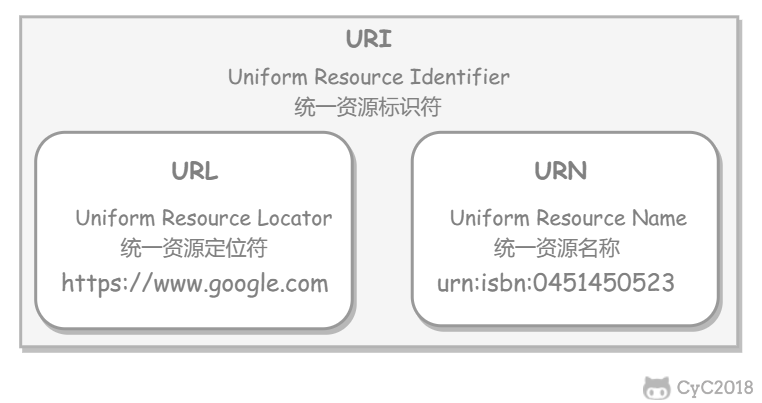
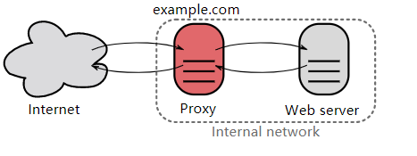

# Computer Network

[toc]


## 1、OSI 的七层模型分别是？各自的功能是什么？

> 1. What are the seven layers of the OSI model? What are their functions?

#### 简要概括 A brief summary

- 物理层：底层数据传输，如网线；网卡标准。

  Physical layer: Low-level data transmission, such as network cable; network card standard.

- 数据链路层：定义数据的基本格式，如何传输，如何标识；如网卡MAC地址。

  Data Link Layer: defines the basic format of data, how it is transmitted, and how it is identified; for example, a network card MAC address.

- 网络层：定义IP编址，定义路由功能；如不同设备的数据转发。

  Network layer: defines the IP address, defines the routing function; such as data forwarding between different devices.

- 传输层：端到端传输数据的基本功能；如 TCP、UDP。

  Transport Layer: the basic function of end-to-end data transfer; e. g. TCP, UDP.

- 会话层：控制应用程序之间会话能力；如不同软件数据分发给不同软件。

  Session layer: controls the ability of applications to communicate with each other; E. G. Different software data is distributed to different software.

- 表示层：数据格式标识，基本压缩加密功能。

  Presentation Layer: data format identification, basic compression encryption function.

- 应用层：各种应用软件，包括 Web 应用。

  Application Layer: a variety of applications, including Web applications.
  
  

#### 各层协议：


#### 说明 Description

- 在四层，既传输层数据被称作**tcp报文段或udp用户数据报**（Segments）；
- At the four levels, both the transport-level data are called TCP message Segments or UDP user data Segments
- 三层网络层数据被称做**包**（Packages）；
- Three layers of network layer data are called Packages;
- 二层数据链路层时数据被称为**帧**（Frames）；
- The data in the two-layer data link layer is called Frames
- 一层物理层时数据被称为**比特流**（Bits）。
- A layer of physical data is called a bit stream (Bits) .

#### 总结 Summary

- 网络七层模型是一个标准，而非实现。
- The seven-tier network model is a standard, not an implementation.
- 网络四层模型是一个实现的应用模型。
- The network four-layer model is an implementation application model.
- 网络四层模型由七层模型简化合并而来。
- The network four-tier model is a simplified merger of the seven-tier mode


#### 为何需要把 TCP/IP 协议栈分成 5 层（或7层）？

> Why is the TCP/IP stack divided into 5 layers (or 7 layers) ? 

分层的好处：

Benefits of  layering：

①隔层之间是独立的

​	different layers are independent

②灵活性好

​	good flexibility

③结构上可以分隔开

​	can be separated structurally

④易于实现和维护

​	easy to implement and maintain

⑤能促进标准化工作。

​	can promote the work of standardization.


#### 应用层协议

##### 动态主机配置协议 Dynamic Host Configuration Protocol

DHCP (Dynamic Host Configuration Protocol) 提供了即插即用的连网方式，用户不再需要手动配置 IP 地址等信息。

DHCP (Dynamic Host Configuration Protocol) provides plug-and-play networking, eliminating the need for users to manually configure information such as IP addresses.

DHCP 配置的内容不仅是 IP 地址，还包括子网掩码、网关 IP 地址。

The DHCP configuration includes not only IP addresses, but also subnet masks, Gateway IP addresses.

DHCP 工作过程如下：

DHCP works as follows:

1. 客户端发送 Discover 报文，该报文的目的地址为 255.255.255.255:67，源地址为 0.0.0.0:68，被放入 UDP 中，该报文被广播到同一个子网的所有主机上。如果客户端和 DHCP 服务器不在同一个子网，就需要使用中继代理。

   The client sends the Discover message, which has a destination address of 255.255.255.255:67 and a Default route address of 0.0.0.0:68 into UDP, and is broadcast to all hosts on the same subnet. If the client and the DHCP server are not on the same subnet, you need to use a relay agent.

2. DHCP 服务器收到 Discover 报文之后，发送 Offer 报文给客户端，该报文包含了客户端所需要的信息。因为客户端可能收到多个 DHCP 服务器提供的信息，因此客户端需要进行选择。

   After the DHCP server receives the Discover message, it sends the Offer message to the client, which contains the information that the client needs. Because the client may receive information from multiple DHCP servers, the client needs to make a choice.

3. 如果客户端选择了某个 DHCP 服务器提供的信息，那么就发送 Request 报文给该 DHCP 服务器。

   If the client selects information provided by a DHCP server, a Request message is sent to that DHCP server.

4. DHCP 服务器发送 Ack 报文，表示客户端此时可以使用提供给它的信息。

   The DHCP server sends an ACK message to indicate that the client can use the information provided to it at this time.


#### 网络层的作用

因为网络层是整个互联网的核心，因此应当让网络层尽可能简单。网络层向上只提供简单灵活的、无连接的、尽最大努力交互的数据报服务。

Because the network layer is the core of the entire Internet, it should be kept as simple as possible. The network layer only provides simple, flexible, connectionless, best effort interactive datagram services upwards.

使用 IP 协议，可以把异构的物理网络连接起来，使得在网络层看起来好像是一个统一的网络。

Using the IP protocol, heterogeneous physical networks can be connected, making the network layer appear as if it were a unified network.


#### 网络层的协议

| 协议Agreement | 名称Name                                              | 作用Effect                                                   |
| ------------- | ----------------------------------------------------- | ------------------------------------------------------------ |
| IP            | 网际协议Internet Protocol                             | IP协议不但定义了数据传输时的基本单元和格式，还定义了数据报的递交方法和路由选择IP protocol not only defines the basic unit and format of data transmission, but also defines the delivery method and routing of datagrams |
| ICMP          | Internet控制报文协议Internet control message protocol | ICMP就是一个“错误侦测与回报机制”，其目的就是让我们能够检测网路的连线状况﹐也能确保连线的准确性，是ping和traceroute的工作协议ICMP is an"Error detection and reward mechanism" designed to enable us to detect and ensure the accuracy of connections on the network. It is the working protocol for Ping and Traceroute |
| RIP           | 路由信息协议Routing Information Protocol              | 使用“跳数”(即metric)来衡量到达目标地址的路由距离Use"Hops"(that is, metric) to measure the routing distance to the destination address |
| IGMP          | Internet组管理协议Internet Group Management Protocol  | 用于实现组播、广播等通信For the implementation of multicast, broadcast and other communications |
| ARP           | 地址解析协议Address Resolution Protocol               | 根据IP地址获取物理地址Gets the physical address based on the IP address |
| RARP          | 反向地址转换协议Reverse Address Resolution Protocol   | 根据物理地址获取IP地址Gets the IP address based on the physical address |

> ==ARP和RARP是网络层的协议，但是它所工作的内容是链路层的==

#### 链路层的协议

| 协议 | 名称Name                          | 作用Effect                                                   |
| ---- | --------------------------------- | ------------------------------------------------------------ |
| PPP  | 点对点协议Point-to-point protocol | 主要是用来通过拨号或专线方式建立点对点连接发送数据，使其成为各种主机、网桥和路由器之间简单连接的一种共通的解决方案It is mainly used to set up point-to-point connection by dial-up or dedicated line to send data, so that it becomes a common solution for simple connection among various hosts, bridges and routers |

## 2、说一下一次完整的HTTP请求过程包括哪些内容？

> What does a complete HTTP request process consist of next?

域名解析 --> 发起TCP的3次握手 --> 建立TCP连接后发起http请求 --> 服务器响应http请求，浏览器得到html代码(如果不不是HTTP请求，这里要替换成HTTPS的解析) --> 浏览器解析html代码，并请求html代码中的资源（如js、css、图片等） --> 浏览器对页面进行渲染呈现给用户。

Domain name resolution-> initiate TCP 3 handshakes-> send HTTP Request-> server response HTTP request, the browser gets HTML code-> browser parsing HTML code, and request HTML code resources (such as JS, CSS, images, etc.)-> Browser to render the page rendered to the user


## 3、 DNS

**官方解释**：DNS（Domain Name System，域名系统），因特网上作为**域名和IP地址相互映射**的一个**分布式数据库**，能够使用户更方便的访问互联网，而不用去记住能够被机器直接读取的IP数串。

DNS (Domain Name System) , a distributed database on the internet where Domain names and IP addresses are mapped to each other, makes it easier for users to access the Internet, without having to remember the IP number strings that can be read directly by the machine.

通过主机名，最终得到该主机名对应的IP地址的过程叫做域名解析（或主机名解析）。

**domain name resolution**: Using the hostname,  getting the IP address for that hostname (or hostname resolution) .

属于应用层协议，使用UDP传输。

belong to application layer protocol, use UDP transmission


#### DNS的工作原理(How DNS works)

 


过程： 总结： 浏览器缓存，系统缓存，路由器缓存，IPS服务器缓存，根域名服务器缓存，顶级域名服务器缓存，主域名服务器缓存。 一、主机向本地域名服务器的查询一般都是采用递归查询。 二、本地域名服务器向根域名服务器的查询的迭代查询。

Process: Summary: Browser Cache, system cache, Router Cache, IPS server cache, Root Domain server cache, top-level domain server cache, primary domain server cache. First, the host to the local domain name server query is generally recursive query. Second, the local domain name server to the root domain name server query iterative query.

1. 当用户输入域名时，浏览器先检查自己的缓存中是否包含这个域名映射的ip地址，有解析结束。 2）若没命中，则检查操作系统缓存（如Windows的hosts）中有没有解析过的结果，有解析结束。 3）若无命中，则请求本地域名服务器解析（LDNS）。 4）若LDNS没有命中就直接跳到根域名服务器请求解析。根域名服务器返回给LDNS一个 主域名服务器地址。 5）此时LDNS再发送请求给上一步返回的gTLD（ 通用顶级域）， 接受请求的gTLD查找并返回这个域名对应的Name Server的地址 6）Name Server根据映射关系表找到目标ip，返回给LDNS
   - When the user enters the domain name, the browser first checks its cache to see if it contains the IP address of the domain name mapping, and the resolution ends. 
   - if it misses, check the operating system cache (such as Windows hosts) for parsed results and the resolution is complete. 
   -  if it misses, request local domain name server resolution (LDNS) 
   - if LDNS doesn't hit, just jump to the root domain server and request resolution. The root domain server returns a primary domain server address to LDNS.
   - LDNS then sends the request to the gTLD (generic top-level domain) returned in the previous step. The requested gTLD finds and returns the address of the Name Server for the domain Name. 
   - the Name Server finds the target IP according to the mapping table and returns it to LDNS
2. LDNS缓存这个域名和对应的ip， 把解析的结果返回给用户，用户根据TTL值缓存到本地系统缓存中，域名解析过程至此结束
3. LDNS caches the domain name and the corresponding IP, and returns the result of the parsing to the user, who caches the domain name into the local system cache according to the TTL value, and the process of domain name resolution ends here


#### 为什么域名解析用UDP协议？

> Why is domain name resolution using UDP?

UDP快速，不需要建立连接，客户端向DNS服务器查询域名，一般返回的内容都不超过512字节，用UDP传输即可

UDP is fast and does not need to establish a connection. The client queries the domain name to the DNS server. Generally, the returned content does not exceed 512 bytes. It can be transmitted by UDP.


#### 为什么区域传送用TCP协议？

> Why is TCP used for area transport?

TCP 更加可靠，并且传送的数据量大

TCP is more reliable and transmits a large amount of data.


#### DNS负载均衡是什么策略？（What is DNS load balancing）

当一个网站有足够多的用户的时候，假如每次请求的资源都位于同一台机器上面，那么这台机器随时可能会崩掉。处理办法就是用DNS负载均衡技术，它的原理是在**DNS服务器中为同一个主机名配置多个IP地址,在应答DNS查询时,DNS服务器对每个查询将以DNS文件中主机记录的IP地址按顺序返回不同的解析结果,将客户端的访问引导到不同的机器上去,使得不同的客户端访问不同的服务器**,从而达到负载均衡的目的｡例如可以根据每台机器的负载量，该机器离用户地理位置的距离等等。

When a site has enough users, if the resources requested are on the same machine every time, the machine could crash at any time. The solution is to use DNS load balancing technology, its principle is to configure multiple IP addresses for the same host name in the DNS server. When answering DNS queries, the DNS server will return different resolution results in order with the IP address recorded by the host in the DNS file for each query, and guide the client's access to different machines, so that different clients access different servers to achieve the purpose of load balancing. For example, according to the load of each machine, the distance of the machine from the user's geographical location, etc.


## 4、HTTP长连接和短连接的区别 

> The difference between HTTP long and short connections

在HTTP/1.0中默认使用短连接。也就是说，客户端和服务器每进行一次HTTP操作，就建立一次连接，任务结束就中断连接。

Short connections are used by default in HTTP/1.0. That is, each time the client and server make an HTTP operation, a connection is established and the connection is broken when the task is finished.

而从HTTP/1.1起，默认使用长连接，用以保持连接特性。

Starting with HTTP/1.1, long connections are used by default to keep the connection feature


## 5、什么是TCP粘包/拆包？发生的原因？ 

> What is TCP sticking/unpacking and why does it happen?

一个完整的业务可能会被TCP拆分成多个包进行发送，也有可能把多个小的包封装成一个大的数据包发送，这个就是TCP的拆包和粘包问题。

A complete business may be TCP split into multiple packets to send, it is also possible to send many small packets into a large packet, this is TCP packet unpacking and sticky packet problem.

#### 原因 Reason

##### 拆包：

1、应用程序写入数据的字节大小大于套接字发送缓冲区的大小.

​		The byte size of the data written by the application is greater than the size of the socket send buffer.

2、进行MSS大小的TCP分段。( MSS=TCP报文段长度-TCP首部长度)

  	TCP segmentation for MSS size. MSS = TCP segment length-TCP header length

3、以太网的payload大于MTU进行IP分片。（ MTU指：一种通信协议的某一层上面所能通过的最大数据包大小。）

​		Ethernet payload greater than MTU for IP sharding. MTU refers to the maximum packet size that can be passed above a certain layer of a communication protocol

##### 粘包：

- 由TCP**连接复用**造成的粘包问题。

- Sticky packet problem caused by TCP connection reuse.

- 因为TCP默认会使用Nagle算法（Nagle algorithm），此算法会导致粘包问题。

  Because TCP uses  Nagle algorithm by default , this algorithm can cause sticky packet problems.

  - 只有上一个分组得到确认，才会发送下一个分组；
  - The next packet is sent only if the previous one is confirmed;
  - 收集多个小分组，在一个确认到来时一起发送。
  - Collect multiple subgroups and send them together when an acknowledgement arrives.

- **数据包过大**造成的粘包问题。

- The problem of sticking packets caused by large data packets.

- 流量控制，**拥塞控制**也可能导致粘包。

- Flow control, congestion control can also lead to sticky packets.

- **接收方不及时接收缓冲区的包，造成多个包接收**

- The receiver does not receive buffered packets in time, causing multiple packets to receive

#### 解决方案 Solutions

1、消息定长。

​		Set the message length.

2、在包尾部增加回车或者空格符等特殊字符进行分割

​		Add special characters such as carriage return or space characters at the end of the package for segmentation

3、将消息分为消息头和消息尾

​		Divide messages into headers and endings

4、使用其它复杂的协议，如RTMP协议等。

​		Use other complex protocols, such as RTMP, etc. .

5、 在TCP报文的头部加上表示数据长度。

​		Adds the data length to the header of the TCP message.

## 5、为什么服务器会缓存这一项功能?如何实现的？

> Why is the server caching this feature? How?

**原因**

Reason

- 缓解服务器压力；
- Relieve server pressure;
- 降低客户端获取资源的延迟：缓存通常位于内存中，读取缓存的速度更快。并且缓存服务器在地理位置上也有可能比源服务器来得近，例如浏览器缓存。
- Reduce client latency to get resources: the cache is usually in memory and can be read more quickly. It is also possible for the cache server to be geographically closer than the source server, such as the browser cache.

**实现方法**

Implementation method

- 让代理服务器进行缓存；
- Allow proxy server to be cached;
- 让客户端浏览器进行缓存。
- Let the client browser cache


## 6、HTTP请求方法你知道？ 

> How much do you know about HTTP request methods?

客户端发送的 **请求报文** 第一行为请求行，包含了方法字段。

The client sends a request message, the first line of the request line, containing the method field.

| 序 号Serial number | 方法Method  | 描述Description                                              |
| :----------------- | :---------- | ------------------------------------------------------------ |
| 1                  | GET走开     | 请求指定的页面信息，并返回实体主体。Requests the specified page information and returns the entity body. |
| 2                  | HEAD头      | 类似于 GET 请求，只不过返回的响应中没有具体的内容，用于获取报头It is similar to a GET request, except that the returned response has no specific content for getting the header |
| 3                  | POST职位    | 向指定资源提交数据进行处理请求（例如提交表单或者上传文件）。数据被包含在请求体中。POST 请求可能会导致新的资源的建立和/或已有资源的修改。Submit data to a specified resource for processing requests (such as submitting a form or uploading a file) . The data is contained in the body of the request. Post requests may result in the creation of new resources and/or modifications to existing resources. |
| 4                  | PUT放       | 从客户端向服务器传送的数据取代指定的文档的内容。The data passed from the client to the server replaces the contents of the specified document.                                                                                        由于自身不带验证机制，任何人都可以上传文件，因此存在安全性问题，一般不使用该方法。Since no authentication mechanism, anyone can upload files, so there is a security problem, generally do not use this method. |
| 5                  | DELETE删除  | 请求服务器删除指定的页面。Requests the server to delete the specified page. |
| 6                  | CONNECT连接 | HTTP/1.1 协议中预留给能够将连接改为管道方式的代理服务器。The HTTP/1.1 protocol is reserved for proxy servers that can change the connection to pipe. |
| 7                  | OPTIONS选择 | 查询支持的方法                                               |
| 8                  | TRACE       | The method supported by the query回显服务器收到的请求，主要用于测试或诊断。echo the request that server received requests, primarily used for testing or diagnostics. 服务器会将通信路径返回给客户端。 |
| 9                  | PATCH补丁   | 是对 PUT 方法的补充，用来对已知资源进行局部更新 。Is a supplement to the PUT method for locally updating known resources |
| 10                  | CONNECT 连接  | 要求在与代理服务器通信时建立隧道 Requires a tunnel to be built while communicating with the proxy server 使用 SSL（Secure Sockets Layer，安全套接层）和 TLS（Transport Layer Security，传输层安全）协议把通信内容加密后经网络隧道传输。 Secure Sockets Layer (SSL) and Transport Layer Security (TLS) protocols are used to encrypt and Transport Layer Security communications over a network Transport Layer Security. |


#### GET和POST的区别？

1. get是获取数据，post是修改数据

   Get is getting data, post is modifying data

2. get把请求的数据放在url上， 以?分割URL和传输数据，参数之间以&相连，所以get不太安全。而post把数据放在HTTP的包体内（request body 相对安全）

   Get puts the requested data on the URL to? Split the URL and transfer the data, and the parameters are connected with & , so get is not very secure. The post puts the data in the HTTP request body (which is relatively safe)

3. get提交的数据最大是2k（ 限制实际上取决于浏览器）， post理论上没有限制。

   The maximum amount of data submitted by get is 2K (the limit actually depends on the browser) , and post is theoretically unlimited.

4. GET产生一个TCP数据包，浏览器会把http header和data一并发送出去，服务器响应200(返回数据); POST产生两个TCP数据包，浏览器先发送header，服务器响应100 continue，浏览器再发送data，服务器响应200 ok(返回数据)。

   GET generates a TCP packet, the browser sends the HTTP header and data together, the server responds with 200(returns data) , the POST generates two TCP packets, the browser sends the header first, and the server responds with 100 continue, the, the browser then sends data, and the server responds with 200ok -LRB-returning data) .

5. GET请求会被浏览器主动缓存，而POST不会，除非手动设置。

   GET requests are actively cached by the browser, while POST requests are not, unless set manually.

6. 本质区别：GET是幂等的，而POST不是幂等的

   The essential difference: Get is idempotent and POST is not

​		正因为它们有这样的区别，所以不应该且**不能用get请求做数据的增删改这些有副作用的操作**。因为get请求是幂等的，**在网络不好的隧道中会尝试重试**。如果用get请求增数据，会有**重复操作**的风险，而这种重复操作可能会导致副作用（浏览器和操作系统并不知道你会用get请求去做增操作）。

Because of this difference, you should not and can not use get requests to add or remove data that has side effects. Because get requests are idempotent, attempts are made to retry in a tunnel with a bad network. If you add data with a get request, you run the risk of repeating the operation, which can lead to side effects (browsers and operating systems don't know you're adding data with a get request)


## 7、HTTP2.0

1. **二进制分帧（Binary Format）**

   - http2.0之所以能够突破http1.X标准的性能限制，改进传输性能，实现低延迟和高吞吐量，就是因为其新增了二进制分帧层。

   - 帧(frame)包含部分：类型Type, 长度Length, 标记Flags, 流标识Stream和frame payload有效载荷。

   - 消息(message)：一个完整的请求或者响应，比如请求、响应等，由一个或多个 Frame 组成。

   - 流是连接中的一个虚拟信道，可以承载双向消息传输。每个流有唯一整数标识符。为了防止两端流ID冲突，客户端发起的流具有奇数ID，服务器端发起的流具有偶数ID。

     流标识是描述二进制frame的格式，使得每个frame能够基于http2发送，与流标识联系的是一个流，每个流是一个逻辑联系，一个独立的双向的frame存在于客户端和服务器端之间的http2连接中。一个http2连接上可包含多个并发打开的流，这个并发流的数量能够由客户端设置。

   - 在二进制分帧层上，http2.0会将所有传输信息分割为更小的消息和帧，并对它们采用二进制格式的编码将其封装。

   - http1.X中的首部信息header封装到Headers帧中，而request body将被封装到Data帧中。

     The reason why http2.0 can break through http1. The performance limitation of the X standard improves transmission performance, and achieves low latency and high throughput because it adds a binary framing layer.

     Frame contains parts: Type, Length, Tag Flags, Stream ID Stream and frame payload payload.

     Message: A complete request or response, consists of one or more Frames.

     The stream is a virtual channel in the connection, which can carry two-way message transmission. Each stream has a unique integer identifier. In order to prevent the conflict of stream IDs at both ends, the stream initiated by the client has an odd ID, and the stream initiated by the server has an even ID.

     The stream identity is a format that describes the binary frame, so that each frame can be sent based on http2. What is associated with the stream identity is a stream. Each stream is a logical connection, and an independent two-way frame exists in the http2 connection between the client and the server. An http2 connection can contain multiple concurrent open streams, and the number of concurrent streams can be set by the client.

     On the binary framing layer, http2.0 divides all transmitted information into smaller messages and frames, and encapsulates them with binary encoding.

     Http1.x The first information header in X is encapsulated in the Headers frame, and the request body will be encapsulated in the Data frame.

2. **多路复用 (Multiplexing)**

   多路复用允许同时通过单一的http/2 连接发起多重的请求-响应消息。有了新的分帧机制后，http/2 不再依赖多个TCP连接去实现多流并行了。每个数据流都拆分成很多互不依赖的帧，而这些帧可以交错（乱序发送），还可以分优先级，最后再在另一端把它们重新组合起来。

   Multiplexing allows multiple request-response messages to be initiated simultaneously through a single http/2 connection. With the new framing mechanism, http/2 no longer relies on multiple TCP connections to achieve multi-stream parallelism. Each data stream is split into many non-reliant frames, which can be sent out of order, prioritized, and finally regroup them at the other end.

3. **头部压缩（Header Compression）**

   http1.x的头带有大量信息，而且每次都要重复发送。http/2使用encoder来减少需要传输的header大小，通讯双方各自缓存一份头部字段表，既避免了重复header的传输，又减小了需要传输的大小。

   The header of http1.x has a lot of information, and it has to be sent repeatedly every time. Http/2 uses encoder to reduce the size of the header that needs to be transmitted. Both parties to the communication cache a header field table, which not only avoids the repeated transmission of the header, but also reduces the size that needs to be transmitted.

4. **请求优先级（Request Priorities）**

​		把http消息分为很多独立帧之后，就可以通过优化这些帧的交错和传输顺序进一步优化性能。每个流都可以带有一个31比特的优先值：0 表示最高优先级；2的31次方-1 表示最低优先级。

​		After dividing http messages into many independent frames, the performance can be further optimized by optimizing the 	staggering and transmission sequence of these frames. Each stream can have a 31-bit priority: 0 indicates the highest priority; the 31rd of 2 -1 indicates the lowest priority.

5. **服务端推送（Server Push）**

​		服务器可以对一个客户端请求发送多个响应，服务器向客户端推送资源无需客户端明确地请求。并且，服务端推送能把客户端所需要的资源伴随着index.html一起发送到客户端，省去了客户端重复请求的步骤。

​	The server can send multiple responses to a client request, and the server pushes resources to the client without the client's explicit request. Moreover, the server push can send the resources required by the client to the client together with index.html, eliminating the steps of repeated requests from the client.


## 7.1 HTTP/1.1 新特性 

- 默认是长连接

  The default is a long connection

- 支持流水线

  Support pipeline

- 支持同时打开多个 TCP 连接

  Support for opening multiple TCP connections simultaneously

- 支持虚拟主机

  Support for virtual hosting

- 新增状态码 100

  Add status code 100

- 支持分块传输编码

  Support the Chunked transfer encoding

- 新增缓存处理指令 max-age

  Add cache handling instruction max-age


## 8、HTTPS和HTTP的区别 

> The difference between HTTPS and HTTP

1、HTTP协议传输的数据都是未加密的，也就是明文的，因此使用HTTP协议传输隐私信息非常不安全， HTTPS协议是由SSL+HTTP协议构建的可进行加密传输、身份认证的网络协议，要比http协议安全。

​	The data transmitted by the HTTP protocol is unencrypted, that is, plain text, so it is very unsafe to use the HTTP protocol to transmit private information, hTTPS protocol is a network protocol constructed by SSL and HTTP protocol, which is more secure than HTTP protocol.

2、https协议需要到ca申请证书，一般免费证书较少，因而需要一定费用。 3、http和https使用的是完全不同的连接方式，用的端口也不一样，前者是80，后者是443。

​	HTTPS protocol needs to apply for a certificate to CA, general free certificate less, therefore need a certain fee. HTTP and HTTPS use completely different connections and different ports, 80 for the former and 443 for the latter


## 8.1 HTTP的缺点有哪些？

> What are the drawbacks of HTTP?

- 使用明文进行通信，内容可能会被窃听；
- Use clear text for communication, the content may be stolen;
- 不验证通信方的身份，通信方的身份有可能遭遇伪装；
- If the identity of the communicator is not verified, the identity of the communicator may be the attacker
- 无法证明报文的完整性，报文有可能遭篡改。
- Can not prove the integrity of the message, the message may be tampered with


## 9、什么是SSL/TLS ？

> What is SSL/TLS?

SSL代表安全套接字层。它是一种用于加密和验证应用程序（如浏览器）和Web服务器之间发送的数据的协议。 身份验证 ， 加密Https的加密机制是一种共享密钥加密和公开密钥加密并用的混合加密机制。

SSL represents the secure socket layer. It is a protocol for encrypting and validating data sent between applications, such as browsers, and Web servers. HTTPS encryption is a hybrid of symmetric-key algorithm and public-key cryptography.

SSL/TLS协议作用：认证用户和服务，加密数据，维护数据的完整性，

SSL TLS function: authenticate users and services, encrypt data, maintain data integrity 

对称加密：优点在于加密、解密效率通常比较高 ，HTTPS 是基于非对称加密的， 公钥是公开的，

Symmetric encryption: the advantage is that encryption and decryption are generally efficient, HTTPS is public-key cryptography


## 9.1 SSL中的认证中的证书是什么？了解过吗？

> 75. What is the certificate in Authentication in SSL? 

通过使用 **证书** 来对通信方进行认证。

To authenticate a party by using a certificate.

数字证书认证机构（CA，Certificate Authority）是客户端与服务器双方都可信赖的第三方机构。

A digital Certificate Authority (CA) is a third-party organization that both the client and the server can trust.

服务器的运营人员向 CA 提出公开密钥的申请，CA 在判明提出申请者的身份之后，会对已申请的公开密钥做数字签名，然后分配这个已签名的公开密钥，并将该公开密钥放入公开密钥证书后绑定在一起。

The server operator applies for the public key to the CA. After the CA determines the identity of the applicant, it digitally signs the applied public key, and then distributes the signed public key, and binding the public key together after putting it into the public key certificate.

进行 HTTPS 通信时，服务器会把证书发送给客户端。客户端取得其中的公开密钥之后，先使用数字签名进行验证，如果验证通过，就可以开始通信了。

When communicating with HTTPS, the server sends the certificate to the client. After the client obtains the public key, it verifies it with a digital signature and, if it passes, it can begin to communicate


## 10、HTTPS

#### what is HTTPS

HTTPS 并不是新协议，而是让 **HTTP 先和 SSL（Secure Sockets Layer）通信，再由 SSL 和 TCP 通信，也就是说 HTTPS 使用了隧道进行通信**。通过使用 SSL，HTTPS 具有了加密（防窃听）、认证（防伪装）和完整性保护（防篡改）。

HTTPS is not a new protocol, but lets HTTP communicate with SSL (Secure Sockets Layer) first, and then with TCP (TCP) , which means that HTTPS uses a tunnel to communicate. With SSL, HTTPS has encryption (eavesdropping) , authentication (camouflage) , and integrity protection (tamper-proof) 

HTTPS 采用混合的加密机制，使用**非对称密钥加密用于传输对称密钥来保证传输过程的安全性**，之后使用**对称密钥加密进行通信来保证通信过程的效率**。

HTTPS uses a hybrid encryption mechanism, using public-key cryptography to transmit symmetric keys to ensure the security of the transmission process, and then using symmetric-key algorithm to communicate to ensure the efficiency of the communication process

#### 传输建立过程

The process of ensuring transport security (which is essentially the RSA principle) :

1. Client给出协议版本号、一个客户端生成的随机数（Client random），以及客户端支持的加密方法。
2. Client gives the protocol version number, a client random number generated by the Client, and the encryption methods supported by the Client.
3. Server确认双方使用的加密方法，并给出数字证书、以及一个服务器生成的随机数（Server random）。
4. Server confirms the encryption method used by both parties and gives a digital certificate and a Server-generated random number.
5. Client确认数字证书有效，然后生成呀一个新的随机数（Premaster secret），并使用数字证书中的公钥，加密这个随机数，发给Server。
6. Client verifies that the digital certificate is valid, then generates a new Premaster secret, encrypts the random number using the public key in the digital certificate, and sends it to the Server.
7. Server使用自己的私钥，获取Client发来的随机数（Premaster secret）。
8. Server uses its private key to get the Premaster secret from the Client.
9. Client和Server根据约定的加密方法，使用前面的三个随机数，生成”对话密钥”（session key），用来加密接下来的整个对话过程。
10. The Client and Server use the first three random numbers to generate the session key, which is used to encrypt the entire conversation

#### 如何保证公钥不被篡改？ 

> How Do I keep my public key from being tampered with?

将公钥放在数字证书中。只要证书是可信的，公钥就是可信的。

Place the public key in the digital certificate. As long as the certificate is trusted, the public key is trusted.


#### 为什么有的时候刷新页面不需要重新建立 SSL 连接？

> Why is it that sometimes refreshing a page does not require re-establishing an SSL connection?

TCP 连接有的时候会被浏览器和服务端维持一段时间，TCP 不需要重新建立，SSL 自然也会用之前的。

TCP connections are sometimes maintained by browsers and servers for a period of time, TCP does not need to be re-established, SSL will naturally use before.


#### 完整性保护 Integrity Protection

SSL 提供报文摘要功能来进行完整性保护。

SSL provides the message summary function for integrity protection.

HTTP 也提供了 MD5 报文摘要功能，但不是安全的。例如报文内容被篡改之后，同时重新计算 MD5 的值，通信接收方是无法意识到发生了篡改。

HTTP also provides MD5 Message Digest functionality, but it is not secure. For example, if the message content is tampered with and the value of MD5 is recalculated, the communication receiver is not aware of the tampering.

HTTPS 的报文摘要功能之所以安全，是因为它结合了加密和认证这两个操作。试想一下，加密之后的报文，遭到篡改之后，也很难重新计算报文摘要，因为无法轻易获取明文。

HTTPS's message digest function is secure because it combines encryption and authentication. Imagine that the message after encryption is tampered with, it is also difficult to recalculate the message abstract, because the plain text can not be easily obtained.


## 11、HTTP请求和响应报文有哪些主要字段？

> What are the main fields of HTTP request and response packets?

#### 请求报文 Request message

- 请求行：Request Line
- 请求头：Request Headers
- 请求体：Request Body

#### 响应报文 Response Message

- 状态行：Status Line
- 响应头：Response Headers
- 响应体：Response Body


### 11.1 URL 网址

HTTP 使用 URL（ **U** niform **R**esource **L**ocator，统一资源定位符）来定位资源，它是 URI（**U**niform **R**esource **I**dentifier，统一资源标识符）的子集，URL 在 URI 的基础上增加了定位能力。URI 除了包含 URL，还包含 URN（Uniform Resource Name，统一资源名称），它只是用来定义一个资源的名称，并不具备定位该资源的能力。例如 urn:isbn:0451450523 用来定义一个书籍名称，但是却没有表示怎么找到这本书。

HTTP uses urls (Uniform Resource locators, Uniform Resource Locator) to locate resources, which are a subset of uris (Uniform Resource Identifiers, Uniform Resource Identifier) that add localization capabilities to uris. A URI contains not only a URL but also a URN -LRB-Uniform Resource Name) , which is simply a Name used to define a Resource and does not have the ability to locate that Resource. For example, URN: ISBN: 0451450523 defines a book name, but does not indicate how to find the book.




## 11.1 常见的HTTP状态码有哪些？ 

> What are some common HTTP status codes?

| 状态码Status Code | 类别Category                     | 含义Meaning                                                  |
| ----------------- | -------------------------------- | ------------------------------------------------------------ |
| 1XX               | Informational（信息性状态码）    | 接收的请求正在处理The received request is being processed    |
| 2XX               | Success（成功状态码）            | 请求正常处理完毕The request is processed normally            |
| 3XX               | Redirection（重定向状态码）      | 需要进行附加操作以完成请求Additional actions are required to complete the request |
| 4XX               | Client Error（客户端错误状态码） | 服务器无法处理请求The server could not process the request   |
| 5XX               | Server Error（服务器错误状态码） | 服务器处理请求出The server processes the request out         |

#### 1xx 信息 1XX message

**100 Continue** ：表明到目前为止都很正常，客户端可以继续发送请求或者忽略这个响应。

100continue:  indicates that so far so good, the client can Continue to send the request or ignore the response.

#### 2xx 成功 2xx success

- **200 OK**
- **204 No Content** ：请求已经成功处理，但是返回的响应报文不包含实体的主体部分。一般在只需要从客户端往服务器发送信息，而不需要返回数据时使用。
- the request was successfully processed, but the returned response message does not contain the body of the entity. It is used when you only need to send information from the client to the server, and you do not need to return data.
- **206 Partial Content** ：表示客户端进行了范围请求，响应报文包含由 Content-Range 指定范围的实体内容。
- indicates that the client has made a range request and the response message contains the entity Content in the range specified by Content-Range.

#### 3xx 重定向 3xx redirection

- **301 Moved Permanently** ：永久性重定向
- **302 Found** ：临时性重定向
- 302 Found: temporary redirection
- **303 See Other** ：和 302 有着相同的功能，但是 303 明确要求客户端应该采用 GET 方法获取资源。
- has the same functionality as 302, but 303 specifically requires that the client use the GET method to GET the resource.
- **304 Not Modified** ：如果请求报文首部包含一些条件，例如：If-Match，If-Modified-Since，If-None-Match，If-Range，If-Unmodified-Since，如果不满足条件，则服务器会返回 304 状态码。
- if the first part of the request contains conditions, such as: If-Match, if-Modified-since, If-None-Match, If-Range, If-Unmodified-Since, if the conditions are Not met, the server returns a 304 status code.
- **307 Temporary Redirect** ：临时重定向，与 302 的含义类似，但是 307 要求浏览器不会把重定向请求的 POST 方法改成 GET 方法。
- Temporary Redirect, similar in meaning to 302, but 307 requires browsers not to change the POST method of a Redirect request to the GET method.

#### 4xx 客户端错误 4xx client error

- **400 Bad Request** ：请求报文中存在语法错误。
- Syntax Error in Request message.
- **401 Unauthorized** ：该状态码表示发送的请求需要有认证信息（BASIC 认证、DIGEST 认证）。如果之前已进行过一次请求，则表示用户认证失败。
- this status code indicates that the sent request requires authentication information (BASIC authentication, Digest Authentication) . If a request has been made previously, user authentication has failed.
- **403 Forbidden** ：请求被拒绝。
- Request denied.
- **404 Not Found**

#### 5xx 服务器错误 5xx server error

- **500 Internal Server Error** ：服务器正在执行请求时发生错误。
- 500internal Server Error: an Error occurred while the Server was executing the request.
- **503 Service Unavailable** ：服务器暂时处于超负载或正在进行停机维护，现在无法处理请求。
- the server is temporarily overloaded or undergoing downtime maintenance and is unable to process requests.


## 11.2 HTTP header

有 4 种类型的首部字段：通用首部字段、请求首部字段、响应首部字段和实体首部字段。

There are four types of header fields: generic header field, request header field, response header field, and entity header field.

各种首部字段及其含义如下（不需要全记，仅供查阅）：

The various header fields and their meanings are as follows (no need to memorize them, just refer to them) :


### 通用首部字段 

|    首部字段名     |                             说明                             |
| :---------------: | :----------------------------------------------------------: |
|   Cache-Control   |      控制缓存的行为 Controls the behavior of the cache       |
|    Connection     | 控制不再转发给代理的首部字段、管理持久连接Controls the first field that is no longer forwarded to the agent, and manages persistent connections |
|       Date        | 创建报文的日期时间 The date and time at which the message was created |
|      Pragma       |                报文指令 Message instructions                 |
|      Trailer      |   报文末端的首部一览 The header at the end of the message    |
| Transfer-Encoding | 指定报文主体的传输编码方式 Specifies the transport encoding for the message body |
|      Upgrade      |          升级为其他协议 Upgrade to another protocol          |
|        Via        |         代理服务器的相关信息 About the proxy server          |
|      Warning      |                 错误通知 Error notification                  |


### 请求首部字段 

|     首部字段名      |                             说明                             |
| :-----------------: | :----------------------------------------------------------: |
|       Accept        | 用户代理可处理的媒体类型 The type of media that the user agent can handle |
|   Accept-Charset    |           优先的字符集 The preferred character set           |
|   Accept-Encoding   |          优先的内容编码 Preferred content encoding           |
|   Accept-Language   | 优先的语言（自然语言）Preferred language (natural language)  |
| Authorization 授权  |          Web 认证信息Web authentication information          |
|       Expect        | 期待服务器的特定行为Expect specific behavior from the server |
|        From         |       用户的电子邮箱地址The e-mail address of the user       |
|        Host         | 请求资源所在服务器The server on which the resource is requested |
|      If-Match       |        比较实体标记（ETag）Compare entity tags (ETAG)        |
|  If-Modified-Since  |  比较资源的更新时间Compare the update time of the resource   |
|    If-None-Match    | 比较实体标记（与 If-Match 相反）Compare entity tags (as opposed to If-Match) |
|      If-Range       | 资源未更新时发送实体 Byte 的范围请求A range request for an entity Byte is sent when the resource is not updated |
| If-Unmodified-Since | 比较资源的更新时间（与 If-Modified-Since 相反）Compare the update time of the resource (as opposed to If-Modified-Since) |
|    Max-Forwards     |    最大传输逐跳数Maximum number of hops per transmission     |
| Proxy-Authorization | 代理服务器要求客户端的认证信息The proxy server requires authentication information from the client |
|        Range        |   实体的字节范围请求The Byte Range Request for the entity    |
|       Referer       | 对请求中 URI 的原始获取方The original acquirer of the URI in the request |
|         TE          |    传输编码的优先级The priority of the transport encoding    |
|     User-Agent      | HTTP 客户端程序的信息Information about the HTTP client program |


### 响应首部字段

|     首部字段名     |                             说明                             |
| :----------------: | :----------------------------------------------------------: |
|   Accept-Ranges    |  是否接受字节范围请求Whether to accept byte range requests   |
|        Age         | 推算资源创建经过时间Calculate the time elapsed for resource creation |
|        ETag        |       资源的匹配信息Match information for the resource       |
|      Location      | 令客户端重定向至指定 URICauses the client to redirect to the specified URI |
| Proxy-Authenticate | 代理服务器对客户端的认证信息Proxy server client authentication information |
|    Retry-After     | 对再次发起请求的时机要求The timing of the request for a second time |
|       Server       | HTTP 服务器的安装信息Installation information for the HTTP server |
|        Vary        | 代理服务器缓存的管理信息Management information for the proxy server cache |
|  WWW-Authenticate  | 服务器对客户端的认证信息Server authentication information for the client |


### 实体首部字段 

| 首部字段名The first field name |                       说明Description                        |
| :----------------------------: | :----------------------------------------------------------: |
|             Allow              | 资源可支持的 HTTP 方法The HTTP methods that the resource can support |
|        Content-Encoding        | 实体主体适用的编码方式The encoding method applicable to the entity body |
|        Content-Language        | 实体主体的自然语言The natural language of the entity subject |
|         Content-Length         |          实体主体的大小The size of the entity body           |
|        Content-Location        | 替代对应资源的 URIReplaces the URI of the corresponding resource |
|          Content-MD5           |   实体主体的报文摘要The message summary of the entity body   |
|         Content-Range          |   实体主体的位置范围The location range of the entity body    |
|          Content-Type          |     实体主体的媒体类型The media type of the entity body      |
|            Expires             | 实体主体过期的日期时间The date and time at which the entity principal expired |
|         Last-Modified          | 资源的最后修改日期时间The last modification date time for the resource |


## 12、HTTP中缓存的私有和共有字段？知道吗？

> Private and public fields cached in HTTP? You know what?

private 指令规定了将资源作为私有缓存，只能被单独用户使用，一般存储在用户浏览器中。

The private instruction specifies that the resource be cached as private and can only be used by a single user, usually stored in the user's browser.

```html
Cache-Control: private    
```

public 指令规定了将资源作为公共缓存，可以被多个用户使用，一般存储在代理服务器中。

The Public instruction specifies that a resource is a public cache that can be used by multiple users, typically stored in a proxy server.

```html
Cache-Control: public
```


## 13、GET 方法的长度限制是怎么回事？ 

> What is the length limit for the GET method?

首先说明一点，HTTP 协议没有 Body 和 URL 的长度限制，对 URL 限制的大多是浏览器和服务器的原因。

First of all, the HTTP protocol has no Body and URL length limits, and most of the URL limits are for browser and server reasons.

服务器是因为处理长 URL 要消耗比较多的资源，为了性能和安全（防止恶意构造长 URL 来攻击）考虑，会给 URL 长度加限制。

the server uses a lot of resources to handle long urls and places limits on the length of urls for performance and security reasons (to prevent long urls from being maliciously constructed) 


## 13、Cookie是什么？

> What is a Cookie?

#### why need cookie?

HTTP 协议是**无状态**的，主要是为了让 HTTP 协议尽可能简单，使得它能够处理大量事务，HTTP/1.1 引入 Cookie 来保存状态信息。

HTTP is a stateless protocol, mainly to make the HTTP protocol as simple as possible, so that it can handle a large number of transactions, HTTP/1.1 introduced cookies to store state information.


#### definition

Cookie 是**服务器发送到用户浏览器并保存在本地的一小块数据**，它会在浏览器之后向同一服务器再次发起请求时被携带上，用于告知服务端两个请求是否来自同一浏览器。由于之后每次请求都会需要携带 Cookie 数据，因此会带来额外的性能开销（尤其是在移动环境下）。

A Cookie is a small piece of data that the server sends to the user's browser and stores locally. It is carried when the browser later makes another request to the same server, used to tell the server if two requests are coming from the same browser. There is an additional performance overhead, especially in a mobile environment, since each subsequent request will need to carry Cookie data.

Cookie 曾一度用于客户端数据的存储，因为当时并没有其它合适的存储办法而作为唯一的存储手段，但现在随着现代浏览器开始支持各种各样的存储方式，Cookie 渐渐被淘汰。

Cookies were once used to store client-side data because there was no other way to store it, but now modern browsers are supporting a variety of storage options, cookies are becoming out of date.

新的浏览器 API 已经允许开发者直接将数据存储到本地，如使用 Web storage API（本地存储和会话存储）或 IndexedDB。

The new browser apis already allow developers to store data locally directly, such as using the Web Storage API (local and session storage) or IndexedDB.

Cookie在客户端的保存形式可以有两种，一种是会话Cookie一种是持久Cookie，会话Cookie就是将服务器返回的Cookie字符串保持在内存中，关闭浏览器之后自动销毁，持久Cookie则是存储在客户端磁盘上，其有效时间在服务器响应头中被指定，在有效期内，客户端再次请求服务器时都可以直接从本地取出。需要说明的是，存储在磁盘中的Cookie是可以被多个浏览器代理所共享的。

Cookies can be stored in two forms on the client side. One is a session Cookie, the other is a persistent Cookie. A session Cookie keeps the Cookie string returned by the server in memory, a persistent Cookie is stored on the client disk for a specified period of time in the server response header, when the client requests the server again, it can simply fetch it locally. It should be noted that cookies stored on disk can be shared by multiple browser agents.


#### Cookie有什么用途 (What are cookies for)

- 会话状态管理（如用户登录状态、购物车、游戏分数或其它需要记录的信息）
- Session state management (such as user login status, shopping cart, game score, or other information to be logged)
- 个性化设置（如用户自定义设置、主题等）
- Personalization settings (such as user-defined settings, themes, and so on)
- 浏览器行为跟踪（如跟踪分析用户行为等）
- Browser behavior tracking (such as tracking and analyzing user behavior)


## 14、Session知识总结 

> Session knowledge summary

除了可以将用户信息通过 Cookie 存储在用户浏览器中，也可以利用 Session 存储在服务器端，存储在服务器端的信息更加安全。

In addition to storing user information in the user's browser via cookies, you can also use the Session to store it on the server side, where it is more secure.

Session 可以存储在服务器上的文件、数据库或者内存中。也可以将 Session 存储在 Redis 这种内存型数据库中，效率会更高。Session结构中存储了用户操作行为。

Sessions can be stored in a file, database, or memory on the server. It is also possible to store sessions in an in-memory database such as Redis, which is more efficient.Session structure stores user actions.


#### 使用 Session 维护用户登录状态的过程如下：

Using Session to maintain user login status is as follows:

1. 用户进行登录时，用户提交包含用户名和密码的表单，放入 HTTP 请求报文中；
2. When the user logs in, the user submits a form containing the user name and password, and puts it into the HTTP request message;
3. 服务器验证该用户名和密码，如果正确则把用户信息存储到 Redis 中，它在 Redis 中的 Key 称为 Session ID；
4. The server verifies the user name and password and, if correct, stores the user information in Redis. Its Key in Redis is called the Session id
5. 服务器返回的响应报文的 Set-Cookie 首部字段包含了这个 Session ID，客户端收到响应报文之后将该 Cookie 值存入浏览器中；
6. The first field of the Set-Cookie of the response packet returned by the server contains the Session ID, and the client saves the Cookie value to the browser after receiving the response packet
7. 客户端之后对同一个服务器进行请求时会包含该 Cookie 值，服务器收到之后提取出 Session ID，从 Redis 中取出用户信息，继续之前的业务操作。
8. The client then makes a request to the same server that contains the Cookie value. The server receives the Cookie, extracts the Session ID, retrieves the user information from Redis, and continues the previous business operation.

> 注意：Session ID 的安全性问题，不能让它被恶意攻击者轻易获取，那么就不能产生一个容易被猜到的 Session ID 值。此外，还需要经常重新生成 Session ID。在对安全性要求极高的场景下，例如转账等操作，除了使用 Session 管理用户状态之外，还需要对用户进行重新验证，比如重新输入密码，或者使用短信验证码等方式。
>
> Note: Session ID is a security issue and can not be easily captured by a malicious attacker, so it can not produce an easily guessed Session ID value. In addition, the Session ID needs to be regenerated frequently. In highly security scenarios, such as money transfers, in addition to using Session to manage the user's state, the user needs to be re-authenticated, such as re-entering a password, or use SMS verification code and other means.

如果客户端的浏览器禁用了Cookie，会使用一种叫做URL重写的技术来进行会话跟踪，即每次HTTP交互，URL后面都会被附加上一个诸如sid=xxxxx这样的参数，服务端据此来识别用户，这样就可以帮用户完成诸如用户名等信息自动填入的操作了。

If the client's browser disables cookies, it uses a technique called URL rewriting for session tracking, where each HTTP interaction is followed by a parameter such as Sid = XXXXX, the server identifies the user accordingly so that it can help the user to fill in the information automatically, such as the user name.

#### cookie和session的关系

In fact, most applications use cookies for session tracking. 


## 15、Session和cookie应该如何去选择（适用场景）？ 

> How should sessions and cookies be selected (applicable scenarios) ?

- Cookie 只能存储 ASCII 码字符串，而 Session 则可以存储任何类型的数据，因此在考虑数据复杂性时首选 Session；

  Cookies can only store ASCII code strings, while sessions can store any type of data, so Session is preferred when considering data complexity;

- Cookie 存储在浏览器中，容易被恶意查看。如果非要将一些隐私数据存在 Cookie 中，可以将 Cookie 值进行加密，然后在服务器进行解密；

  Cookies are stored in browsers and are easy to view with malicious intent. If you must store some private data in a Cookie, you can encrypt the Cookie value and then decrypt it on the server;

- 对于大型网站，如果用户所有的信息都存储在 Session 中，那么开销是非常大的，因此不建议将所有的用户信息都存储到 Session 中。

  For large sites, if all the user information is stored in the Session, then the overhead is very large, so it is not recommended to store all the user information in the Session.


## 16、Cookies和Session区别是什么？ 

> What is the difference between Cookies and sessions?

Cookie和Session都是客户端与服务器之间保持状态的解决方案 1，存储的位置不同，cookie：存放在客户端，session：存放在服务端。Session存储的数据比较安全 2，存储的数据类型不同 两者都是key-value的结构，但针对value的类型是有差异的 cookie：value只能是字符串类型，session：value是Object类型 3，存储的数据大小限制不同 cookie：大小受浏览器的限制，很多是是4K的大小， session：理论上受当前内存的限制， 4，生命周期的控制 cookie的生命周期当浏览器关闭的时候，就消亡了 (1)cookie的生命周期是累计的，从创建时，就开始计时，20分钟后，cookie生命周期结束， (2)session的生命周期是间隔的，从创建时，开始计时如在20分钟，没有访问session，那么session生命周期被销毁

Cookies and sessions are both state-preserving solutions between the client and the server.

1. stored in different places.

 	   Cookies: On the client side, and Session: on the server side. The data stored in Session is more secure 

2. The data types stored are different. 

   Both are key-value structures, but the type for value is cookie: value can only be a string, and Session: Value is Object type 

3. stored data size limits

    cookies: size is limited by browser, many are 4K, session: theoretically limited by current memory, 

4. cookie life cycle control 

   (1) The life cycle of the cookie is cumulative. From the time of creation, it begins to be timed. After 20 minutes, the cookie life cycle ends. (2) The life cycle of the session is at intervals. From the time of creation, if there is no access to the session in 20 minutes, then the session life cycle is destroyed.


## 17、SQL注入攻击

> Do you know about SQL injection attacks?

#### definition

攻击者在HTTP请求中注入恶意的SQL代码，服务器使用参数构建数据库SQL命令时，恶意SQL被一起构造，并在数据库中执行。 

The attacker injects evil SQL code into the HTTP request, and when the server uses parameters to build database SQL commands, the evil SQL is constructed together and executed in the database. 

#### example

用户登录，输入用户名 lianggzone，密码 ‘ or ‘1’=’1 ，如果此时使用参数构造的方式，就会出现 select * from user where name = ‘lianggzone’ and password = ‘’ or ‘1’=‘1’ 不管用户名和密码是什么内容，使查询出来的用户列表不为空。

The user logs in, enters the user name lianggzone, password 'or '1' = ' 1, and if the method of parameter construction is used at this time, select * from user where name = 'lianggzone' and password = 'or '1' = '1' no matter what the user name and password are, the list of users queried is not empty. 

#### how to prevent

 Web端 

1）有效性检验。 

2）限制字符串输入的长度。 

1) validation. 
2)  limit the length of string input

服务端 

1）不用拼接SQL字符串。 

2）使用预编译的PrepareStatement。 

3）有效性检验。(为什么服务端还要做有效性检验？第一准则，外部都是不可信的，防止攻击者绕过Web端请求) 

4）过滤SQL需要的参数中的特殊字符。比如单引号、双引号。

1) does not concatenate SQL strings. 
2) use a precompiled PrepareStatement. 
3) validity test. (why does the server need to do validation? First rule, external is not trusted to prevent attackers from bypassing Web-side requests. 
4) filter special characters in the parameters required by SQL. For example, single and double quotes


## 18、什么是RARP？工作原理 ？

> What is RARP? How it works

概括： 反向地址转换协议，网络层协议，RARP与ARP工作方式相反。 RARP使只知道自己硬件地址的主机能够知道其IP地址。RARP发出要反向解释的物理地址并希望返回其IP地址，应答包括能够提供所需信息的RARP服务器发出的IP地址。

原理： (1)网络上的每台设备都会有一个独一无二的硬件地址，通常是由设备厂商分配的MAC地址。主机从网卡上读取MAC地址，然后在网络上发送一个RARP请求的广播数据包，请求RARP服务器回复该主机的IP地址。

Summary: Reverse Address Resolution Protocol, network layer protocols, RARP and ARP work in opposite ways. RARP enables hosts that know only their hardware addresses to know their IP addresses. RARP issues a physical address to be interpreted in reverse and wishes to return its IP address. The reply includes the IP address issued by the RARP server that can provide the required information. 

How it works: (1) each device on the network will have a unique hardware address, usually a MAC address assigned by the device manufacturer. The host reads the MAC address from the network card, and then sends a broadcast packet of RARP request over the network, requesting the RARP server to reply to the host's IP address.

(2)RARP服务器收到了RARP请求数据包，为其分配IP地址，并将RARP回应发送给主机。

(2) the RARP server receives the RARP request packet, assigns an IP address to it, and sends the RARP response to the host.

(3)PC1收到RARP回应后，就使用得到的IP地址进行通讯。

(3) when PC1 receives a RARP response, it communicates using the IP address it receives.


## 19、端口有效范围是多少到多少？ 

> What is the port valid range?

0-1023为知名端口号，比如其中HTTP是80，FTP是20（数据端口）、21（控制端口）

0-1023 is the well-known port number, where HTTP is 80, FTP is 20(Data Port) , 21(control port)

UDP和TCP报头使用两个字节存放端口号，所以端口号的有效范围是从0到65535。动态端口的范围是从1024到65535

The UDP and TCP headers use two bytes to hold the port number, so the valid range for the port number is from 0 to 65535. Dynamic ports range from 1024 to 65535


## 20、DDos 攻击了解吗？ 

> Do you understand DDos attacks?

客户端向服务端发送请求链接数据包，服务端向客户端发送确认数据包，客户端不向服务端发送确认数据包，服务器一直等待来自客户端的确认 没有彻底根治的办法，除非不使用TCP DDos 预防： 1）限制同时打开SYN半链接的数目 2）缩短SYN半连接的Time out 时间 3）关闭不必要的服务

The client sends the request link packet to the server, the server sends the confirmation packet to the client, the client does not send the confirmation packet to the server, the server has been waiting for the confirmation from the client, there is no cure-all unless you don't use TCP DDos prevention: 1) Limit the number of SYN semi-links opened at the same time 2) Shorten the Time out time of SYN semi-connection 3) Close unnecessary services


## 21、MTU和MSS分别是什么？

> What are MTU and MSS?

MTU：maximum transmission unit，最大传输单元，由硬件规定，如以太网的MTU为1500字节。

MTU: Maximum Transmission Unit, Maximum transmission unit, specified by hardware, such as Ethernet, where the MTU is 1500 bytes.

MSS：maximum segment size，最大分节大小，为TCP数据包每次传输的最大数据分段大小，一般由发送端向对端TCP通知对端在每个分节中能发送的最大TCP数据。MSS值为MTU值减去IPv4 Header（20 Byte）和TCP header（20 Byte）得到。

MSS: maximum segment size (MSS) , the maximum size of a TCP packet per transmission. MSS is the maximum amount of TCP data that can be sent in each segment from the sender to receiver. The MSS value is the MTU value minus the IPv4 Header (20byte) and TCP Header (20byte) .


## 22、浏览器在与服务器建立了一个 TCP 连接后是否会在一个 HTTP 请求完成后断开？什么情况下会断开？

> Will the browser disconnect after a TCP connection is made to the server and an HTTP request is completed? Under what circumstances would it disconnect?

在 HTTP/1.0 中，一个服务器在发送完一个 HTTP 响应后，会断开 TCP 链接。但是这样每次请求都会重新建立和断开 TCP 连接，代价过大。所以虽然标准中没有设定，**某些服务器对 Connection: keep-alive 的 Header 进行了支持**。意思是说，完成这个 HTTP 请求之后，不要断开 HTTP 请求使用的 TCP 连接。这样的好处是连接可以被重新使用，之后发送 HTTP 请求的时候不需要重新建立 TCP 连接，以及如果维持连接，那么 SSL 的开销也可以避免。

In HTTP/1.0, a server breaks the TCP link after sending an HTTP response. But it is too expensive to re-establish and disconnect the TCP connection with each request. So although not specified in the standard, some servers support headers for Connection: keep-alive. This means that after the HTTP request is completed, do not disconnect the TCP connection used by the HTTP request. The benefit is that the connection can be reused, the TCP connection need not be re-established when the HTTP request is sent later, and the SSL overhead can be avoided if the connection is maintained.

**持久连接**：HTTP/1.1 就把 Connection 头写进标准，并且默认开启持久连接，除非请求中写明 Connection: close，那么浏览器和服务器之间是会维持一段时间的 TCP 连接，不会一个请求结束就断掉。

Persistent connections:  HTTP/1.1 writes the Connection header to the standard and opens a persistent Connection by default, unless the request says Connection: Close, then the TCP connection between the browser and the server is maintained for a period of time and does not break at the end of a request.

默认情况下建立 TCP 连接不会断开，只有在请求报头中声明` Connection: close` 才会在请求完成后关闭连接。

By default, establishing a TCP Connection does not disconnect, and only declaring `Connection: Close` in the request header closes the Connection after the request completes.


## 23、TCP

### TCP是什么？

> What is TCP?

TCP（Transmission Control Protocol 传输控制协议）是一种面向连接的、可靠的、基于字节流的传输层通信协议。

TCP (Transmission Control Protocol Transmission Control Protocol) is a connection-oriented, reliable, byte-stream-based transport-layer communication Protocol.

### TCP头部中有哪些信息？

> What information is in the TCP header?

* source port 和 destination port

  > 应用程序的端口号和应用程序所在主机的 IP 地址统称为 socket（套接字），IP:端口号, 在互联网上 socket 唯一标识每一个应用程序
  >
  > Extension: Application Port Number and application host IP address collectively called Socket (socket), IP: port number, on the internet socket unique identity of each application

- 序号（32bit）：传输方向上字节流的字节编号。初始时序号会被设置一个随机的初始值（ISN），之后每次发送数据时，序号值 = ISN + 数据在整个字节流中的偏移。假设A -> B且ISN = 1024，第一段数据512字节已经到B，则第二段数据发送时序号为1024 + 512。用于解决网络包乱序问题。

  Sequence number (32bit) : the byte number of the byte stream in the transmission direction. The initial sequence number is set to a random initial value (ISN) , and then each time the data is sent, the sequence number value = ISN + offsets the data across the byte stream. Assuming a-> B and ISN = 1024, the first 512 bytes of data have reached B, the second data transmission sequence number is 1024 + 512. It is used to solve the problem of network packet disorder.

- 确认号（32bit）：接收方对发送方TCP报文段的响应，其值是收到的序号值 + 1。确认序列号是接收确认端所期望收到的下一序列号。主要用来解决不丢包的问题。

  Ack Sequence number (32bit) : the receiver's response to the sender's TCP message segment, which is the received ordinal sequence number value + 1. The confirmation sequence number is the next sequence number that the receiving confirmation side expects to receive.Mainly used to solve the problem of losing packets.

- 首部长（4bit）：标识首部有多少个4字节 * 首部长，最大为15，即60字节。

  Header (4bit) : identifies how many 4-byte * headers there are in the header, up to a maximum of 15, or 60 bytes.

- 标志位（6bit）：

  6bit flag:

  - URG：标志紧急指针是否有效。

    URG: indicates whether the emergency pointer is valid.

  - ACK：标志确认号是否有效（确认报文段）。用于解决丢包问题。

    ACK: whether the symbol confirmation number is valid (confirmation message segment) . Used to resolve packet loss issues.

  - PSH：提示接收端立即从缓冲读走数据。

    PSH: prompts the receiver to read data away from the buffer immediately.

  - RST：表示要求对方重新建立连接（复位报文段）。

    RST: requires the other party to re-establish the connection (reset message segment) .

  - SYN：连接建立时用来同步序号。

    SYN: Used to synchronize Sequence number  when a connection is established. 

  - FIN：表示关闭连接（断开报文段）。

    Fin: indicates closing the connection (disconnecting the message segment) .

- 窗口（16bit）：接收窗口。用于告知对方（发送方）本方的缓冲还能接收多少字节数据。用于解决流控。

  Window (16bit) : receive window. Used to tell the other (sender) side of the buffer can also receive how many bytes of data. used to solve flow control.

- 校验和（16bit）：接收端用CRC检验整个报文段有无损坏。

  Checksum (16bit) : the receiver uses CRC to check whether the whole message segment is damaged


### 常见TCP的连接状态有哪些？

> What are the common TCP connection states?

- CLOSED：初始状态。

  Closed: initial state.

- LISTEN：服务器处于监听状态。

  LISTEN: the server is listening.

- SYN_SEND：客户端socket执行CONNECT连接，发送SYN包，进入此状态。

  SYN_SEND: the client socket performs a CONNECT connection, sends a SYN packet, and enters this state.

- SYN_RECV：服务端收到SYN包并发送服务端SYN包，进入此状态。

  SYN_RECV: this state is entered when the server receives the SYN packet and sends it to the server.

- ESTABLISH：表示连接建立。客户端发送了最后一个ACK包后进入此状态，服务端接收到ACK包后进入此状态。

  SYN_RECV: indicates that a connection is established. The client enters this state after sending the last ACK packet, and the server enters this state after receiving the ACK packet.

- FIN_WAIT_1：终止连接的一方（通常是客户机）发送了FIN报文后进入。等待对方FIN。

  FIN_WAIT_1: the party that terminates the connection (usually the client) sends a FIN message and enters. Wait for each other FIN.

- CLOSE_WAIT：（假设服务器）接收到客户机FIN包之后等待关闭的阶段。在接收到对方的FIN包之后，自然是需要立即回复ACK包的，表示已经知道断开请求。但是本方是否立即断开连接（发送FIN包）取决于是否还有数据需要发送给客户端，若有，则在发送FIN包之前均为此状态。

  CLOSE_WAIT: (assuming the server) the phase of waiting to CLOSE after receiving the client FIN package. After receiving the other party's FIN packet, it is naturally necessary to reply to the ACK packet immediately, indicating that the disconnect request has been known. However, whether the party immediately disconnects (sends the FIN packet) depends on whether there is any data to be sent to the client, or if there is, until the FIN packet is sent.

- FIN_WAIT_2：此时是半连接状态，即有一方要求关闭连接，等待另一方关闭。客户端接收到服务器的ACK包，但并没有立即接收到服务端的FIN包，进入FIN_WAIT_2状态。

  FIN_WAIT_2: this is a semi-connected state, where one party requests to close the connection and waits for the other to close. The client receives the server's ACK packet, but does not immediately receive the server's FIN packet and enters the FIN state.

- LAST_ACK：服务端发动最后的FIN包，等待最后的客户端ACK响应，进入此状态。

  LAST_ACK: the server launches the LAST FIN packet, waits for the LAST client ACK response, and enters this state.

- TIME_WAIT：客户端收到服务端的FIN包，并立即发出ACK包做最后的确认，在此之后的2MSL时间称为TIME_WAIT状态。

  TIME_WAIT: the client receives the FIN packet from the server and immediately sends the ACK packet for final confirmation, after which the 2MSL TIME is called the TIME state


### 建立连接 Three handshakes


进行三次握手的主要作用就是为了确认双方的接收能力和发送能力是否正常、指定自己的初始化序列号为后面的可靠性传送做准备。

A Three-way Handshake is a TCP connection that requires the client and server to send a total of three packets. The main role of the three handshakes is to confirm the ability to receive and send the ability of both sides is normal, specify their initial serial number for the subsequent reliability of transmission preparation. 


刚开始客户端处于 Closed 的状态，服务端处于 Listen 状态，进行三次握手：

At first the client is Closed, the server is Listen, and there are three handshakes:

- 第一次握手：客户端给服务端发一个 SYN 报文，并指明客户端的初始化序列号 ISN(c)。此时客户端处于 `SYN_SEND` 状态。

  First Handshake: the client sends a SYN message to the server, indicating the client's initialization sequence number ISN (C) . The client is in a  `SYN_SEND` state.

  首部的同步位SYN=1，初始序号seq=x，SYN=1的报文段不能携带数据，但要消耗掉一个序号。

  The first synchro bit SYN = 1, the initial sequence number SEQ = X, SYN = 1 message segment can not carry data, but to consume a sequence number.

- 第二次握手：服务器收到客户端的 SYN 报文之后，会以自己的 SYN 报文作为应答，并且也是指定了自己的初始化序列号 ISN(s)。同时会把客户端的 ISN + 1 作为ACK 的值，表示自己已经收到了客户端的 SYN，此时服务器处于 `SYN_RCVD` 的状态。

  Second Handshake: the server receives a SYN message from the client, responds with its own SYN message and also assigns its own initialization sequence number, ISN (s) . At the same time the client's ISN + 1 as the value of ACK, that they have received the client's Syn, the server in the state of  `SYN_RCVD` 

  在确认报文段中SYN=1，ACK=1，确认号ack=x+1，初始序号seq=y。

  In the confirmation message segment, SYN = 1, ACK = 1, ack = x + 1, initial serial number SEQ = Y.

- 第三次握手：客户端收到 SYN 报文之后，会发送一个 ACK 报文，当然，也是一样把服务器的 ISN + 1 作为 ACK 的值，表示已经收到了服务端的 SYN 报文，此时客户端处于 `ESTABLISHED` 状态。服务器收到 ACK 报文之后，也处于 `ESTABLISHED` 状态，此时，双方已建立起了连接。

  Third Handshake: after the client receives the SYN message, it will send an ACK message. Of course, it also takes the ISN + 1 of the server as the value of the ACK, indicating that it has received the SYN message of the server, the client is in the ESTABLISHED state. After the server receives the ACK message, it is also in the ESTABLISHED state, at which point the connection between the two parties is ESTABLISHED.

  确认报文段ACK=1，确认号ack=y+1，序号seq=x+1（初始为seq=x，第二个报文段所以要+1），ACK报文段可以携带数据，不携带数据则不消耗序号。

  ACK = 1, Ack = y + 1, SEQ = X + 1(initially seq = x, the second message SO + 1) , ACK can carry data, do not carry data consumption sequence number.

发送第一个SYN的一端将执行主动打开（active open），接收这个SYN并发回下一个SYN的另一端执行被动打开（passive open）。

Sending one end of the first SYN will perform an active open, receiving the SYN and sending it back to the next SYN to perform a passive open.

在socket编程中，客户端执行connect()时，将触发三次握手。

In socket programming, three handshakes are triggered when the client executes  `connect ()` .


### 为什么需要三次握手，两次不行吗？ 

> Why three handshakes and not two?

弄清这个问题，我们需要先弄明白三次握手的目的是什么，能不能只用两次握手来达到同样的目的。

To understand this question, we need to first understand what is the purpose of three handshakes, can only two handshakes to achieve the same purpose.

- 第一次握手：客户端发送网络包，服务端收到了。 这样服务端就能得出结论：客户端的发送能力、服务端的接收能力是正常的。
- First Handshake: the client sends the network packet and the server receives it. In this way, the server can conclude that the sending capability of the client and the receiving capability of the server are normal.
- 第二次握手：服务端发包，客户端收到了。 这样客户端就能得出结论：服务端的接收、发送能力，客户端的接收、发送能力是正常的。不过此时服务器并不能确认客户端的接收能力是否正常。
- The second handshake: the server sent the package, the client received. So the client can draw a conclusion: the server's ability to receive, send, the client's ability to receive, send is normal. However, at this point the server can not confirm whether the client's receiving capacity is normal.
- 第三次握手：客户端发包，服务端收到了。 这样服务端就能得出结论：客户端的接收、发送能力正常，服务器自己的发送、接收能力也正常。
- Third Handshake: the client sent the package, the server received. So the server can conclude that the client's receiving and sending capabilities are normal, and the server's own sending and receiving capabilities are also normal.

1. **因此，需要三次握手才能确认双方的接收与发送能力是否正常**。

Therefore, three handshakes are required to confirm that the receiving and sending capabilities of both parties are normal.

2. **第三次握手是为了防止失效的连接请求到达服务器，让服务器错误打开连接**。

The third handshake is to prevent invalid connection requests from reaching the server, causing the server to open the connection by mistake.

试想如果是用两次握手，则会出现下面这种情况：

Imagine shaking hands twice. This would happen:

如客户端发出连接请求，但因连接请求报文丢失而未收到确认，于是客户端再重传一次连接请求。后来收到了确认，建立了连接。数据传输完毕后，就释放了连接，客户端共发出了两个连接请求报文段，其中第一个丢失，第二个到达了服务端，但是第一个丢失的报文段只是在**某些网络结点长时间滞留了，延误到连接释放以后的某个时间才到达服务端**，此时服务端误认为客户端又发出一次新的连接请求，于是就向客户端发出确认报文段，同意建立连接，不采用三次握手，只要服务端发出确认，就建立新的连接了，此时客户端忽略服务端发来的确认，也不发送数据，则服务端一致等待客户端发送数据，浪费资源。

If the client sends a connection request, but because the connection request message is lost and did not receive confirmation, then the client retransmits the connection request again. The confirmation was later received and the connection established. After the data transmission is completed, the connection is released, and the client sends out a total of two connection request message segments, of which the first one is lost and the second one reaches the server, however, the first missing segment only lingers on some network nodes for a long time, delaying reaching the server until some time after the connection is released, at this point, the server mistakenly thinks that the client is sending a new connection request, so it sends a confirmation message to the client, agreeing to establish the connection without three handshakes, as long as the server sends out the confirmation, if the client ignores the confirmation sent by the server and does not send data, the server will wait for the client to send data, wasting resources


### 什么是半连接队列

> What is a semi-connected queue?

服务器第一次收到客户端的 SYN 之后，就会处于 SYN_RCVD 状态，此时双方还没有完全建立其连接，服务器会把此种状态下请求连接放在一个**队列**里，我们把这种队列称之为**半连接队列**。

After the server receives the client's Syn for the first time, it will be in a SYN state where the connection has not been fully established and the server will put the request connection in this state in a queue, we call this type of queue a semi-connected queue.

当然还有一个**全连接队列**，就是已经完成三次握手，建立起连接的就会放在全连接队列中。如果队列满了就有可能会出现丢包现象。

There is, of course, a fully connected queue, where three handshakes have been completed and the established connection is placed in the fully connected queue. If the queue is full, packet loss may occur.

这里在补充一点关于**SYN-ACK 重传次数**的问题： 服务器发送完SYN-ACK包，如果未收到客户确认包，服务器进行首次重传，等待一段时间仍未收到客户确认包，进行第二次重传。如果重传次数超过系统规定的最大重传次数，系统将该连接信息从半连接队列中删除。 注意，每次重传等待的时间不一定相同，一般会是指数增长，例如间隔时间为 1s，2s，4s，8s......

Here is an additional point about the number of SYN-ACK retransmission: the server sent the SYN-ACK package, if not received the customer confirmation package, the server retransmitted the first time, waiting for a period of time still did not receive the customer confirmation package, make a second retransmission. If the number of retransmissions exceeds the maximum number of retransmissions specified by the system, the system deletes the connection information from the semi-connection queue. Note that the wait time for each retransmission is not always the same, usually exponential growth, such as interval times of 1s, 2s, 4s, 8s


###  ISN(Initial Sequence Number)是固定的吗?

> Is the ISN (Initial Sequence Number) fixed?

当一端为建立连接而发送它的SYN时，它为连接选择一个初始序号。ISN随时间而变化，因此每个连接都将具有不同的ISN，ISN是一个有可以看作是一个32比特的计数器，但并不是简单的计数器，大概每4ms加1 。

When an end sends its SYN to establish a connection, it selects an initial sequence number for the connection. The ISN varies over time, so each connection will have a different ISN. The ISN is a counter that has what can be considered a 32-bit counter, but it is not a simple counter, roughly adding 1 every 4 ms.

> ISN = M + F(localhost, localport, remotehost, remoteport)(M为计数器)，ISN应该由这个公式确定，F为哈希算法，不是一个简单计数器。
>

这样选择序号的目的在于防止在网络中被延迟的分组在以后又被传送，而导致某个连接的一方对它做错误的解释。

The sequence number is chosen so as to prevent delayed packets in the network from being transmitted later, causing one party to the connection to interpret it incorrectly.

**三次握手的其中一个重要功能是客户端和服务端交换 ISN(Initial Sequence Number)，以便让对方知道接下来接收数据的时候如何按序列号组装数据。如果 ISN 是固定的，攻击者很容易猜出后续的确认号，因此 ISN 是动态生成的。**

One of the key features of a three-way handshake is that the client and server exchange an ISN (Initial Sequence Number) so that the other party knows how to assemble the data by the Initial Sequence Number when it is received next. If the ISN is fixed, the attacker can easily guess the subsequent confirmation number, so the ISN is generated dynamically.


### 三次握手过程中可以携带数据吗？ 

> Can you carry data with you during three handshakes?

其实第三次握手的时候，是可以携带数据的。但是，**第一次、第二次握手不可以携带数据**

In fact, the third handshake, can carry data. However, the first and second handshakes can not carry data

假如第一次握手可以携带数据的话，如果有人要恶意攻击服务器，那他每次都在第一次握手中的 SYN 报文中放入大量的数据。因为攻击者根本就不理服务器的接收、发送能力是否正常，然后疯狂着重复发 SYN 报文的话，这会让服务器花费很多时间、内存空间来接收这些报文。

if the first handshake can carry data, if someone wants to malicious attacks server, then he put the first handshake in the SYN message in a large number of data. Because the attacker does not care about the server's ability to receive, send normal, and then crazy repeated SYN message, this will make the server spend a lot of time, memory space to receive these messages.

而对于第三次的话，此时客户端已经处于 ESTABLISHED 状态。对于客户端来说，他已经建立起连接了，并且也已经知道服务器的接收、发送能力是正常的了，所以能携带数据.

For the third time, the client is already in the ESTABLISHED state. For the client, he has established a connection, and he already knows that the server's receiving and sending ability is normal, so he can carry data.


### 四次挥手相关内容 four Waves

这由TCP的**半关闭**（half-close）造成的。所谓的半关闭，其实就是TCP提供了连接的一端在结束它的发送后还能接收来自另一端数据的能力。

The so-called half-close is actually TCP provides the ability for one end of the connection to receive data from the other end after it has finished sending.

TCP 的连接的拆除需要发送四个包，因此称为四次挥手(Four-way handshake)，客户端或服务器均可主动发起挥手动作。

TCP's connection dismantlement requires four packets to be sent and is therefore called a Four-way handshake, which can be initiated by either the client or the server.

刚开始双方都处于 ESTABLISHED 状态，假如是客户端先发起关闭请求。四次挥手的过程如下：

At first, both parties are in the ESTABLISHED state, if the client initiates the shutdown request first. The four waves are as follows:

- 第一次挥手：客户端发送一个 FIN 报文，报文中会指定一个序列号。此时客户端处于 `FIN_WAIT1` 状态。 即发出**连接释放报文段**（FIN=1，序号seq=u），并停止再发送数据，主动关闭TCP连接，进入FIN_WAIT1（终止等待1）状态，等待服务端的确认。
- First Wave: the client sends a FIN packet, which specifies a serial number. The client is in the FIN state. That is, the connection releases the packet segment (FIN = 1, serial number SEQ = U) , and stops sending data again, actively closes the TCP connection, enters the `FIN_WAIT1` (terminates waiting 1) state, and waits for the confirmation of the server.
- 第二次挥手：服务端收到 FIN 之后，会发送 ACK 报文，且把客户端的序列号值 +1 作为 ACK 报文的序列号值，表明已经收到客户端的报文了，此时服务端处于 `CLOSE_WAIT` 状态。 即服务端收到连接释放报文段后即发出**确认报文段**（ACK=1，确认号ack=u+1，序号seq=v），服务端进入CLOSE_WAIT（关闭等待）状态，此时的TCP处于半关闭状态，客户端到服务端的连接释放。客户端收到服务端的确认后，进入FIN_WAIT2（终止等待2）状态，等待服务端发出的连接释放报文段。
- Second Wave: after receiving FIN, the server will send ACK message, and take the serial number value of the client + 1 as the serial number value of the ACK message, indicating that it has received the packet of the client, the server is in the  `CLOSE_WAIT` state. That is, after the server receives the connection release message segment, it sends out the acknowledgement message segment (ack = 1, ack = U + 1, SEQ = V) , and the server enters the CLOSE (CLOSE and wait) state, at which time TCP is in the half-closed state, client-to-server connection release. After the client receives the confirmation from the server, it enters the FIN (termination wait 2) state and waits for the connection from the server to release the segment.
- 第三次挥手：如果服务端也想断开连接了，和客户端的第一次挥手一样，发给 FIN 报文，且指定一个序列号。此时服务端处于 `LAST_ACK` 的状态。 即服务端没有要向客户端发出的数据，服务端发出**连接释放报文段**（FIN=1，ACK=1，序号seq=w，确认号ack=u+1），服务端进入LAST_ACK（最后确认）状态，等待客户端的确认。
- Third Wave: if the server also wants to disconnect, send a FIN packet with a serial number, as the client did with the first wave. At this point the server is in the state of `LAST_ACK` . That is, the server has no data to send to the client, the server sends the connection-release segment (fin = 1, ACK = 1, SEQ = W, ack = U + 1) , and the server enters the LAST state, wait for confirmation from the client.
- 第四次挥手：客户端收到 FIN 之后，一样发送一个 ACK 报文作为应答，且把服务端的序列号值 +1 作为自己 ACK 报文的确认号值，此时客户端处于 `TIME_WAIT` 状态。需要过一阵子以确保服务端收到自己的 ACK 报文之后才会进入 CLOSED 状态，服务端收到 ACK 报文之后，就处于关闭连接了，处于 `CLOSED` 状态。 即客户端收到服务端的连接释放报文段后，对此发出**确认报文段**（ACK=1，seq=u+1，ack=w+1），客户端进入TIME_WAIT（时间等待）状态。此时TCP未释放掉，需要经过时间等待计时器设置的时间2MSL后，客户端才进入CLOSED状态。
- Fourth Wave: after receiving FIN, the client sends an ACK message as a reply, and takes the serial number value of the server + 1 as the confirmation value of its ACK message, when the client is in the state of `TIME_WAIT` . It would take a while to ensure that the server would enter the `CLOSED` state after receiving the ACK message. After receiving the ACK message, the server would be in the CLOSED state. That is, after the client receives the connection from the server and releases the message segment, it sends out the confirmation message segment (ack = 1, seq = U + 1, ack = w + 1) , and the client enters the TIME (TIME waiting) state. At this point TCP is not released, after the time required to wait for the timer set time 2MSL, the client before entering the CLOSED state.

收到一个FIN只意味着在这一方向上没有数据流动。**客户端执行主动关闭并进入TIME_WAIT是正常的，服务端通常执行被动关闭，不会进入TIME_WAIT状态。**

Receiving a FIN simply means that there is no data flow in that direction. It is normal for the client to perform an active shutdown and enter TIME_WAIT, while the server usually performs a passive shutdown and does not enter the TIME_WAIT state.

在socket编程中，任何一方执行close()操作即可产生挥手操作。

In socket programming, either party performs the close() operation to generate a wave operation.


### 挥手为什么需要四次？ 

> Why do you need four waves?

因为当服务端收到客户端的SYN连接请求报文后，可以直接发送SYN+ACK报文。其中**ACK报文是用来应答的，SYN报文是用来同步的**。但是关闭连接时，当服务端收到FIN报文时，很可能并不会立即关闭SOCKET，所以只能先回复一个ACK报文，告诉客户端，"你发的FIN报文我收到了"。只有等到我服务端所有的报文都发送完了，我才能发送FIN报文，因此不能一起发送。故需要四次挥手。

Because when the server receives the client's SYN connection request message, it can send the SYN + ACK message directly. Where ACK message is used to reply, SYN message is used to synchronize. But closing the connection, when the server receives a FIN message, it probably won't close the SOCKET immediately, so you'll have to reply with an ACK message telling the client, "I got your FIN message.". I can not send a FIN packet until all the packets on my server have been sent, so it can not be sent together. Four waves are required


### 四次挥手释放连接时，等待2MSL的意义?

> What's the point of waiting for 2MSL when you wave your hand four times to release the connection?

MSL（Maximum Segment Lifetime），它是任何报文段被丢弃前在网络内的最长时间。

Maximum Segment Lifetime (MSL) , which is the Maximum time that any Segment will last in the network before it is discarded. 

这样可让TCP再次发送最后的ACK以防这个ACK丢失（另一端超时并重发最后的FIN)

This allows TCP to send the last ACK again in case the ACK is lost (the other end times out and resets the last FIN) .

防止“已失效的连接请求报文段”出现在本连接中。 客户端在发送完最后一个ACK报文段后，再经过2MSL，就可以使本连接持续的时间内所产生的所有报文段都从网络中消失，使下一个新的连接中不会出现这种旧的连接请求报文段。

Prevent invalid connection request message segment from appearing on this connection. After the client sends the last ACK message segment, and then after 2MSL, it can make all the packets generated during the duration of this connection disappear from the network, make this old connection request message segment not appear in the next new connection


## 服务器出现大量close_wait的连接的原因是什么？有什么解决方法？

> What is the reason for the large number of close connections on the server? What's the solution?

close_wait状态是在TCP四次挥手的时候收到FIN但是没有发送自己的FIN时出现的，服务器出现大量close_wait状态的原因有两种：

The close state occurs when TCP receives FIN on four waves but does not send its own FIN. There are two reasons for the high number of close states on the server:

- 服务器内部业务处理占用了过多时间，都没能处理完业务；或者还有数据需要发送；或者服务器的业务逻辑有问题，没有执行close()方法
- The server's internal business processing took too long to complete; either there was data to send; or there was a problem with the server's business logic and the close () method was not executed
- 服务器的父进程派生出子进程，子进程继承了socket，收到FIN的时候子进程处理但父进程没有处理该信号，导致socket的引用不为0无法回收
- The parent process of the server derives the child process, which inherits the socket. When receiving FIN, the child process processes it but the parent process does not process the signal, which causes the socket reference not to be 0 and can not be reclaimed

处理方法：

Treatment:

- 停止应用程序

- Stop the application

- 修改程序里的bug

- Fix bugs in programs

  

## 24、TCP 协议如何保证可靠传输？ 

> How does the TCP protocol guarantee reliable transmission?

- **确认和重传**：接收方收到报文就会确认，发送方发送一段时间后没有收到确认就会重传。

  Confirmation and retransmission: the receiver receives the message will confirm, the sender sent a period of time after not receiving confirmation will be retransmitted.

- **数据校验**：TCP报文头有校验和，用于校验报文是否损坏。

  Data Checksum: TCP header has checksum, used to check whether the packet is damaged.

- **数据合理分片和排序**：tcp会按最大传输单元(MTU)合理分片，接收方会缓存未按序到达的数据，重新排序后交给应用层。

  Data slicing and sorting: TCP is Maximum transmission unit by MTU, and the receiver caches out-of-order data and re-sorts it to the application layer. 

- **流量控制**：当接收方来不及处理发送方的数据，能通过滑动窗口，提示发送方降低发送的速率，防止包丢失。

  Flow Control: when the receiver does not have time to process the sender's data, the sender can be prompted through a sliding window to reduce the transmission rate, to prevent packet loss.

- **拥塞控制**：当网络拥塞时，通过拥塞窗口，减少数据的发送，防止包丢失。

  Congestion Control: when the network is congested, through the congestion window, reduce the data sent, prevent packet loss


## 25、TCP四大拥塞控制算法总结

> TCP four congestion control algorithm summary

### **四大算法** **Four algorithms**

拥塞控制主要是四个算法：1）慢启动，2）拥塞避免，3）拥塞发生，4）快速恢复。

Congestion control is mainly four algorithms: 1) slow start, 2) congestion avoidance, 3) congestion occurs, 4) fast recovery. 

#### 慢热启动算法 Slow Start 

所谓慢启动，也就是TCP连接刚建立，一点一点地提速，试探一下网络的承受能力，以免直接扰乱了网络通道的秩序。

The so-called slow start, that is, TCP connections just established, bit by bit to speed up, test the bearing capacity of the network, so as not to directly disturb the order of the network channel.

1. 连接建好的开始先初始化拥塞窗口cwnd大小为1，表明可以传一个MSS大小的数据。

   The cwnd size of the congestion window is 1, indicating that MSS-sized data can be transmitted.

2. 每当收到一个ACK，cwnd大小加一，呈线性上升。

   Each time an ACK is received, the CWND size increases linearly by one.

3. 每当过了一个往返延迟时间RTT(Round-Trip Time)，cwnd大小直接翻倍，乘以2，呈指数让升。

   After each Round-Trip delay Time (RTT) , the cwnd size doubles directly, multiplying by 2, giving an exponential rise.

4. 还有一个ssthresh（slow start threshold），是一个上限，当cwnd >= ssthresh时，就会进入“拥塞避免算法”

   There is  a slow start threshold, which is an upper limit, and when cwnd > = ssthresh, you go into the"Congestion avoidance algorithm"

#### 拥塞避免算法 Congestion Avoidance 

当拥塞窗口大小cwnd大于等于慢启动阈值ssthresh后，就进入拥塞避免算法。算法如下：

The congestion avoidance algorithm is entered when the congestion window size cwnd is greater than or equal to the slow start threshold ssthresh. The algorithm is as follows:

1. 收到一个ACK，则cwnd = cwnd + 1 / cwnd
2. When an ACK is received, CWND = CWND + 1/CWND
3. 每当过了一个往返延迟时间RTT，cwnd大小加一。
4. Whenever a round trip delay time RTT passes, the cwnd size is increased by one.

过了慢启动阈值后，拥塞避免算法可以避免窗口增长过快导致窗口拥塞，而是缓慢的增加调整到网络的最佳值。

After passing the slow start threshold, the congestion avoidance algorithm can avoid the window growing too fast causing the window congestion, instead slowly increase the adjustment to the optimal value of the network


#### 拥塞发生状态时的算法 The algorithm when congestion occurs

一般来说，TCP拥塞控制默认认为网络丢包是由于网络拥塞导致的,对于丢包有两种判定方式，一种是超时重传RTO[Retransmission Timeout]，另一个是收到三个重复确认ACK。

In general, TCP congestion control default that the network packet loss is caused by network congestion. There are two ways to determine packet loss, one is  the RTO [ Retransmission Timeout ], and the other is to receive three repeat ACK.


超时重传是TCP协议保证数据可靠性的一个重要机制，其原理是在发送一个数据以后就开启一个计时器，在一定时间内如果没有得到发送数据报的ACK报文，那么就重新发送数据，直到发送成功为止。

Timeout retransmission is an important mechanism of TCP to guarantee the reliability of data. Its principle is to start a timer after sending a data, and if no ACK message is sent in a certain time, then retransmit the data until it is successfully sent.

超时重传RTO[Retransmission Timeout]超时，TCP会重传数据包。TCP认为这种情况比较糟糕，反应也比较强烈：

Timeout Retransmission(RTO [ Retransmission Timeout ]) , TCP retransmits packets. TCP thinks this is a bad situation, and the reaction is strong:

- 由于发生丢包，将慢启动阈值ssthresh设置为当前cwnd的一半，即ssthresh = cwnd / 2.

  Because of packet loss, the slow start threshold ssthresh is set to half of the current cwnd, ssthresh = CWND/2.

- cwnd重置为1

  CWND resets to 1

- 进入慢启动过程

  Enter the slow start process

最为早期的TCP Tahoe算法就只使用上述处理办法，但是由于一丢包就一切重来，导致cwnd又重置为1，十分不利于网络数据的稳定传递。

The earliest TCP Tahoe algorithm only used the above-mentioned methods, but because of a loss of packets all over again, resulting in cwnd reset to 1, is very harmful to the stability of network data transmission.


但是如果发送端接收到3个以上的重复ACK，TCP就意识到数据发生丢失，需要重传。这个机制不需要等到

重传定时器超时，所以叫 做快速重传，而快速重传后没有使用慢启动算法，而是拥塞避免算法，所以这又叫做快速恢复算法。

But if the sender receives more than three repeated ACK, TCP realizes that the data is lost and needs to be retransmitted. This mechanism doesn't need to wait for the retransmission timer to time out, so it's called fast retransmission, and after fast retransmission, instead of using a slow-start algorithm, use a fast recovery algorithm.

当收到三个重复确认ACK时，TCP开启快速重传Fast Retransmit算法，而不用等到RTO超时再进行重传：

When receiving three double-confirmed ACKS, TCP turns on the Fast Retransmit algorithm instead of waiting for the RTO timeout to Retransmit:

- cwnd大小缩小为当前的一半
- The cwnd size is reduced to half the current size
- ssthresh设置为缩小后的cwnd大小
- ssthresh is set to the reduced cwnd size
- 然后进入快速恢复算法Fast Recovery。
- Then move on to the Fast Recovery algorithm.


#### 快速恢复算法 – Fast Recovery Fast Recovery algorithm-Fast Recovery

在进入快速恢复之前，cwnd和ssthresh已经被更改为原有cwnd的一半。快速恢复算法的逻辑如下：

CWND and SSTHRESH have been changed to half of the original CWND before moving on to rapid recovery. The logic of the fast recovery algorithm is as follows:

- cwnd = cwnd + 3 *MSS，加3* MSS的原因是因为收到3个重复的ACK。

  CWND = CWND + 3mss, plus 3MSS because of the receipt of three repeated acks.

- 重传DACKs指定的数据包。

  Retransmit the packet specified by duplicated acks.

- 如果再收到DACKs，那么cwnd大小增加一。

  If you receive DACKs again, increase the CWND size by one.

- 如果收到新的ACK，表明重传的包成功了，那么退出快速恢复算法。将cwnd设置为ssthresh，然后进入拥塞避免算法。

  If a new ACK is received, indicating that the retransmitted packet succeeded, then exit the fast recovery algorithm. Set cwnd to ssthresh, then enter the congestion avoidance algorithm.

> TCP 发送方在接收到重复确认后，会假设之前发送的某个数据包已经丢失，并立即执行快速恢复算法。具体步骤如下：
>
> 1. 将拥塞窗口减半：TCP 发送方会将拥塞窗口减半，这是因为发送方收到三个重复确认时，说明网络已经开始发生拥塞，拥塞窗口的大小应该减少以避免拥塞的继续发生。
> 2. 发送丢失的数据包：TCP 发送方会立即重新发送丢失的数据包。这是因为 TCP 发送方已经假设之前发送的某个数据包丢失，而在网络中的路由器又有可能出现重叠的丢包情况，因此发送方需要将丢失的数据包尽快重新发送。
> 3. 等待接收方确认：TCP 发送方在发送丢失的数据包后，会等待接收方的确认。如果接收方收到了数据包并发送了确认，发送方会根据确认信息重新计算拥塞窗口大小，并进入拥塞避免阶段。
> 4. 如果未收到确认，继续执行快速恢复算法：如果 TCP 发送方在等待一段时间后仍未收到确认，就会重复执行快速恢复算法。这个过程可以一直持续到 TCP 发送方成功恢复数据传输。
>
> 总的来说，快速恢复算法通过及时检测数据包的丢失并迅速恢复数据传输，能够提高网络传输的效率和可靠性。

#### **快速重传算法**

一句话描述：当收到3个重复报文的ack时，TCP不等待重传超时时间，立即重传该数据包


## 26、流量控制原理

> Are you familiar with flow control principles?

- 目的是接收方通过TCP头窗口字段告知发送方本方可接收的最大数据量，用以解决发送速率过快导致接收方不能接收的问题。所以流量控制是点对点控制。

  The aim is to tell the sender the maximum amount of data that can be received by the receiver through the TCP header window field, so as to solve the problem that the receiver can not receive the data because of the high sending rate. So flow control is point-to-point control.

- TCP是双工协议，双方可以同时通信，所以发送方接收方各自维护一个发送窗和接收窗。

  TCP is a duplex protocol, both sides can communicate at the same time, so the sender and receiver maintain a send window and receive window respectively.

  - 发送窗：用来限制发送方可以发送的数据大小，其中发送窗口的大小由接收端返回的TCP报文段中窗口字段来控制，接收方通过此字段告知发送方自己的缓冲（受系统、硬件等限制）大小。

    Sending window: Used to limit the size of data that can be sent by the sender, where the size of the sending window is controlled by the TCP message field returned by the receiver, through this field, the receiver informs the sender of its own buffer size (limited by system, hardware, and so on) .

  - 接收窗：用来标记可以接收的数据大小。

    Receive Window: Used to mark the size of data that can be received.

- TCP是流数据，发送出去的数据流可以被分为以下四部分：已发送且被确认部分 | 已发送未被确认部分 | 未发送但可发送部分 | 不可发送部分，其中发送窗 = 已发送未确认部分 + 未发但可发送部分。接收到的数据流可分为：已接收 | 未接收但准备接收 | 未接收不准备接收。接收窗 = 未接收但准备接收部分。

  TCP is a stream of data, which can be divided into four parts: sent and acknowledged part | sent and unacknowledged part | Unsent but deliverable part | non-deliverable part, where send window = sent unacknowledged part + unsent but can send part. The received data stream can be divided into: received | not received but ready to receive | not received not ready to receive. Receive Window = unreceived but ready to receive section.

- 发送窗内数据只有当接收到接收端某段发送数据的ACK响应时才移动发送窗，左边缘紧贴刚被确认的数据。接收窗也只有接收到数据且最左侧连续时才移动接收窗口。

  The data in the sending window only moves the sending window when the ACK response of a segment of sent data from the receiving end is received, and the left edge is close to the newly confirmed data. The receiving window only moves the receiving window when the data is received and the leftmost side is continuous.


## 27、如何区分流量控制和拥塞控制？ 

> How do you distinguish between flow control and congestion control?

- 流量控制属于通信双方协商；拥塞控制涉及通信链路全局。

  Flow control belongs to negotiation between two parties, and congestion control involves the whole communication link.

- 流量控制需要通信双方各维护一个发送窗、一个接收窗，对任意一方，接收窗大小由自身决定，发送窗大小由接收方响应的TCP报文段中窗口值确定；拥塞控制的拥塞窗口大小变化由试探性发送一定数据量数据探查网络状况后而自适应调整。

  Flow control requires both sides to maintain a sending window and a receiving window. For any side, the size of the receiving window is determined by itself, and the sending window is determined by the value of the window in the TCP message segment that the receiver responds. The change in the size of the congestion window of congestion control is adaptively adjusted by the tentative sending of a certain amount of data to explore the network condition.

- 实际最终发送窗口 = min{流控发送窗口，拥塞窗口}。

  The actual final send window = min { flow-controlled send window, congestion window } .


## 28、什么是Ddos攻击？如何防御DDos攻击？常见的DDos攻击？

DDoS攻击（分布式拒绝服务攻击）是一种网络攻击，旨在通过向目标服务器发送大量的数据流量或请求来使其不可用。攻击者通常使用一个或多个计算机网络的僵尸网络（也称为“僵尸军团”或“傀儡网络”）来发动攻击，从而隐藏其真实身份。

防御DDoS攻击的一些方法包括：

1. 负载均衡：使用负载均衡器来将流量分配到多个服务器上，以减轻单个服务器的压力。
2. 增加带宽：增加带宽可以使服务器更容易处理大量流量。
3. 使用防火墙：配置防火墙以封锁来自已知攻击源的流量。
4. 使用反向代理：反向代理可以隐藏真实服务器的IP地址，并在攻击发生时将流量路由到其他地方。
5. 将DNS配置为弹性：配置DNS以在攻击发生时自动重新路由流量。

常见的DDoS攻击包括：

1. UDP Flood攻击：攻击者发送大量的UDP数据包到目标服务器上的特定端口，从而导致服务器崩溃或变得不可用。
2. SYN Flood攻击：攻击者利用TCP握手的漏洞发送大量的SYN请求到服务器，从而使其资源耗尽。
3. HTTP Flood攻击：攻击者发送大量的HTTP请求到目标服务器，从而使其资源耗尽。
4. DNS Amplification攻击：攻击者向公开可访问的DNS服务器发送DNS请求，并将请求的IP地址设置为目标服务器的IP地址，从而导致DNS服务器向目标服务器发送大量的响应。这种攻击可以使目标服务器的带宽耗尽。

DDoS attack (Distributed Denial of Service attack) is a type of network attack aimed at making a target server unavailable by flooding it with a large amount of data traffic or requests. Attackers typically use a botnet (also known as a zombie army or puppet network) from one or more computer networks to launch the attack, thereby hiding their true identity.

Some methods for defending against DDoS attacks include:

1. Load balancing: Use load balancers to distribute traffic across multiple servers to alleviate the load on a single server.
2. Increase bandwidth: Increasing bandwidth can make it easier for servers to handle large amounts of traffic.
3. Use firewalls: Configure firewalls to block traffic from known attack sources.
4. Use reverse proxies: Reverse proxies can hide the real IP address of the server and route traffic elsewhere in the event of an attack.
5. Configure DNS for elasticity: Configure DNS to automatically reroute traffic in the event of an attack.

Common types of DDoS attacks include:

1. UDP flood attack: Attackers send a large number of UDP packets to a specific port on the target server, causing it to crash or become unavailable.
2. SYN flood attack: Attackers exploit a weak points in TCP handshake by sending a large number of SYN requests to the server, causing it to exhaust its resources.
3. HTTP flood attack: Attackers send a large number of HTTP requests to the target server, causing it to exhaust its resources.
4. DNS amplification attack: Attackers send DNS requests to publicly accessible DNS servers and set the requested IP address to the target server's IP address, causing the DNS server to send a large amount of responses to the target server. This type of attack can consume the target server's bandwidth.


## 29、SYN攻击是什么？ 

> What's a SYN attack?

SYN攻击就是Client在短时间内伪造大量不存在的IP地址，并向Server不断地发送SYN包，Server则回复确认包，并等待Client确认，由于源地址不存在，因此Server需要不断重发直至超时，这些伪造的SYN包将长时间占用未连接队列，导致正常的SYN请求因为队列满而被丢弃，从而引起网络拥塞甚至系统瘫痪。SYN 攻击是一种典型的 DoS/DDoS 攻击。

The Syn attack is that the Client generate a large number of non-existent IP addresses in a short time, and sends Syn packets to the Server continuously. The Server then replies to the confirmation packet and waits for the Client to confirm that the source address does not exist, as a result, the Server needs to Resend and timeout continuously. These forged SYN packets will occupy the unconnected queue for a long time, causing normal SYN requests to be discarded because the queue is full, thus causing network congestion and even system paralysis. SYN attack is a typical DOS/DDOS attack.

检测 SYN 攻击非常的方便，当你在服务器上看到大量的半连接状态时，特别是源IP地址是随机的，基本上可以断定这是一次SYN攻击。在 Linux/Unix 上可以使用系统自带的 netstats 命令来检测 SYN 攻击。

Detection of SYN attacks is very convenient, when you see a large number of semi-connected state in the server, especially the source IP address is random, basically can be concluded that this is a SYN attack. SYN attacks can be detected on Linux/Unix using the system-specific netstats command.


常见的防御 SYN 攻击的方法有如下几种：

There are several common ways to defend against Syn attacks:

- 缩短超时（SYN Timeout）时间

  Shorten the SYN Timeout time

- 增加最大半连接数

  Increases the maximum number of semi-connections

- 过滤网关防护

  Filter gateway protection

- SYN cookies技术

  SYN cookies technology


## 30、Socket 编程API


## 31、UDP

### What is UDP?

提供**无连接**的，尽最大努力的数据传输服务（**不保证数据传输的可靠性**）。

Provide connectionless, best effort data transfer service (no guarantee of data transfer reliability) .


### The difference between TCP and UDP

1、TCP面向连接（如打电话要先拨号建立连接）;UDP是无连接的，即发送数据之前不需要建立连接

TCP is connection-oriented (such as dialing to establish a connection before making a call) ; UDP is connectionless, meaning there is no need to establish a connection before sending data

2、TCP提供可靠的服务。也就是说，通过TCP连接传送的数据，无差错，不丢失，不重复，且按序到达;UDP尽最大努力交付，即不保证可靠交付

TCP provides reliable service. That is, the data transmitted over a TCP connection is error-free, not lost, not duplicated, and arrives in sequence; UDP does its best to deliver, that is, it does not guarantee reliable delivery

3、TCP面向字节流，实际上是TCP把数据看成一连串无结构的字节流;UDP是面向报文的

TCP is byte-stream oriented, in fact TCP treats data as a series of unstructured byte streams; UDP is packet-oriented

UDP没有拥塞控制，因此网络出现拥塞不会使源主机的发送速率降低（对实时应用很有用，如IP电话，实时视频会议等）

UDP does not have congestion control, so congestion on the network does not slow the sending rate of the source host (useful for real-time applications such as IP telephony, real-time video conferencing, etc.)

4、每一条TCP连接只能是点到点的;UDP支持一对一，一对多，多对一和多对多的交互通信

Each TCP connection can only be point-to-point; UDP supports one-to-one, one-to-many, many-to-one, and many-to-many interactions

5、TCP首部开销20字节;UDP的首部开销小，只有8个字节

TCP header overhead is 20 bytes; UDP header overhead is small, only 8 bytes

6、UDP是面向报文的，发送方的UDP对应用层交下来的报文，不合并，不拆分，只是在其上面加上首部后就交给了下面的网络层，论应用层交给UDP多长的报文，它统统发送，一次发送一个。而对接收方，接到后直接去除首部，交给上面的应用层就完成任务了。因此，它需要应用层控制报文的大小

UDP is packet-oriented. The sender's UDP does not merge or split the packets handed over by the application layer, but only adds the header to them before handing them over to the network layer below. For the receiver, the first part is removed directly after receiving, and the task is completed by the application layer above. Therefore, it requires the application layer to control the size of the message

TCP是面向字节流的，它把上面应用层交下来的数据看成无结构的字节流会发送，可以想象成流水形式的，发送方TCP会将数据放入“蓄水池”（缓存区），等到可以发送的时候就发送，不能发送就等着TCP会根据当前网络的拥塞状态来确定每个报文段的大小。

TCP is byte-stream oriented. It sends the data handed down by the application layer as an unstructured stream of bytes. The sender TCP puts the data into a"Reservoir"(buffer area) , wait until it can send, and then wait until TCP determines the size of each packet segment based on the current network congestion.


### 在进行UDP编程的时候，一次发送多少bytes好?

> How many bytes can you send at a time when you are doing UDP programming?

下面我们由下至上一步一步来看:以太网(Ethernet)数据帧的长度必须在46-1500字节之间,这是由以太网的物理特性决定的.这个1500字节被称为链路层的MTU(最大传输单元).

Let's go from the bottom up: Ethernet data frames must be between 46 and 1500 bytes long, depending on the physical characteristics of the Ethernet. This 1500 byte is called the link layer MTU (Maximum transmission unit) . 

所以,事实上,这个1500字节就是网络层IP数据报的长度限制。因为IP数据报的首部为20字节,所以IP数据报的数据区长度最大为1480字节.而这个1480字节就是用来放TCP传来的TCP报文段或UDP传来的UDP数据报的.又因为UDP数据报的首部8字节,所以UDP数据报的数据区最大长度为1472字节.这个1472字节就是我们可以使用的字节数。

So, in fact, this 1500 bytes is the length limit of the network layer IP datagram. Because the IP Datagram has a 20-byte header, the IP Datagram has a maximum data area of 1480 bytes. And this 1480 bytes is used to put TCP from the TCP segment or UDP from the UDP datagram. And because of the first 8 bytes of the UDP datagram, the maximum datagram size of the UDP datagram is 1472 bytes. This 1472 byte is the number of bytes we can use.

当我们发送的UDP数据大于1472的时候会怎样呢？ 这也就是说IP数据报大于1500字节,大于MTU.这个时候发送方IP层就需要分片(fragmentation). 把数据报分成若干片,使每一片都小于MTU.而接收方IP层则需要进行数据报的重组. 这样就会多做许多事情,而更严重的是,由于UDP的特性,当某一片数据传送中丢失时,接收方便 无法重组数据报.将导致丢弃整个UDP数据报。

What happens when we send UDP data greater than 1472? This means that the IP datagram is greater than 1500 bytes and greater than MTU. At this point, the sender IP layer needs fragmentation. Divide the datagram into several pieces so that each piece is smaller than the MTU. The receiver IP layer needs to reorganize the datagram. This will do a lot of things, and more seriously, because of the characteristics of UDP, when a piece of data transmission loss, easy to receive, can not be reorganized datagrams. Will cause the entire UDP datagram to be discarded.


## 32、Ping命令基于什么协议？原理是什么？ 

> What protocol is the Ping Command based on? How does it work?

ping是基于网络层的ICMP协议实现的。通过向对方发送一个**ICMP回送请求报文**，如果对方主机可达的话会收到该报文，并响应一个**ICMP回送回答报文**。

Ping is implemented based on the ICMP protocol of the network layer. By sending an ICMP echo request message to the other party, it will receive the message if the other host is accessible, and respond with an ICMP echo reply message.

ICMP 是为了更有效地转发 IP 数据报和提高交付成功的机会。它封装在 IP 数据报中，但是不属于高层协议。

ICMP is for more efficient forwarding of IP datagrams and improved delivery success. It is encapsulated in IP datagrams, but is not part of a high-level protocol.

#### ICMP报文的介绍

ICMP报文(ICMP packet)分为两个种类：

ICMP packets fall into two categories:

1. ICMP差错报告报文，常见的有

   ICMP error report packets, common are

   1. 终点不可达

      The destination is unreachable

   2. 时间超过

      time out

   3. 参数问题

      Parameter problem

   4. 改变路由

      route change 

2. ICMP询问报文

   ICMP query packets

   1. 回送请求和回答：向特定主机发出**回送请求报文**，收到回送请求报文的主机响应**回送回答报文**。

      ECHO request and reply: Send a echo request message to a specific host, and the host that receives the echo request message responds to the echo reply message.
   
   2. 时间戳请求和回答：询问对方当前的时间，返回的是一个32位的时间戳。
   
      Timestamp request and Response: ask for the current time and return a 32-bit timestamp


## 33、RTO，RTT和超时重传分别

> RTO, RTT and timeout retransmission

- 超时重传：发送端发送报文后若长时间未收到确认的报文则需要重发该报文。可能有以下几种情况：

  Timeout retransmission: if the sender does not receive the message for a long time after sending the message, the message needs to be retransmitted. There are several possible scenarios:

  - 发送的数据没能到达接收端，所以对方没有响应。

    The data sent did not reach the receiving end, so the other side did not respond.

  - 接收端接收到数据，但是ACK报文在返回过程中丢失。

    The receiver receives the data, but the ACK message is lost in the return process.

  - 接收端拒绝或丢弃数据。

    The receiver rejects or discards data.

- RTO：从上一次发送数据，因为长期没有收到ACK响应，到下一次重发之间的时间。就是重传间隔。

  RTO: the time between the last time the data was sent, because the ACK response was not received for a long time, and the next retransmission. Is the retransmission interval.

  - 通常每次重传RTO是前一次重传间隔的两倍，计量单位通常是RTT。例：1RTT，2RTT，4RTT，8RTT......

    RTO is usually twice the interval between retransmissions, usually measured in RTT... Example: 1 RTT, 2 RTT, 4 RTT, 8 RTT...

  - 重传次数到达上限之后停止重传。

    Stop retransmission after the number of retransmissions reaches the upper limit.

- RTT：数据从发送到接收到对方响应之间的时间间隔，即数据报在网络中一个往返用时。大小不稳定。

  RTT: the time between the time the data is sent and the time it receives a response from the other party, that is, a round trip of the datagram over the network. The size is not stable.


## 34、XSS攻击是什么？

> What is an XSS attack? (low frequency)

跨站点脚本攻击，指攻击者通过篡改网页，嵌入恶意脚本程序，在用户浏览网页时，控制用户浏览器进行恶意操作的一种攻击方式。

如何防范XSS攻击 1）需要字符串输入的长度限制。 2）需要对HTML转义处理。将其中的”<”,”>”等特殊字符进行转义编码。

 防 XSS 的核心是必须对输入的数据做过滤处理。

Cross-site script attack, refers to the attacker through tampering with the web page, embedded malicious script program, while users browse the web, control the user browser for malicious operations in a way of attack.

How to prevent XSS attacks 

1）The length limit of string input is required. 

2) HTML escape processing is required. Escape and encode special characters such as "<”, ">" in it. 

The core of anti-XSS is that the input data must be filtered.


## 35、CSRF攻击

> CSRF attack? Did you know that?

攻击者盗用你的身份，以你的名义向第三方网站发送恶意请求。CRSF能做的事情包括利用你的身份发邮件，发短信，进行交易转账，甚至盗取账号信息。

 An attacker steals your identity and sends a malicious request to a third-party web site in your name. Things CRSF can do include using your identity to email, text, transfer transactions, and even steal account information.


#### 如何防范CSRF攻击 

> How to prevent CSRF attacks

1. **安全框架**，例如Spring Security。 

2. 验证请求来源地址
3. 关键操作添加验证码
4. 在请求地址添加 token 并验证。

1. A Security framework, such as Spring Security
2. verify the source address of the request
3. add a verification code to the key operation
4. add a token to the request address and verify.


## 36、文件上传漏洞是如何发生的？

> How did the file upload vulnerability happen? 

文件上传漏洞，指的是用户上传一个可执行的脚本文件，并通过此脚本文件获得了执行服务端命令的能力。 许多第三方框架、服务，都曾经被爆出文件上传漏洞，比如很早之前的Struts2，以及富文本编辑器等等，可被攻击者上传恶意代码，有可能服务端就被人黑了。

File upload vulnerability, refers to the user upload an executable script file, and through this script file to obtain the ability to execute server-side commands


#### 如何防范文件上传漏洞 

> How to prevent file upload vulnerability

1. 文件上传的目录设置为不可执行。

​	The Directory where the file is uploaded is set to non-executable.

2. 判断文件类型。在判断文件类型的时候，可以结合使用MIME Type，后缀检查等方式。

​	determine the file type. You can use a combination of MIME Type, suffix checking, and so on when judging file types. 

3. 对上传的文件类型进行白名单校验，只允许上传可靠类型。

 	whitelist the type of file to upload, only allow upload reliable type.

4. 传的文件需要进行重新命名，使攻击者无法猜想上传文件的访问路径，将极大地增加攻击成本，同时向shell.php.rar.ara这种文件，因为重命名而无法成功实施攻击。

​	the uploaded file needs to be renamed so that the attacker can not guess the access path of the uploaded file, which will greatly increase the cost of the attack. PHP. Rar. A file such as ARA can not be successfully attacked due to renaming.

5. 限制上传文件的大小。

​	limit the size of uploaded files.

6. 单独设置文件服务器的域名。

​	set the domain name of the file server separately.


## 37、地址解析协议 ARP 

> The Address Resolution Protocol 

ARP 实现由 IP 地址得到 MAC 地址。

The ARP implementation gets the MAC address from the IP address.


每个主机都有一个 ARP 高速缓存，里面有本局域网上的各主机和路由器的 IP 地址到 MAC 地址的映射表。

Each host has an ARP cache that contains a table of IP address-to-MAC address mappings for each host and router on the LAN.

如果主机 A 知道主机 B 的 IP 地址，但是 ARP 高速缓存中没有该 IP 地址到 MAC 地址的映射，此时主机 A 通过广播的方式发送 ARP 请求分组，主机 B 收到该请求后会发送 ARP 响应分组给主机 A 告知其 MAC 地址，随后主机 A 向其高速缓存中写入主机 B 的 IP 地址到 MAC 地址的映射。

If host a knows the IP address of host B, but there is no mapping from the IP address to the MAC address in the ARP cache, then host a sends ARP request packets by broadcasting, host B receives the request and sends an ARP response packet to host a telling it the MAC address. Then host a writes host B's IP address to the MAC address mapping into its cache.


## 38、网络地址转换 NAT 

> Network Address Translation

专用网内部的主机使用本地 IP 地址又想和互联网上的主机通信时，可以使用 NAT 来将本地 IP 转换为全球 IP。

When a host within a private network uses a local IP address and wants to communicate with a host on the internet, it can use NAT to convert the local IP to a global IP.

### 子网掩码 （subnet mask）

子网掩码是一个32位地址，是与IP地址结合使用的一种技术。它的主要作用有两个，一是用于屏蔽IP地址的一部分以区别网络标识和主机标识，并说明该IP地址是在局域网上，还是在远程网上。二是用于将一个大的IP网络划分为若干小的子网络。

使用子网是为了减少IP的浪费。因为随着互联网的发展，越来越多的网络产生，有的网络多则几百台，有的只有区区几台，这样就浪费了很多IP地址，所以要划分子网。使用子网可以提高网络应用的效率。

Subnet mask is a 32-bit address, which is a technology used in combination with IP addresses. It has two main functions. One is to shield part of the IP address to distinguish the network identity from the host identity, and to indicate whether the IP address is on the local area network or on the remote network. The second is to divide a large IP network into several small subnetworks.

Subnets are used to reduce IP waste. Because with the development of the Internet, more and more networks have been generated. Some have hundreds of networks, and some only have a few, which wastes a lot of IP addresses, so subnets need to be divided. Using a subnet can improve the efficiency of network applications.


## 39、路由选择协议 Routing Protocol

路由选择协议都是自适应的，能随着网络通信量和拓扑结构的变化而自适应地进行调整。

Routing protocols are adaptive and can be adjusted with the changes of network traffic and topology.

互联网可以划分为许多较小的自治系统 AS，一个 AS 可以使用一种和别的 AS 不同的路由选择协议。

The Internet can be divided into many smaller autonomous systems (AS) , and an AS can use a routing protocol that is different from other AS.

可以把路由选择协议划分为两大类：

Routing protocols can be divided into two broad categories:

- 自治系统内部的路由选择：RIP 和 OSPF
- Routing options within Autonomous Systems: RIP and OSPF
- 自治系统间的路由选择：BGP
- Routing between autonomous systems: BGP

### 1.  内部网关协议 RIP

RIP 是一种基于距离向量的路由选择协议。距离是指跳数，直接相连的路由器跳数为 1。跳数最多为 15，超过 15 表示不可达。

RIP is a distance vector based routing protocol. Distance refers to the number of hops, directly connected to the router hops of 1. The maximum number of hops is 15, and more than 15 means it is not reachable.

RIP 按固定的时间间隔仅和相邻路由器交换自己的路由表，经过若干次交换之后，所有路由器最终会知道到达本自治系统中任何一个网络的最短距离和下一跳路由器地址。

RIP only exchanges its routing tables with adjacent routers at fixed intervals, and after several exchanges, all routers eventually know the shortest distance to any network in the autonomous system and the address of the next-hop router.

距离向量算法：

Distance Vector Algorithm:

- 对地址为 X 的相邻路由器发来的 RIP 报文，先修改报文中的所有项目，把下一跳字段中的地址改为 X，并把所有的距离字段加 1；
- For the RIP message sent by the adjacent router with Address X, modify all items in the message first, change the address in the next jump field to X, and add 1 to all the distance fields;
- 对修改后的 RIP 报文中的每一个项目，进行以下步骤：
- For each item in the modified RIP message, follow these steps:
- 若原来的路由表中没有目的网络 N，则把该项目添加到路由表中；
- If there is no destination network N in the original routing table, add the item to the routing table;
- 否则：若下一跳路由器地址是 X，则把收到的项目替换原来路由表中的项目；否则：若收到的项目中的距离 d 小于路由表中的距离，则进行更新（例如原始路由表项为 Net2, 5, P，新表项为 Net2, 4, X，则更新）；否则什么也不做。
- Otherwise, if the next router address is X, replace the received item with the item in the original routing table, or if the distance D in the received item is less than the distance in the routing table, update (for example, if the original routing table entry is NET2,5, P and the new table entry is NET2,4, X) ; otherwise, do nothing.
- 若 3 分钟还没有收到相邻路由器的更新路由表，则把该相邻路由器标为不可达，即把距离置为 16。
- If the updated routing table is not received in 3 minutes, mark the adjacent router as unreachable, i. e. set the distance to 16.

RIP 协议实现简单，开销小。但是 RIP 能使用的最大距离为 15，限制了网络的规模。并且当网络出现故障时，要经过比较长的时间才能将此消息传送到所有路由器。

RIP protocol is simple to implement, low overhead. But the maximum range that RIP can use is 15, limiting the network's size. And when the network fails, it takes a long time to send this message to all routers.

### 2. 内部网关协议 OSPF 

开放最短路径优先 OSPF，是为了克服 RIP 的缺点而开发出来的。

Open Shortest Path first （OSPF） was developed to overcome the shortcomings of RIP.

开放表示 OSPF 不受某一家厂商控制，而是公开发表的；最短路径优先表示使用了 Dijkstra 提出的最短路径算法 SPF。

Open representation OSPF is not controlled by a single vendor, but published publicly; the shortest path first representation uses Dijkstra's shortest path algorithm SPF.

OSPF 具有以下特点：

OSPF has the following characteristics:

- 向本自治系统中的所有路由器发送信息，这种方法是洪泛法。
- The flooding method is used to send information to all routers in the autonomous system.
- 发送的信息就是与相邻路由器的链路状态，链路状态包括与哪些路由器相连以及链路的度量，度量用费用、距离、时延、带宽等来表示。
- The information sent is the link state of the adjacent routers. The link state includes which routers are connected to and the measurement of the link, which is expressed in terms of cost, distance, delay, bandwidth, etc. .
- 只有当链路状态发生变化时，路由器才会发送信息。
- Routers send messages only when the link state changes.

所有路由器都具有全网的拓扑结构图，并且是一致的。相比于 RIP，OSPF 的更新过程收敛的很快。

All routers have a network-wide topology diagram and are consistent. Compared with RIP, the OSPF update process converges quickly.

### 3. 外部网关协议 BGP

BGP（Border Gateway Protocol，边界网关协议）

AS 之间的路由选择很困难，主要是由于：

Routing between AS is difficult, mainly because:

- 互联网规模很大；

  The Internet is Big;

- 各个 AS 内部使用不同的路由选择协议，无法准确定义路径的度量；

  Different routing protocols are used in each AS, so the measurement of path can not be defined exactly

- AS 之间的路由选择必须考虑有关的策略，比如有些 AS 不愿意让其它 AS 经过。

  Routing between AS must consider relevant policies, such AS the unwillingness of some AS to allow other AS to pass through.

BGP 只能寻找一条比较好的路由，而不是最佳路由。

BGP can only look for a good route, not the best route.

每个 AS 都必须配置 BGP 发言人，通过在两个相邻 BGP 发言人之间建立 TCP 连接来交换路由信息。

Each AS must configure a BGP spokesperson to exchange routing information by establishing a TCP connection between two adjacent BGP speakers.


## 40、socket I/O model

对于一个套接字上的输入操作，第一步通常涉及等待数据从网络中到达。当所等待数据到达时，它被复制到内核中的某个缓冲区。第二步就是把数据从内核缓冲区复制到应用进程缓冲区。

For an input operation on a socket, the first step usually involves waiting for data to arrive from the network. When the waiting data arrives, it is copied to a buffer in the kernel. The second step is to copy the data from the kernel buffer to the application process buffer.

Unix 有五种 I/O 模型：

Unix has five I/O models:

- 阻塞式 I/O

  Blocking I/O

- 非阻塞式 I/O

  Non-blocking I/O

- I/O 复用（select 和 poll）

- I/O reuse 

- 信号驱动式 I/O（SIGIO）

  Signal-driven I/O

- 异步 I/O（AIO）

  Asynchronous I/O 

#### Blocking I/O

应用进程被阻塞，直到数据从内核缓冲区复制到应用进程缓冲区中才返回。

The application process is blocked until the data is copied from the kernel buffer into the application process buffer.

应该注意到，在阻塞的过程中，其它应用进程还可以执行，因此阻塞不意味着整个操作系统都被阻塞。因为其它应用进程还可以执行，所以不消耗 CPU 时间，这种模型的 CPU 利用率会比较高。

It should be noted that during blocking, other application processes can also execute, so blocking does not mean that the entire operating system is blocked. Because other application processes can also execute, CPU time is not consumed and CPU utilization is higher in this model.


#### Non-blocking I/O

应用进程执行系统调用之后，内核返回一个错误码。应用进程可以继续执行，但是需要不断的执行系统调用来获知 I/O 是否完成，这种方式称为轮询（polling）。

After the application process performs the system call, the kernel returns an error code. The application process can continue executing, but it needs to execute a series of system calls to know if I/O is complete, which is called polling.

由于 CPU 要处理更多的系统调用，因此这种模型的 CPU 利用率比较低。

This model has low CPU utilization because the CPU handles more system calls.


#### I/O Reuse

使用 select 或者 poll 等待数据，并且可以等待多个套接字中的任何一个变为可读。这一过程会被阻塞，当某一个套接字可读时返回，之后再使用 recvfrom 把数据从内核复制到进程中。

Use select or poll to wait for data, and you can wait for any of multiple sockets to become readable. This process is blocked, returns when a socket is readable, and then uses `recvfrom` to copy data from the kernel into the process.

它可以让单个进程具有处理多个 I/O 事件的能力。又被称为 Event Driven I/O，即事件驱动 I/O。

It gives a single process the ability to handle multiple I/O events. Also known as Event Driven I/O.

如果一个 Web 服务器没有 I/O 复用，那么每一个 Socket 连接都需要创建一个线程去处理。如果同时有几万个连接，那么就需要创建相同数量的线程。相比于多进程和多线程技术，I/O 复用不需要进程线程创建和切换的开销，系统开销更小。

If a Web server does not have I/O reuse, then each Socket connection needs to create a thread to handle it. If you have tens of thousands of connections at the same time, you need to create the same number of threads. Compared with multi-process and multi-thread technology, I/O reuse does not require the cost of process thread creation and switching, and the system cost is lower.


#### signal driven I/O

应用进程使用 sigaction 系统调用，内核立即返回，应用进程可以继续执行，也就是说等待数据阶段应用进程是非阻塞的。内核在数据到达时向应用进程发送 SIGIO 信号，应用进程收到之后在信号处理程序中调用 recvfrom 将数据从内核复制到应用进程中。

The application process uses the SIGACTION system call, the kernel immediately returns, and the application process can continue executing, that is, waiting for the data phase of the application process is non-blocking. The kernel sends a SIGIO signal to the application process when the data arrives, which then calls recvfrom in the signal handler to copy the data from the kernel into the application process.

相比于非阻塞式 I/O 的轮询方式，信号驱动 I/O 的 CPU 利用率更高。

Signal-driven I/O has higher CPU utilization than non-blocking I/O polling.


#### Asynchronous I/O

应用进程执行 `aio_read` 系统调用会立即返回，应用进程可以继续执行，不会被阻塞，内核会在所有操作完成之后向应用进程发送信号。

The  `aio_read` system call will return immediately, and the application process can continue without being blocked. The kernel will send a signal to the application process after all the operations are completed.

异步 I/O 与信号驱动 I/O 的区别在于，异步 I/O 的信号是通知应用进程 I/O 完成，而信号驱动 I/O 的信号是通知应用进程可以开始 I/O。

The difference between asynchronous I/O and signal-driven I/O is that the asynchronous I/O signal notifies the application process that I/O is complete, while the signal-driven I/O signal notifies the application process that I/O can begin.


#### Comparison of five I/O models


## 41、select/poll/epoll

select/poll/epoll 都是 I/O 多路复用的具体实现，select 出现的最早，之后是 poll，再是 epoll。

Select/poll/EPOLL are concrete implementations of I/O multiplexing, with select appearing first, then poll, then epoll.

### select 

```c
int select(int n, fd_set *readfds, fd_set *writefds, fd_set *exceptfds, struct timeval *timeout);
```

select 允许应用程序监视一组文件描述符，等待一个或者多个描述符成为就绪状态，从而完成 I/O 操作。

Select allows an application to monitor a set of File descriptor and wait for one or more descriptors to become ready to complete the IO operation.

- fd_set 使用数组实现，数组大小使用 FD_SETSIZE 定义，所以只能监听少于 FD_SETSIZE 数量的描述符。有三种类型的描述符类型：readset、writeset、exceptset，分别对应读、写、异常条件的描述符集合。

  FD is implemented using arrays, and array sizes are defined using FD, so you can only listen for less than the number of descriptors. There are three types of descriptor types: readset, writeset, and exceptset, which correspond to a set of descriptors for read, write, and exception conditions, respectively.

- timeout 为超时参数，调用 select 会一直阻塞直到有描述符的事件到达或者等待的时间超过 timeout。

  Timeout is a timeout parameter, and a call to select blocks until a descriptor event arrives or waits longer than timeout.

- 成功调用返回结果大于 0，出错返回结果为 -1，超时返回结果为 0。

  A successful call returns a result greater than 0, an error returns a result of -1, and a timeout returns a result of 0.

```c
fd_set fd_in, fd_out;
struct timeval tv;

// Reset the sets
FD_ZERO( &fd_in );
FD_ZERO( &fd_out );

// Monitor sock1 for input events
FD_SET( sock1, &fd_in );

// Monitor sock2 for output events
FD_SET( sock2, &fd_out );

// Find out which socket has the largest numeric value as select requires it
int largest_sock = sock1 > sock2 ? sock1 : sock2;

// Wait up to 10 seconds
tv.tv_sec = 10;
tv.tv_usec = 0;

// Call the select
int ret = select( largest_sock + 1, &fd_in, &fd_out, NULL, &tv );

// Check if select actually succeed
if ( ret == -1 )
    // report error and abort
else if ( ret == 0 )
    // timeout; no event detected
else
{
    if ( FD_ISSET( sock1, &fd_in ) )
        // input event on sock1

    if ( FD_ISSET( sock2, &fd_out ) )
        // output event on sock2
}
```

### poll 

```c
int poll(struct pollfd *fds, unsigned int nfds, int timeout);
```

poll 的功能与 select 类似，也是等待一组描述符中的一个成为就绪状态。

Poll is similar to select in that it waits for one of a set of descriptors to become ready.

poll 中的描述符是 pollfd 类型的数组，pollfd 的定义如下：

The descriptor in a poll is an array of type pollfd, which is defined as follows:

```c
struct pollfd {
  int   fd;         /* file descriptor */
  short events;     /* requested events */
  short revents;    /* returned events */
};
// The structure for two events
struct pollfd fds[2];

// Monitor sock1 for input
fds[0].fd = sock1;
fds[0].events = POLLIN;

// Monitor sock2 for output
fds[1].fd = sock2;
fds[1].events = POLLOUT;

// Wait 10 seconds
int ret = poll( &fds, 2, 10000 );
// Check if poll actually succeed
if ( ret == -1 )
    // report error and abort
else if ( ret == 0 )
    // timeout; no event detected
else
{
    // If we detect the event, zero it out so we can reuse the structure
    if ( fds[0].revents & POLLIN )
        fds[0].revents = 0;
        // input event on sock1

    if ( fds[1].revents & POLLOUT )
        fds[1].revents = 0;
        // output event on sock2
}
```

### Comparison

#### 功能 

select 和 poll 的功能基本相同，不过在一些实现细节上有所不同。

Select and poll have essentially the same functionality, though with some implementation details that differ.

- select 会修改描述符，而 poll 不会；

  Select modifies the descriptor, but poll does not;

- select 的描述符类型使用数组实现，FD_SETSIZE 大小默认为 1024，因此默认只能监听少于 1024 个描述符。如果要监听更多描述符的话，需要修改 FD_SETSIZE 之后重新编译；而 poll 没有描述符数量的限制；

  The descriptor type for select is implemented using an array, and the FD size defaults to 1024, so by default you can only listen on less than 1024 descriptors. To listen for more descriptors, you need to modify the `FD_SETSIZE` and recompile; poll has no limit on the number of descriptors;

- poll 提供了更多的事件类型，并且对描述符的重复利用上比 select 高。

  `poll` provides for more event types and greater reuse of descriptors than select.

- 如果一个线程对某个描述符调用了 select 或者 poll，另一个线程关闭了该描述符，会导致调用结果不确定。

  If one thread calls select or poll on a descriptor and another thread closes the descriptor, the result of the call is inconclusive.

####  速度(speed)

select 和 poll 速度都比较慢，每次调用都需要将全部描述符从应用进程缓冲区复制到内核缓冲区。

Both select and poll are slow, requiring that all descriptors be copied from the application process buffer to the kernel buffer on each call.

#### 可移植性 (portability)

几乎所有的系统都支持 select，但是只有比较新的系统支持 poll。

Almost all systems support select, but only the newer ones support poll.


### epoll 

```c
int epoll_create(int size);
int epoll_ctl(int epfd, int op, int fd, struct epoll_event *event)；
int epoll_wait(int epfd, struct epoll_event * events, int maxevents, int timeout);
```

epoll_ctl() 用于向内核注册新的描述符或者是改变某个文件描述符的状态。已注册的描述符在内核中会被维护在一棵红黑树上，通过回调函数内核会将 I/O 准备好的描述符加入到一个链表中管理，进程调用 epoll_wait() 便可以得到事件完成的描述符。

Epoll 只需要将描述符从进程缓冲区向内核缓冲区拷贝一次，并且进程不需要通过轮询来获得事件完成的描述符。

epoll 仅适用于 Linux OS。

epoll 比 select 和 poll 更加灵活而且没有描述符数量限制。

epoll 对多线程编程更有友好，一个线程调用了 epoll_wait() 另一个线程关闭了同一个描述符也不会产生像 select 和 poll 的不确定情况。

Epoll_ctl() is used to register a new descriptor to the kernel or change the state of a file descriptor. The registered descriptor will be maintained on a red-black tree in the kernel. Through the callback function, the kernel will add the I/O-prepared descriptor to a linked list for management, and the process calls epoll_wait() to get the completed descriptor of the event.

Epoll only needs to copy the descriptor from the process buffer to the kernel buffer once, and the process does not need to poll to obtain the event completion descriptor.

Epoll is only available for Linux OS.

Epoll is more flexible than select and poll and has no limit on the number of descriptors.

Epoll is more friendly to multi-threaded programming. One thread calls epoll_wait() and the other thread closes the same descriptor without generating uncertainty like select and poll.

```c
// Create the epoll descriptor. Only one is needed per app, and is used to monitor all sockets.
// The function argument is ignored (it was not before, but now it is), so put your favorite number here
int pollingfd = epoll_create( 0xCAFE );

if ( pollingfd < 0 )
 // report error

// Initialize the epoll structure in case more members are added in future
struct epoll_event ev = { 0 };

// Associate the connection class instance with the event. You can associate anything
// you want, epoll does not use this information. We store a connection class pointer, pConnection1
ev.data.ptr = pConnection1;

// Monitor for input, and do not automatically rearm the descriptor after the event
ev.events = EPOLLIN | EPOLLONESHOT;
// Add the descriptor into the monitoring list. We can do it even if another thread is
// waiting in epoll_wait - the descriptor will be properly added
if ( epoll_ctl( epollfd, EPOLL_CTL_ADD, pConnection1->getSocket(), &ev ) != 0 )
    // report error

// Wait for up to 20 events (assuming we have added maybe 200 sockets before that it may happen)
struct epoll_event pevents[ 20 ];

// Wait for 10 seconds, and retrieve less than 20 epoll_event and store them into epoll_event array
int ready = epoll_wait( pollingfd, pevents, 20, 10000 );
// Check if epoll actually succeed
if ( ret == -1 )
    // report error and abort
else if ( ret == 0 )
    // timeout; no event detected
else
{
    // Check if any events detected
    for ( int i = 0; i < ready; i++ )
    {
        if ( pevents[i].events & EPOLLIN )
        {
            // Get back our connection pointer
            Connection * c = (Connection*) pevents[i].data.ptr;
            c->handleReadEvent();
         }
    }
}
```

### 工作模式 Mode of operation

epoll 的描述符事件有两种触发模式：LT（level trigger）和 ET（edge trigger）。

There are two trigger modes for descriptor events in epoll: LT (level trigger) and ET (edge trigger) .

#### LT 模式

当 epoll_wait() 检测到描述符事件到达时，将此事件通知进程，进程可以不立即处理该事件，下次调用 epoll_wait() 会再次通知进程。是默认的一种模式，并且同时支持 Blocking 和 No-Blocking。

When epoll () detects the arrival of a descriptor event, it notifies the process of the event. The process can not handle the event immediately, and the next call to epoll () notifies the process again. Is the default mode and supports both Blocking and no-Blocking.

#### ET 模式

和 LT 模式不同的是，通知之后进程必须立即处理事件，下次再调用 epoll_wait() 时不会再得到事件到达的通知。

Unlike the LT pattern, the process must process the event immediately after notification, and will not be notified of the event's arrival the next time epoll () is called.

很大程度上减少了 epoll 事件被重复触发的次数，因此效率要比 LT 模式高。只支持 No-Blocking，以避免由于一个文件句柄的阻塞读/阻塞写操作把处理多个文件描述符的任务饿死。

This greatly reduces the number of times that EPOLL events are triggered repeatedly, so it is more efficient than LT mode. No-blocking only is supported to avoid starvation of tasks dealing with multiple File descriptor due to a blocking read blocking write operation of a file handle.

### Application scenarios

很容易产生一种错觉认为只要用 epoll 就可以了，select 和 poll 都已经过时了，其实它们都有各自的使用场景。

It's easy to get the illusion that you can just use epoll, that select and poll are outdated, that they have their own use cases.

#### Select application scenarios

select 的 timeout 参数精度为微秒，而 poll 和 epoll 为毫秒，因此 select 更加适用于实时性要求比较高的场景，比如核反应堆的控制。

The timeout parameter for select is accurate in microseconds, compared to milliseconds for poll and epoll, so select is better suited for real-time scenarios such as nuclear reactor control.

select 可移植性更好，几乎被所有主流平台所支持。

Select is more portable and is supported on almost all major platforms.

#### Poll application scenario

poll 没有最大描述符数量的限制，如果平台支持并且对实时性要求不高，应该使用 poll 而不是 select。

Poll does not have a maximum number of descriptors, and should be used instead of select if the platform supports it and has low real-time requirements.

#### Epoll application scenario

只需要运行在 Linux 平台上，有大量的描述符需要同时轮询，并且这些连接最好是长连接。

As long as you are running on Linux, there are a number of descriptors that need to be polled at the same time, and these connections are preferably long.

需要同时监控小于 1000 个描述符，就没有必要使用 epoll，因为这个应用场景下并不能体现 epoll 的优势。

With less than 1000 descriptors to monitor at the same time, there is no need to use epoll, as this application scenario does not reflect the advantages of epoll.

需要监控的描述符状态变化多，而且都是非常短暂的，也没有必要使用 epoll。因为 epoll 中的所有描述符都存储在内核中，造成每次需要对描述符的状态改变都需要通过 epoll_ctl() 进行系统调用，频繁系统调用降低效率。并且 epoll 的描述符存储在内核，不容易调试。

The descriptor states that need to be monitored vary widely and are very ephemeral, and there is no need to use epoll. Because all the descriptors in epoll are stored in the kernel, it is inefficient to make frequent system calls through epoll () every time a state change to the descriptors is required. And epoll descriptors are stored in the kernel and not easy to debug


## 42、通信数据转发

> Communication data forwarding

#### 代理 (proxy)

代理服务器接受客户端的请求，并且转发给其它服务器。

The proxy server accepts requests from clients and forwards them to other servers.

使用代理的主要目的是：

The main purposes of using agents are:

- 缓存

  Cache

- 负载均衡

  Load balancing

- 网络访问控制

  Network access control

- 访问日志记录

  Access logging

代理服务器分为正向代理和反向代理两种：

There are two types of proxy server:

- 用户察觉得到正向代理的存在。
- The user is aware of the presence of a forward proxy.


- 而反向代理一般位于内部网络中，用户察觉不到。
- The reverse proxy is usually located in the internal network, the user is not aware.





####  网关 Gateway

与代理服务器不同的是，网关服务器会将 HTTP 转化为其它协议进行通信，从而请求其它非 HTTP 服务器的服务。

Unlike proxy server, Gateway servers convert HTTP to other protocols to communicate and request services from other non-HTTP servers.

#### 隧道 Tunnels

使用 SSL 等加密手段，在客户端和服务器之间建立一条安全的通信线路。

Establish a secure communication line between the client and the server using encryption such as SSL.
