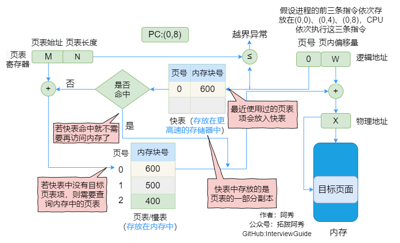

# OS

[toc]


## 1、进程、线程和协程的区别和联系 

> The differences and relationships among processes, threads, and coroutines

|                           | 进程Process                                                  | 线程Thread                                                   | 协程coroutines                                               |
| ------------------------- | ------------------------------------------------------------ | ------------------------------------------------------------ | ------------------------------------------------------------ |
| 定义Definition            | 资源分配和拥有的基本单位The basic unit of resource allocation and ownership | 程序执行的基本单位The basic unit of program execution        | 用户态的轻量级线程，线程内部调度的基本单位User mode for lightweight threads, the basic unit of thread internal scheduling |
| 切换情况Switch cases      | 进程CPU环境(栈、寄存器、页表和文件句柄等)的保存以及新调度的进程CPU环境的设置Save of the process CPU environment (stack, register, page table, file handle, etc.) and setup of the newly scheduled process CPU environment | 保存和设置程序计数器、少量寄存器和栈的内容Save and set the contents of the Program counter, a few registers, and the stack | 先将寄存器上下文和栈保存，等切换回来的时候再进行恢复Save the register context and stack first, and restore when you switch back |
| 切换者Switcher            | 操作系统The operating system                                 | 操作系统The operating system                                 | 用户Users                                                    |
| 切换过程Switching process | 用户态->内核态->用户态User mode-> kernel mode-> user mode    | 用户态->内核态->用户态User mode-> kernel mode-> user mode    | 用户态(没有陷入内核)User mode (not stuck in the kernel)      |
| 调用栈Call Stack          | 内核栈The kernel stack                                       | 内核栈The kernel stack                                       | 用户栈User stack                                             |
| 拥有资源Own the resources | CPU资源、内存资源、文件资源和句柄等CPU resources, memory resources, file resources, handles, and so on | 程序计数器、寄存器、栈和状态字Program counter, registers, stacks, and status words | 拥有自己的寄存器上下文和栈Has its own register context and stack |
| 并发性Concurrency         | 不同进程之间切换实现并发，各自占有CPU实现并行Different processes switch between the implementation of concurrent, their respective CPU to achieve parallel | 一个进程内部的多个线程并发执行Multiple threads within a process execute concurrently | 同一时间只能执行一个协程，而其他协程处于休眠状态，适合对任务进行分时处理Only one coroutine can be executed at the same time, while other coroutines are in a dormant state, suitable for time-sharing processing of tasks |
| 系统开销System overhead   | 切换虚拟地址空间，切换内核栈和硬件上下文，CPU高速缓存失效、页表切换，开销很大Switching the virtual address space, switching the kernel stack and hardware context, CPU cache failure, page table switching, expensive | 切换时只需保存和设置少量寄存器内容，因此开销很小Only a small amount of register content needs to be saved and set when switching, so the overhead is minimal | 直接操作栈则基本没有内核切换的开销，可以不加锁的访问全局变量，所以上下文的切换非常快The direct-access stack has virtually no kernel switching overhead and can access global variables without locking, so context switching is very fast |
| 通信方面Communications    | 进程间通信需要借助操作系统Inter-process communication requires an operating system | 线程间可以直接读写进程数据段(如全局变量)来进行通信Threads can directly read and write process data segments (such as global variables) to communicate | 共享内存、消息队列Shared Memory, message queuing             |

1、进程是资源调度的基本单位，运行一个可执行程序会创建一个或多个进程，进程就是运行起来的可执行程序

 A process is the basic unit of resource scheduling. Running an executable program creates one or more processes, and a process is an executable program that runs

2、线程是程序执行的基本单位，是轻量级的进程。每个进程中都有唯一的主线程，且只能有一个，主线程和进程是相互依存的关系，主线程结束进程也会结束。多提一句：协程是用户态的轻量级线程，线程内部调度的基本单位

Threads are the basic unit of program execution and are lightweight processes. Each process has a unique main thread, and can only have one, the main thread and process is interdependent relationship, the main thread end process will end. A word more: coroutines are user-mode lightweight threads, the basic unit of internal scheduling threads


## 2、外中断和异常有什么区别？ 

>  What's the difference between an interrupt and an exception?

外中断是指由 CPU 执行指令以外的事件引起，如 I/O 完成中断，表示设备输入/输出处理已经完成，处理器能够发送下一个输入/输出请求。此外还有时钟中断、控制台中断等。

External interrupts are events other than the execution of instructions by the CPU, such as I/O completion interrupts. There are also clock interrupts, console interrupts, and so on.

而异常时由 CPU 执行指令的内部事件引起，如非法操作码、地址越界、算术溢出等。

The exception is caused by the internal events of CPU executing instructions, such as illegal opcodes, address overstepping, arithmetic overflow and so on.


## 3、exit()、_exit()、return

exit()和_exit()区别：exit()是对__exit()的封装，都会终止进程并做相关收尾工作，最主要的区别是_exit()函数关闭全部描述符和清理函数后不会刷新流，但是exit()会在调用_exit()函数前刷新数据流。

The difference between exit () and () : Exit () is the encapsulation of __exit() , which terminates the process and do related finishing work. The main difference is that the _exit() function closes all descriptors and clears the function without refreshing the stream, exit () , however, refreshes the data stream before calling the _exit() function.

return和exit()区别：exit()是函数，但有参数，执行完之后控制权交给系统。return若是在调用函数中，执行完之后控制权交给调用进程，若是在main函数中，控制权交给系统。

Return and exit () are different: Exit () is a function that takes parameters and hands control to the system after execution. Return in the calling function, control is given to the calling process after execution, in the main function, control is given to the system.


## 4、Linux process control

- 进程地址空间（地址空间）

  Process address space (address space)

  虚拟存储器为每个进程提供了独占系统地址空间的假象。

  Virtual memory provides each process with the illusion of an exclusive system address space.

  尽管每个进程地址空间内容不尽相同，但是他们的都有相似的结构。X86 Linux进程的地址空间底部是保留给用户程序的，包括文本、数据、堆、栈等，其中文本区和数据区是通过存储器映射方式将磁盘中可执行文件的相应段映射至虚拟存储器地址空间中。

  虚拟内存的目的是为了让物理内存扩充成更大的逻辑内存，从而让程序获得更多的可用内存。

  The goal of virtual memory is to let the physical memory expand into larger logical memory, thus allowing the program to get more available memory.

- 进程控制块（处理机）

  Process Control Block (processor)

  进程的调度实际就是内核选择相应的进程控制块，被选择的进程控制块中包含了一个进程基本的信息。

  The scheduling of a process is that the kernel selects the corresponding process control block, which contains the basic information of a process.

- 上下文切换

  Context switching

  内核管理所有进程控制块，而进程控制块记录了进程全部状态信息。每一次进程调度就是一次上下文切换，所谓的上下文本质上就是当前运行状态，主要包括通用寄存器、浮点寄存器、状态寄存器、程序计数器、用户栈和内核数据结构（页表、进程表、文件表）等。

  The kernel manages all the process control blocks, and the process control block records all the process status information. Each process schedule is a context switch, which is essentially the current running state, these include general purpose registers,, Program counter, user stacks, and kernel data structures (page tables, process tables, file tables) .

  进程执行时刻，内核可以决定抢占当前进程并开始新的进程，这个过程由内核调度器完成，当调度器选择了某个进程时称为该进程被调度，该过程通过上下文切换来改变当前状态。

  When a process is executing, the kernel can decide to preempt the current process and start a new process. This process is done by the kernel scheduler, and when the scheduler selects a process, it is called the process is scheduled, the procedure changes the current state by context switching.

  一次完整的上下文切换通常是进程原先运行于用户态，之后因系统调用或时间片到切换到内核态执行内核指令，完成上下文切换后回到用户态，此时已经切换到进程B。

  A complete context switch is usually a process that runs in the user state, then executes kernel instructions due to a system call or time slice switching to the kernel state, and then returns to the user state after the context switch, you have switched to process B.


## 5、进程调度算法你了解多少？ 

> How much do you know about process scheduling algorithms?

#### 1、先来先服务 first-come first-serverd（FCFS）

非抢占式的调度算法，按照请求的顺序进行调度。

Non-preemptive scheduling algorithm, according to the order of requests to schedule.

有利于长作业，但不利于短作业，因为短作业必须一直等待前面的长作业执行完毕才能执行，而长作业又需要执行很长时间，造成了短作业等待时间过长。

It is good for long job, but not good for short job, because short job must wait for the previous long job to finish executing, and long job needs to execute for a long time, resulting in short job waiting time is too long.

#### 2、 短作业优先 shortest job first（SJF）

非抢占式的调度算法，按估计运行时间最短的顺序进行调度。

Non-preemptive scheduling algorithm, according to the estimated running time of the shortest order to schedule.

长作业有可能会饿死，处于一直等待短作业执行完毕的状态。因为如果一直有短作业到来，那么长作业永远得不到调度。

Long jobs can starve to death, waiting for short jobs to finish. Because if there are always short jobs coming, then long jobs will never be scheduled.

#### 3、最短剩余时间优先 shortest remaining time next（SRTN）

最短作业优先的抢占式版本，按剩余运行时间的顺序进行调度。 当一个新的作业到达时，其整个运行时间与当前进程的剩余时间作比较。

A preemptive（/priˈɛmptɪv/） version of the shortest job that is scheduled in the order of the remaining elapsed time. When a new job arrives, its entire run time is compared to the time remaining in the current process.

如果新的进程需要的时间更少，则挂起当前进程，运行新的进程。否则新的进程等待。

If the new process takes less time, suspend the current process and run the new process. Otherwise the new process waits.

#### 4、**时间片轮转**The time piece rotates

将所有就绪进程按 FCFS 的原则排成一个队列，每次调度时，把 CPU 时间分配给队首进程，该进程可以执行一个时间片。

All ready processes are queued according to FCFS principle, and each time scheduling, CPU time is allocated to the first process of the queue, which can execute a time slice.

当时间片用完时，由计时器发出时钟中断，调度程序便停止该进程的执行，并将它送往就绪队列的末尾，同时继续把 CPU 时间分配给队首的进程。

When the time slice runs out, the timer issues a clock interrupt, and the scheduler stops the process and sends it to the end of the ready queue, while continuing to allocate CPU time to the process at the head of the queue.

时间片轮转算法的效率和时间片的大小有很大关系：

The efficiency of the time slice rotation algorithm has a lot to do with the size of the time slice:

- 因为进程切换都要保存进程的信息并且载入新进程的信息，如果时间片太小，会导致进程切换得太频繁，在进程切换上就会花过多时间。
- Because process switching always saves process information and loads new process information, if the time slice is too small, the process will switch too frequently, which will spend too much time on process switching.
- 而如果时间片过长，那么实时性就不能得到保证。
- If the time slice is too long, the real-time performance can not be guaranteed.


#### 5、**优先级调度**Priority scheduling

为每个进程分配一个优先级，按优先级进行调度。

Assign a priority to each process and schedule by priority.

为了防止低优先级的进程永远等不到调度，可以随着时间的推移增加等待进程的优先级。

To prevent low-priority processes from never getting scheduled, you can increase the priority of waiting processes over time.

#### 6、**多级反馈队列**Multilevel feedback queues

一个进程需要执行 100 个时间片，如果采用时间片轮转调度算法，那么需要交换 100 次。

A process needs to execute 100 time slices, if the time slice rotation scheduling algorithm, then need to exchange 100 times.

多级队列是为这种需要连续执行多个时间片的进程考虑，它设置了多个队列，每个队列时间片大小都不同，例如 1,2,4,8,..。进程在第一个队列没执行完，就会被移到下一个队列。

The multilevel queue is for processes that need to execute multiple timeslices in a row. It sets up multiple queues with different timeslice sizes, such as 1,2,4,8, . . . A process that does not finish in the first queue is moved to the next queue.

这种方式下，之前的进程只需要交换 7 次。每个队列优先权也不同，最上面的优先权最高。因此只有上一个队列没有进程在排队，才能调度当前队列上的进程。

This way, the previous process only needs to be swapped 7 times. Each queue has a different priority, and the top priority is the highest. Therefore, processes on the current queue can be scheduled only if there are no processes queued on the previous queue.

可以将这种调度算法看成是时间片轮转调度算法和优先级调度算法的结合。

This scheduling algorithm can be regarded as a combination of time-slice rotation scheduling algorithm and priority scheduling algorithm.


## 6、Linux下进程间通信方式？ 

> Interprocess communication under Linux?

六种：

- 管道(Pipes):

  - 无名管道（内存文件）：管道是一种半双工的通信方式，数据只能单向流动，而且只能在具有亲缘关系的进程之间使用。进程的亲缘关系通常是指父子进程关系。

    Anonymous pipes (memory files) : pipes are a half-duplex form of communication in which data flows only in one direction and can only be used between related processes, usually a parent-child relationship.

  - 有名管道（FIFO文件，借助文件系统）：有名管道也是半双工的通信方式，但是允许在没有亲缘关系的进程之间使用，管道是先进先出的通信方式。

    Named Pipes (FIFO files, with file system) : named pipes are also a half-duplex form of communication, but are allowed between unrelated processes. Pipes are a first-in, first-out form of communication.

- 共享内存：共享内存就是映射一段能被其他进程所访问的内存，这段共享内存由一个进程创建，但多个进程都可以访问。共享内存是最快的IPC方式，它是针对其他进程间通信方式运行效率低而专门设计的。它往往与信号量，配合使用来实现进程间的同步和通信。

  Shared Memory: A shared memory map is a piece of memory that can be accessed by other processes. This shared memory is created by one process, but can be accessed by multiple processes. Shared Memory is the fastest way of IPC. It is often used in conjunction with semaphores to achieve synchronization and communication between processes.

- 消息队列：消息队列是有消息的链表，存放在内核中并由消息队列标识符标识。消息队列克服了信号传递信息少、管道只能承载无格式字节流以及缓冲区大小受限等缺点。

  Message Queue: A Message Queue is a linked list of messages, stored in the kernel and identified by the message queue identifier. Message queue overcomes the disadvantages of less information transmitted by signal, the pipeline can only carry unformatted byte stream, and the limited buffer size.

- 套接字：适用于不同机器间进程通信，在本地也可作为两个进程通信的方式。

  Socket: used for process communication between different machines, and also as a way for two processes to communicate locally.

- 信号：用于通知接收进程某个事件已经发生，比如按下ctrl + C就是信号。

  Signal: Used to notify the receiving process that an event has occurred, such as pressing Ctrl + C is a signal.

- 信号量：信号量是一个计数器，可以用来控制多个进程对共享资源的访问。它常作为一种锁机制，实现进程、线程的对临界区的同步及互斥访问。

  Semaphore: A Semaphore is a counter that can be used to control access to shared resources by multiple processes. It is often used as a lock mechanism to achieve the process, thread of the critical area of the synchronization and mutual exclusive access


## 7、Linux下线程通讯方式

| 名称及含义Name and meaning                                   |
| ------------------------------------------------------------ |
| 共享变量：shared variable                                    |
| 锁机制：互斥锁、读写锁和自旋锁 Mutex Lock, read-write lock and spin lock |
| 条件变量：使用通知的方式解锁，与互斥锁配合使用Condition Variable: Unlock by notification, use together with a mutex |
| 信号量：包括无名线程信号量和命名线程信号量Semaphore: includes unnamed thread semaphore and named Thread Semaphore |


## 8、Linux下同步机制？

> Synchronization under Linux?

- POSIX信号量：可用于进程同步，也可用于线程同步。

  POSIX semaphores: can be used for process synchronization or thread synchronization.

- POSIX互斥锁 + 条件变量：只能用于线程同步。

  POSIX MUTEX + condition variable: can only be used for thread synchronization.


## 9、虚拟地址到物理地址的翻译（有快表）

> What happens to address translation if you have a fast table in your system?

可以借助进程的页表将逻辑地址转换为物理地址。

You can use the process's page table to convert logical addresses to physical addresses.

通常会在系统中设置一个页表寄存器(PTR)，存放页表在内存中的起始地址F和页表长度M。进程未执行时，页表的始址和页表长度放在进程控制块(PCB) 中，当进程被调度时，操作系统内核会把它们放到页表寄存器中。

A page table register (PTR) is typically set up on the system to hold the starting address F and the page table length M of the page table in memory. When the process is not executing, the page table start address and page table length are placed in the process control block (PCB) , and when the process is scheduled, the operating system kernel places them in the page table register.

①CPU给出逻辑地址，由某个硬件算得页号、页内偏移量，将页号与快表中的所有页号进行比较。

 The CPU gives a logical address, calculates the page number and the intra page offset from MMU, and compares the page number with all the page numbers in the PLB.

②如果找到匹配的页号，说明要访问的页表项在快表中有副本，则直接从中取出该页对应的内存块号，再将内存块号与页内偏移量拼接形成物理地址，最后，访问该物理地址对应的内存单元。因此，若快表命中，则访问某个逻辑地址仅需一次访存即可。

If a page number is found, the page table entry to be visited has a copy in the fast table, then the memory block number corresponding to the page is directly extracted from it, and then the memory block number and the page offset are spliced to form a physical address, finally, access the memory location corresponding to the physical address. Therefore, if the fast table hits, access to a logical address requires only one access to memory.

③如果没有找到匹配的页号，则需要访问内存中的页表，找到对应页表项，得到页面存放的内存块号，再将内存块号与页内偏移量拼接形成物理地址，最后，访问该物理地址对应的内存单元。因此,若快表未命中，则访问某个逻辑地址需要两次访存(注意:在找到页表项后，应同时将其存入快表,以便后面可能的再次访问。但若快表已满，则必须按照-定的算法对旧的页表项进行替换)

If no matching page number is found, we need to visit the page table in memory, find the corresponding page table entry, get the memory block number stored in the page, and then the memory block number and page offset to form a physical address, finally, access the memory location corresponding to the physical address. Therefore, if the TLB misses, it takes two accesses to access a logical address (note: once page table entries are found, they should also be stored in the fast table for possible subsequent accesses) . However, if the fast table is full, the old page table entries must be replaced using the-specified algorithm



## 10、动态分区分配算法有哪几种？

> What are the dynamic partitioning algorithms? 

| 算法Algorithm     | 算法思想Algorithmic thinking                                 | 分区排列顺序Partition order                                  | 优点Advantages                                               | 缺点Disadvantages                                            |
| ----------------- | ------------------------------------------------------------ | ------------------------------------------------------------ | ------------------------------------------------------------ | ------------------------------------------------------------ |
| 首次适应First fit | 从头到尾找适合的分区Find the right partition from start to end | 空闲分区以地址递增次序排列The free partitions are in ascending order of address | 综合看性能最好。**算法开销小**，回收分区后一般不需要对空闲分区队列重新排序Overall, the performance is the best. The algorithm overhead is small, and there is generally no need to reorder the idle partition queue after recycling partitions. | 首次适应算法会使得内存低地址部分出现很多小的空闲分区，而每次查找都要经过这些分区，因此也增加了查找的开销 The first fit algorithm will cause many small idle partitions in the memory low address part, and each search will pass through these partitions, thus increasing the cost of searching. |
| 最佳适应Best Fit  | 优先使用更小的分区，以保留更多大分区Preferentially use smaller partitions to retain more large partitions | 空闲分区以容量递增次序排列The free partitions are arranged in ascending order of capacity | 会有更多的大分区被保留下来，更能满足大进程需求More large partitions will be retained to better meet the needs of the larger process | 会产生很多太小的、难以利用的碎片;**算法开销大**，回收分区后可能需要对空闲分区队列重新排序There is a lot of fragmentation that is too small to exploit; the algorithm is expensive and may need to reorder the idle partition queue after the partition is reclaimed |
| 最坏适应Worst fit | 优先使用更大的分区，以防止产生太小的不可用的碎片Give preference to larger partitions to prevent the generation of too small and unusable fragments | 空闲分区以容量递减次序排列The free partitions are arranged in descending order of capacity | 可以减少难以利用的小碎片Can reduce difficult to use small debris | 大分区容易被用完，不利于大进程;**算法开销大**(原因同上)Large partitions are easy to use up, not conducive to large processes; algorithm overhead (same reason) |
| 邻近适应next fit  | 由首次适应演变而来，每次从上次查找结束位置开始查找It evolved from first adaptation, each time starting at the end of the last lookup | 空闲分区以地址递增次序排列(可排列成循环链表)Free partitions are arranged in ascending order of address (can be arranged in a circular list) | 不用每次都从低地址的小分区开始检索。**算法开销小**(原因同首次适应算法)You Don't have to start each time with a low-address partition. Algorithm overhead is small (the reason is the same as the first adaptation algorithm) | 会使高地址的大分区也被用完Large partitions with high addresses are also used up |


## 11、进程状态的切换 

> How much do you know about process state switching?


- 就绪状态（ready）：等待被调度
- Ready: Waiting to be scheduled
- 运行状态（running）
- Running
- 阻塞状态（waiting）：等待资源
- Waiting: Waiting for a resource

应该注意以下内容：

The following should be noted:

- 只有就绪态和运行态可以相互转换，其它的都是单向转换。就绪状态的进程通过调度算法从而获得 CPU 时间，转为运行状态；而运行状态的进程，在分配给它的 CPU 时间片用完之后就会转为就绪状态，等待下一次调度。
- Only the ready state and the running state can be converted to each other; the rest are one-way conversions. A process in the ready state gets CPU time by scheduling an algorithm and goes to the running state, while a process in the running state goes to the ready state after the CPU time slice allocated to it is used up, wait for the next dispatch.
- 阻塞状态是缺少需要的资源从而由运行状态转换而来，但是该资源不包括 CPU 时间，缺少 CPU 时间会从运行态转换为就绪态。
- A blocking state is a transition from a running state that lacks the required resources, but that does not include CPU time, which can transition from a running state to a ready state.


## 12、进程同步的四种方法？ 

> Four ways to synchronize processes?

#### 1. 临界区 （Critical Zone）

对临界资源进行访问的那段代码称为临界区。

The code that accesses a critical resource is called a critical section.

为了互斥访问临界资源，每个进程在进入临界区之前，需要先进行检查。

To mutually exclusive access to critical resources, each process needs to be checked before entering the critical section.

#### 2. 同步与互斥 (Synchronization and mutex)

- 同步：多个进程因为合作产生的直接制约关系，使得进程有一定的先后执行关系。

  Synchronization: multiple processes because of the direct constraints of cooperation, so that the process has a certain degree of sequential execution relationship.

- 互斥：多个进程在同一时刻只有一个进程能进入临界区。

  Mutex: multiple processes at the same time only one process can enter the critical zone.

#### 3. 信号量 (Semaphores)

信号量（Semaphore）是一个整型变量，可以对其执行 down 和 up 操作，也就是常见的 P 和 V 操作。

A Semaphore is an integer variable on which you can perform down and up operations, commonly known as P and V operations.

- **down** : 如果信号量大于 0 ，执行 -1 操作；如果信号量等于 0，进程睡眠，等待信号量大于 0；

  down: if the semaphore is greater than 0, perform a -1 operation; if the semaphore is equal to 0, the process sleeps, waiting for the semaphore to be greater than 0;

- **up** ：对信号量执行 +1 操作，唤醒睡眠的进程让其完成 down 操作。

- UP: performs A + 1 operation on the semaphore to wake the sleeping process to complete the down operation.

down 和 up 操作需要被设计成原语，不可分割，通常的做法是在执行这些操作的时候屏蔽中断。

down and up operations need to be designed as atomic action, indivisible, and it is common practice to shield interrupts while performing these operations.

如果信号量的取值只能为 0 或者 1，那么就成为了 **互斥量（Mutex）** ，0 表示临界区已经加锁，1 表示临界区解锁。

If the semaphore can only have a value of 0 or 1, then it becomes a Mutex, with 0 indicating that the critical region is locked and 1 indicating that the critical region is unlocked.

#### 4. 管程 （Moniter）

管程有一个重要特性：在一个时刻只能有一个进程使用管程。进程在无法继续执行的时候不能一直占用管程，否则其它进程永远不能使用管程。管程将对于共享变量以及对共享变量的操作统一封装起来。

One important feature of a Moniter is that only one process can use a pipe at a time. Processes can not continue to occupy the pipe when they can not continue, otherwise other processes can never use the pipe. The moniter encapsulates shared variables and operations on shared variables.

管程引入了 **条件变量** 以及相关的操作：**wait()** 和 **signal()** 来实现同步操作。对条件变量执行 wait() 操作会导致调用进程阻塞，把管程让出来给另一个进程持有。signal() 操作用于唤醒被阻塞的进程。

The pipe introduces, the condition variable, and the associated operations: Wait () and signal () to implement the synchronous operation. The Wait () operation on the condition variable causes the calling process to block, giving up the pipe to be held by another process. The signal () operation is used to wake up the blocked process.


## 13、操作系统在对内存进行管理的时候需要做些什么?

> What does the operating system need to do to manage memory?

- 操作系统负责内存空间的分配与回收。

  The operating system is responsible for the allocation and reclamation of memory space.

- 操作系统需要提供某种技术从逻辑上对内存空间进行扩充。

  The operating system needs to provide some kind of technology to expand the memory space logically.

- 操作系统需要提供地址转换功能，负责程序的逻辑地址与物理地址的转换。

  Operating system needs to provide address translation function, responsible for the program's logical address and physical address conversion.

- 操作系统需要提供内存保护功能。保证各进程在各自存储空间内运行，互不干扰

  The operating system needs to provide memory protection. Ensure that each process runs in its own storage space without interfering with each other.


## 14、经典问题场景

#### 1、哲学家进餐问题 （the Philosopher's meal）

五个哲学家围着一张圆桌，每个哲学家面前放着食物。哲学家的生活有两种交替活动：吃饭以及思考。当一个哲学家吃饭时，需要先拿起自己左右两边的两根筷子，并且一次只能拿起一根筷子。

There are five philosophers around a round table, with food in front of each philosopher. There are two alternating activities in a philosopher's life: eating and thinking. When a philosopher eats, he must first pick up two chopsticks on his left and right, and can only pick up one at a time.

为了防止死锁的发生，可以设置两个条件：

To prevent deadlocks, you can set two conditions:

- 必须同时拿起左右两根筷子；

  Two chopsticks must be picked up at the same time;

- 只有在两个邻居都没有进餐的情况下才允许进餐。

  Meals are allowed only if neither of the neighbours has eaten.

```c
#define N 5
#define LEFT (i + N - 1) % N // 左邻居
#define RIGHT (i + 1) % N    // 右邻居
#define THINKING 0
#define HUNGRY   1
#define EATING   2
typedef int semaphore;
int state[N];                // 跟踪每个哲学家的状态
semaphore mutex = 1;         // 临界区的互斥，临界区是 state 数组，对其修改需要互斥
semaphore s[N];              // 每个哲学家一个信号量

void philosopher(int i) {
    while(TRUE) {
        think(i);
        take_two(i);
        eat(i);
        put_two(i);
    }
}

void take_two(int i) {
    down(&mutex);
    state[i] = HUNGRY;
    check(i);
    up(&mutex);
    down(&s[i]); // 只有收到通知之后才可以开始吃，否则会一直等下去
}

void put_two(i) {
    down(&mutex);
    state[i] = THINKING;
    check(LEFT); // 尝试通知左右邻居，自己吃完了，你们可以开始吃了
    check(RIGHT);
    up(&mutex);
}

void eat(int i) {
    down(&mutex);
    state[i] = EATING;
    up(&mutex);
}

// 检查两个邻居是否都没有用餐，如果是的话，就 up(&s[i])，使得 down(&s[i]) 能够得到通知并继续执行
void check(i) {         
    if(state[i] == HUNGRY && state[LEFT] != EATING && state[RIGHT] !=EATING) {
        state[i] = EATING;
        up(&s[i]);
    }
}
```

#### 读者写者问题

允许多个进程同时对数据进行读操作，但是不允许读和写以及写和写操作同时发生。

Multiple processes are allowed to read data at the same time, but not read and write, or write and write simultaneously.

```c
typedef int semaphore;
semaphore count_mutex = 1;
semaphore data_mutex = 1;
int count = 0;

void reader() {
    while(TRUE) {
        down(&count_mutex);
        count++;
        if(count == 1) down(&data_mutex); // 第一个读者需要对数据进行加锁，防止写进程访问
        up(&count_mutex);
        read();
        down(&count_mutex);
        count--;
        if(count == 0) up(&data_mutex);//最后一个读者要对数据进行解锁，防止写进程无法访问
        up(&count_mutex);
    }
}

void writer() {
    while(TRUE) {
        down(&data_mutex);
        write();
        up(&data_mutex);
    }
}
```

#### 补充：

读者优先
读者优先的解决方案：

互斥信号量wrt，初值是1，代表一个共享文件，解决“读－写”互斥，“写－写”互斥。

一个记数器，即整型变量readcount，记录读者数，初值是0。 来一个读者， readcount加1 当readcount ＝1表示是第一个读者， 则需要执行p操作抢占文件；否则表示已有读者在安全的读数据。 走一个读者，readcount减1 当readcount ＝0表示是最后一个读者，则需要v操作释放资源；否则表示还有读者在读数据。

readcount 为多个读者共享的变量，是临界资源。用互斥信号量mutex控制, mutex初值是1。

代码：
```c
int readcount=0; 
semaphore mutex=1, wrt=1 ; 
 
读者进程：
    wait (mutex);
	readcount++;	
	if (readcount == 1)
	       wait(wrt);
	signal (mutex);
		…
	   reading is performed
		 …
	wait (mutex);
	readcount--;
	if (readcount == 0)
		signal (wrt);
	signal (mutex);
 
 
写者进程：     
      wait(wrt);
	    …
         writing is performed
	    …
      signal(wrt);
```

##### 写者优先

在读者优先的基础上

增加信号量r，初值是1：当至少有一个写进程准备访问数据区时，用于禁止所有的读进程。

增加一个记数器，即整型变量writecount，记录写者数，初值是0。 writecount为多个写者共享的变量，是临界资源。用互斥信号量mutex2控制, mutex2初值是1。

增加mutex3，初值是1：在r上不允许建造长队列，否则写进程将不能跳过这个队列，因此，只允许一个读进程在r上排队，而所有其他读进程在等待r之前，在信号量mutex3上排队。

代码：

```c
int readcount=0, writecount=0; 
semaphore mutex1=1, mutex2=1, mutex3=1, w=1, r=1 ; 

读者进程：
P(mutex 3);
   P(r);
      P(mutex 1);
         readcount++;
         if (readcount == 1 ) 
            P(w);
      V(mutex 1);
    V(r);
V(mutex 3);
      reading is performed
P(mutex 1);
    readcount --;
    if (readcount == 0 )
             V(w);
V(mutex 1);

写者进程：     
P(mutex 2);
    writecount++;
    if (writecount == 1 )
           P(r);
V(mutex 2);
P(w);
    writing is performed
V(w);
P(mutex 2);
    writecount --;
    if (writecount == 0)
           V(r);
V(mutex 2); 
```

##### 读写公平

```c
int readcount=0; 
semaphore mutex=1, rw=1 w=1; 
 
读者进程：
        wait (w);
        wait (mutex);
        if (readcount == 0)
	       wait(rw);
    	readcount++;	
    	signal (mutex);
        signal (w);
		…
    	   reading is performed
		 …
    	wait (mutex);
    	readcount--;
    	if (readcount == 0)
    		signal (rw);
    	signal (mutex);
 
 
写者进程：     
    wait(w);
    wait(rw);
	    …
         writing is performed
	    …
    signal(rw);
    signal(w);

```


## 15、介绍一下几种典型的锁？ 

>  What are some typical locks?

#### 读写锁 Read-write lock

- 多个读者可以同时进行读
- Multiple readers can read at the same time
- 写者必须互斥（只允许一个写者写，也不能读者写者同时进行）
- Writers must be mutually exclusive (only one writer is allowed to write, and neither reader nor writer is allowed to write simultaneously)
- 写者优先于读者(其实这个不一定）（一旦有写者，则后续读者必须等待，唤醒时优先考虑写者）
- The writer takes precedence over the reader (once there is a writer, subsequent readers have to wait and give priority to the writer when awakened)

#### 互斥锁 Mutex： sleep-waiting

一次只能一个线程拥有互斥锁，其他线程只有等待

Only one thread can have a mutex at a time, and other threads can only wait

互斥锁是在抢锁失败的情况下主动放弃CPU进入睡眠状态直到锁的状态改变时再唤醒，而操作系统负责线程调度，为了实现锁的状态发生改变时唤醒阻塞的线程或者进程，需要把锁交给操作系统管理，所以互斥锁在加锁操作时涉及上下文的切换。互斥锁实际的效率还是可以让人接受的，加锁的时间大概100ns左右，而实际上互斥锁的一种可能的实现是先自旋一段时间，当自旋的时间超过阀值之后再将线程投入睡眠中，因此在并发运算中使用互斥锁（每次占用锁的时间很短）的效果可能不亚于使用自旋锁

A mutex is the active abandonment of the CPU in the event of a failed snatch and sleep until the state of the lock changes, and the operating system is responsible for thread scheduling, in order to wake up a blocked thread or process when the state of the lock changes, the lock needs to be handed over to the operating system, so a mutex involves context switching during a lock operation. The actual efficiency of a mutex is acceptable, the lock-up time is about 100 ns, and in fact one possible implementation of a mutex is to spin for a while, putting a thread to sleep after the spin time exceeds the threshold, so using a mutex (which holds the lock for a short time each time) in concurrent operations can be as effective as using a spin lock

#### 条件变量 Condition variable

互斥锁一个明显的缺点是他只有两种状态：锁定和非锁定。而条件变量通过允许线程阻塞和等待另一个线程发送信号的方法弥补了互斥锁的不足，他常和互斥锁一起使用，以免出现竞态条件。当条件不满足时，线程往往解开相应的互斥锁并阻塞线程然后等待条件发生变化。一旦其他的某个线程改变了条件变量，他将通知相应的条件变量唤醒一个或多个正被此条件变量阻塞的线程。总的来说**互斥锁是线程间互斥的机制，条件变量则是同步机制。**

An obvious drawback of a mutex is that it has only two states: locked and unlocked. The condition variable makes up for the mutex by allowing a thread to block and wait for another thread to send a signal. It is often used with a mutex to avoid race conditions. When the condition is not met, the thread often unlocks the corresponding mutex and blocks the thread and waits for the condition to change. Once another thread changes the condition variable, it notifies the corresponding condition variable to wake up one or more threads that are being blocked by the condition variable. In general, a mutex is a mechanism of mutual exclusion between threads, and a conditional variable is a synchronization mechanism.

#### 自旋锁 Spin Lock：busy-waiting

如果进线程无法取得锁，进线程不会立刻放弃CPU时间片，而是一直循环尝试获取锁，直到获取为止。如果别的线程长时期占有锁，那么自旋就是在浪费CPU做无用功，但是自旋锁一般应用于加锁时间很短的场景，这个时候效率比较高。

If the thread can not acquire the lock, the thread does not immediately give up the CPU timeslice, but rather loops until it does. If other threads hold the lock for a long time, then the spin is a waste of CPU to do useless work, but the spin lock is generally applied to lock the time is very short scenarios, this time the efficiency is higher


## 16、内存的覆盖是什么？有什么特点？

> What is the memory coverage and what are the features?

由于程序运行时并非任何时候都要访问程序及数据的各个部分（尤其是大程序），因此可以把用户空间分成为一个固定区和若干个覆盖区。将经常活跃的部分放在固定区，其余部分按照调用关系分段，首先将那些即将要访问的段放入覆盖区，其他段放在外存中，在需要调用前，系统将其调入覆盖区，替换覆盖区中原有的段。

Because the program does not have to access all parts of the program and data (especially large programs) at all times when running, the user space can be divided into a fixed area and several coverage areas. Put the often active parts in the fixed area, and the rest parts are segmented according to the call relationship. First, put the segments to be accessed into the coverage area, and the other segments are placed in the external memory. Before it needs to be called, the system calls it into the coverage area and replaces the original segments in the coverage area.

覆盖技术的特点：是打破了必须将一个进程的全部信息装入内存后才能运行的限制，但当同时运行程序的代码量大于主存时仍不能运行，再而，大家要注意到，内存中能够更新的地方只有覆盖区的段，不在覆盖区的段会常驻内存。

The characteristics of coverage technology: it breaks the restriction that all the information of a process must be loaded into memory before it can be run, but when the amount of code running the program at the same time is greater than the main memory, it still cannot be run. In addition, it should be noted that the only part of the coverage area in the memory that can be updated, and segments that are not in the coverage area will reside in memory.


## 17、内存交换是什么？有什么特点？ 

> What is memory swapping and what are its features?

**交换(对换)技术的设计思想**：内存空间紧张时，系统将内存中某些进程暂时换出外存，把外存中某些已具备运行条件的进程换入内存(进程在内存与磁盘间动态调度)

Switch (swap) technology design idea: When the memory space is tight, the system temporarily replaces some processes in memory with external memory, and replaces some processes in external memory that already have the operating conditions into memory (process dynamic scheduling between memory and disk).

内存交换通常在许多进程运行且内存吃紧时进行，而系统负荷降低就暂停。例如:在发现许多进程运行时经常发生缺页，就说明内存紧张，此时可以换出一些进程;如果缺页率明显下降，就可以暂停换出。

Memory swapping usually occurs when many processes are running and memory is tight, and the system is paused when the load drops. For example, if you find that many processes are running with frequent page faults, you are running out of memory, and you can swap out some processes; if the page fault rate drops significantly, you can pause the swap


## 18、在执行malloc申请内存的时候，操作系统是怎么做的？

> What does the operating system do when executing Malloc memory requests?

从操作系统层面上看，malloc是通过两个系统调用来实现的： brk和mmap

At the operating system level, Malloc is implemented through two system calls: BRK and MMAP

- brk是将进程数据段(.data)的最高地址指针向高处移动，这一步可以扩大进程在运行时的堆大小
- The BRK is the highest address pointer to the process's data segment (. Data) , which is moved up the heap size at run time
- mmap是在进程的虚拟地址空间中寻找一块空闲的虚拟内存，这一步可以获得一块可以操作的堆内存。
- MMAP is the process of virtual address space in the search for a free piece of virtual memory,  This step can get an operational heap memory.

通常，分配的内存小于128k时，使用brk调用来获得虚拟内存，大于128k时就使用mmap来获得虚拟内存。

Typically, BRK calls are used to get virtual memory when the allocated memory is less than 128K, and MMAP is used to get virtual memory when it is greater than 128K.

进程先通过这两个系统调用获取或者扩大进程的虚拟内存，获得相应的虚拟地址，在访问这些虚拟地址的时候，通过缺页中断，让内核分配相应的物理内存，这样内存分配才算完成。

The process first obtains or expands the virtual memory of the process through these two system calls, obtains the corresponding virtual addresses, when accessing these virtual addresses, lets the kernel allocate the corresponding physical memory through the page fault interrupt, then the memory allocation is complete.


## 19、 守护进程、僵尸进程和孤儿进程

> Daemons, zombies, and orphans

#### 守护进程 Daemon process

指在后台运行的，没有控制终端与之相连的进程。它独立于控制终端，周期性地执行某种任务。Linux的大多数服务器就是用守护进程的方式实现的，如web服务器进程http等

A process running in the background with no control terminal attached to it. It performs certain tasks periodically, independent of the control terminal. Most Linux servers are implemented as Daemons, such as the web server process HTTP

创建守护进程要点：

Key points for creating a daemon:

（1）让程序在后台执行。方法是调用fork（）产生一个子进程，然后使父进程退出。

(1) let the program run in the background. You can do this by calling fork () to produce a child process and then exiting the parent process.

（2）调用setsid（）创建一个新对话期。控制终端、登录会话和进程组通常是从父进程继承下来的，守护进程要摆脱它们，不受它们的影响，方法是调用setsid（）使进程成为一个会话组长。setsid（）调用成功后，进程成为新的会话组长和进程组长，并与原来的登录会话、进程组和控制终端脱离。

(2) call `setsid ()` to create a new session. The control terminal, login session, and process group are usually inherited from the parent process, and the Daemon gets rid of them and is not affected by them by calling Setsid () to make the process a session leader. After the SETSID () call is successful, the process becomes the new session leader and process leader, detached from the original login session, process group, and control terminal.

（3）禁止进程重新打开控制终端。经过以上步骤，进程已经成为一个无终端的会话组长，但是它可以重新申请打开一个终端。为了避免这种情况发生，可以通过使进程不再是会话组长来实现。再一次通过fork（）创建新的子进程，使调用fork的进程退出。

(3) stop the process from reopening the control terminal. You can do this by making the process no longer the session leader. Once again, fork () creates a new child process, causing the process that called fork to exit.

（4）关闭不再需要的文件描述符。子进程从父进程继承打开的文件描述符。如不关闭，将会浪费系统资源，造成进程所在的文件系统无法卸下以及引起无法预料的错误。首先获得最高文件描述符值，然后用一个循环程序，关闭0到最高文件描述符值的所有文件描述符。

(D) turn off File descriptor that are no longer required. Child processes inherit open File descriptor from parent processes. If not, it will waste system resources, causing the process in the file system can not be unmounted and cause unexpected errors. First get the highest File descriptor, then use a loop to close all File descriptor from zero to the highest File descriptor.

（5）将当前目录更改为根目录。

(5) change the current directory to the root directory.

（6）子进程从父进程继承的文件创建屏蔽字可能会拒绝某些许可权。为防止这一点，使用unmask（0）将屏蔽字清零。

(6) the child process inherits from the parent process to create masking words that may deny certain permissions. To prevent this, the mask word is zeroed using unmask (0) .

（7）处理SIGCHLD信号。对于服务器进程，在请求到来时往往生成子进程处理请求。如果子进程等待父进程捕获状态，则子进程将成为僵尸进程（zombie），从而占用系统资源。如果父进程等待子进程结束，将增加父进程的负担，影响服务器进程的并发性能。在Linux下可以简单地将SIGCHLD信号的操作设为SIG_IGN。这样，子进程结束时不会产生僵尸进程。

(7) processing SIGCHLD signal. For server processes, child processes are often generated to process requests when they arrive. If the child process waits for the parent process to capture the state, the child process will become a zombie process, consuming system resources. If the parent process waits for the child process to finish, this increases the burden on the parent process and affects the concurrent performance of the server process. Under Linux, you can simply set the operation of the SIGCHLD signal to SIG_IGN. This way, no zombie process is generated when the child process ends.

#### 孤儿进程Orphan process

如果父进程先退出，子进程还没退出，那么子进程的父进程将变为init进程。（注：任何一个进程都必须有父进程）。

If the parent process exits first and the child process has not yet exited, the parent of the child process becomes the init process. Note: Any process must have a parent.

一个父进程退出，而它的一个或多个子进程还在运行，那么那些子进程将成为孤儿进程。孤儿进程将被init进程(进程号为1)所收养，并由init进程对它们完成状态收集工作。

When a parent process exits and one or more of its child processes are still running, those child processes become orphaned. Orphan processes are adopted by the init process (Process Number 1) and the init process completes status collection on them.

#### 僵尸进程Zombie process

如果子进程先退出，父进程还没退出，那么子进程必须等到父进程捕获到了子进程的退出状态才真正结束，否则这个时候子进程就成为僵尸进程。

If the child process exited first and the parent process has not yet exited, then the child process must wait until the parent process has caught the child process exited state, otherwise the child process will become a zombie process at this time.

设置**僵尸进程的目**的是维护子进程的信息，以便父进程在以后某个时候获取。这些信息至少包括进程ID，进程的终止状态，以及该进程使用的CPU时间，所以当终止子进程的父进程调用wait或waitpid时就可以得到这些信息。如果一个进程终止，而该进程有子进程处于僵尸状态，那么它的所有僵尸子进程的父进程ID将被重置为1（init进程）。继承这些子进程的init进程将清理它们（也就是说init进程将wait它们，从而去除它们的僵尸状态）。

The goal of setting up a zombie process is to maintain information about the child process so that the parent process can get it at a later time. This information includes at least the process ID, the process's termination status, and the CPU time used by the process, so it is available when the parent of the terminating child calls wait or waitpid. If a process terminates and one of its children is in a zombie state, the parent ID of all its zombie children is reset to 1(init process) . The init process that inherits these child processes will clean them up (that is, the init process will wait for them, thereby removing their zombie state)

#### 如何避免僵尸进程？

>  How to avoid zombie progress?

- 通过signal(SIGCHLD, SIG_IGN)通知内核对子进程的结束不关心，由内核回收。

  Signal (SIGCHLD, SIG) notifies the kernel that it does not care about the end of the child process and is reclaimed by the kernel. 

- 父进程调用wait/waitpid等函数等待子进程结束，如果尚无子进程退出wait会导致父进程阻塞。waitpid可以通过传递WNOHANG使父进程不阻塞立即返回。

  The parent process calls functions such as wait/Waitpid to wait for the child process to finish, and if no child process exits wait, the parent process blocks. `waitpid` can return immediately without blocking the parent process by passing WNOHANG.

- 如果父进程很忙可以用signal注册信号处理函数，在信号处理函数调用wait/waitpid等待子进程退出。

  If the parent process is busy, you can register the signal handler function with signal, where you call wait/Waitpid and wait for the child process to exit.

- 通过两次调用fork。父进程首先调用fork创建一个子进程然后waitpid等待子进程退出，子进程再fork一个孙进程后退出。这样子进程退出后会被父进程等待回收，而对于孙子进程其父进程已经退出所以孙进程成为一个孤儿进程，孤儿进程由init进程接管，孙进程结束后，init会等待回收。

  By calling fork twice. The parent process first forks to create a child process and then  `waitpid` waits for the child process to exit, which then forks a child process and exits. Then the child process will exit and the parent process will wait to be reclaimed. For the child process, the parent process has already left and the child process will become an orphan process. The orphan process will be taken over by the init process, init will wait for recycling.


## 20、局部性原理你知道吗？主要有哪两大局部性原理？各自是什么？

> Do you know the locality principle? What are the two main principles of locality? What are they?

主要分为**时间局部性和空间局部性**。

There are time locality and spatial locality.

时间局部性:如果执行了程序中的某条指令，那么不久后这条指令很有可能再次执行;如果某个数据被访问过，不久之后该数据很可能再次被访问。(因为程序中存在大量的循环) 

Time locality: If an instruction in a program is executed, it is likely that the instruction will be executed again soon; If a piece of data has been accessed, it is likely that the data will be accessed again soon. (Because there are a lot of loops in the program)

空间局部性:一旦程序访问了某个存储单元，在不久之后，其附近的存储单元也很有可能被访问。(因为很多数据在内存中都是连续存放的，并且程序的指令也是顺序地在内存中存放的)

Spatial locality: Once a program accesses a storage location, it is likely that in the near future, nearby storage locations will also be accessed. (Because a lot of data is stored continuously in memory, and program instructions are stored sequentially in memory.)


## 21、父进程、子进程、进程组、作业和会话

> Parent processes, child processes, process groups, jobs, and sessions

#### 父进程 Parent process

已创建一个或多个子进程的进程

A process that has created one or more child processes

#### 子进程 child process

由fork创建的新进程被称为子进程（child process）。该函数被调用一次，但返回两次。两次返回的区别是子进程的返回值是0，而父进程的返回值则是新进程（子进程）的进程 id。将子进程id返回给父进程的理由是：因为一个进程的子进程可以多于一个，没有一个函数使一个进程可以获得其所有子进程的进程id。对子进程来说，之所以fork返回0给它，是因为它随时可以调用getpid()来获取自己的pid；也可以调用getppid()来获取父进程的id。(进程id 0总是由交换进程使用，所以一个子进程的进程id不可能为0 )。

The new process created by the fork is called a child process. This function is called once but returns twice. The difference between the two returns is that the child's return value is 0, while the parent's return value is the process ID of the new process (child process) . The reason for returning the child process ID to the parent process is that because a process can have more than one child process, there is no function that allows a process to get the process ids of all its child processes. For the child process, the fork returns 0 to it because it can call getpid () at any time to get its own PID; it can also call getppid () to get the ID of the parent process. Process ID 0 is always used by the swap process, so a child process can not have a process ID of 0.

fork之后，操作系统会复制一个与父进程完全相同的子进程，虽说是父子关系，但是在操作系统看来，他们更像兄弟关系，这2个进程共享代码空间，但是数据空间是互相独立的，子进程数据空间中的内容是父进程的完整拷贝，指令指针也完全相同，子进程拥有父进程当前运行到的位置（两进程的程序计数器pc值相同，也就是说，子进程是从fork返回处开始执行的），但有一点不同，如果fork成功，子进程中fork的返回值是0，父进程中fork的返回值是子进程的进程号，如果fork不成功，父进程会返回错误。

After Fork, the operating system copies a child process that is identical to the parent process, although the parent-child relationship is more like a sibling relationship to the operating system, and the two processes share code space, but the data space is independent of each other, the contents of the child process data space are the complete copy of the parent process, the instruction pointer is exactly the same, the child process has the location where the parent process is currently running (both processes have the same Program counter PC value, that is, the child process starts execution at the return of the fork) , but the difference is that if the fork succeeds, the return value of the fork in the child process is 0, the return value of the fork in the parent process is the child process number, and if the fork is unsuccessful, the parent process returns an error.

子进程从父进程继承的有：

The child process inherits from the parent process:

1.进程的资格(真实(real)/有效(effective)/已保存(saved)用户号(UIDs)和组号(GIDs))

​	Process eligibility (real/effective/saved user id (UIDS) and group ID (Gids))

2.环境(environment)

3.堆栈

4.内存

5.进程组号(Process Group number)

独有(Exclusive)

1.进程号(Process number)

3.资源使用(resource utilizations)设定为0

​	Resource utilizations are set to 0

#### 进程组 Process Group

进程组就是多个进程的集合，其中肯定有一个组长，其进程PID等于进程组的PGID。只要在某个进程组中一个进程存在，该进程组就存在，这与其组长进程是否终止无关。

A process group is a collection of processes, which must have a group leader whose process PID is equal to the PGID of the process group. As long as a process exists in a process group, the process group exists regardless of whether its group leader process terminates.

#### 作业 Job

shell分前后台来控制的不是进程而是作业（job）或者进程组（Process Group）。

The shell controls not processes but jobs or Process groups in the background.

一个前台作业可以由多个进程组成，一个后台也可以由多个进程组成，shell可以运行一个前台作业和任意多个后台作业，这称为作业控制

A foreground job can be made up of multiple processes, and a background job can be made up of multiple processes. The shell can run a foreground job and any number of background jobs, which is called job control

#### **为什么只能运行一个前台作业？** 

> **Why can only one foreground job run?**

答：当我们在前台新起了一个作业，shell就被提到了后台，因此shell就没有办法再继续接受我们的指令并且解析运行了。 但是如果前台进程退出了，shell就会有被提到前台来，就可以继续接受我们的命令并且解析运行。

A: when we create a new job in the foreground, the shell is referred to the background, so the shell can no longer accept our instructions and parse them. But if the foreground process quits, the shell is brought to the foreground and can continue to accept our commands and run parses.

作业与进程组的区别：如果作业中的某个进程有创建了子进程，则该子进程是不属于该作业的。 一旦作业运行结束，shell就把自己提到前台（子进程还存在，但是子进程不属于作业），如果原来的前台进程还存在（这个子进程还没有终止），他将自动变为后台进程组

The difference between a job and a process group: if a process in a job has created a child process, that child process is not part of the job. Once the job has finished running, the shell moves itself to the foreground (the child process exists, but the child process is not part of the job) , if the original foreground process exists (the child process has not yet terminated) , it will automatically become a background process group

#### 会话 session

会话（Session）是一个或多个进程组的集合。一个会话可以有一个控制终端。在xshell或者WinSCP中打开一个窗口就是新建一个会话。

A Session is a collection of one or more process groups. A session can have a control terminal. Opening a window in an X shell or WinSCP creates a new session.


## 22、Linux中异常和中断的区别 

> The difference between exceptions and interrupts in Linux

#### **相同点** **The same**

- 最后都是由CPU发送给内核，由内核去处理

  In the end, they are sent by the CPU to the kernel, which handles them

- 处理程序的流程设计上是相似的

  The process design of the handler is similar

#### **不同点** **Different**

- 产生源不相同，异常是由CPU产生的，而中断是由硬件设备产生的
- The sources are different, exceptions are generated by the CPU, and interrupts are generated by hardware devices
- 内核需要根据是异常还是中断调用不同的处理程序
- The kernel needs to call different handlers depending on whether it is an exception or an interrupt
- 中断不是时钟同步的，这意味着中断可能随时到来；异常由于是CPU产生的，所以它是时钟同步的
- Interrupts are not clock-synchronous, which means they can come at any time; exceptions are clock-synchronous because they are CPU-generated
- 当处理中断时，处于中断上下文中；处理异常时，处于进程上下文中
- In the interrupt context when handling interrupts and in the process context when handling exceptions


## 23、Linux环境下内存分布情况 

> Distribution of memory in Linux environments


通过这张图你可以看到，用户空间内存，从**低到高**分别是 7 种不同的内存段：

As you can see from this diagram, user-space memory, from low to high, is divided into seven different memory segments:

- 程序文件段，包括二进制可执行代码；
- Program file segment, including binary executable code;
- 已初始化数据段，包括静态常量；
- Initialized data segments, including static constants;
- 未初始化数据段，包括未初始化的静态变量；
- An uninitialized data segment, including an uninitialized static variable;
- 堆段，包括动态分配的内存，从低地址开始向上增长；
- Heap segments, including dynamically allocated memory, grow up from low addresses;
- 文件映射段，包括动态库、共享内存等，从低地址开始向上增长（跟硬件和内核版本有关）
- File-mapped segments, including dynamic libraries, shared memory, and so on, grow up from low addresses (depending on the hardware and kernel version)
- 栈段，包括局部变量和函数调用的上下文等。栈的大小是固定的，一般是 `8 MB`。当然系统也提供了参数，以便我们自定义大小；
- Stack segments, including local variables and the context of function calls. The stack size is fixed, typically 8mb. Of course, the system also provides parameters so that we can customize the size


## 24、交换空间与虚拟内存的关系

> SWAP space versus virtual memory

#### **交换空间** **Swap space**

Linux 中的交换空间（Swap space）在**物理内存**（RAM）被充满时被使用。如果系统需要更多的内存资源，而物理内存已经充满，内存中不活跃的页就会被移到交换空间去。虽然交换空间可以为带有少量内存的机器提供帮助，但是这种方法不应该被当做是对内存的取代。交换空间位于硬盘驱动器上，它比进入物理内存要慢。 交换空间可以是一个专用的交换分区（推荐的方法），交换文件，或两者的组合。 交换空间的总大小应该相当于你的计算机内存的两倍和 32 MB这两个值中较大的一个，但是它不能超过 2048MB（2 GB）。

Swap space in Linux is used when physical memory (RAM) is full. If the system needs more memory resources and physical memory is already full, inactive pages in memory are moved to swap space. While swap space can help machines with small amounts of memory, this approach should not be seen as a replacement for memory. Swap space is located on the hard drive, which is slower than entering physical memory. The swap space can be a dedicated swap partition (the recommended method) , a swap file, or a combination of the two. The total size of the swap space should be equal to twice the memory of your computer and the larger of the two values of 32 MB, but it should not exceed 2048 MB (2 GB) 

具有对换功能的操作系统中，通常把磁盘空间分为文件区和对换区两部分。文件区主要用于存放文件，主要追求存储空间的利用率，因此对文件区空间的管理采用离散分配方式;对换区空间只占磁盘空间的小部分，被换出的进程数据就存放在对换区。由于对换的速度直接影响到系统的整体速度，因此对换区空间的管理主要追求换入换出速度，因此通常对换区采用连续分配方式(学过文件管理章节后即可理解)。总之，对换区的I/O速度比文件区的更快。

n an operating system with swap function, disk space is usually divided into file area and swap area. The file area is mainly used for storing files, and the utilization of the storage space is mainly pursued, so the management of the file area space adopts the discrete allocation method, while the swap area space only occupies a small part of the disk space, the swapped-out process data is stored in the swap area. Because the speed of switching directly affects the overall speed of the system, the management of switching space is mainly pursuing the speed of switching in and out, therefore, the transfer area is usually allocated in a continuous manner (after studying the document management section can be understood) . In short, I/O on swap is faster than on file.

> PCB 会常驻内存，不会被换出外存
>
> Note: The PCB will reside in memory and will not be swapped out


## 25、抖动你知道是什么吗？它也叫颠簸现象

>  Do you know what a thrashing is? It's also called a bumpy phenomenon

刚刚换出的页面马上又要换入内存，刚刚换入的页面马上又要换出外存，这种频繁的页面调度行为称为抖动，或颠簸。产生抖动的主要原因是进程频繁访问的页面数目高于可用的物理块数(分配给进程的物理块不够)

Just out of the page and immediately into memory, just into the page and immediately out of memory, this frequent page scheduling behavior called jitter, or turbulence. The main reason for jitter is that the number of pages frequently visited by the process is higher than the number of physical blocks available (not enough physical blocks are allocated to the process)

为进程分配的物理块太少，会使进程发生抖动现象。为进程分配的物理块太多，又会降低系统整体的并发度，降低某些资源的利用率 为了研究为应该为每个进程分配多少个物理块，Denning 提出了进程工作集” 的概念

Too few physical blocks are allocated to the process, causing it to jitter. Allocating too many physical blocks to a process reduces the overall concurrency of the system and the utilization of certain resources. To investigate how many physical blocks should be allocated to each process, denning proposed the concept of process working set


## 26、从堆和栈上建立对象哪个快？（考察堆和栈的分配效率比较）

> Which is faster to create objects from the stack or the stack? Examine the allocation efficiency of the stack versus the heap

从两方面来考虑：

Consider two things:

- 分配和释放，堆在分配和释放时都要调用函数（malloc,free)，比如分配时会到堆空间去寻找足够大小的空间（因为多次分配释放后会造成内存碎片），这些都会花费一定的时间，具体可以看看malloc和free的源代码，函数做了很多额外的工作，而栈却不需要这些。

  Allocation and release, the heap calls functions (malloc, free) when it allocates and releases, such as finding enough space in the heap space when it allocates (because multiple allocations can cause memory fragmentation) , this takes some time, but look at the source code for Malloc and free. The function does a lot of extra work, but the stack doesn't need this.

- 访问时间，访问堆的一个具体单元，需要两次访问内存，第一次得取得指针，第二次才是真正的数据，而栈只需访问一次。另外，堆的内容被操作系统交换到外存的概率比栈大，栈一般是不会被交换出去的。

  Access time, access to a specific unit of the heap, requires two accesses to memory, the first to get the pointer, the second to get the real data, and the stack only needs to be accessed once. In addition, the contents of the heap are more likely to be swapped out of memory by the operating system than the stack, which is generally not swapped out


## 27、常见内存分配方式有哪些？ 

> What are the common memory allocation methods?

（1） 从静态存储区域分配。内存在程序编译的时候就已经分配好，这块内存在程序的整个运行期间都存在。例如全局变量，static变量。

​		from a static storage area. Memory is allocated when the program is compiled, and it exists for the entire duration of the program. For example, global variables, static variables.

（2） 在栈上创建。在执行函数时，函数内局部变量的存储单元都可以在栈上创建，函数执行结束时这些存储单元自动被释放。栈内存分配运算内置于处理器的指令集中，效率很高，但是分配的内存容量有限。

​	create on the stack. When a function is executed, the storage units of local variables within the function can be created on the stack, and these storage units are automatically released at the end of the function execution. The stack memory allocation is built into the processor's instruction set and is efficient, but the amount of memory allocated is limited.

（3） 从堆上分配，亦称动态内存分配。程序在运行的时候用malloc或new申请任意多少的内存，程序员自己负责在何时用free或delete释放内存。动态内存的生存期由我们决定，使用非常灵活，但问题也最多。

​		allocation from the heap, also known as dynamic memory allocation. The program uses `malloc` or `new` to request any amount of memory at run time, and the programmer is responsible for when free or delete frees the memory. The lifetime of dynamic memory is up to us, which is very flexible to use, but also the most problematic


## 28、常见内存分配内存错误 

> Common memory allocation memory errors

（1）内存分配未成功，却使用了它。

(1) memory allocation was unsuccessful, but it was used.

（2）内存分配虽然成功，但是尚未初始化就引用它。

(2) the memory allocation is successful, but it is referenced before it is initialized.

（3）内存分配成功并且已经初始化，但操作越过了内存的边界。

(3) the memory was allocated successfully and initialized, but the operation crossed memory boundaries.

（4）忘记了释放内存，造成内存泄露。

(4) forgetting to free memory, causing memory leaks.

含有这种错误的函数每被调用一次就丢失一块内存。刚开始时系统的内存充足，你看不到错误。终有一次程序突然挂掉，系统出现提示：内存耗尽。动态内存的申请与释放必须配对，程序中malloc与free的使用次数一定要相同，否则肯定有错误（new/delete同理）。

Functions that contain such errors lose a chunk of memory each time they are called. At first, the system has enough memory so you don't see errors. Finally, a program suddenly died, the system prompt: out of memory. Dynamic memory requests and releases must be paired, and Malloc and free must be used the same number of times in the program, or there must be an error (new/delete) .

（5）释放了内存却继续使用它。常见于以下有三种情况：

(5) Free the memory but continue to use it. There are three common scenarios:

- 程序中的对象调用关系过于复杂，实在难以搞清楚某个对象究竟是否已经释放了内存，此时应该重新设计数据结构，从根本上解决对象管理的混乱局面。

  The relationship between object calls in a program is too complex to know whether an object has freed up memory or not, and the data structure should be redesigned to fundamentally solve the chaotic situation of object management.

- 函数的return语句写错了，注意不要返回指向“栈内存”的“指针”或者“引用”，因为该内存在函数体结束时被自动销毁。

  The return statement of the function is written incorrectly. Be careful not to return a"Pointer" or a"Reference" to"Stack memory" because that memory is automatically destroyed at the end of the function body.

- 使用free或delete释放了内存后，没有将指针设置为NULL。导致产生“野指针”。

  After freeing memory with free or delete, the pointer is not set to NULL. Result in"Wild pointer"


## 29、原子操作的是如何实现的 

> How atomic manipulation is achieved

**处理器使用基于对缓存加锁或总线加锁的方式来实现多处理器之间的原子操作。**首先处理器会自动保证基本的内存操作的原子性。处理器保证从系统内存中读取或者写入一个字节是原子的，意思是当一个处理器读取一个字节时，其他处理器不能访问这个字节的内存地址。

**processors perform atomic operations between multiple processors using cache-or bus-based locking. ** first the processor automatically guarantees atomicity for basic memory operations. A processor guarantees that a byte is read or written from system memory is atomic, meaning that when a processor reads a byte, other processors can not access the memory address of that byte..

（1）使用总线锁保证原子性 **所谓总线锁就是使用处理器提供的一个LOCK＃信号，当一个处理器在总线上输出此信号时，其他处理器的请求将被阻塞住，那么该处理器可以独占共享内存。**

The processor uses bus locks to solve this problem. A bus LOCK is a `LOCK#` signal provided by a processor. When a processor outputs this signal on the bus, requests from other processors are blocked, and the processor can monopolize the shared memory.

（2）使用缓存锁保证原子性 第二个机制是通过缓存锁定来保证原子性。在同一时刻，我们只需保证对某个内存地址的操作是原子性即可，但**总线锁定把CPU和内存之间的通信锁住了**，这使得锁定期间，其他处理器不能操作其他内存地址的数据，所以总线锁定的开销比较大，目前处理器在某些场合下使用缓存锁定代替总线锁定来进行优化。

(2) using cache locking to guarantee atomicity, the second mechanism is to guarantee atomicity through cache locking. At the same time, we only need to ensure that the operation on a memory address is atomic, but the bus lock locks the communication between the CPU and memory, which makes the other processors can not manipulate data from other memory addresses, so bus locking is expensive, and currently processors use cache locking instead of bus locking in some cases for optimization.

所谓“缓存锁定”是指内存区域如果被缓存在处理器的缓存行中，并且在Lock操作期间被锁定，那么当它执行锁操作回写到内存时，处理器不在总线上声言LOCK＃信号，而是修改内部的内存地址，并允许它的缓存一致性机制来保证操作的原子性，因为**缓存一致性机制会阻止同时修改由两个以上处理器缓存的内存区域数据，当其他处理器回写已被锁定的缓存行的数据时，会使缓存行无效**

The term"Cache Lock" means that if an area of memory is cached in the processor's cache row and locked during a Lock operation, when it performs a Lock operation to write back to memory, instead of declaring a LOCK # signal on the bus, the processor modifies the internal memory address and allows its cache consistency mechanism to guarantee atomicity of the operation, because the cache consistency mechanism prevents the memory region data from being modified by more than two CPU cache at the same time, it invalidates the cache row when other processors write back the data of the locked cache row

但是有两种情况下处理器不会使用缓存锁定。 第一种情况是：当操作的数据不能被缓存在处理器内部，或操作的数据跨多个缓存行（cache line）时，则处理器会调用总线锁定。 第二种情况是：有些处理器不支持缓存锁定。

However, there are two cases where the processor does not use cache locking. The first is that the operation data can not be cached inside the processor, or when the operation data spans multiple cache lines. 


## 30、系统并发和并行？ 

> System concurrency and parallelism, can you tell the difference?

并发是指宏观上在一段时间内能同时运行多个程序，而并行则指同一时刻能运行多个指令。

Concurrency is the ability to run multiple programs at the same time at the macro level, while parallelism is the ability to run multiple instructions at the same time.

并行需要硬件支持，如多流水线、多核处理器或者分布式计算系统。

Parallelism requires hardware support, such as multiple pipeline, multi-core processor, or distributed computing systems.

操作系统通过引入进程和线程，使得程序能够并发运行。

The operating system allows programs to run concurrently by introducing processes and thread


## 31、页面置换算法

> summary of page replacement algorithms

|                                                      | 算法规则Algorithm rules                                      | 优缺点Pros and cons                                          |
| ---------------------------------------------------- | ------------------------------------------------------------ | ------------------------------------------------------------ |
| OPT(optimal)                                         | 优先淘汰最长时间内不会被访问的页面Prioritize pages that will not be visited for the longest time | 缺页率最小，性能最好;但无法实现Minimum page faults and best performance; Not Possible |
| FIFO                                                 | 优先淘汰最先进入内存的页面The first page to enter memory is eliminated | 实现简单;但性能很差，可能出现Belady异常The implementation is simple; however, the performance is poor and Belady exceptions can occur |
| LRU                                                  | 优先淘汰最近最久没访问的页面Prioritize the most unvisited page recently. | 性能很好;但需要硬件支持，算法开销大Performance is good; but requires hardware support, algorithm overhead |
| CLOCK (NRU)时钟(NRU)                                 | 循环扫描各页面 第一轮淘汰访问位=0的，并将扫描过的页面访问位改为1。若第-轮没选中，则进行第二轮扫描。Scanning each page, the first round of elimination visit bit = 0, and will scan the page visit bit to 1. If the first scan is not selected, a second scan is performed. | 实现简单，算法开销小;但未考虑页面是否被修改过。The implementation is simple and the algorithm overhead is small; however, it does not consider whether the page has been modified. |
| 改进型CLOCK (改进型NRU)Improved CLOCK (improved NRU) | 若用(访问位，修改位)的形式表述，则 第一轮:淘汰(0,0) 第二轮:淘汰(O,1)，并将扫描过的页面访问位都置为0 第三轮:淘汰(O, 0) 第四轮:淘汰(0, 1)If the form of (access bit, modify bit) , then the first round: Out (0,0) the second round: Out (0, 1) , and the scanned page access position is 0 the third round: Out (0, 0) the fourth round: Out (0,1) | 算法开销较小，性能也不错The algorithm has low overhead and good performance |


## 32、死锁相关问题

> deadlock-related issues 

#### 死锁的解决方案 (A solution to deadlocks)

 保证上锁的顺序一致。

Ensure that the lock sequence is consistent.

#### 死锁必要条件 (Deadlock requirements)

- 互斥条件：进程对所需求的资源具有排他性，若有其他进程请求该资源，请求进程只能等待。
- Mutex: a process is exclusive of the resource it needs, and if another process requests the resource, the requesting process can only wait.
- 不剥夺条件：进程在所获得的资源未释放前，不能被其他进程强行夺走，只能自己释放
- Non-deprivation: Before the resources obtained are released, the process cannot be forcibly taken away by other processes, but can only be released by itself.
- 请求和保持条件：进程当前所拥有的资源在进程请求其他新资源时，由该进程继续占有。
- Request and hold conditions: resources currently owned by a process are retained by the process when it requests other new resources.
- 循环等待条件：存在一种进程资源循环等待链，链中每个进程已获得的资源同时被链中下一个进程所请求。
- Circular waiting condition: there is a process resource circular waiting chain, in the chain each process has obtained the resources are requested by the next process in the chain.

### 处理方法 （Treatment）

主要有以下四种方法：

There are four main approaches:

- 鸵鸟策略
- Ostrich strategy
- 死锁检测与死锁恢复
- Deadlock Detection and deadlock recovery
- 死锁预防
- Deadlock Prevention
- 死锁避免
- Deadlock avoidance

#### **鸵鸟策略** **Ostrich strategy**

把头埋在沙子里，假装根本没发生问题。

Bury your head in the sand and pretend that nothing is wrong.

因为解决死锁问题的代价很高，因此鸵鸟策略这种不采取任务措施的方案会获得更高的性能。

Because the cost of resolving deadlocks is high, an ostrich strategy that does not take action on a task will achieve higher performance.

当发生死锁时不会对用户造成多大影响，或发生死锁的概率很低，可以采用鸵鸟策略。

When the deadlock will not cause much impact to the user, or the probability of deadlock is very low, we can adopt the ostrich strategy.

大多数操作系统，包括 Unix，Linux 和 Windows，处理死锁问题的办法仅仅是忽略它。

Most operating systems, including Unix, Linux, and Windows, handle deadlock simply by ignoring it.

#### **死锁检测与死锁恢复** **Deadlock Detection and deadlock recovery**

不试图阻止死锁，而是当检测到死锁发生时，采取措施进行恢复。

Instead of trying to prevent deadlocks, take steps to recover when a deadlock is detected.

1、每种类型一个资源的死锁检测

Deadlock detection for one resource per type


上图为资源分配图，其中方框表示资源，圆圈表示进程。资源指向进程表示该资源已经分配给该进程，进程指向资源表示进程请求获取该资源。

The image above shows a resource allocation diagram, with boxes representing resources and circles representing processes. A resource points to a process to indicate that the resource has been allocated to the process, and a process points to a resource to indicate that the process requests the resource.

图 a 可以抽取出环，如图 b，它满足了环路等待条件，因此会发生死锁。

Figure A can extract the loop, as shown in figure B, which satisfies the loop wait condition and therefore deadlocks occur.

每种类型一个资源的死锁检测算法是通过检测有向图是否存在环来实现，从一个节点出发进行深度优先搜索，对访问过的节点进行标记，如果访问了已经标记的节点，就表示有向图存在环，也就是检测到死锁的发生。

The deadlock detection algorithm of one resource per type is realized by detecting whether there is a ring in the digraph, searching depth first from one node and marking the visited nodes, if a marked node is accessed, the digraph has a ring, and a deadlock is detected.

2、每种类型多个资源的死锁检测

Deadlock detection for multiple resources of each type


上图中，有三个进程四个资源，每个数据代表的含义如下：

In the figure above, there are three processes and four resources, and each data represents the following meaning:

- E 向量：资源总量
- E vector: Total Resources
- A 向量：资源剩余量
- A vector: resource surplus
- C 矩阵：每个进程所拥有的资源数量，每一行都代表一个进程拥有资源的数量
- C matrix: the number of resources owned by each process, and each row represents the number of resources owned by one process
- R 矩阵：每个进程请求的资源数量
- R matrix: the number of resources requested per process

进程 P1 和 P2 所请求的资源都得不到满足，只有进程 P3 可以，让 P3 执行，之后释放 P3 拥有的资源，此时 A = (2 2 2 0)。P2 可以执行，执行后释放 P2 拥有的资源，A = (4 2 2 1) 。P1 也可以执行。所有进程都可以顺利执行，没有死锁。

Neither process P1 nor process P2 has the requested resource, only process P 3 can, let P3 execute, and then release the resources owned by P3, where a = (2 2 2 0) . P 2 can execute and release resources owned by P2 after execution, a = (4 2 2 1) . P 1 can also be executed. All processes can execute without deadlock.

算法总结如下：

The algorithm can be summarized as follows:

每个进程最开始时都不被标记，执行过程有可能被标记。当算法结束时，任何没有被标记的进程都是死锁进程。

Each process is not marked at the beginning and execution may be marked. When the algorithm ends, any process that is not marked is a deadlock process.

1. 寻找一个没有标记的进程 Pi，它所请求的资源小于等于 A。
2. Look for an unmarked process Pi that requests resources less than or equal to A.
3. 如果找到了这样一个进程，那么将 C 矩阵的第 i 行向量加到 A 中，标记该进程，并转回 1。
4. If such a process is found, the i-row vector of the C matrix is added to a, marking the process and returning 1.
5. 如果没有这样一个进程，算法终止。
6. If there is no such process, the algorithm terminates.

#### 死锁恢复 Deadlock recovery

- 利用抢占恢复
- Recovery with preemption
- 利用回滚恢复
- Recovery with rollback
- 通过杀死进程恢复
- Recover by killing the process

#### 死锁预防 Deadlock Prevention

在程序运行之前预防发生死锁。

Prevent deadlocks before the program runs.

1. 破坏互斥条件
2. Break mutex condition

 例如假脱机打印机技术允许若干个进程同时输出，唯一真正请求物理打印机的进程是打印机守护进程。

For example, spooled printer technology allows several processes to output at the same time, the only process that actually requests a physical printer is the printer daemon.

1. 破坏请求和保持条件
2. Break requests and hold conditions

 一种实现方式是规定所有进程在开始执行前请求所需要的全部资源。

One way to do this is to specify that all processes request all the resources they need before they start executing.

1. 破坏不剥夺条件
2. Destroy conditions without deprivation

 允许抢占资源

Allow preemption of resources

1. 破坏循环请求等待
2. Break the loop and ask to wait

 给资源统一编号，进程只能按编号顺序来请求资源。

To the resources of uniform numbering, the process can only be numbered in order to request resources.

#### 死锁避免 Deadlock avoidance

在程序运行时避免发生死锁。

Avoid deadlocks while the program is running.

**安全状态** **Security status**


图 a 的第二列 Has 表示已拥有的资源数，第三列 Max 表示总共需要的资源数，Free 表示还有可以使用的资源数。从图 a 开始出发，先让 B 拥有所需的所有资源（图 b），运行结束后释放 B，此时 Free 变为 5（图 c）；接着以同样的方式运行 C 和 A，使得所有进程都能成功运行，因此可以称图 a 所示的状态时安全的。

The second column of Figure A, Has, represents the number of resources that are already available, the third column, Max, represents the total number of resources that are needed, and Free represents the number of resources that are still available. Start with Figure A, let B have all the resources it needs (figure B) , release B at the end of the run, and Free becomes 5(figure C) ; then run C and a in the same way, so that all processes can run successfully, it is safe to call the state shown in Figure A.

定义：如果没有死锁发生，并且即使所有进程突然请求对资源的最大需求，也仍然存在某种调度次序能够使得每一个进程运行完毕，则称该状态是安全的。

Definition: if no deadlock occurs, and even if all processes suddenly request the maximum demand for resources, there is still some sort of scheduling order to make each process run to the end, said the state is safe.

安全状态的检测与死锁的检测类似，因为安全状态必须要求不能发生死锁。下面的银行家算法与死锁检测算法非常类似，可以结合着做参考对比。

Security state detection is similar to deadlock detection because security state must require that deadlocks can not occur. The following banker algorithm is very similar to the deadlock detection algorithm and can be combined for reference.

#### **单个资源的银行家算法** **A banker algorithm for a single resource**

一个小城镇的银行家，他向一群客户分别承诺了一定的贷款额度，算法要做的是判断对请求的满足是否会进入不安全状态，如果是，就拒绝请求；否则予以分配。

A small-town banker promises a certain amount of credit to a group of clients. The algorithm determines whether the request is met in an insecure manner. If it is, it rejects the request Otherwise it will be distributed.


上图 c 为不安全状态，因此算法会拒绝之前的请求，从而避免进入图 c 中的状态。

Figure C above is unsafe, so the algorithm rejects previous requests to avoid entering the state in Figure C.

#### **多个资源的银行家算法** **Multi-resource banker algorithm**


上图中有五个进程，四个资源。左边的图表示已经分配的资源，右边的图表示还需要分配的资源。最右边的 E、P 以及 A 分别表示：总资源、已分配资源以及可用资源，注意这三个为向量，而不是具体数值，例如 A=(1020)，表示 4 个资源分别还剩下 1/0/2/0。

There are five processes and four resources in the figure above. The diagram on the left represents the resources that have been allocated, and the diagram on the right represents the resources that still need to be allocated. The right-most E, P, and a represent total resources, allocated resources, and available resources, respectively. Note that these are vectors, not numerical values, such as a = (1020) , means that each of the four resources has 1/0/2/0 left.

#### **检查一个状态是否安全的算法如下** **The algorithm to check whether a state is safe is as follows**：

- 查找右边的矩阵是否存在一行小于等于向量 A。如果不存在这样的行，那么系统将会发生死锁，状态是不安全的。
- Find if there is a row of matrices on the right that is less than or equal to vector A. If no such row exists, then the system will deadlock and the state is unsafe.
- 假若找到这样一行，将该进程标记为终止，并将其已分配资源加到 A 中。
- If such a line is found, mark the process as terminated and add its allocated resources to A.
- 重复以上两步，直到所有进程都标记为终止，则状态时安全的。
- The state is safe by repeating the above two steps until all processes are marked as terminated.

如果一个状态不是安全的，需要拒绝进入这个状态。

If a state is not secure, you need to deny entry into that state


## 33、内部碎片与外部碎片 

> Internal and external fragmentation

内碎片：分配给某些进程的内存区域中有些部分没用上，常见于固定分配方式

Internal fragmentation: some parts of the memory area allocated to certain processes are not used, often in fixed allocations

外碎片：内存中某些空闲区因为比较小，而难以利用上，一般出现在内存动态分配方式中

External fragmentation: some free areas of memory because of small, and difficult to use, generally appear in the dynamic allocation of memory


#### 如何消除碎片文件 

> How to defragment files

对于外部碎片，通过**紧凑技术**消除，就是操作系统不时地对进程进行移动和整理。但是这需要动态重定位寄存器地支持，且相对费时。紧凑地过程实际上类似于Windows系统中地磁盘整理程序，只不过后者是对外存空间地紧凑

In the case of external fragmentation, elimination through compact technology means that the operating system moves and organizes processes from time to time. This, however, requires dynamic relocator register support and is relatively time consuming. The compact process is actually similar to the disk defragmenter in Windows, except that the latter is compact for external memory

解决外部内存碎片的问题就是**内存交换**。

The solution to the problem of external memory fragmentation is memory swapping.

可以把音乐程序占用的那 256MB 内存写到硬盘上，然后再从硬盘上读回来到内存里。不过再读回的时候，我们不能装载回原来的位置，而是紧紧跟着那已经被占用了的 512MB 内存后面。这样就能空缺出连续的 256MB 空间，于是新的 200MB 程序就可以装载进来。

You can write the 256MB of memory that the music program takes up to the hard disk, and then read it back from the hard disk into memory. When we read it back, however, we couldn't load it back to its original location, but instead followed closely behind the 512MB of memory that had already been taken up. This will free up a continuous 256MB of space so that new 200MB programs can be loaded.

回收内存时要尽可能地将相邻的空闲空间合并。

Whenever possible, coalesce adjacent free space when you reclaim memory.


## 34、什么时候该用多线程，什么时候该用多进程？

> When should we use multiple threads and when should we use multiple processes?

- 频繁修改：需要频繁创建和销毁的优先使用**多线程**
- Frequent modification: requires frequent creation and destruction of priority using multiple threads
- 计算量：需要大量计算的优先使用**多线程** 因为需要消耗大量CPU资源且切换频繁，所以多线程好一点
- Computations: multithreading is preferred for those requiring large amounts of computation, since it consumes a lot of CPU resources and switches frequently, so multithreading is better
- 相关性：任务间相关性比较强的用**多线程**，相关性比较弱的用多进程。因为线程之间的数据共享和同步比较简单。
- Relevance: inter-task correlation is strong with multi-threading, correlation is weak with multi-process. Because data sharing and synchronization between threads is simple.
- 多分布：可能要扩展到多机分布的用**多进程**，多核分布的用**多线程**。
- Multi-distribution: may want to extend to multi-machine distribution with multi-process, multi-core distribution with multi-thread

但是实际中更常见的是进程加线程的结合方式，并不是非此即彼的。

But in practice it is more common to have a process-and-thread combination that is not Either/Or


## 35、服务器高并发的解决方案你知道多少？

> How much do you know about server high concurrency solutions?

- 应用数据与静态资源分离 将静态资源（图片，视频，js，css等）单独保存到专门的静态资源服务器中，在客户端访问的时候从静态资源服务器中返回静态资源，从主服务器中返回应用数据。

  The application data is separated from the static resource, and the static resource (image, video, JS, CSS, etc.) is saved in the special static resource server, and the static resource is returned from the static resource server when the client accesses it, returns application data from the primary server.

- 客户端缓存 因为效率最高，消耗资源最小的就是纯静态的html页面，所以可以把网站上的页面尽可能用静态的来实现，在页面过期或者有数据更新之后再将页面重新缓存。或者先生成静态页面，然后用ajax异步请求获取动态数据。

  Client-side cache, because the most efficient, the smallest consumption of resources is the pure static HTML page, so you can use the web pages as static as possible to achieve, the page is re-cached after it has expired or data is updated. Or you can first generate a static page and then use Ajax asynchronous requests to get dynamic data.

- 集群和分布式 （集群是所有的服务器都有相同的功能，请求哪台都可以，主要起分流作用）
  （分布式是将不同的业务放到不同的服务器中，处理一个请求可能需要使用到多台服务器，起到加快请求处理的速度。）
  可以使用服务器集群和分布式架构，使得原本属于一个服务器的计算压力分散到多个服务器上。同时加快请求处理的速度。

  Clustering and distribution (clustering is all the servers have the same function, the request can be any one, mainly for shunt) (distributed is to put different business in different servers, processing a request may need to use more than one server, to speed up the request processing.) Server clustering and distributed architecture can be used to spread the computing pressure that would otherwise belong to a single server across multiple servers. It also speeds up the processing of requests.

- 反向代理 在访问服务器的时候，服务器通过别的服务器获取资源或结果返回给客户端。

  Reverse proxy, when accessing the server, the server through the other server to get resources or results back to the client


## 36、将字符串“hello world”从开始到打印到屏幕上的全过程?

> The entire process of starting the string“Hello World” and printing it to the screen?

1.用户告诉操作系统执行HelloWorld程序（通过键盘输入等）

The user tells the operating system to execute the HelloWorld program (via keyboard input, etc.)

2．操作系统：找到helloworld程序的相关信息，检查其类型是否是可执行文件；并通过程序首部信息，确定代码和数据在可执行文件中的位置并计算出对应的磁盘块地址。

Operating system: find information about the helloworld program, check if its type is executable; and through the program header information, determine the location of code and data in the executable file and calculate the corresponding disk block address.

3．操作系统：创建一个新进程，将HelloWorld可执行文件映射到该进程结构，表示由该进程执行helloworld程序。

Operating system: creates a new process, maps the Helloworld executable file to the process structure, and represents the process executing the HelloWorld program.

4．操作系统：为helloworld程序设置cpu上下文环境，并跳到程序开始处。

Operating system: set the CPU context for the helloworld program and jump to the beginning of the program.

5．执行helloworld程序的第一条指令，发生缺页异常

Executing the first instruction of the Hello World Program, a page fault exception occurs

6．操作系统：分配一页物理内存，并将代码从磁盘读入内存，然后继续执行helloworld程序

Operating system: allocate a page of physical memory, read code from disk into memory, and continue to execute the helloworld program

7．helloword程序执行puts函数（系统调用），在显示器上写一字符串

Seven. The HELLOWORD program executes the puts function (the system call) to write a string on the display

8．操作系统：找到要将字符串送往的显示设备，通常设备是由一个进程控制的，所以，操作系统将要写的字符串送给该进程

Operating system: find the display device to send the string to, usually the device is controlled by a process, so the operating system will write the string sent to the process

9．操作系统：控制设备的进程告诉设备的窗口系统，它要显示该字符串，窗口系统确定这是一个合法的操作，然后将字符串转换成像素，将像素写入设备的存储映像区

Operating system: the process that controls the device tells the device's windowing system that it wants to display the string. The windowing system determines that this is a legal operation, and then converts the string into pixels, writes pixels to the storage image area of the device

10．视频硬件将像素转换成显示器可接收和一组控制数据信号

Video hardware converts pixels into a display that can receive and a set of control data signals

11．显示器解释信号，激发液晶屏

The display interprets the signal and activates the LCD screen

12．我们在屏幕上看到了`Hello World`

we see `Hello World` on the screen


## 37、OS的基本功能

> Basic functions

1.  进程管理 Process Management

  进程控制、进程同步、进程通信、死锁处理、处理机调度等。

​		Process control, process synchronization, process communication, deadlock processing, processor scheduling.

2.  内存管理 Memory management

   内存分配、地址映射、内存保护与共享、虚拟内存等。

​		Memory allocation, address mapping, memory protection and sharing, virtual memory, etc. .

3. 文件管理 Document Management

   文件存储空间的管理、目录管理、文件读写管理和保护等。

​		File storage space management, directory management, file reading and writing management and protection.

4. 设备管理  Equipment Management

   完成用户的 I/O 请求，方便用户使用各种设备，并提高设备的利用率。

​		Complete the user's I/O request, facilitate the user to use a variety of devices, and improve the utilization of devices.

​		主要包括缓冲管理、设备分配、设备处理、虛拟设备等。

​		It mainly includes buffer management, equipment allocation, equipment processing, virtual equipment and so on.


## 38、宏内核和微内核 

> Macrokernels and microkernels

#### 宏内核 Macro kernel

宏内核是将操作系统功能作为一个紧密结合的整体放到内核。

The macro kernel places operating system functionality into the kernel as a cohesive whole.

由于各模块共享信息，因此有很高的性能。

Because the modules share information, they have high performance.

#### 微内核 Microkernels

由于操作系统不断复杂，因此将一部分操作系统功能移出内核，从而降低内核的复杂性。移出的部分根据分层的原则划分成若干服务，相互独立。

The increasing complexity of the operating system reduces the complexity of the kernel by removing some of the operating system functionality from the kernel. The removed parts are divided into several services which are independent of each other according to the principle of layer.

在微内核结构下，操作系统被划分成小的、定义良好的模块，只有微内核这一个模块运行在内核态，其余模块运行在用户态。

In the micro-kernel architecture, the operating system is divided into small, well-defined modules. Only the micro-kernel module runs in the kernel state, the rest of the modules run in the user state.

因为需要频繁地在用户态和核心态之间进行切换，所以会有一定的性能损失。

There is a performance penalty due to frequent switching between user mode and core mode.


## 39、exception

1. interrupt 中断
   - 原因: 来自IO设备的信号
   - 异步处理
   - 返回到下一条指令
2. trap 自陷
   - 有意识触发的异常 （syscall)
   - 同步处理
   - 返回到下一条指令
3. fault 故障
   - 潜在的可恢复的错误
   - 同步处理
   - 可能会返回当前指令
4. abort 终止
   - 不可恢复的错误
   - 同步处理
   - 不返回
