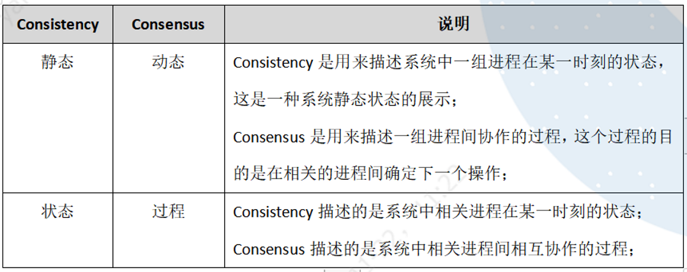

# System Design

## 1、分布式系统基本概念 

> Basic concepts of distributed systems

### CAP理论基础 (The theoretical basis of CAP)

分布式系统有三个指标：

there are three criteria for a distributed system:

- Consistency
- Availability
- Partition tolerance

它指出对于一个分布式计算系统来说，不可能同时满足以下三点：

It points out that it is impossible for a distributed computing system to satisfy all three:

- 一致性（Consistency） ：等同于所有节点访问同一份最新的数据副本，或者说同一数据在不同节点上的副本在同一逻辑时钟应当是相同的内容。
- Consistency: equal to all nodes accessing the same latest copy of data, or that copies of the same data on different nodes should be the same on the same logical clock.
- 可用性（Availability）：每次请求都能获取到非错的响应，以及尽量保证低延迟，但是不保证获取的数据为最新数据。
- Availability:  getting a good response on every request and keeping latency as low as possible, but not up-to-date.
- 分区容错性（Partition tolerance）：以实际效果而言，分区相当于对**通信的时限要求**。要求任意节点故障时，系统仍然可以对外服务。
- Partition tolerance: in practical terms, a Partition is equivalent to a time-bound requirement for communication. When any node fails, the system can still be serviced.

### Data consistency (C side)

一些分布式系统通过复制数据来提高系统的可靠性和容错性，并且将数据的不同的副本存放在不同的机器，由于维护数据副本的一致性代价高，因此许多系统**采用弱一致性来提高性能**，一些不同的一致性模型也相继被提出。

Some distributed systems improve system reliability and fault tolerance by replicating data, and store different copies of data on different machines, therefore, many systems adopt weak consistency to improve performance, and some different consistency models are proposed one after another.

- **强一致性**： 要求无论更新操作实在哪一个副本执行，之后所有的读操作都要能获得最新的数据。

  Strong consistency: requires that no matter which copy of the update operation is performed, all subsequent read operations must be able to obtain the latest data.

- **弱一致性**：用户读到某一操作对系统特定数据的更新需要一段时间，我们称这段时间为“不一致性窗口”。

  Weak consistency: it takes a while for a user to read an update to a particular data in the system, which we call the “inconsistency window.”.

- **最终一致性**：是弱一致性的一种特例，保证存储系统保证如果再也没有新的update，那么最终所有的访问将会返回最新更改的updated value

  Eventual consistency: is a special case of weak consistency that ensures that if no new updates are made to a given data item, eventually all accesses to that item will return the last updated value.

#### 基本要求 Basic requirements

规范的说，理想的分布式系统一致性应该满足：

Formally speaking, the ideal distributed system consistency should satisfy:

1. 可终止性（Termination）：一致的结果在有限时间内能完成；

   Termination: consistent results can be achieved in a finite time;

2. 共识性（Consensus）：不同节点最终完成决策的结果应该相同；

   Consensus: the final decision should be the same for different nodes;

   **核心在于需要把两件事情进行排序，而且这个顺序还得是合理的、大家都认可的**。

   the key is to put two things in order, in a reasonable, agreed-upon order.

3. 合法性（Validity）：决策的结果必须是其它进程提出的提案。

   Validity: the result of the decision must be a proposal from another process.

#### 强一致性的不同分类

##### 线性一致性 Linear consistency

线性一致性或称 **原子一致性** 或 **严格一致性**

Linear consistency, or atomic consistency or strict consistency. The requirements are as follows:

1. **写后读** 如果写操作在完成之后，读才开始，读要能读到最新的数据，而且保证以后也能读操作也都能读到这个最新的数据。

   Write before read,  if the write operation after the completion of the read, read to be able to read the latest data, but also to ensure that later read operations can also read this latest data.

2. **所有操作的时序与真实物理时间一致**，要求即使不相关的两个操作，如果执行有先后顺序，线性一致性要求最终执行的结果也需要满足这个先后顺序。

   The timing of all operations is consistent with the real physical time, requiring that even two unrelated operations, if executed in a sequential order, the linear consistency requires that the result of the final execution also satisfy this sequence. 

3. 如果两个操作是并发的（比如读A没有结束时，写B开始了），那么这个并发时序不确定，但从最终执行的结果来看，要确保所有线程(进程，节点)看到的执行序列是一致的。

   If the two operations are concurrent (for example, if reading a does not end and writing B begins) , then the concurrent timing is uncertain, but based on the final execution, make sure that all threads (processes, nodes) see the same sequence of execution.

##### 顺序一致性 Order consistency

相比线性一致性，主要区别在于，**对于物理上有先后顺序的操作，不保证这个时序**。具体而言，对于单个线程，操作的顺序仍然要保留，对于多个线程(进程，节点)，执行的事件的先后顺序与物理时钟顺序不保证。但是要求，从执行结果来看，所有线程(进程，节点)看到的执行序列是一样的。

The main difference from linear consistency is that for operations that have a physical sequence, this sequence is not guaranteed. Specifically, for multiple threads (processes, nodes) , the order of events executed is not guaranteed to match the physical clock order. However, it is required that all threads (processes, nodes) see the same sequence of execution from the execution result.

##### 因果一致性 Cause-and-effect consistency

因果一致性，被认为是比`顺序一致性`更弱的一致性，在因果一致性中，只对**有因果关系的事件**有顺序要求。

Causal consistency, considered to be a weaker consistency than sequential consistency, in which there is a sequential requirement only for events that are causally related

#### 一致性解决方案(consistent solution)

1. 分布式事务：两段提交

   Distributed transaction: two-phase Commit

2. 分布式锁

   Distributed Locks

3. 消息队列、消息持久化、重试、幂等操作

   Message queuing, message persistence, retry, idempotent operations

4. Raft / Paxos 等一致性算法

   Raft/Paxos and other consistency algorithms

   

### Service availability (A side)

可用性，意思是只要收到用户的请求，服务器就必须给出回应。

Availability means that whenever a user requests something, the server must respond.

#### 高可用解决方案（Highly available solutions）

- **负载均衡**：尽力将网络流量平均分发到多个服务器上，以提高系统整体的响应速度和可用性。

  Load Balancing: try to distribute network traffic evenly across multiple servers to increase overall system responsiveness and availability.

- **降级**：当服务器压力剧增的情况下，根据当前业务情况及流量对一些服务和页面有策略的降级，以此释放服务器资源以保证核心任务的正常运行。

  Demotion: when the server pressure increases, according to the current business situation and traffic to some services and pages have a policy of demotion, in order to release server resources to ensure the normal operation of core tasks.

- **熔断**：对于目标服务的请求和调用大量超时或失败，这时应该熔断该服务的所有调用，并且对于后续调用应直接返回，从而快速释放资源。确保在目标服务不可用的这段时间内，所有对它的调用都是立即返回的、不会阻塞的，等到目标服务好转后进行接口恢复。

  Fusing: when a request and invocation to a target service fails with a large number of timeouts, all invocations of the service should be fused and returned directly for subsequent invocations to quickly release resources. Ensure that all calls to the target service are immediate and non-blocking during the period when the target service is unavailable, and that the interface is restored when the target service improves.

- **流量控制**：流量控制可以有效的防止由于网络中瞬间的大量数据对网络带来的冲击，保证用户网络高效而稳定的运行，类似于TCP拥塞控制方法。

  Flow Control: flow control can effectively prevent the impact of a large amount of data on the network, to ensure the efficient and stable operation of the user network, similar to TCP congestion control method.

- **异地多活**：在不同地区维护不同子系统，并保证子系统的可用性

  Live in different places: maintain different subsystems in different areas, and ensure the availability of subsystems

熔断是减少由于下游服务故障对自己的影响；而降级则是在整个系统的角度上，考虑业务整体流量，保护核心业务稳定。

Fuses reduce the impact of downstream service failures on themselves, while downgrades protect core business stability from a system-wide perspective, taking into account overall traffic.

### Partition tolerance (P side)

大多数分布式系统都分布在多个子网络。每个子网络就叫做一个区（partition）。分区容错的意思是，区间通信可能失败。比如，一台服务器放在中国，另一台服务器放在美国，这就是两个区，它们之间可能无法通信。

Most distributed systems are distributed over multiple subnetworks. Each subnetwork is called a partition. Partition fault tolerance means that interval communication may fail. For example, one server in China, another server in the United States, which is two districts, they may not be able to communicate.

般来说，分区容错无法避免，因此可以认为 CAP 的 `P` 总是成立。CAP 定理告诉我们，剩下的 `C` 和 `A` 无法同时做到。

In general, partition fault tolerance is unavoidable, so you can assume that the P of CAP always holds. CAP's theorem tells us that the rest of C and a can't be done at the same time.

## 2、 一致性（Consistency）与共识（Consensus）的关系 

> The relationship between Consistency and Consensus

## 3、高并发系统的设计 

>  The design of high concurrency system

#### 1、系统拆分  Split the system

将一个系统拆分为多个子系统，用 RPC 来搞。然后每个系统连一个数据库。

Split a system into subsystems and communicate with RPC. Then each system is connected to a database。

#### 2、缓存 Cache

大部分的高并发场景，都是读多写少，可以在数据库和缓存里都写一份，然后读的时候大量走缓存 (比如redis，单机可以做到几万并发)。可以考虑项目里，那些承载主要请求的读场景，怎么用缓存来抗高并发。

Most high concurrency scenarios involve reading more and writing less. You can write one copy in both the database and cache, and then cache a large number of reads (such as Redis, which can achieve tens of thousands of concurrent transactions on a single machine). You can consider how to use caching to resist high concurrency in the read scenarios that host the main requests in the project.

#### 3、消息队列 Message Queuing

Redis作为缓存，缺点是数据可能被LRU换出，并且数据格式简单，没有事务支持，redis不能代替对于MySQL数据库的写。在承载复杂写业务逻辑的场景里，可以用message queue异步写，提升并发性

As a cache, the disadvantage of Redis is that the data may be replaced by LRU, and the data format is simple. Without transaction support, redis cannot replace the writing of MySQL database. In the scenario of carrying complex writing business logic, you can use message queue to write asynchronously to improve concurrency.

#### 4、分库分表 (divide into sub-database and sub-table)

 将一个数据库分成多个数据库，用更多的数据库承载高并发；一张表分成多张表，提高SQL运行的性能。

Divide a database into multiple databases and carry high concurrency with more databases; divide a table into multiple tables to improve the performance of SQL operation.

#### 5、读写分离 Read-write separation

大部分时候数据库可能也是读多写少，可以采用主从架构，主库写入，从库读取，搞一个读写分离。读流量太多的时候，还可以加更多的从库。

Most of the time, the database may also read more and write less. It can adopt the master-slave architecture, write the main library, read from the library, and make a read-write separation. When there is too much reading traffic, you can also add more slave libraries.

## 4、分布式缓存 

> Distributed caching

### 1、应用场景 Apply scenarios

1. **页面缓存**：用来缓存Web 页面的内容片段,包括HTML、CSS 和图片等;
2. Page Cache: Used to cache Web page content fragments, including HTML, CSS and images;
3. **应用对象缓存**：缓存系统作为ORM 框架的二级缓存对外提供服务,目的是减轻数据库的负载压力,加速应用访问;解决分布式Web部署的 session 同步问题，状态缓存.缓存包括Session 会话状态及应用横向扩展时的状态数据等,这类数据一般是难以恢复的,对可用性要求较高,多应用于高可用集群。
4. Application Object Cache: as the second-level cache of ORM framework, the cache system provides services to the outside world in order to reduce the load of the database, speed up the application access, solve the session synchronization problem of the distributed Web deployment, status cache. The cache includes Session state and state data when the Session state is extended horizontally, which is difficult to recover and requires high availability.
5. **并行处理**：通常涉及大量中间计算结果需要共享;
6. Parallel Processing: usually involves a large number of intermediate computing results need to be shared;
7. **云计算领域提供分布式缓存服务**
8. The cloud computing world provides distributed caching services

### [#](https://interviewguide.cn/notes/03-hunting_job/02-interview/05-01-02-distribution.html#_2、缓存雪崩)2、缓存雪崩 Cache avalanches

缓存雪崩我们可以简单的理解为：由于原有缓存失效、新缓存未到之间(**例如：我们设置缓存时采用了相同的过期时间，在同一时刻出现大面积的缓存过期**)，所有原本应该访问缓存的请求都去查询数据库了，而对数据库CPU和内存造成巨大压力，严重的会造成数据库宕机。从而形成一系列连锁反应，造成整个系统崩溃。

A cache avalanche can be understood simply as a large cache expiration that occurs at the same time due to the failure of the old cache and the failure of the new cache (for example, we set up the cache with the same expiration time) , all the requests that should have been accessing the cache have gone to the database, putting a lot of pressure on the database CPU and memory, which can cause serious database outages. This creates a chain reaction that causes the entire system to collapse.

### [#](https://interviewguide.cn/notes/03-hunting_job/02-interview/05-01-02-distribution.html#_3、缓存穿透)3、缓存穿透 Cache penetration

缓存穿透是指用户查询数据，在数据库没有，自然在缓存中也不会有。**这样就导致用户查询的时候，在缓存中找不到，每次都要去数据库再查询一遍，然后返回空**（*相当于进行了两次无用的查询*）。这样请求就绕过缓存直接查数据库，这也是经常提的缓存命中率问题。

Cache penetration is when a user queries for data that is not in the database and certainly not in the cache. This causes the user to make a query that is not found in the cache, go to the database again each time, and return null (equivalent to making two useless queries) . This allows the request to bypass the cache and go directly to the database, which is a common cache hit ratio issue.

### [#](https://interviewguide.cn/notes/03-hunting_job/02-interview/05-01-02-distribution.html#_4、缓存预热)4、缓存预热 Preheat the cache

缓存预热这个应该是一个比较常见的概念，相信很多小伙伴都应该可以很容易的理解，缓存预热就是系统上线后，将相关的缓存数据直接加载到缓存系统。这样就可以避免在用户请求的时候，先查询数据库，然后再将数据缓存的问题！用户直接查询事先被预热的缓存数据！

Cache preheating this should be a relatively common concept, I believe that many small partners should be very easy to understand, cache preheating is the system on-line, the relevant cache data directly loaded into the cache system. This avoids the problem of querying the database and then caching the data when the user requests it! Users directly query preheated cache data!

### [#](https://interviewguide.cn/notes/03-hunting_job/02-interview/05-01-02-distribution.html#_5、缓存更新)5、缓存更新 Cache updates

除了缓存服务器自带的缓存失效策略之外，我们还可以根据具体的业务需求进行自定义的缓存淘汰，常见的策略有两种：

In addition to the cache invalidation policy that comes with the cache server, we can customize the cache obsolescence according to specific business requirements. There are two common strategies:

1. 定时去清理过期的缓存；
2. Regularly to clean up expired caches;
3. 当有用户请求过来时，再判断这个请求所用到的缓存是否过期，过期的话就去底层系统得到新数据并更新缓存。
4. When a user requests it, determine whether the cache used for the request has expired, and then go to the underlying system to get new data and update the cache.

两者各有优劣，第一种的缺点是维护大量缓存的key是比较麻烦的，第二种的缺点就是每次用户请求过来都要判断缓存失效，逻辑相对比较复杂！具体用哪种方案，大家可以根据自己的应用场景来权衡。

Each has its advantages and disadvantages. The first disadvantage is that it is quite troublesome to maintain a large number of cached keys. The second disadvantage is that every time a user requests it, the cache must be judged to be invalid. The logic is relatively complex! The specific use of which solution, you can be based on their own application scenario to weigh.

### [#](https://interviewguide.cn/notes/03-hunting_job/02-interview/05-01-02-distribution.html#_6、缓存降级)6、缓存降级 6. Cache degradation

当访问量剧增、服务出现问题（如响应时间慢或不响应）或非核心服务影响到核心流程的性能时，仍然需要保证服务还是可用的，即使是有损服务。系统可以根据一些关键数据进行自动降级，也可以配置开关实现人工降级。

When traffic surges, a service has a problem (such as slow or non-responsive response time) , or a non-core service affects the performance of the core process, you still need to make sure that the service is still available, even if it hurts the service. The system can be automatically degraded according to some key data, and can also be configured with switches to achieve manual degradation.

降级的最终目的是 **保证核心服务可用，即使是有损的**。而且有些服务是无法降级的（如加入购物车、结算）。

The ultimate goal of downgrading is to ensure that core services are available, even at a cost. And some services can not be downgraded (add shopping carts, checkout) .

在进行降级之前要对系统进行梳理，看看系统是不是可以丢卒保帅；从而梳理出哪些必须誓死保护，哪些可降级；比如可以参考日志级别设置预案：

Before downgrading, comb the system to see if you can protect the system without losing a pawn; thus comb out which must be protected to the death, which can be downgraded; for example, you can refer to the log level settings:

1. **一般**：比如有些服务偶尔因为网络抖动或者服务正在上线而超时，可以自动降级；
2. General: for example, some services occasionally because of network jitter or service is on-line and time-out, can be automatically downgraded;
3. **警告**：有些服务在一段时间内成功率有波动（如在95~100%之间），可以自动降级或人工降级，并发送告警；
4. Warning: some services have fluctuations in the success rate over a period of time (such as between 95% and 100%) , can be automatically downgraded or manually downgraded, and send an alert;
5. **错误**：比如可用率低于90%，或者数据库连接池被打爆了，或者访问量突然猛增到系统能承受的最大阀值，此时可以根据情况自动降级或者人工降级；
6. Error: if the availability is less than 90% , or the database connection pool is blown up, or the traffic suddenly increases to the maximum threshold that the system can bear, then it can be automatically downgraded or manually downgraded according to the situation;
7. **严重错误**：比如因为特殊原因数据错误了，此时需要紧急人工降级。
8. Serious error: for example, data error due to special reasons, at this time the need for emergency manual demotion