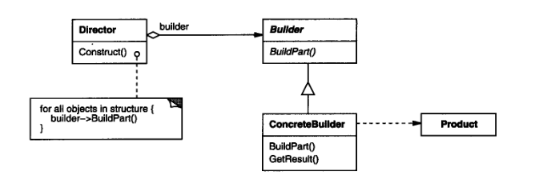
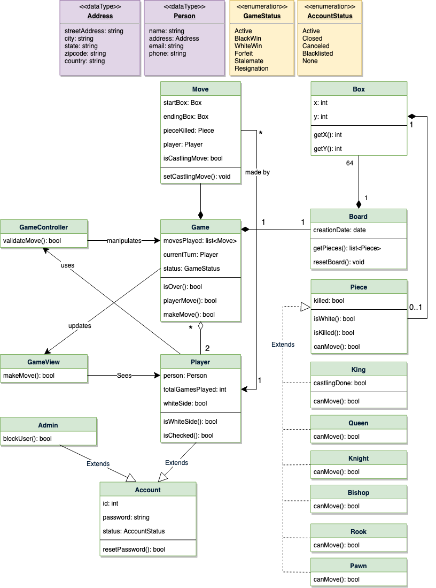

# 设计模式


## 0、预备知识


## 在类图中表示关系

类和类、类和接口、接口和接口之间存在一定关系，UML类图中一般会有连线指明它们之间的关系。关系共有六种类型，分别是实现关系、泛化关系、关联关系、依赖关系、聚合关系、组合关系，如图6所示。


下面我们详细讲述这些关系，以及在UML类图中如何表示这些关系。


### 1）实现关系

实现关系是指接口及其实现类之间的关系。在UML类图中，实现关系用空心三角和虚线组成的箭头来表示，从实现类指向接口，如图1.9所示。在Java代码中，实现关系可以直接翻译为关键字 `implements`。


### 2）泛化关系

泛化关系（Generalization）是指对象与对象之间的继承关系。如果对象A和对象B之间的“is a”关系成立，那么二者之间就存在继承关系，对象B是父对象，对象A是子对象。例如，一个年薪制员工“is a”员工，很显然年薪制员工Salary对象和员工Employee对象之间存在继承关系，Employee对象是父对象，Salary对象是子对象。

在UML类图中，泛化关系用空心三角和实线组成的箭头表示，从子类指向父类，如图8所示。在Java代码中，对象之间的泛化关系可以直接翻译为关键字 `extends`。


### 3）关联关系

关联关系（Association）是指对象和对象之间的连接，它使一个对象知道另一个对象的属性和方法。在Java中，关联关系的代码表现形式为一个对象含有另一个对象的引用。也就是说，如果一个对象的类代码中，包含有另一个对象的引用，那么这两个对象之间就是关联关系。

关联关系有单向关联和双向关联。如果两个对象都知道（即可以调用）对方的公共属性和操作，那么二者就是双向关联。如果只有一个对象知道（即可以调用）另一个对象的公共属性和操作，那么就是单向关联。大多数关联都是单向关联，单向关联关系更容易建立和维护，有助于寻找可重用的类。

在UML图中，双向关联关系用带双箭头的实线或者无箭头的实线双线表示。单向关联用一个带箭头的实线表示，箭头指向被关联的对象，如图9所示。这就是导航性（Navigatity）。


一个对象可以持有其它对象的数组或者集合。在UML中，通过放置多重性（multipicity）表达式在关联线的末端来表示。多重性表达式可以是一个数字、一段范围或者是它们的组合。多重性允许的表达式示例如下：

- 数字：精确的数量
- `*`或者`0..*`：表示0到多个
- `0..1`：表示0或者1个，在Java中经常用一个空引用来实现
- `1..*`：表示1到多个

关联关系又分为依赖关联、聚合关联和组合关联三种类型。

### 4）依赖关系

依赖（Dependency）关系是一种弱关联关系。如果对象A用到对象B，但是和B的关系不是太明显的时候，就可以把这种关系看作是依赖关系。如果对象A依赖于对象B，则 A “use a” B。比如驾驶员和汽车的关系，驾驶员使用汽车，二者之间就是依赖关系。

在UML类图中，依赖关系用一个带虚线的箭头表示，由使用方指向被使用方，表示使用方对象持有被使用方对象的引用，如图10所示。


依赖关系在Java中的具体代码表现形式为**B为A的构造器**或**方法中的局部变量**、**方法或构造器的参数**、**方法的返回值**，或者**A调用B的静态方法**。

下面我们用代码清单1和代码清单2所示的Java代码来演示对象和对象之间的依赖关系。

代码清单1所示的`B`类定义了一个成员变量 `field1`，一个普通方法 `method1()` 和一个静态方法 `method2()`。

```text
//代码清单1 B.java
public class B {
  public String field1;   //成员变量

  public void method1() {
    System.println("在类B的方法1中");
  }

  public static void method2() {                 //静态方法
    System.out.println("在类B的静态方法2中");
  }
}
```

代码清单2所示的`A`类依赖于`B`类，在`A`类中定义了四个方法，分别演示四种依赖形式。

```text
/* 代码清单2 A.java
  A依赖于B
*/

public class A {
  public void method1() {
    //A依赖于B的第一种表现形式：B为A的局部变量
    B b = new B();
    b.method1();
  }

  public void method2() {
    //A依赖于B的第二种表现形式： 调用B的静态方法
    B.method2();
  }

  public void method3(B b)  {
    //A依赖于B的第三种表现形式：B作为A的方法参数
    String s = b.field1;
  }

  //A依赖于B的第四种表现形式：B作为A的方法的返回值
  public B method4() {
    return new B();
  }
}
```

### 5）聚合关系与组合关系

聚合（Aggregation）是关联关系的一种特例，它体现的是整体与部分的拥有关系，即 “has a” 的关系。此时整体与部分之间是可分离的，它们可以具有各自的生命周期，部分可以属于多个整体对象，也可以为多个整体对象共享，所以聚合关系也常称为共享关系。例如，公司部门与员工的关系，一个员工可以属于多个部门，一个部门撤消了，员工可以转到其它部门。

在UML图中，聚合关系用空心菱形加实线箭头表示，空心菱形在整体一方，箭头指向部分一方，如图11所示。


组合（Composition）也是关联关系的一种特例，它同样体现整体与部分间的包含关系，即 “contains a” 的关系。但此时整体与部分是不可分的，部分也不能给其它整体共享，作为整体的对象负责部分的对象的生命周期。这种关系比聚合更强，也称为强聚合。如果`A`组合`B`，则`A`需要知道`B`的生存周期，即可能`A`负责生成或者释放`B`，或者`A`通过某种途径知道`B`的生成和释放。

例如，人包含头、躯干、四肢，它们的生命周期一致。当人出生时，头、躯干、四肢同时诞生。当人死亡时，作为人体组成部分的头、躯干、四肢同时死亡。

在UML图中，组合关系用实心菱形加实线箭头表示，实心菱形在整体一方，箭头指向部分一方，如图12所示。


在Java代码形式上，聚合和组合关系中的部分对象是整体对象的一个成员变量。但是，在实际应用开发时，两个对象之间的关系到底是聚合还是组合，有时候很难区别。在Java中，仅从类代码本身是区分不了聚合和组合的。如果一定要区分，那么如果在删除整体对象的时候，必须删掉部分对象，那么就是组合关系，否则可能就是聚合关系。从业务角度上来看，如果作为整体的对象必须要部分对象的参与，才能完成自己的职责，那么二者之间就是组合关系，否则就是聚合关系。

例如，汽车与轮胎，汽车作为整体，轮胎作为部分。如果用在二手车销售业务环境下，二者之间就是聚合关系。因为轮胎作为汽车的一个组成部分，它和汽车可以分别生产以后装配起来使用，但汽车可以换新轮胎，轮胎也可以卸下来给其它汽车使用。如果用在驾驶系统业务环境上，汽车如果没有轮胎，就无法完成行驶任务，二者之间就是一个组合关系。再比如网上书店业务中的订单和订单项之间的关系，如果订单没有订单项，也就无法完成订单的业务，所以二者之间是组合关系。而购物车和商品之间的关系，因为商品的生命周期并不被购物车控制，商品可以被多个购物车共享，因此，二者之间是聚合关系。


C + +中接口继承的标准方法是公有继承一个含 (纯)虚成员 函数的类。


### How to interview

- Abstraction
- Encapsulation
- Inheritance
- Polymorphism
- Association, Aggregation, Composition
- Class
- Object
- Method

#### step

1. **prepare**

- Gather the top requirements or the feature you want to include in your design. Write down all the requirements and discuss them with the interviewer. Your interviewer will mention if he/she wants to include some other details or features.

  收集您想要包含在设计中的最高要求或特性。写下所有的要求并与面试官讨论。你的面试官会提到他/她是否想包括一些其他的细节或特点。

- Once the requirement is discussed talk about the use cases on a high level.

  一旦讨论了需求，就要从高层次讨论用例。

- Now define your assumptions clearly to the interviewer.

  现在向面试官清楚地说明你的假设。

- Mention and clarify the scope you need to address in the interviews.

  在面试中提及并澄清你需要解决的范围。

2. **画类图**

Start with identifying the core objects. How to identify the core objects? Below is the rule to identify the core objects…

从识别核心对象开始。如何识别核心对象？下面是识别核心物体的规则..。

- Nouns in requirements are possible candidates for objects.
- 要求中的名词可以作为宾语的候选名词。
- Verbs in the requirements are possible methods.
- 要求中的动词是可能的方法。

**A.** Your main objective is to identify the relationship between the objects.

你的主要目标是确定物体之间的关系。

**B.** Identify whether to use an abstract class or interface for the abstractions

确定是否使用抽象类或接口进行抽象

**C.** Check if you can use some design patterns in it or not.

检查是否可以在其中使用一些设计模式。

**D.** Design a class diagram to represent everything to the interviewer. 

设计一个类图来向面试官展示所有的东西。 


#### 为了简化问题，您可以对遇到的任何 OOD 问题采取以下方法:

1. **Clarify the requirements:** Make sure you understand the expectations of the interviewer. Ask clarifying questions if at all necessary — the interviewer will not mind, and will likely appreciate it. For example, “are you looking for me to demonstrate the structure of a solution, or to fully implement it?” **Doing this here will take about 5–10 seconds, but save tremendous amounts of time later.**

   明确要求: 确保你了解面试官的期望。如果有必要的话，问一些澄清性的问题ーー面试官不会介意的，而且很可能会欣赏这些问题。例如，“您希望我演示解决方案的结构，还是完全实现它?”在这里执行此操作大约需要5-10秒，但是可以节省大量的时间。

2. **Hash out the primary use cases:** Think about, and then *talk through,* use cases. Make sure you understand all the different functionality your system is expected to have. Talking about it out loud can also help you to come across expectations or ideas you might not have realized if you just jumped right in.

   制定出主要的用例: 考虑用例，然后讨论用例。确保您了解您的系统期望具有的所有不同功能。大声谈论它也可以帮助你遇到期望或想法，你可能没有意识到，如果你只是跳了起来。

3. **Identify key Objects:** Now, identify all the objects that will play a role in your solution. For example, if you’re designing a parking lot, these will be things like vehicles, parking spots, parking garages, entrances, exits, garage operators, etc.

   识别关键对象: 现在，识别在解决方案中起作用的所有对象。例如，如果你正在设计一个停车场，这些东西将像车辆，停车位，停车场，入口，出口，车库操作员等。

4. **Identify Operations supported by Objects:** Work out all the behaviors you’d expect each object that you identified in the previous step to have. For example, a car should be able to move, park in a given spot, and hold a license plate. A parking spot should be able to accommodate a two-wheeled vehicle or a four-wheeled vehicle — and so on.

   识别对象支持的操作: 计算出在前一步中识别出的每个对象应该具有的所有行为。例如，汽车应该能够移动，停泊在一个给定的地点，并持有一个牌照。一个停车位应该能够容纳两轮车辆或四轮车辆ーー等等。

5. **Identify Interactions between Objects:** Map out the relationships between the different objects that will need to interface with each other. This is where it all comes together. For example, a *car* should be able to park in a *parking spot*. *Parking garages* should be able to fit multiple *parking spots*, and so on.

   识别对象之间的交互: 映射出需要相互接口的不同对象之间的关系。这就是一切的开始。例如，汽车应该能够停在一个停车位。停车场应该能够容纳多个停车位等等。

I’ll now walk through some of the top questions I’d recommend practicing. For each one, I’ll also share some pointers about things the interviewer will probably be looking for in your answer to such a question.


### some expression

Sure, here are some example sentences that you can use to **express your opinion** during an object-oriented design interview:

1. In my opinion, the best approach to solve this problem would be to use [insert design choice here] because [insert reason why you think this is the best approach].
2. From my experience, I have found that [insert design choice here] is a reliable way to address this problem because [insert reason why you think this is a reliable approach].
3. Personally, I believe that [insert design choice here] is a better option in this case because [insert reason why you think this is a better option].
4. While there are several approaches to solve this problem, I think that [insert design choice here] would be the most effective because [insert reason why you think this is the most effective approach].
5. Based on my understanding of the requirements, I think that [insert design choice here] would be the most appropriate solution because [insert reason why you think this is the most appropriate solution].

Remember to explain the reasoning behind your opinion and provide specific examples to support your argument. Also, be open to other ideas and be willing to listen to the interviewer's feedback.


Here are some example sentences you can use to **clarify your understanding** with the interviewer during an object-oriented design interview:

1. I want to make sure I understand the requirements correctly. Could you please explain [insert requirement or concept] in more detail?
2. Just to confirm, you are looking for a solution that meets [insert requirement]. Is that correct?
3. I'm not sure I understand what you mean by [insert concept or requirement]. Could you please give me an example or clarify that further?
4. Let me repeat what I understood so far. You're looking for a solution that [insert requirement]. Is that correct? Did I miss anything?
5. I want to make sure I'm on the right track. Can you please let me know if I'm understanding the problem correctly so far?

Remember, it's important to ask questions and clarify any uncertainties to make sure you fully understand the problem before you start designing a solution. Don't hesitate to ask for more details or examples if you 

need them. Also, it's a good idea to summarize what you understand so far and confirm with the interviewer to ensure you're on the right track.

## 1、什么是设计模式

> What is the design pattern

设计模式是解决问题的方案，学习现有的设计模式可以做到经验复用。拥有设计模式词汇，在沟通时就能用更少的词汇来讨论，并且不需要了解底层细节。

Design pattern is the solution to the problem, learning the existing design pattern can achieve experience reuse. Having a design pattern vocabulary allows you to communicate with fewer words and no need to know the underlying details


设计模式之间的关系：


**1.1　创建型设计模式**

如下图所示，创建型设计模式中使用频率由高到低依次为工厂方法模式、抽象工厂模式、建造者模式、单例模式、原型模式。原型模式一般都有现成的工具类，自己造轮子的情况比较少。


**1.2　结构型设计模式**

如下图所示，结构型设计模式中使用频率由高到低依次为适配器模式、装饰器模式、代理模式、门面模式、组合模式、享元模式、桥接模式。其中桥接模式一般都有现成的工具类，自己造轮子的情况比较少。


**1.3　行为型设计模式**

如下图所示，行为型设计模式中使用频率由高到低依次为策略模式、观察者模式、责任链模式、解释器模式、模板方法模式、迭代器模式、中介者模式、命令模式、访问者模式、备忘录模式、状态模式。其中，观察者模式、解释器模式、迭代器模式、中介者模式、命令模式、访问者模式、备忘录模式一般都有现成的工具类，自己造轮子的情况比较少。


## 2、如何解决复杂性？

> How Do You Solve Complexity?

- 分解 (Decomposition)

  - 人们面对复杂性有一个常见的做法：即分而治之，将大问题分解为多个小问题，将复杂问题分解为多个简单问题。

    A common approach to complexity is to Divide and rule a large problem into many small problems and a complex problem into many simple problems.

- 抽象 (Abstract)

  - 更高层次来讲，人们处理复杂性有一个通用的技术，即抽象。由于不能掌握全部的复杂对象，我们选择忽视它的非本质细节，而去处理泛化和理想化了的对象模型。

    At a higher level, one common technique for dealing with complexity is abstraction. Because we can not master all complex objects, we choose to ignore its non-essential details and deal with the generalized and idealized object model.


## 3、面向对象设计原则

> Object-oriented design principles

1. 依赖倒置原则（DIP）Dependence Inversion Principle

- 高层模块(稳定)不应该依赖于低层模块(变化)，二者都应该依赖于抽象(稳定) 。

  High-level modules (stability) should not depend on low-level modules (change) , both should depend on abstraction (stability) .

- 抽象(稳定)不应该依赖于实现细节(变化) ，实现细节应该依赖于抽象(稳定)。

  Abstraction (stability) should not depend on implementation details (variation) , implementation details should depend on abstraction (stability) .

2. 开放封闭原则（OCP）Open closed principle 

- 对扩展开放，对更改封闭。

  Is open for extension and closed for change.

- 类模块应该是可扩展的，但是不可修改。

  Class modules should be extensible, but not modifiable.

3. 单一职责原则（SRP）Single responsibility principle

- 一个类应该仅有一个引起它变化的原因。

  A class should have only one cause for change.

- 变化的方向隐含着类的责任。

  The direction of change implies the responsibility of the class.

4. Liskov 替换原则（LSP）The Liskov substitution principle 

- 子类必须能够替换它们的基类(IS-A)。

  Subclasses must be able to replace their base class (IS-A) .

- 继承表达类型抽象。

  Inherits expression type abstraction.

5. 接口隔离原则（ISP）Interface Segregation Principle

- 不应该强迫客户程序依赖它们不用的方法。

  Clients should not be forced to rely on methods they do not use.

- 接口应该小而完备。

  Interfaces should be small and complete.

7. 优先使用对象组合，而不是类继承 Prioritize object composition over class inheritance

- 类继承通常为“白箱复用”，对象组合通常为“黑箱复用” 。

  Class inheritance is typically white-box reuse, and object combinations are typically black-box reuse.

- 继承在某种程度上破坏了封装性，子类父类耦合度高。

  Inheritance destroys encapsulation to some extent, and child-class superclasses are highly coupled.

- 而对象组合则只要求被组合的对象具有良好定义的接口，耦合度低。

  However, object composition only requires well-defined interfaces and low coupling.

8. 封装变化点 Encapsulating change points

- 使用封装来创建对象之间的分界层，让设计者可以在分界层的一侧进行修改，而不会对另一侧产生不良的影响，从而实现层次间的松耦合。

  Encapsulation is used to create layers of separation between objects, allowing designers to make changes on one side of the separation layer without adversely affecting the other, thus allowing for loose coupling between the layers.

9. 针对接口编程，而不是针对实现编程 Program for an interface, not an implementation

- 不将变量类型声明为某个特定的具体类，而是声明为某个接口。

  Instead of declaring a variable type as a specific concrete class, declare it as an interface.

- 客户程序无需获知对象的具体类型，只需要知道对象所具有的接口。

  The client does not need to know the specific type of the object, just the interface it has.

- 减少系统中各部分的依赖关系，从而实现“高内聚、松耦合”的类型设计方案。

  Reduce the dependencies of the various parts of the system, so as to achieve“==High cohesion, loose coupling==” type design.


## 3、创建型 (create type)

### 3.1 单例（Singleton）

#### Motivation

- 在软件系统中，经常有这样一些特殊的类，必须保证它们在系统中只存在一个实例，才能确保它们的逻辑正确性、以及良好的效率。

  In software systems, there are often special classes that must be guaranteed to have only one instance in the system to ensure their logical correctness and good efficiency.

#### schema definition

保证一个类仅有一个实例，并提供一个该实例的全局访问点。

Guarantees that a class has only one instance and provides a global access point for that instance. 


#### 要点总结

- Singleton模式中的实例构造器可以设置为protected以允许子类派生。

  The instance constructor in the singleton pattern can be set to protected to allow subclasses to derive.

- Singleton模式一般不要支持拷贝构造函数和Clone接口，因为这有可能导致多个对象实例，与Singleton模式的初衷违背。

  The Singleton pattern generally does not support copy constructors and the clone interface, as this can result in multiple object instances, which contrary to the original intention of the Singleton model.

- 如何实现多线程环境下安全的Singleton？注意对双检查锁的正确实现。

- How do you achieve a secure Singleton in a multithreaded environment? Note the correct implementation of double-checked locks.

### 3.2 Factory Method

#### Motivation

- 在软件系统中，经常面临着创建对象的工作；由于需求的变化，需要创建的对象的具体类型经常变化。

  In software systems, you are often faced with creating objects; the exact types of objects you need to create often change due to changing requirements.

#### schema definition

定义一个用于创建对象的接口，让子类决定实例化哪一个类。Factory Method使得一个类的实例化延迟（目的：解耦，手段：虚函数）到子类。 

Define an interface for creating objects, and let subclasses decide which class to instantiate. Factory Method causes the instantiation of a class to delay (purpose: decoupling, means: Virtual Functions) to subclasses. 


#### Summary

- Factory Method模式用于隔离类对象的使用者和具体类型之间的耦合关系。面对一个经常变化的具体类型，紧耦合关系(new)会导致软件的脆弱。

  The Factory Method pattern is used to isolate the coupling between the consumer of a class object and a concrete type. Faced with a specific type of constant change, tight coupling (new) can lead to software fragile.

- Factory Method模式通过面向对象的手法，将所要创建的具体对象工作延迟到子类，从而实现一种扩展（而非更改）的策略，较好地解决了这种紧耦合关系。

  The Factory Method pattern resolves this tight coupling by implementing an extension (rather than change) strategy through an object-oriented approach that delays the work of the concrete objects to be created to subclasses.

- Factory Method模式解决“单个对象”的需求变化。缺点在于要求创建方法/参数相同。

  The Factory Method pattern addresses changes in the requirements of a“Single object.”. The disadvantage is that the same method/parameter is required to be created.


### 3.3 Simple Factory

#### schema definition

在创建一个对象时不向客户暴露内部细节，并提供一个创建对象的通用接口。

Does not expose internal details to the customer when creating an object, and provides a common interface for creating objects.

#### 要点总结

简单工厂把实例化的操作单独放到一个类中，这个类就成为简单工厂类，让简单工厂类来决定应该用哪个具体子类来实例化。

The simple factory puts the instantiated operations into a single class, which becomes the simple factory class, and lets the simple factory class decide which concrete subclass should be instantiated.

这样做能把客户类和具体子类的实现解耦，客户类不再需要知道有哪些子类以及应当实例化哪个子类。

This decouples the implementation of the client class from the concrete subclasses, and the client class no longer needs to know which subclasses exist and which subclasses should be instantiated. 


#### Implementation


### 3.4 Abstract Factory

#### motivation

- 在软件系统中，经常面临着“一系列相互依赖的对象工作”；同时，由于需求的变化，往往存在更多系列对象的创建工作。

  In software systems, there is often a “Set of interdependent object jobs”; at the same time, there is often more set of object creation due to changing requirements.

#### 模式定义

提供一个接口，让该接口负责创建一系列”相关或者相互依赖的对象“，无需指定它们具体的类。 ——《设计模式》GoF

Provides an interface that is responsible for creating a series of "Related or interdependent objects" without specifying their specific classes


#### 要点总结

- 如果没有应对”多系列对象创建“的需求变化，则没有必要使用Abstract Factory模式，这时候使用简单的工厂即可。

  The Abstract Factory pattern is not necessary if there is no change in requirements for“Multi-series object creation,” in which case a simple Factory is fine.

- ”系列对象“指的是在某一个特定系列的对象之间有相互依赖、或作用的关系。不同系列的对象之间不能相互依赖。

  A“Serial object” is an interdependent or functional relationship between objects of a particular series. Objects of different series can not depend on each other.

- Abstract Factory模式主要在于应用”新系列“的需求变动。其缺点在于难以应对”新对象“的需求变动。

  The Abstract Factory model mainly lies in the demand changes of the application of the "new series". Its disadvantage is that it is difficult to cope with the demand changes of "new objects".

#### Implementation


### 3.5 Builder

#### Motivation

- 在软件系统中，有时候面临着“一个复杂对象”的创建工作，其通常由各个部分的子对象用一定的算法构成；由于需求的变化，这 个复杂对象的各个部分经常面临着剧烈的变化，但是将它们组合在一起的算法却相对稳定。

  In a software system, sometimes it is faced with the creation of a "complex object", which is usually composed of a certain algorithm for the sub-objects of each part. Due to the change of requirements, each part of this complex object is often facing drastic changes, but the algorithm that combines them together is relatively stable.

#### Schema definition

将一个复杂对象的构建与其表示相分离，使得同样的构建过程(稳定)可以创建不同的表示(变化)。 ——《设计模式》GoF

Separating the construction of a complex object from its representation allows the same build process (stable) to create different representations (variations) . 



#### Implementation


### 3.6 原型模式Prototype

#### motivation

在软件系统中，经常面临这“某些结构复杂的对象”的创建工作；由于需求的变化，这些对象经常面临着剧烈的变化，但是它们却拥有比较稳定一致的接口

In the software system, it often faces the creation of "some complex objects"; due to changes in requirements, these objects often face drastic changes, but they have a relatively stable and consistent interface.

#### Schema definition

使用原型实例指定要创建对象的类型，通过复制这个原型来创建新对象。

Use a prototype instance to specify the type of object to create, and copy the prototype to create a new object.


#### Summary

- Prototype模式同样用于隔离对象的使用者和具体类型(易变类)之间的耦合关系，它同样要求这些“易变类”拥有稳定的接口。

  The Prototype pattern is also used to isolate the coupling between the consumer of an object and a concrete type (a mutable class) , and it also requires these“Mutable classes” to have stable interfaces.

- Prototype模式对于“如何创建易变类的实体对象“采用”原型克隆“的方法来做， 它使得我们可以非常灵活地动态创建”拥有某些稳定接口“的新对象——所需工作仅仅是注册一个新类的对象(即原型)， 然后在任何需要的地方Clone。

  The Prototype model takes a “Prototype Clone” approach to how to create an entity object of a mutable class. It gives us the flexibility to dynamically create new objects with certain stable interfaces -- all it takes is to register an object of a new class (that is, a Prototype) and Clone it wherever it is needed.

- Prototype模式中的Clone方法可以利用某些框架中的序列化来实现深拷贝。

  The Clone method in the Prototype pattern can take advantage of serialization in some frameworks to achieve a deep copy.


## 4、行为型 Behavioral type

### 4.1 Chain of Resposibility

#### Motivation

- 一个请求可能被多个对象处理，但是每个请求在运行时只能有一个接收者，如果显式指定，将必不可少地带来请求发送者与接收者的紧耦合。

  A request may be processed by multiple objects, but each request can only have one receiver at run time, which, if explicitly specified, will inevitably result in a tight coupling between the sender and the receiver.

#### Schema definition

使多个对象都有机会处理请求，从而避免请求的发送者和接收者之间的耦合关系。将这些对象连成一条链，并沿着这条链传递请求，直到有一个对象处理它为止。 ——《设计模式》GoF

Provides an opportunity for multiple objects to process the request, thereby avoiding coupling between the sender and receiver of the request. Connect the objects in a chain and pass the request along the chain until an object processes it. 


#### Summary


- 应用于”一个请求可能有多个接受者，但是最后真正的接受者只有一个“，这时候请求发送者与接受者有可能出现”变化脆弱“的症状，职责链解耦。

  Applied to“A request may have multiple recipients, but there is only one true recipient”, where the sender and recipient may have“Fragile change” symptoms, the chain of responsibility decoupling.

- 有些过时。

  A little out of date.


### 4.2 Observer

#### Motivation

- 在软件构建过程中，我们需要为某些对象建立一种“通知依赖关系” ——一个对象（目标对象）的状态发生改变，所有的依赖对象（观察者对象）都将得到通知。如果这样的依赖关系过于紧密，将使软件不能很好地抵御变化。
- In the process of building software, we need to create a“Notification dependency” for some objects-when the state of an object (the target object) changes, all dependent objects (observers) will be notified. If such dependencies are too tight, the software will not be able to withstand change well.
- 使用面向对象技术，可以将这种依赖关系弱化，并形成一种稳定的依赖关系。从而实现软件体系结构的松耦合。
- By using object-oriented technology, this dependency can be weakened and a stable dependency can be formed. Thus the loose coupling of software architecture is realized.

#### Schema definition


定义对象间的一种一对多（变化）的依赖关系，以便当一个对象(Subject)的状态发生改变时，所有依赖于它的对象都得到通知并自动更新。

Defines a one-to-many (variable) dependency between objects so that when an object's state changes, all dependent objects are notified and updated automatically. 

#### Summary

- 使用面向对象的抽象，Observer模式使得我们可以独立地改变目标与观察者，从而使二者之间的依赖关系达致松耦合。

  Using object-oriented abstractions, the Observer pattern allows us to change the target and Observer independently, thus loosely coupling the dependencies between the two.

- 目标发送通知时，无需指定观察者，通知（可以携带通知信息作为参数）会自动传播。

  When a target sends a notification, it does not need to specify an observer, and the notification (which can carry the notification information as a parameter) is automatically propagated.

- 观察者自己决定是否需要订阅通知，目标对象对此一无所知。

  The Observer decides whether to subscribe to the notification or not, and the target is unaware of this.

- Observer模式是基于事件的UI框架中非常常用的设计模式，也是MVC模式的一个重要组成部分。

  The Observer pattern is a very common design pattern in the event-based UI framework and an important part of the MVC pattern.

#### Implementation

当博主发表新文章的时候，即博主状态发生了改变，那些订阅的读者就会收到通知，然后进行相应的动作，比如去看文章，或者收藏起来。博主与读者之间存在种一对多的依赖关系。下面给出相应的UML图设计。 


### 4.3 State

#### Motivation

- 对象状态如果改变，其行为也会随之而发生变化，比如文档处于只读状态，其支持的行为和读写状态支持的行为就可能完全不同。

  When an object's state changes, its behavior changes as well. For example, if the document is read-only, the behavior it supports may be completely different from the behavior supported by the read-write state.

#### Schema definition


允许对象在内部状态改变时改变它的行为，对象看起来好像修改了它所属的类。

Allows an object to change its behavior when its internal state changes, and the object appears to modify the class to which it belongs.

#### Summary

- State模式将所有与一个特定状态相关的行为都放入一个State的子对象中，在对象状态切换时，切换相应的对象； 但同时维持State的接口，这样实现了具体操作与状态转换之间的解耦。

  The State pattern places all the behavior associated with a particular State into a child object of State, toggling the object when the State of the object switches, while maintaining the State interface, this decouples the concrete operation from the state transition.

- 转换是原子性的

  The transformation is atomic

- 与Strategy模式类似

  Similar to the Strategy pattern

#### Implementation

使用网络时，有打开、关闭、连接等状态，对于每一个操作，都存在某个状态。


### 4.4 Strategy

#### Motivation

- 在软件构建过程中，某些对象使用的算法可能多种多样，经常改变，如果将这些算法都编码到对象中，将会使对象变得异常复杂；而且有时候支持不使用的算法也是一个性能负担。

  In the process of building software, the algorithms used by some objects may be varied and often changed. If these algorithms are coded into objects, the objects will become very complex. And sometimes supporting unused algorithms is a performance burden.

#### Schema definition


定义一系列算法，把它们一个个封装起来，并且使它们可互相替换（变化）。该模式使得算法可独立于使用它的客户程序(稳定)而变化（扩展，子类化）。

Define a set of algorithms, encapsulate them, and make them interchangeable. This pattern allows the algorithm to vary (extend, subclass) independently of the client that uses it (stability) . 

#### Summary

- Strategy及其子类为组件提供了一系列可重用的算法，从而可以使得类型在运行时方便地根据需要在各个算法之间进行切换。

  Strategy and its subclasses provide a set of reusable algorithms for components that allow types to easily switch between algorithms as needed at run time.

- Strategy模式提供了用条件判断语句以外的另一种选择，消除条件判断语句，就是在解耦合。含有许多条件判断语句的代码通常都需要Strategy模式。

  The Strategy pattern provides an alternative to using conditional statements, eliminating conditional statements is decoupling. Code that contains many conditional statements typically requires the Strategy pattern.

- 如果Strategy对象没有实例变量，那么各个上下文可以共享同一个Strategy对象，从而节省对象开销。

  If the Strategy object does not have an instance variable, then each context can share the same Strategy object, saving object overhead.

### 4.5 Template Method

#### Motivation

- 在软件构建过程中，对于某一项任务，它常常有稳定的整体操作结构，但各个子步骤却有很多改变的需求，或者由于固有的原因（比如框架与应用之间的关系）而无法和任务的整体结构同时实现。

  In the process of building software, it often has a stable overall operational structure for a task, but there are many changing requirements for each sub-step, or it can not be implemented at the same time as the overall structure of the task for inherent reasons, such as the relationship between the framework and the application.

#### Schema definition


定义一个操作中的算法的骨架 **(稳定)** ，而将一些步骤延迟 **(变化)** 到子类中。 Template Method使得子类可以不改变(复用)一个算法的结构即可重定义(override 重写)该算法的 某些特定步骤。 

Define the skeleton (stable) of an algorithm in an operation, and defer (vary) some steps to subclasses. Template Method allows subclasses to override certain steps of an algorithm without changing (reusing) the structure of the algorithm. 

#### Summary

- Template Method模式是一种非常基础性的设计模式，在面向对象系统中有着大量的应用。它用最简洁的机制（虚函数的多态性） 为很多应用程序框架提供了灵活的扩展点，是代码复用方面的基本实现结构。

  Template Method pattern is a very basic design pattern, which is widely used in object-oriented system. It provides flexible extension points for many application frameworks with the simplest mechanism (polymorphism of virtual functions) and is a basic implementation structure for code reuse.

- 除了可以灵活应对子步骤的变化外， **“不要调用我，让我来调用你”** 的反向控制结构是Template Method的典型应用。

  In addition to the flexibility to deal with substep changes, the“Don't call me, let me call you” reverse control structure is a typical application of Template Method.

- 在具体实现方面，被Template Method调用的虚方法可以具有实现，也可以没有任何实现（抽象方法、纯虚方法），但一般推荐将它们设置为protected方法。

  On the implementation side, virtual methods invoked by Template methods can have an implementation or no implementation (abstract methods, pure virtual methods) , but it is generally recommended to set them to protected methods.

#### Implementation

主要利用c++多态特性，运行时刻，基类指针指向不同的子类，则运行该子类重写的函数（前提：基类中是[虚函数](https://so.csdn.net/so/search?q=虚函数&spm=1001.2101.3001.7020)）


###  4.6 Visitor

### 意图

表示一个作用于某对象结构中的各元素的操作。

Visitor 模式使你可以在不改变各元素的类的前提下定义作用于这些元素的新操作。

### 适用性

在下列情况下使用 Visitor 模式：

- 一个对象结构包含很多类对象，它们有不同的接口，而你想对这些对象实施一些依赖于其具体类的操作。

- 需要对一个对象结构中的对象进行很多不同的并且不相关的操作，而你想避免让这些操作“污染”这些对象的类。Visitor 使得你可以将相关的操作集中起来定义在一个类中。当该对象结构被很多应用共享时，用Visitor模式让每个应用仅包含需要用到的操作。

- 定义对象结构的类很少改变，但经常需要在此结构上定义新的操作。改变对象结构类需要重定义对所有访问者的接口，这可能需要很大的代价。如果对象结构类经常改变，那么可能还是在这些类中定义这些操作较好。

  

### 参与者

-	**Visitor**（抽象访问者角色）
  -	为该对象结构中ConcreteElement的每一个类声明一个Visit操作。该操作的名字和特征标识了发送Visit请求给该访问者的那个类。这使得访问者可以确定正被访问元素的具体的类。这样访问者就可以通过该元素的特定接口直接访问它。
-	**ConcreteVisitor**（具体访问者角色）
  -	实现每个由Visitor声明的操作。每个操作实现本算法的一部分，而该算法片断乃是对应于结构中对象的类。ConcreteVisitor为该算法提供了上下文并存储它的局部状态。这一状态常常在遍历该结构的过程中累积结果。
-	**Element**（抽象元素角色）
  -	定义一个Accept操作，它以一个访问者为参数。
-	**ConcreteElement**（具体元素角色）
  -	实现Accept操作，该操作以一个访问者为参数。
-	**ObjectStructure**（对象结构角色）
  -	能枚举它的元素。
  -	可以提供一个高层的接口以允许该访问者访问它的元素。
  -	可以是一个复合或是一个集合，如一个列表或一个无序集合。

### 协作

-	一个使用Visitor模式的客户必须创建一个ConcreteVisitor对象，然后遍历该对象结构，并用该访问者访问每一个元素。
-	当一个元素被访问时，它调用对应于它的类的Visitor操作。如果必要，该元素将自身作为这个操作的一个参数以便该访问者访问它的状态。

### 效果

下面是访问者模式的一些优缺点：

- **访问者模式使得易于增加新的操作**

  访问者使得增加依赖于复杂对象结构的构件的操作变得容易了。仅需增加一个新的访问者即可在一个对象结构上定义一个新的操作。相反，如果每个功能都分散在多个类之上的话，定义新的操作时必须修改每一类。

- **访问者集中相关的操作而分离无关的操作**

  相关的行为不是分布在定义该对象结构的各个类上，而是集中在一个访问者中。无关行为却被分别放在它们各自的访问者子类中。这就既简化了这些元素的类，也简化了在这些访问者中定义的算法。所有与它的算法相关的数据结构都可以被隐藏在访问者中。

- **增加新的 ConcreteElement 类很困难**

  Visitor 模式使得难以增加新的Element的子类。每添加一个新的ConcreteElement都要在Vistor中添加一个新的抽象操作，并在每一个ConcretVisitor类中实现相应的操作。

- **通过类层次进行访问**

  一个迭代器可以通过调用节点对象的特定操作来遍历整个对象结构，同时访问这些对象。但是迭代器不能对具有不同元素类型的对象结构进行操作。

- **累积状态**

  当访问者访问对象结构中的每一个元素时，它可能会累积状态。如果没有访问者，这一状态将作为额外的参数传递给进行遍历的操作，或者定义为全局变量。

- **破坏封装**

  访问者方法假定 ConcreteElement 接口的功能足够强，足以让访问者进行它们的工作。结果是，该模式常常迫使你提供访问元素内部状态的公共操作，这可能会破坏它的封装性。


### 4.8 Memento


### 意图

用一个中介对象来封装一系列的对象交互。

中介者使各对象不需要显式地相互引用，从而使其耦合松散，而且可以独立地改变它们之间的交互。

### 适用性

在下列情况下使用中介者模式:

- 一组对象以定义良好但是复杂的方式进行通信。产生的相互依赖关系结构混乱且难以理解。

- 一个对象引用其他很多对象并且直接与这些对象通信,导致难以复用该对象。

- 想定制一个分布在多个类中的行为，而又不想生成太多的子类。

  


### 参与者

-	**Mediator**(抽象中介者)
  -	中介者定义一个接口用于与各同事（Colleague）对象通信。
-	**ConcreteMediator**(具体中介者)
  -	具体中介者通过协调各同事对象实现协作行为。
  -	了解并维护它的各个同事。
-	**Colleague**(抽象同事类)
  - 定义出调停者到同事对象的接口。同事对象只知道中介者对象而不知道其余的同事对象。
-	**ConcreteColleague**(具体同事类)
  -	每一个同事类都知道它的中介者对象。
  -	每一个同事对象在需与其他的同事通信的时候，与它的中介者通信。

### 协作

-	同事向一个中介者对象发送和接收请求。中介者在各同事间适当地转发请求以实现协作行为。

### 效果

中介者模式有以下优点和缺点:

- **减少了子类生成**

  Mediator将原本分布于多个对象间的行为集中在一起。改变这些行为只需生成Meditator的子类即可。这样各个Colleague类可被重用。

- **它将各Colleague解耦**

  Mediator有利于各Colleague间的松耦合.你可以独立的改变和复用各Colleague类和Mediator类。

- **它简化了对象协议**

  用Mediator和各Colleague间的一对多的交互来代替多对多的交互。一对多的关系更易于理解、维护和扩展。

- **它对对象如何协作进行了抽象将**

  中介作为一个独立的概念并将其封装在一个对象中，使你将注意力从对象各自本身的行为转移到它们之间的交互上来。这有助于弄清楚一个系统中的对象是如何交互的。

- **它使控制集中化**

  中介者模式将交互的复杂性变为中介者的复杂性。因为中介者封装了协议,它可能变得比任一个Colleague都复杂。这可能使得中介者自身成为一个难于维护的庞然大物。


## 5、结构型 Structural type

### 5.1 Adapter

#### Motivation

- 由于应用环境的变化，常常需要将”一些现存的对象“放在新的环境中应用，但是新环境要求的接口是这些现存对象所不满足。
- Due to changes in the application environment, it is often necessary to put“Some existing objects” into the new environment, but the new environment requires interfaces that these existing objects do not meet.

#### Schema definition


将一个类的接口转换成客户希望的另一个接口。Adapter模式使得原本由于接口不兼容而不能一起工作的那些类可以一起工作。 

Convert the interface of one class to another that the customer wants. The Adapter mode allows classes that would not otherwise work together due to interface incompatibilities to work together. 

#### Summary

- 在遗留代码复用、类库迁移等方面有用

  Useful for legacy code reuse, class library migration, and more


### 5.2 Bridge

#### Motivation

- 由于某些类型的固有的实现逻辑，使得它们具有两个变化的维度，乃至多个纬度的变化。

  Because of the inherent implementation logic of some types, they have two varying dimensions, or even multiple latitudes.

#### Schema definition


将抽象部分(业务功能)与实现部分(平台实现)分离，使它们都可以独立地变化。 ——《设计模式》GoF

Separate the abstract part (business function) from the implementation part (platform implementation) so that both can change independently. Design Patterns, Gof

#### Summary

- Bridge模式使用“对象间的组合关系”解耦了抽象和实现之间固有的绑定关系，使得抽象和实现可以沿着各自的维度来变化。所谓抽象和实现沿着各自纬度的变化，即“子类化”它们。

  The Bridge pattern uses“Composition relationships between objects” to decouple the inherent bindings between abstraction and implementation, allowing the abstraction and implementation to vary along their respective dimensions. The so-called abstractions and implementations vary along their respective latitudes, that is, “Subclassing” them.

- Bridge模式有时候类似于多继承方案，但是多继承方案往往违背单一职责原则（即一个类只有一个变化的原因），复用性比较差。Bridge模式是比多继承方案更好的解决方法。

  Bridge patterns are sometimes similar to multi-inheritance schemes, but multi-inheritance schemes often violate the single-responsibility principle (that is, a class has only one reason to change) and are less reusable. The Bridge pattern is a better solution than the multiple inheritance scheme.

- Bridge模式的应用一般在“两个非常强的变化维度”，有时一个类也有多于两个的变化维度，这时可以使用Bridge的扩展模式。

  Bridge patterns are used in“Two very strong variable dimensions,” and sometimes there are more than two variable dimensions in a class, where the Bridge extension pattern can be used.


### 5.3 Composite 组合

#### Motivation

- 客户代码过多地依赖于对象容器复杂的内部实现结构，对象容器内部实现结构(而非抽象结构)的变化 引起客户代码的频繁变化，带来了代码的维护性、扩展性等弊端。

  The client code relies too much on the complex internal implementation structure of the object container, and changes in the internal implementation structure of the object container (rather than the abstract structure) cause frequent changes in the client code, brings the code maintainability, extensibility and other drawbacks

#### schema definition


将对象组合成树形结构以表示”部分-整体“的层次结构。Composite使得用户对单个对象和组合对象的使用具有一致性(稳定)。 

Combining objects into a tree structure to represent a part-whole hierarchy. Composite allows users to use individual and Composite objects consistently.

#### Summary

- Composite模式采用树性结构来实现普遍存在的对象容器，从而将”一对多“的关系转化为”一对一“的关系，使得客户代码可以一致地(复用)处理对象和对象容器， 无需关心处理的是单个的对象，还是组合的对象容器。

  The Composite pattern uses a tree structure to implement the ubiquitous object container, this transforms a one-to-many relationship into a one-to-one one relationship, allowing the client code to handle objects and object containers consistently, regardless of whether the object is a single object or a composite object container.

- 客户代码与纯粹的抽象接口——而非对象容器的内部实现结构——发生依赖，从而更能”应对变化“。

  The client code relies on purely abstract interfaces -- not on the internal implementation structure of the object container -- to be more“Adaptable to change”.

- Composite模式在具体实现中，可以让父对象中的子对象反向追溯；如果父对象有频繁的遍历需求，可使用缓存技术来改善效率。

  In a concrete implementation, the Composite pattern allows child objects in the parent object to be backtracked; if the parent object has frequent traversal needs, caching techniques can be used to improve efficiency.

### 5.4 Decorator

#### Motivation

- 在某些情况下我们可能会“过度地使用继承来扩展对象的功能”，由于继承为类型引入的静态特质，使得这种扩展方式缺乏灵活性； 并且随着子类的增多（扩展功能的增多），各种子类的组合（扩展功能的组合）会导致更多子类的膨胀。

  In some cases we may“Overuse inheritance to extend the functionality of an object”, which is inflexible because of the static nature introduced by inheritance for a type; And as the number of subclasses increases (the number of extended functions) , the combination of various subclasses (the combination of extended functions) will lead to the expansion of more subclasses.

#### schema definition


动态（组合）地给一个对象增加一些额外的职责。就增加功能而言，Decorator模式比生成子类（继承）更为灵活（消除重复代码 & 减少子类个数

Add some additional responsibilities to an object dynamically (in combination) . In terms of added functionality, the Decorator pattern is more flexible than generating subclasses (inheritance)(eliminating duplication & reducing the number of subclasses) . 

#### Summary

- 通过采用组合而非继承的手法， Decorator模式实现了在运行时动态扩展对象功能的能力，而且可以根据需要扩展多个功能。 避免了使用继承带来的“灵活性差”和“多子类衍生问题”。

  By using composition rather than inheritance, the Decorator pattern achieves the ability to dynamically extend object functionality at run time and can extend multiple functionality as needed. The“Poor flexibility” and“Multiple subclass derivation problems” associated with the use of inheritance are avoided.

- Decorator类在接口上表现为is-a Component的继承关系，即Decorator类继承了Component类所具有的接口。 但在实现上又表现为has-a Component的组合关系，即Decorator类又使用了另外一个Component类。

  The Decorator class represents an inheritance of IS-A Component on the interface, that is, the Decorator class inherits the interface that the Component class has. However, the implementation is represented as a has-a Component composition, where the Decorator class uses another Component class.

- Decorator模式的目的并非解决“多子类衍生的多继承”问题，Decorator模式应用的要点在于解决“主体类在多个方向上的扩展功能”——是为“装饰”的含义。

  The Decorator pattern is not intended to solve the“Multiple inheritance from multiple subclasses” problem, the point of applying the Decorator pattern is to address“The extension of the principal class in multiple directions”-- in the sense of“Decorator.”.

### 5.5 Facade(门面模式)

#### Motivation

- 客户和组件中各种复杂的子系统有过多的耦合

  There is too much coupling between the customer and the various complex subsystems in the component

#### Schema definition

为子系统中的一组接口提供一个一致(稳定)的界面，Façade模式定义了一个高层接口，这个接口使得这一子系统更加容易使用(复用)。

To provide a consistent (stable) interface to a set of interfaces in a subsystem, the FAcade pattern defines a high-level interface that makes the subsystem easier to use (reuse) . 

#### Summary

- 从客户程序角度来看，Facade模式简化了整个组件系统的接口，对于组件内部与外部的客户程序来说， 达到了一种”解耦“的效果——内部子系统的任何变化不会影响到Facade接口的变化。

  From a client perspective, the FAcade pattern simplifies the interface of the entire component system, for both internal and external clients of the component, a“Decoupling” effect is achieved-any change in the internal subsystem does not affect the change in the FA çade interface.

- Facade设计模式更注重架构的层次去看整个系统，而不是单个类的层次。Facade很多时候是一种架构设计模式。

  The FAcade design pattern focuses on the architectural level to look at the whole system rather than the level of individual classes. Facade is often an architectural design pattern.

- Facade设计模式并非一个集装箱，可以任意地放进任何多个对象。Facade模式组件中的内部应该是”相互耦合关系比较大的一系列组件“，而不是一个简单的功能集合。

  The FAcade design pattern is not a container that can be placed into any number of objects at will. The interior of the FA çade pattern component should be a“Series of components that are highly coupled to each other” rather than a simple set of functions.

#### Implementation


### 5.6 Flyweight (享元)

#### Motivation

- 在软件系统采用纯粹对象方案的问题在于大量细粒度的对象会很快充斥在系统中，从而带来很高的运行时代价——主要指内存需求方面的代价。
- The problem with a pure object approach to a software system is that a large number of fine-grained objects can quickly flood the system, resulting in high runtime costs -- mainly in terms of memory requirements.

#### schema definition


运行共享技术有效地支持大量细粒度的对象。 

Running shared technology effectively supports a large number of fine-grained objects

#### Summary

- 面向对象很好地解决了抽象性的问题，但是作为yield运行机器中的程序实体，我们需要考虑对象的代价问题， Flyweight主要解决面向对象的大家问题，一般不触及面向对象的抽象性问题。

  Object-oriented solves the problem of abstraction very well, but as a program entity in the Yield running machine, we need to consider the cost of objects. Flyweight mainly solves the object-oriented problem, and generally does not touch the object-oriented abstraction problem.

- Flyweight采用对象共享的做法来降低系统中对象的个数，从而降低细粒度对象给系统带来的压力。在具体实现方面，要注意对象状态的处理。

  Flyweight uses object sharing to reduce the number of objects in the system, thus reducing the pressure of fine-grained objects on the system. In the concrete implementation aspect, must pay attention to the object state processing.

- 对象的数量太大从而导致对象内存开销加大——什么样的数量才算大？这需要我们仔细的根据具体应用情况进行评估，而不能凭空臆断。

  The number of objects is too large, leading to an increase in object memory overhead -- what is a large number? This requires careful evaluation based on specific applications, rather than assumptions.

#### Implementation


### 5.7 Proxy 代理

#### Motivation

- 在面向对象系统中，有些对象由于某种原因(比如对象创建的开销很大，或者某些操作需要安全控制，或者需要进程外的访问等)， 直接访问会给使用者、或者系统结构带来很多麻烦。

  In an object-oriented system, some objects, for some reason (such as expensive object creation, or security control for some operations, or out-of-process access, etc.) , direct access can cause a lot of trouble for the user, or for the system architecture.

#### Schema definition


为其他对象提供一种代理以控制(隔离，使用接口)对这对象的访问。 

Provides a proxy for other objects to control (isolate, use interfaces) access to this object. 

#### Summary

- Proxy并不一定要求保持接口完整的一致性，只要能够实现间接控制，有时候损及一些透明性是可以接受的。

  Proxy does not necessarily require the integrity of the interface, and it is sometimes acceptable to compromise some transparency as long as indirect control is achieved.


## Design an Online Stock Brokerage System

An Online Stock Brokerage System facilitates its users the trade (i.e. buying and selling) of stocks online. It allows clients to keep track of and execute their transactions, and shows performance charts of the different stocks in their portfolios. It also provides security for their transactions and alerts them to pre-defined levels of changes in stocks, without the use of any middlemen.

The online stock brokerage system automates traditional stock trading using computers and the internet, making the transaction faster and cheaper. This system also gives speedier access to stock reports, current market trends, and real-time stock prices.


### System Requirements

We will focus on the following set of requirements while designing the online stock brokerage system:

1. Any user of our system should be able to buy and sell stocks.
2. Any user can have multiple watchlists containing multiple stock quotes.
3. Users should be able to place stock trade orders of the following types: 1) market, 2) limit, 3) stop loss and, 4) stop limit.
4. Users can have multiple ‘lots’ of a stock. This means that if a user has bought a stock multiple times, the system should be able to differentiate between different lots of the same stock.
5. The system should be able to generate reports for quarterly updates and yearly tax statements.
6. Users should be able to deposit and withdraw money either via check, wire, or electronic bank transfer.
7. The system should be able to send notifications whenever trade orders are executed.

### Use Case Diagram

We have three main Actors in our system:

* **Admin:** Mainly responsible for administrative functions like blocking or unblocking members.
* **Member:** All members can search the stock inventory, as well as buy and sell stocks. Members can have multiple watchlists containing multiple stock quotes.
* **System:** Mainly responsible for sending notifications for stock orders and periodically fetching stock quotes from the stock exchange.

Here are the top use cases of the Stock Brokerage System:

* **Register new account/Cancel membership:** To add a new member or cancel the membership of an existing member.
* **Add/Remove/Edit watchlist:** To add, remove or modify a watchlist.
* **Search stock inventory:** To search for stocks by their symbols.
* **Place order:** To place a buy or sell order on the stock exchange.
* **Cancel order:** Cancel an already placed order.
* **Deposit/Withdraw money:** Members can deposit or withdraw money via check, wire or electronic bank transfer.

Here is the use case diagram of an Online Stock Brokerage System:


### Class Diagram

Here are the main classes of our Online Stock Brokerage System:

* **Account:** Consists of the member’s name, address, e-mail, phone, total funds, funds that are available for trading, etc. We’ll have two types of accounts in the system: one will be a general member, and the other will be an Admin. The Account class will also contain all the stocks the member is holding.
* **StockExchange:** The stockbroker system will fetch all stocks and their current prices from the stock exchange. StockExchange will be a singleton class encapsulating all interactions with the stock exchange. This class will also be used to place stock trading orders on the stock exchange.
* **Stock:** The basic building block of the system. Every stock will have a symbol, current trading price, etc.
* **StockInventory:** This class will fetch and maintain the latest stock prices from the StockExchange. All system components will read the most recent stock prices from this class.
* **Watchlist:** A watchlist will contain a list of stocks that the member wants to follow.
* **Order:** Members can place stock trading orders whenever they would like to sell or buy stock positions. The system would support multiple types of orders:
  * **Market Order:** Market order will enable users to buy or sell stocks immediately at the current market price.
  * **Limit Order:** Limit orders will allow a user to set a price at which they want to buy or sell a stock.
  * **Stop Loss Order:** An order to buy or sell once the stock reaches a certain price.
  * **Stop Limit Order:** The stop-limit order will be executed at a specified price or better after a given stop price has been reached. Once the stop price is reached, the stop-limit order becomes a limit order to buy or sell at the limit price or better.
* **OrderPart:** An order could be fulfilled in multiple parts. For example, a market order to buy 100 stocks could have one part containing 70 stocks at \$10 and another part with 30 stocks at $10.05.
* **StockLot:** Any member can buy multiple lots of the same stock at different times. This class will represent these individual lots. For example, the user could have purchased 100 shares of AAPL yesterday and 50 more stocks of AAPL today. While selling, users will be able to select which lot they want to sell first.
* **StockPosition:** This class will contain all the stocks that the user holds.
* **Statement:** All members will have reports for quarterly updates and yearly tax statements.
* **DepositMoney & WithdrawMoney:** Members will be able to move money through check, wire or electronic bank transfers.
* **Notification:** Will take care of sending notifications to members.


### Activity Diagrams

**Place a buy order:** Any system user can perform this activity. Here are the steps to place a buy order:


## Design Chess

### System Requirements

We’ll focus on the following set of requirements while designing the game of chess:

1. The system should support two online players to play a game of chess.
2. All rules of international chess will be followed.
3. Each player will be randomly assigned a side, black or white.
4. Both players will play their moves one after the other. The white side plays the first move.
5. Players can’t cancel or roll back their moves.
6. The system should maintain a log of all moves by both players.
7. Each side will start with 8 pawns, 2 rooks, 2 bishops, 2 knights, 1 queen, and 1 king.
8. The game can finish either in a checkmate from one side, forfeit or stalemate (a draw), or resignation.

### Use Case Diagram

We have two actors in our system:

* **Player:** A registered account in the system, who will play the game. The player will play chess moves.
* **Admin:** To ban/modify players.

Here are the top use cases for chess:

* **Player moves a piece:** To make a valid move of any chess piece.
* **Resign or forfeit a game:** A player resigns from/forfeits the game.
* **Register new account/Cancel membership:** To add a new member or cancel an existing member.
* **Update game log:** To add a move to the game log.

Here is the use case diagram of our Chess Game:


### Class Diagram

Here are the main classes for chess:

**Player:** Player class represents one of the participants playing the game. It keeps track of which side (black or white) the player is playing.<br />
**Account:** We’ll have two types of accounts in the system: one will be a player, and the other will be an admin.<br />
**Game:** This class controls the flow of a game. It keeps track of all the game moves, which player has the current turn, and the final result of the game.<br />
**Box:** A box represents one block of the 8x8 grid and an optional piece.<br />
**Board:** Board is an 8x8 set of boxes containing all active chess pieces.<br />
**Piece:** The basic building block of the system, every piece will be placed on a box. This class contains the color the piece represents and the status of the piece (that is, if the piece is currently in play or not). This would be an abstract class and all game pieces will extend it.<br />
**Move:** Represents a game move, containing the starting and ending box. The Move class will also keep track of the player who made the move, if it is a castling move, or if the move resulted in the capture of a piece.<br />
**GameController:** Player class uses GameController to make moves.<br />
**GameView:** Game class updates the GameView to show changes to the players.<br />




## ATM

### System Requirements

The main components of the ATM that will affect interactions between the ATM and its users are:

1. **Card reader:** to read the users’ ATM cards.
2. **Keypad:** to enter information into the ATM e.g. PIN. cards.
3. **Screen:** to display messages to the users.
4. **Cash dispenser:** for dispensing cash.
5. **Deposit slot:** For users to deposit cash or checks.
6. **Printer:** for printing receipts.
7. **Communication/Network Infrastructure:** it is assumed that the ATM has a communication infrastructure to communicate with the bank upon any transaction or activity.

The user can have two types of accounts: 1) Checking, and 2) Savings, and should be able to perform the following five transactions on the ATM:

1. **Balance inquiry:** To see the amount of funds in each account.
2. **Deposit cash:** To deposit cash.
3. **Deposit check:** To deposit checks.
4. **Withdraw cash:** To withdraw money from their checking account.
5. **Transfer funds:** To transfer funds to another account.

### How ATM works?

The ATM will be managed by an operator, who operates the ATM and refills it with cash and receipts. The ATM will serve one customer at a time and should not shut down while serving. To begin a transaction in the ATM, the user should insert their ATM card, which will contain their account information. Then, the user should enter their Personal Identification Number (PIN) for authentication. The ATM will send the user’s information to the bank for authentication; without authentication, the user cannot perform any transaction/service.

The user’s ATM card will be kept in the ATM until the user ends a session. For example, the user can end a session at any time by pressing the cancel button, and the ATM Card will be ejected. The ATM will maintain an internal log of transactions that contains information about hardware failures; this log will be used by the ATM operator to resolve any issues.

1. Identify the system user through their PIN.
2. In the case of depositing checks, the amount of the check will not be added instantly to the user account; it is subject to manual verification and bank approval.
3. It is assumed that the bank manager will have access to the ATM’s system information stored in the bank database.
4. It is assumed that user deposits will not be added to their account immediately because it will be subject to verification by the bank.
5. It is assumed the ATM card is the main player when it comes to security; users will authenticate themselves with their debit card and security pin.

### Use Case Diagram

Here are the actors of the ATM system and their use cases:

**Operator:** The operator will be responsible for the following operations:

1. Turning the ATM ON/OFF using the designated Key-Switch.
2. Refilling the ATM with cash.
3. Refilling the ATM’s printer with receipts.
4. Refilling the ATM’s printer with INK.
5. Take out deposited cash and checks.

**Customer:** The ATM customer can perform the following operations:

1. Balance inquiry: the user can view his/her account balance.
2. Cash withdrawal: the user can withdraw a certain amount of cash.
3. Deposit funds: the user can deposit cash or checks.
4. Transfer funds: the user can transfer funds to other accounts.

**Bank Manager:** The Bank Manager can perform the following operations:

1. Generate a report to check total deposits.
2. Generate a report to check total withdrawals.
3. Print total deposits/withdrawal reports.
4. Checks the remaining cash in the ATM.

Here is the use case diagram of our ATM system:


### Class Diagram

Here are the main classes of the ATM System:

* **ATM:** The main part of the system for which this software has been designed. It has attributes like ‘atmID’ to distinguish it from other available ATMs, and ‘location’ which defines the physical address of the ATM.
* **CardReader:** To encapsulate the ATM’s card reader used for user authentication.
* **CashDispenser:** To encapsulate the ATM component which will dispense cash.
* **Keypad:** The user will use the ATM’s keypad to enter their PIN or amounts.
* **Screen:** Users will be shown all messages on the screen and they will select different transactions by touching the screen.
* **Printer:** To print receipts.
* **DepositSlot:** User can deposit checks or cash through the deposit slot.
* **Bank:** To encapsulate the bank which ownns the ATM. The bank will hold all the account information and the ATM will communicate with the bank to perform customer transactions.
* **Account:** We’ll have two types of accounts in the system: 1)Checking and 2)Saving.
* **Customer:** This class will encapsulate the ATM’s customer. It will have the customer’s basic information like name, email, etc.
* **Card:** Encapsulating the ATM card that the customer will use to authenticate themselves. Each customer can have one card.
* **Transaction:** Encapsulating all transactions that the customer can perform on the ATM, like BalanceInquiry, Deposit, Withdraw, etc.


### 

##  21 points

### System Requirements

Blackjack is played with one or more standard 52-card decks. The standard deck has 13 ranks in 4 suits.

**Background**

* To start with, the players and the dealer are dealt separate hands. Each hand has two cards in it.
* The dealer has one card exposed (the up card) and one card concealed (the hole card), leaving the player with incomplete information about the state of the game.
* The player’s objective is to make a hand that has more points than the dealer, but less than or equal to 21 points.
* The player is responsible for placing bets when they are offered, and taking additional cards to complete their hand.
* The dealer will draw additional cards according to a simple rule: when the dealer’s hand is 16 or less, they will draw cards (called a hit), when it is 17 or more, they will not draw additional cards (or stand pat).

**Points calculation**

Blackjack has different point values for each of the cards:

* The number cards (2-10) have the expected point values.
* The face cards (Jack, Queen, and King) all have a value of 10 points.
* The Ace can count as one point or eleven points. Because of this, an Ace and a 10 or face card totals 21. This two-card winner is called “blackjack”.
* When the points include an ace counting as 11, the total is called soft-total; when the ace counts as 1, the total is called hard-total. For example, A+5 can be considered a soft 16 or a hard 6.

**Gameplay**

* The player places an initial bet.
* The player and dealer are each dealt a pair of cards.
* Both of the player’s cards are face up, the dealer has one card up and one card down.
* If the dealer’s card is an ace, the player is offered insurance.

Initially, the player has a number of choices:

* If the two cards are the same rank, the player can elect to split into two hands.
* The player can double their bet and take just one more card.
* The more typical scenario is for the player to take additional cards (a hit ) until either their hand totals more than 21 (they bust ), or their hand totals exactly 21, or they elect to stand.

If the player’s hand is over 21, their bet is resolved immediately as a loss. If the player’s hand is 21 or less, it will be compared to the dealer’s hand for resolution.

**Dealer has an Ace:** If the dealer’s up card is an ace, the player is offered an insurance bet. This is an additional proposition that pays 2:1 if the dealer’s hand is exactly 21. If this insurance bet wins, it will, in effect, cancel the loss of the initial bet. After offering insurance to the player, the dealer will check their hole card and resolve the insurance bets. If the hole card is a 10-point card, the dealer has blackjack, the card is revealed, and insurance bets are paid. If the hole card is not a 10-point card, the insurance bets are lost, but the card is not revealed.

**Split Hands:** When dealt two cards of the same rank, the player can split the cards to create two hands. This requires an additional bet on the new hand. The dealer will deal an additional card to each new hand, and the hands are played independently. Generally, the typical scenario described above applies to each of these hands.

**Bets**

* **Ante:** This is the initial bet and is mandatory to play.
* **Insurance:** This bet is offered only when the dealer shows an ace. The amount must be half the ante.
* **Split:** This can be thought of as a bet that is offered only when the player’s hand has two cards of equal rank. The amount of the bet must match the original ante.
* **Double:** This can be thought of as a bet that is offered instead of taking an ordinary hit. The amount of the bet must match the original ante.

### Use Case Diagram

We have two main Actors in our system:

* **Dealer:** Mainly responsible for dealing cards and game resolution.
* **Player:** Places the initial bets, accepts or declines additional bets - including insurance, and splits hands. Accepts or rejects the offered resolution, including even money. Chooses among hit, double and stand pat options.

**Typical Blackjack Game Use cases**

Here are the top use cases of the Blackjack game:

* **Create Hands:** Initially both the player and the dealer are given two cards each. The player has both cards visible whereas only one card of the dealer’s hand is visible to the player.
* **Place Bet:** To start the game, the player has to place a bet.
* **Player plays the hand:** If the hand is under 21 points, the player has three options:
  * Hit: The hand gets an additional card and this process repeats.
  * Double Down: The player creates an additional bet, and the hand gets one more card and play is done.
  * Stands Pat: If the hand is 21 points or over, or the player chooses to stand pat, the game is over.
  * Resolve Bust: If a hand is over 21, it is resolved as a loser.
* **Dealer plays the hand:** The dealer keeps getting a new card if the total point value of the hand is 16 or less, and stops dealing cards at the point value of 17 or more.
  * Dealer Bust: If the dealer’s hand is over 21, the player’s wins the game. Player Hands with two cards totaling 21 ( “blackjack” ) are paid 3:2, all other hands are paid 1:1.
* **Insurance:** If the dealer’s up card is an Ace, then the player is offered insurance:
  * Offer Even Money: If the player’s hand totals to a soft 21, a blackjack; the player is offered an even money resolution. If the player accepts, the entire game is resolved at this point. The ante is paid at even money; there is no insurance bet.
  * Offer Insurance: The player is offered insurance, which they can accept by creating a bet. For players with blackjack, this is the second offer after even money is declined. If the player declines, there are no further insurance considerations.
  * Examine Hole Card: The dealer’s hole card is examined. If it has a 10-point value, the insurance bet is resolved as a winner, and the game is over. Otherwise, the insurance is resolved as a loser, the hole card is not revealed, and play continues.
* **Split:** If the player’s hand has both cards of equal rank, the player is offered a split. The player accepts by creating an additional Bet. The original hand is removed; The two original cards are split and then the dealer deals two extra cards to create two new Hands. There will not be any further splitting.
* **Game Resolution:** The Player’s Hand is compared against the Dealer’s Hand, and the hand with the higher point value wins. In the case of a tie, the bet is returned. When the player wins, a winning hand with two cards totaling 21 (“blackjack”) is paid 3:2, any other winning hand is paid 1:1.

Here is the use case diagram of our Blackjack game:


### Class Diagram

Here are the main classes of our Blackjack game:

* **Card:** A standard playing card has a suit and point value from 1 to 11.
* **BlackjackCard:** In blackjack, cards have different face values. For example, jack, queen, and king, all have a face value of 10. An ace can be counted as either 1 or 11.
* **Deck:** A standard playing card deck has 52 cards and 4 suits.
* **Shoe:** Contains a set of decks. In casinos, a dealer’s shoe is a gaming device to hold multiple decks of playing cards.
* **Hand:** A collection of cards with one or two point values: a hard value (when an ace counts as 1) and a soft value (when an ace counts as 11).
* **Player:** Places the initial bets, updates the stake with amounts won and lost. Accepts or declines offered additional bets - including insurance, and split hands. Accepts or declines offered resolution, including even money. Chooses between hit, double and stand options.
* **Game:** This class encapsulates the basic sequence of play. It runs the game, offers bets to players, deals the cards from the shoe to hands, updates the state of the game, collects losing bets, pays winning bets, splits hands, and responds to player choices of a hit, double or stand.


### Activity Diagram

**Blackjack hit or stand:** Here are the set of steps to play blackja